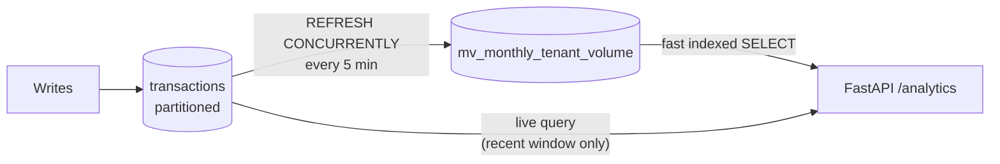

# Query Plans, Partitioning & Materialized Views Masterclass

The operational half of Postgres mastery: reading what the planner actually does with your query, and the two structural tools — partitioning and materialized views — for tables that outgrow indexes alone. Companion to the aggregation theory in [01_postgres_aggregation_sqlalchemy.md](01_postgres_aggregation_sqlalchemy.md).

---

## 1. Reading a Query Plan (Why & What)

`EXPLAIN` shows the planner's chosen strategy with *estimated* costs; **`EXPLAIN ANALYZE` executes the query** and adds actual times and row counts. The senior skill is comparing the two: when `rows=50000 (estimated)` meets `rows=4 (actual)`, the planner is working from stale statistics (`ANALYZE tablename;` refreshes them) and every downstream choice — join strategy, scan type — may be wrong.

Node vocabulary to recognize on sight:

| Node | Meaning | Verdict |
|---|---|---|
| `Seq Scan` | Read the whole table | Fine on small tables; a siren on large ones with a selective filter |
| `Index Scan` | Walk the index, fetch matching heap rows | Good for selective predicates |
| `Index Only Scan` | Answer entirely from the index, skip the heap | Best case — needs a covering index + recent VACUUM |
| `Bitmap Heap Scan` | Batch index matches, then fetch heap pages in physical order | Planner's middle ground for medium selectivity |
| `Nested Loop / Hash Join / Merge Join` | Join strategies: small-driven / hashed / pre-sorted | Hash join on big unsorted sets; nested loop degrades if the inner side is scanned repeatedly |

## 2. Worked Example: Seq Scan → Index Only Scan (How)

Take the daily-totals base query from [01/01](01_postgres_aggregation_sqlalchemy.md), filtered to one tenant's recent window:

```sql
-- Gist: explain_worked_example.sql
EXPLAIN ANALYZE
SELECT DATE_TRUNC('day', created_at) AS day, SUM(amount)
FROM transactions
WHERE tenant_id = 7 AND status = 'completed' AND created_at >= now() - interval '30 days'
GROUP BY 1;

-- ROUND 1 — no useful index:
--   HashAggregate (actual time=2140.512..2140.601)
--     -> Seq Scan on transactions (actual time=0.041..1980.334 rows=41250)
--          Filter: (tenant_id = 7 AND ...)
--          Rows Removed by Filter: 9958750        <-- read 10M rows to keep 41k
--   Execution Time: 2141.3 ms

CREATE INDEX idx_tx_tenant_status_created
    ON transactions (tenant_id, status, created_at);

-- ROUND 2 — composite index (equality columns first, range column last):
--   -> Index Scan using idx_tx_tenant_status_created (actual time=0.032..38.7 rows=41250)
--   Execution Time: 52.1 ms                        <-- 40x: reads only matching rows,
--                                                      but still visits the heap for `amount`

CREATE INDEX idx_tx_covering
    ON transactions (tenant_id, status, created_at) INCLUDE (amount);

-- ROUND 3 — covering index:
--   -> Index Only Scan using idx_tx_covering (actual time=0.030..21.2 rows=41250)
--        Heap Fetches: 0                           <-- everything answered from the index
--   Execution Time: 29.8 ms
```

Two rules this example encodes: **column order matters** (equality predicates `tenant_id`, `status` before the range predicate `created_at` — reversed order makes the index nearly useless), and **`INCLUDE` pays for hot queries** by adding payload columns to leaf pages without widening the search key. Counterweight to volunteer: every index taxes every write and consumes RAM — you index for measured queries, not speculatively.

## 3. Declarative Range Partitioning (Why, What & How)

Past roughly 100M+ rows in an append-heavy table, single-table problems compound: indexes stop fitting in RAM, VACUUM runs for hours, and deleting old data by `DELETE` bloats the table. **Partitioning splits one logical table into physical child tables by a key** — for time-series, monthly ranges:

```sql
-- Gist: range_partitioning.sql
CREATE TABLE transactions (
    id          BIGINT GENERATED ALWAYS AS IDENTITY,
    tenant_id   BIGINT NOT NULL,
    amount      NUMERIC(14,2) NOT NULL,
    status      TEXT NOT NULL,
    created_at  TIMESTAMPTZ NOT NULL,
    PRIMARY KEY (id, created_at)      -- GOTCHA: the partition key MUST be part of
) PARTITION BY RANGE (created_at);    -- every PK/unique constraint

CREATE TABLE transactions_2026_07 PARTITION OF transactions
    FOR VALUES FROM ('2026-07-01') TO ('2026-08-01');
-- New months: created ahead by a scheduled job (pg_partman automates this).
```

The payoffs: **partition pruning** — `WHERE created_at >= '2026-07-01'` touches only matching partitions, so the dashboard's 30-day query scans two months of data instead of five years; per-partition indexes and VACUUM stay small; and **retention becomes `DROP TABLE transactions_2021_01`** — instant, no bloat, versus a multi-hour DELETE. The costs: the PK gotcha above (uniqueness is only enforceable per-partition), queries *without* the partition key hit every partition, and partition management is an operational duty. Partitioning is a scale tool, not a performance patch — indexes first.

## 4. Materialized Views for Dashboard Aggregates (How)

A view re-runs its query on every read; a **materialized view stores the result physically** and serves it like a table — trading freshness for a constant fast read on aggregations too heavy to run per request.

```sql
-- Gist: matview_refresh.sql
CREATE MATERIALIZED VIEW mv_monthly_tenant_volume AS
SELECT tenant_id, DATE_TRUNC('month', created_at) AS month,
       SUM(amount) AS volume, COUNT(*) AS tx_count
FROM transactions WHERE status = 'completed'
GROUP BY 1, 2;

-- CONCURRENTLY requires a unique index, but readers are never blocked mid-refresh:
CREATE UNIQUE INDEX ON mv_monthly_tenant_volume (tenant_id, month);
REFRESH MATERIALIZED VIEW CONCURRENTLY mv_monthly_tenant_volume;  -- cron / pg_cron, e.g. every 5 min
```

Without `CONCURRENTLY`, a refresh takes an exclusive lock and dashboard reads queue behind it — the classic production surprise. Where matviews sit against the other staleness tools ([04/08](../04_architecture_and_system_design/08_redis_caching_strategies.md) has the full table): choose a **matview** when the aggregate is join-heavy and consumers want to query it *with SQL* (filter, join, window it); choose **Redis** when you need sub-ms reads of a finished payload and event-driven invalidation.



## 5. Interview Angles

**"Here's a slow dashboard query — what's your first command, and how do you read the output?"**
Skeleton: `EXPLAIN ANALYZE` (with `BUFFERS` if allowed) → check estimated-vs-actual rows first (stats drift → `ANALYZE`) → find the dominant node: Seq Scan with huge `Rows Removed by Filter` → composite index, equality columns before range → re-explain and confirm Index/Index Only Scan → only then consider caching or matviews. The discipline is *measure, index, re-measure* — never guess.

**"The transactions table crossed 500M rows; queries and vacuums are degrading. Options?"**
Skeleton: verify indexes and query shapes first → then range-partition by `created_at` (pruning, small per-partition maintenance, `DROP`-based retention) → name the PK-must-include-partition-key gotcha and the ops duty of pre-creating partitions → move heavy historical aggregates to a matview refreshed `CONCURRENTLY` so the hot path never touches cold data.

**"Materialized view or Redis cache for the monthly-volume widget?"**
Skeleton: both are staleness tradeoffs → matview if consumers keep querying it relationally; Redis if it's a finished JSON payload needing sub-ms reads and write-driven invalidation → they compose: matview for the heavy join, Redis in front for the hot tenants.
