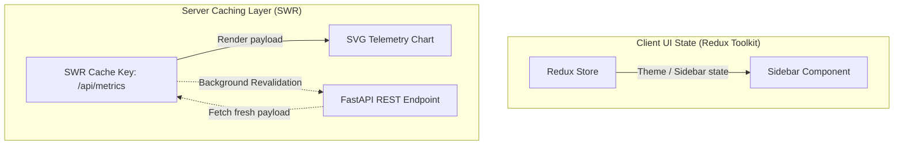

# React Dashboard State & Rendering Optimization Masterclass

A deep-dive academic guide to managing client-side state boundaries, configuring optimistic UI caching pipelines, and optimizing high-frequency render paths in React dashboards.

---

## 1. Frontend State Architecture (Why & What)

### Server Cache vs. Client UI State Boundaries
Storing API responses inside global Redux stores is a common architectural anti-pattern. Doing so requires writing verbose action and reducer boilerplate code just to synchronize client memories with server datastores. 

Modern web architectures separate state into two distinct boundaries:

1. **Server State Caching (SWR / React Query)**:
   * *What*: Data that exists on the database (e.g. daily sales totals, account profiles, transactional ledgers).
   * *Why*: Server state is transient and can be altered by other clients or background tasks. SWR caches this data locally using a key scheme, handles automatic re-validation, and shares data across decoupled components without prop-drilling or global Redux store synchronization.
2. **Client UI State (Redux Toolkit / Context)**:
   * *What*: Data that exists strictly inside the user's browser runtime (e.g. sidebar collapse states, active dashboard widgets layout grid, current theme selection).
   * *Why*: This data has zero relation to databases and does not need network caching. Redux Toolkit provides an optimized slice-based engine to manage this transient layout state.



---

## 2. Dashboard Rendering Optimization (Why & How)

Dashboards process large arrays of timeseries data. Unoptimized rendering code will drop frames, causing laggy interactions.

### Memoization Rules
* **`React.memo`**: A higher-order component that wraps visual widgets. It prevents a component from re-rendering unless its incoming properties (props) change.
* **`useMemo`**: Caches the result of expensive computations (e.g. sorting or grouping large transaction lists into chart datasets). It prevents calculations from running on unrelated parent re-renders.
* **`useCallback`**: Memoizes function definitions between rendering passes. Wrapping event handlers passed to children in `useCallback` ensures props comparison checks inside `React.memo` do not fail due to recreation of function references.

### List Virtualization
Rendering thousands of DOM table rows representing raw transaction ledgers will cause layout thrashing. Virtualization limits rendering to only the items visible inside the current screen viewport, dynamically recycling DOM elements during scroll events.

---

## 3. Implementation Blueprint (How)

### Gist: dashboard_optimization_stack.tsx
A production-ready implementation of an Axios client, SWR custom hook with optimistic updates, and a Redux Toolkit layout slice.

```typescript
// Gist: dashboard_optimization_stack.tsx
import axios from 'axios';
import useSWR, { useSWRConfig } from 'swr';
import { useMemo, useCallback } from 'react';
import { createSlice, PayloadAction, configureStore } from '@reduxjs/toolkit';

// ---------------------------------------------------------
// 1. AXIOS CLIENT CONFIGURATION
// ---------------------------------------------------------
export const api = axios.create({
  baseURL: 'http://localhost:8000/api/v1',
  headers: { 'Content-Type': 'application/json' },
});

api.interceptors.request.use((config) => {
  const token = localStorage.getItem('token');
  if (token && config.headers) {
    config.headers.Authorization = `Bearer ${token}`;
  }
  return config;
});

export const fetcher = (url: string) => api.get(url).then((res) => res.data);

// ---------------------------------------------------------
// 2. SWR CUSTOM FETCHING HOOK WITH OPTIMISTIC UPDATES
// ---------------------------------------------------------
interface DailySales {
  id: number;
  amount: number;
  date: string;
}

export const useDailySalesMetrics = () => {
  const { mutate } = useSWRConfig();
  const cacheKey = '/analytics/sales';
  
  const { data, error, mutate: localMutate } = useSWR<DailySales[]>(cacheKey, fetcher, {
    revalidateOnFocus: false,
    dedupingInterval: 5000,
  });

  // Memoize data transformations for charting components
  const chartDataSet = useMemo(() => {
    if (!data) return [];
    return data.map((item) => ({
      x: new Date(item.date).toLocaleDateString(),
      y: item.amount,
    }));
  }, [data]);

  // Optimistic UI updates
  const postNewTransaction = async (newTx: Omit<DailySales, 'id'>) => {
    if (!data) return;

    const tempItem: DailySales = { ...newTx, id: Date.now() };
    const optimisticData = [...data, tempItem];

    // Update local cache immediately, bypass background check
    localMutate(optimisticData, false);

    try {
      await api.post('/analytics/sales', newTx);
      mutate(cacheKey); // Revalidate global cache
    } catch (err) {
      localMutate(data, true); // Rollback to original state on failure
      throw err;
    }
  };

  return {
    sales: data,
    chartDataSet,
    isLoading: !data && !error,
    postNewTransaction,
  };
};

// ---------------------------------------------------------
// 3. REDUX TOOLKIT LAYOUT SLICE
// ---------------------------------------------------------
interface LayoutState {
  theme: 'light' | 'dark';
  sidebarOpen: boolean;
}

const initialLayoutState: LayoutState = {
  theme: 'dark',
  sidebarOpen: true,
};

const layoutSlice = createSlice({
  name: 'layout',
  initialState: initialLayoutState,
  reducers: {
    toggleTheme: (state) => {
      state.theme = state.theme === 'light' ? 'dark' : 'light';
    },
    setSidebarOpen: (state, action: PayloadAction<boolean>) => {
      state.sidebarOpen = action.payload;
    },
  },
});

export const { toggleTheme, setSidebarOpen } = layoutSlice.actions;

export const store = configureStore({
  reducer: {
    layout: layoutSlice.reducer,
  },
});

export type RootState = ReturnType<typeof store.getState>;
```
