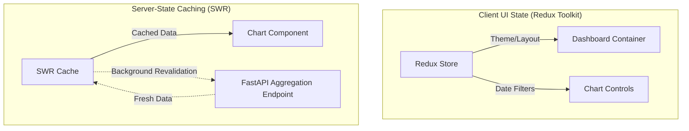

# React Dashboard Optimization: Caching, Global State, and Rendering Performance

A comprehensive guide to building performance-optimized dashboards using React, Redux Toolkit, SWR, Zod, and Formik.

---

## 1. Frontend State Architecture (Why & What)

### SWR (Server Cache) vs. Redux Toolkit (Client UI State)
A common mistake in React dashboard applications is storing API response data in a global Redux store. This leads to heavy boilerplate (actions, reducers, selectors) and manual sync code. Modern architectures separate state into two distinct boundaries:

1. **Server Cache (SWR / React Query)**:
   * **Why**: Dashboard statistics, tables, and metrics belong to the server. SWR fetches, caches, and automatically refreshes this data (e.g., when the user refocused the window or browser tab).
   * **Mechanism**: SWR uses the **Stale-While-Revalidate** strategy. It returns cached (stale) data immediately, fetches fresh data in the background, and updates the UI seamlessly without showing loading spinners.
2. **Client UI State (Redux Toolkit / Context)**:
   * **Why**: UI-specific configurations (e.g., dark mode toggle, side-panel collapse, active chart time-range, selected widget grid layout) are local client states and do not exist on the server. Redux Toolkit excels at handling these transient, complex UI flows.



---

## 2. Dashboard Rendering Optimizations (Why & How)

Dashboards deal with continuous updates and large data volumes. Unoptimized React code will cause the main thread to drop frames, resulting in laggy interactions.

### Memoization Rules:
* **`React.memo`**: Wraps dashboard widget components. It prevents a widget from re-rendering if its parent container re-renders, unless the widget's inputs (props) change.
* **`useMemo`**: Used to transform or filter aggregated data arrays (e.g., converting dates, grouping raw timeseries values into chart datasets) before feeding them to chart components.
* **`useCallback`**: Memoizes event handlers (e.g., date-range changes or widget dismissals) so that they don't break child component `React.memo` optimizations by recreation on every render cycle.

### Virtualization
When rendering raw transactional tables or audit logs with thousands of rows under a chart, rendering all DOM elements will crash the browser tab. 
* **Virtualization** (using libraries like `react-window` or `react-virtualized`) only renders rows that are currently visible inside the viewport, recycling DOM nodes as the user scrolls.

---

## 3. Implementation Code (How)

### Gist 1: SWR Cache Setup with Axios Interceptors
A central API client with global error handling and SWR integration.

```typescript
// Gist: apiClient.ts
import axios from 'axios';

// Initialize Axios Client
export const apiClient = axios.create({
  baseURL: import.meta.env.VITE_API_URL || 'http://localhost:8000/api/v1',
  headers: {
    'Content-Type': 'application/json',
  },
  timeout: 10000,
});

// Axios Request Interceptor (Inject auth token or logs)
apiClient.interceptors.request.use(
  (config) => {
    const token = localStorage.getItem('auth_token');
    if (token && config.headers) {
      config.headers.Authorization = `Bearer ${token}`;
    }
    return config;
  },
  (error) => Promise.reject(error)
);

// Axios Response Interceptor (Global error catching)
apiClient.interceptors.response.use(
  (response) => response,
  (error) => {
    if (error.response?.status === 401) {
      // Handle logout or refresh token logic
      window.location.href = '/login';
    }
    return Promise.reject(error);
  }
);

// Generic SWR Fetcher
export const swrFetcher = (url: string) => 
  apiClient.get(url).then((res) => res.data);
```

### Gist 2: Custom React Hook for Optimistic Updates and Memoized Transform
A reusable hook to fetch timeseries metrics, transform data for a Chart library, and support instant local UI updates (optimistic UI).

```typescript
// Gist: useDashboardMetrics.ts
import useSWR, { useSWRConfig } from 'swr';
import { useMemo } from 'react';
import { apiClient, swrFetcher } from './apiClient';

interface RawMetric {
  tenant_id: number;
  tenant_name: string;
  sales_date: string;
  daily_sales: number;
  running_cumulative_sales: number;
}

export const useDashboardMetrics = (startDate?: string) => {
  const { mutate } = useSWRConfig();
  const url = `/analytics/cumulative-sales${startDate ? `?start_date=${startDate}` : ''}`;
  
  const { data, error, isLoading, mutate: localMutate } = useSWR<RawMetric[]>(url, swrFetcher, {
    revalidateOnFocus: true,
    dedupingInterval: 5000, // Dedupes requests for 5 seconds
  });

  // Optimization: Memoize transformed data for charting components
  // Why: Prevents reprocessing arrays on unrelated parent re-renders
  const chartData = useMemo(() => {
    if (!data) return [];
    
    return data.map((item) => ({
      date: new Date(item.sales_date).toLocaleDateString(),
      sales: item.daily_sales,
      cumulative: item.running_cumulative_sales,
      name: item.tenant_name,
    }));
  }, [data]);

  // Optimistic UI Update: Instantly update client view before backend responds
  const updateMetricOptimistically = async (tenantId: number, tempSalesUpdate: number) => {
    if (!data) return;

    // 1. Construct optimistic data
    const optimisticData = data.map((item) => 
      item.tenant_id === tenantId 
        ? { ...item, daily_sales: tempSalesUpdate } 
        : item
    );

    // 2. Perform local update immediately, disable immediate background revalidation
    localMutate(optimisticData, false);

    try {
      // 3. Send mutation to backend
      await apiClient.post('/analytics/adjust-metric', { tenant_id: tenantId, amount: tempSalesUpdate });
      // 4. Force refetch to ensure source of truth
      mutate(url);
    } catch (err) {
      // 5. Rollback on error
      localMutate(data, true);
      throw err;
    }
  };

  return {
    metrics: data,
    chartData,
    isLoading,
    isError: !!error,
    updateMetricOptimistically,
  };
};
```

### Gist 3: Redux Toolkit Slice for Dashboard Layout Configurations
Manages dashboard UI states, customizable grids, and theme configurations.

```typescript
// Gist: dashboardSlice.ts
import { createSlice, PayloadAction } from '@reduxjs/toolkit';

interface DashboardState {
  theme: 'light' | 'dark';
  timeRange: '7d' | '30d' | '90d' | '1y';
  visibleWidgets: string[];
  sidebarCollapsed: boolean;
}

const initialState: DashboardState = {
  theme: 'dark',
  timeRange: '30d',
  visibleWidgets: ['sales-line', 'revenue-kpi', 'rankings-table'],
  sidebarCollapsed: false,
};

export const dashboardSlice = createSlice({
  name: 'dashboard',
  initialState,
  reducers: {
    toggleTheme: (state) => {
      state.theme = state.theme === 'light' ? 'dark' : 'light';
    },
    setTimeRange: (state, action: PayloadAction<DashboardState['timeRange']>) => {
      state.timeRange = action.payload;
    },
    toggleWidgetVisibility: (state, action: PayloadAction<string>) => {
      const widget = action.payload;
      if (state.visibleWidgets.includes(widget)) {
        state.visibleWidgets = state.visibleWidgets.filter((w) => w !== widget);
      } else {
        state.visibleWidgets.push(widget);
      }
    },
    setSidebarCollapsed: (state, action: PayloadAction<boolean>) => {
      state.sidebarCollapsed = action.payload;
    },
  },
});

export const {
  toggleTheme,
  setTimeRange,
  toggleWidgetVisibility,
  setSidebarCollapsed,
} = dashboardSlice.actions;

export default dashboardSlice.reducer;
```

### Gist 4: Zod & Formik Filter Panel Validation
Formik handles state, and Zod validates dashboard custom query parameters before fetching backend endpoints.

```typescript
// Gist: FilterPanel.tsx
import React from 'react';
import { useFormik } from 'formik';
import { z } from 'zod';
import { toFormikValidationSchema } from 'zod-formik-adapter';

// 1. Define strict filter schemas using Zod
const filterSchema = z.object({
  startDate: z.string().regex(/^\d{4}-\d{2}-\d{2}$/, 'Must be YYYY-MM-DD format'),
  endDate: z.string().regex(/^\d{4}-\d{2}-\d{2}$/, 'Must be YYYY-MM-DD format'),
  tenantId: z.string().optional(),
  minAmount: z.number().nonnegative('Cannot be less than 0').optional(),
}).refine((data) => new Date(data.startDate) <= new Date(data.endDate), {
  message: 'Start date cannot be after end date',
  path: ['startDate'],
});

interface FilterPanelProps {
  onApplyFilters: (filters: z.infer<typeof filterSchema>) => void;
}

export const FilterPanel: React.FC<FilterPanelProps> = ({ onApplyFilters }) => {
  const formik = useFormik({
    initialValues: {
      startDate: new Date(Date.now() - 30 * 24 * 60 * 60 * 1000).toISOString().split('T')[0],
      endDate: new Date().toISOString().split('T')[0],
      tenantId: '',
      minAmount: 0,
    },
    // Integration of Zod schema into Formik validation pool
    validationSchema: toFormikValidationSchema(filterSchema),
    onSubmit: (values) => {
      onApplyFilters(values);
    },
  });

  return (
    <form onSubmit={formik.handleSubmit} className="p-4 bg-gray-900 text-white rounded-lg shadow-md flex gap-4 items-end">
      <div>
        <label className="block text-xs font-semibold uppercase text-gray-400">Start Date</label>
        <input
          name="startDate"
          type="date"
          onChange={formik.handleChange}
          value={formik.values.startDate}
          className="bg-gray-800 p-2 rounded text-white border border-gray-700 focus:outline-none"
        />
        {formik.errors.startDate && <div className="text-red-500 text-xs mt-1">{formik.errors.startDate}</div>}
      </div>
      <div>
        <label className="block text-xs font-semibold uppercase text-gray-400">End Date</label>
        <input
          name="endDate"
          type="date"
          onChange={formik.handleChange}
          value={formik.values.endDate}
          className="bg-gray-800 p-2 rounded text-white border border-gray-700 focus:outline-none"
        />
        {formik.errors.endDate && <div className="text-red-500 text-xs mt-1">{formik.errors.endDate}</div>}
      </div>
      <button type="submit" className="bg-blue-600 hover:bg-blue-700 px-4 py-2 rounded font-bold text-white transition-colors">
        Apply Filters
      </button>
    </form>
  );
};
```
