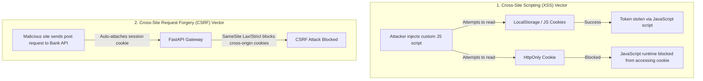

# Web Browser APIs & Storage Security Boundaries Masterclass

A deep-dive academic guide to client-side storage mechanisms, security headers, token storage policies, and transport boundaries.

---

## 1. Browser Storage Comparison (Why & What)

Modern browsers provide multiple mechanisms to store data on the client side. Choosing the correct storage type requires analyzing capacity constraints, lifecycle persistence, access scopes, and security boundaries.

| Storage Type | Capacity | Lifecycle | Accessible via JavaScript? | Sent Automatically via HTTP? | Use Case |
|---|---|---|---|---|---|
| **Cookies** | ~4KB | Expire time set by server/client | Yes (Unless `HttpOnly` is set) | **Yes** (Sent on every request matching domain) | Session tokens, tracking IDs. |
| **LocalStorage** | ~5MB - 10MB | Persistent until cleared manually | **Yes** | No | User theme preferences, offline forms. |
| **SessionStorage**| ~5MB | Cleared when browser tab is closed | **Yes** | No | Single-tab state backups. |
| **IndexedDB** | ~Over 250MB | Persistent | **Yes** | No | Heavy offline datasets, local asset cache. |

---

## 2. Session Models & Token Storage Security (Why & How)

A critical architectural decision when building fullstack React/FastAPI applications is where to store authentication tokens (e.g. JWTs):

### Approach A: LocalStorage / SessionStorage
* **Mechanism**: Store the JWT token in LocalStorage and inject it manually into Axios request headers.
* **The Vulnerability (XSS)**: If an attacker executes a Cross-Site Scripting (XSS) script (e.g. via an unescaped markdown comment widget or a vulnerable npm package dependency), they can call `localStorage.getItem("token")` and steal the token, gaining full access to the user's account.

### Approach B: HTTP-Only Cookies
* **Mechanism**: The backend FastAPI server sends the JWT token in a cookie with the `HttpOnly` and `Secure` flags set.
* **The Protection**: JavaScript code running in the browser cannot read HTTP-Only cookies, protecting the token from XSS theft.
* **The Vulnerability (CSRF)**: Since browsers automatically append cookies to all outgoing requests matching the target domain, an attacker can trick a user into visiting a malicious website that issues requests to the bank API. The browser attaches the session cookie automatically, executing the request.
* **The Mitigation (SameSite)**: Set the `SameSite` cookie attribute to `Lax` or `Strict` to block browsers from attaching cookies to cross-site requests.



---

## 3. Implementation Blueprint (How)

### Gist: secure_session_backend.py
A complete FastAPI authentication endpoint setting and deleting secure, HTTP-Only cookies.

```python
# Gist: secure_session_backend.py
from fastapi import FastAPI, Response, status, HTTPException
from pydantic import BaseModel

app = FastAPI()

class LoginRequest(BaseModel):
    username: str
    password: str

@app.post("/api/v1/auth/login")
async def login(response: Response, credentials: LoginRequest):
    # Authenticate user credentials
    if credentials.username != "admin" or credentials.password != "secret":
        raise HTTPException(status_code=400, detail="Invalid username or password")
        
    jwt_token = "generated_secure_jwt_token_payload"
    
    # Set the token in an HttpOnly, Secure, SameSite Cookie
    # Why: Protects the token from XSS theft and CSRF attacks
    response.set_cookie(
        key="session_token",
        value=jwt_token,
        httponly=True,       # Prevents JavaScript from reading the cookie
        secure=True,         # Enforces HTTPS transmission only
        samesite="lax",      # Blocks cookie attachment on cross-site requests
        max_age=1800,        # Expires in 30 minutes
        path="/",            # Scope cookie to the entire domain
    )
    return {"success": True, "message": "Login successful"}

@app.post("/api/v1/auth/logout")
async def logout(response: Response):
    # Delete cookie to clear session
    response.delete_cookie(
        key="session_token",
        path="/",
        httponly=True,
        secure=True,
        samesite="lax"
    )
    return {"success": True, "message": "Logout successful"}
```

### Gist: safe_local_storage.ts
A TypeScript helper class providing type-safe LocalStorage operations with quota boundary error handling.

```typescript
// Gist: safe_local_storage.ts
export class LocalStorageHelper {
  // Set item safely, catching quota exceptions (e.g. storage full)
  public static setItem(key: string, value: unknown): boolean {
    try {
      const stringifiedValue = JSON.stringify(value);
      localStorage.setItem(key, stringifiedValue);
      return true;
    } catch (error) {
      console.error('LocalStorage write failed:', error);
      // QuotaExceededError occurs if the 5MB browser storage allocation limit is hit
      return false;
    }
  }

  // Get item safely, returning fallback values on parsing errors
  public static getItem<T>(key: string, fallback: T): T {
    try {
      const value = localStorage.getItem(key);
      if (value === null) return fallback;
      return JSON.parse(value) as T;
    } catch (error) {
      console.error('LocalStorage parsing failed:', error);
      return fallback;
    }
  }

  public static removeItem(key: string): void {
    localStorage.removeItem(key);
  }
}
```
