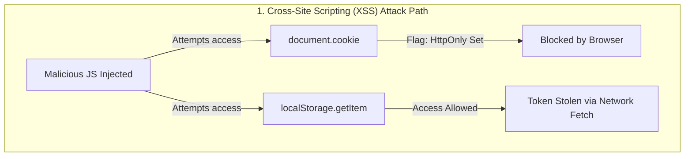
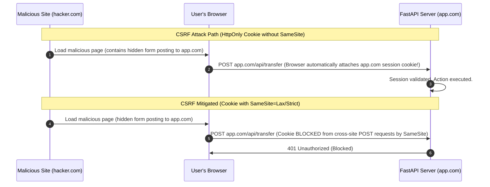

# Browser APIs, Client-Side Storage, and Session Security

A senior-level fullstack reference guide to client storage mechanics (Cookies, LocalStorage, SessionStorage, IndexedDB) and security mechanisms (XSS/CSRF mitigations).

---

## 1. Browser Storage Mechanics (Why & What)

As a fullstack engineer, choosing where to store data on the client (authentication tokens, user settings, cached dashboard charts) directly impacts application performance, scalability, and security.

### Storage Options Comparison

| Storage Mechanism | Capacity | Access / Scope | Synchronous / Async | Sent with HTTP Requests? | Best Use Case |
| :--- | :--- | :--- | :--- | :--- | :--- |
| **Cookies** | ~4 KB | Accessible via headers (document.cookie unless HttpOnly is set). | Synchronous | **Yes** (Automatically sent by browser for matching domains). | Session IDs, auth tokens, tracking identifiers. |
| **Local Storage** | ~5 MB | Per origin (protocol + host + port). Persists across tabs/windows indefinitely. | Synchronous (blocking) | **No** (Must be manually read and sent via JS code). | Non-sensitive UI preferences (theme, collapsed sidebar). |
| **Session Storage**| ~5 MB | Per tab/window session. Cleared when the tab is closed. | Synchronous (blocking) | **No** | Temporary transient states (multi-step form inputs). |
| **IndexedDB** | Disk dependent | Per origin. Persistent database storing objects and blobs. | **Asynchronous** (non-blocking) | **No** | Heavy offline caches, local replica datasets. |

---

## 2. Client-Side Security & Session Management (Why & What)

### Stateless JWT (LocalStorage) vs. Stateful Cookie Session (HttpOnly)
The choice of where to store authentication state is a primary source of debate in web security.

#### 1. LocalStorage Storage (JWT approach)
* **Vulnerability**: **Cross-Site Scripting (XSS)**. If an attacker injects a malicious script into your site (e.g., via unescaped input or a vulnerable npm package), the script can execute `localStorage.getItem('auth_token')` and send the token to an external server.
* **Mitigation**: Strictly sanitize HTML inputs and set Content Security Policies (CSP).

#### 2. HttpOnly Cookie Storage (Session ID or JWT approach)
* **Vulnerability**: **Cross-Site Request Forgery (CSRF)**. Since browsers automatically attach cookies to matching HTTP requests, an attacker can trick a logged-in user into clicking a link that triggers an action on your server (e.g., `POST /api/v1/transfer`). The browser will attach the session cookie, and the server will execute it.
* **Mitigation**: Use `SameSite=Lax` or `SameSite=Strict` cookie flags, and double-submit CSRF tokens.



### Cookie Security Flags
To secure cookies from both XSS and CSRF, you must configure the following headers:
* **`HttpOnly`**: Blocks client-side JavaScript from reading the cookie via `document.cookie`. This prevents theft during XSS attacks.
* **`Secure`**: Enforces that the cookie is only transmitted over secure, encrypted HTTPS connections (ignored on localhost).
* **`SameSite`**: Controls cross-site cookie transmission:
  * `SameSite=Strict`: The cookie is never sent on cross-site requests (e.g., following a link from google.com to your site).
  * `SameSite=Lax` (Default modern standard): The cookie is sent on cross-site requests only during top-level navigation (following links), but blocked on subresource requests (e.g. cross-site image loads or fetch/ajax queries).
  * `SameSite=None`: The cookie is sent everywhere, but requires the `Secure` flag.



---

## 3. Implementation Blueprints (How)

### Gist 1: FastAPI Setting Secure HttpOnly Cookies
A backend configuration demonstrating how to set and clear secure cookies containing session JWTs.

```python
# Gist: cookie_session_backend.py
from fastapi import FastAPI, Response, status, Request, HTTPException
from fastapi.responses import JSONResponse

app = FastAPI()

SESSION_COOKIE_NAME = "session_token"

@app.post("/api/v1/auth/login")
async def login(response: Response):
    """
    Simulates user login and writes JWT into a secure HttpOnly cookie.
    """
    mock_jwt_token = "eyJhbGciOiJIUzI1NiIsInR5cCI6IkpXVCJ9.mock_payload_data"
    
    # Set the cookie with all security parameters configured
    response.set_cookie(
        key=SESSION_COOKIE_NAME,
        value=mock_jwt_token,
        httponly=True,       # Prevents JavaScript reading (Mitigates XSS)
        secure=True,         # Enforces HTTPS only (Ignored on localhost dev)
        samesite="lax",      # Mitigates CSRF by blocking cross-site AJAX attachments
        max_age=1800,        # Expires in 30 minutes (1800 seconds)
        path="/",            # Scope cookie to the entire domain
    )
    return {"success": True, "message": "Login successful"}

@app.post("/api/v1/auth/logout")
async def logout(response: Response):
    """
    Clears the session cookie on logout.
    """
    response.delete_cookie(
        key=SESSION_COOKIE_NAME,
        path="/",
        httponly=True,
        secure=True,
        samesite="lax"
    )
    return {"success": True, "message": "Logged out successfully"}

@app.get("/api/v1/users/me")
async def get_current_user(request: Request):
    """
    Reads cookie session state directly from request headers.
    """
    # Retrieve cookie value
    token = request.cookies.get(SESSION_COOKIE_NAME)
    if not token:
        raise HTTPException(
            status_code=status.HTTP_401_UNAUTHORIZED,
            detail="Session expired or invalid"
        )
    return {"user_id": 1024, "role": "editor", "token_validated": True}
```

### Gist 2: React LocalStorage Safe Wrapper Helper
A TypeScript utility to read and write data in LocalStorage, managing JSON parsing errors and private browser quota exceptions.

```typescript
// Gist: localStorageHelper.ts

export const localStorageHelper = {
  /**
   * Set item in LocalStorage safely.
   * Why: Handles private browsing quota exceptions (Safari/Firefox throw errors when full or in incognito).
   */
  set: <T>(key: string, value: T): boolean => {
    try {
      const serializedValue = JSON.stringify(value);
      window.localStorage.setItem(key, serializedValue);
      return true;
    } catch (err) {
      console.error(`LocalStorage write error for key "${key}":`, err);
      return false;
    }
  },

  /**
   * Get item from LocalStorage safely.
   * Why: Handles invalid JSON parsing formats without crashing the React main thread.
   */
  get: <T>(key: string, fallbackValue: T): T => {
    try {
      const item = window.localStorage.getItem(key);
      if (item === null) return fallbackValue;
      return JSON.parse(item) as T;
    } catch (err) {
      console.error(`LocalStorage read/parse error for key "${key}":`, err);
      return fallbackValue;
    }
  },

  /**
   * Remove item from LocalStorage.
   */
  remove: (key: string): void => {
    try {
      window.localStorage.removeItem(key);
    } catch (err) {
      console.error(`LocalStorage deletion error for key "${key}":`, err);
    }
  },
};
```
