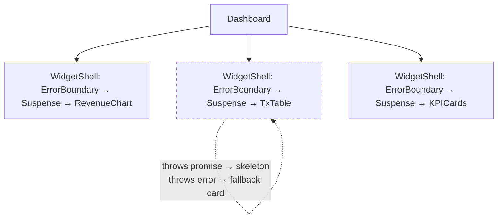

# Error Boundaries, Suspense & Profiling Masterclass

The resilience-and-performance half of senior React: containing failures to one widget, declaring loading states instead of hand-rolling them, and diagnosing jank with a profiler instead of guessing. Rendering/memoization fundamentals live in [01_react_dashboard_rendering_state.md](01_react_dashboard_rendering_state.md) — this doc builds on them.

---

## 1. Why Errors Must Be Contained (Why)

React's default failure mode is brutal: **an uncaught error during render unmounts the entire component tree.** One chart choking on a malformed API row doesn't break that chart — it blanks the whole dashboard, nav and all. For a multi-widget UI this is an architecture bug, not a code bug: nothing decided the *blast radius* of a failure.

An **error boundary** is that decision made explicit — a component that catches render-phase errors in its subtree and swaps in a fallback. Catching render errors is only exposed through class lifecycles (`getDerivedStateFromError`/`componentDidCatch`), which is why everyone uses the tiny `react-error-boundary` package rather than hand-rolling classes. Boundary placement *is* blast-radius design: one boundary per widget means one broken card in an otherwise healthy dashboard. Know the blind spots: boundaries do **not** catch errors in event handlers (use try/catch), async callbacks outside render, or SSR.

## 2. Error Boundaries in Practice (How)

The senior detail is the **reset story**. A fallback with a Retry button that only resets the boundary re-renders straight into the same stale SWR cache — same error. Reset must clear *both*: the boundary state and the data that poisoned it.

```tsx
// Gist: widget_boundary.tsx — full runnable version in usable_gists/react_error_boundary_suspense_widget.tsx
import { ErrorBoundary } from "react-error-boundary";
import { useSWRConfig } from "swr";

function WidgetShell({ swrKey, children }: { swrKey: string; children: React.ReactNode }) {
  const { mutate } = useSWRConfig();
  return (
    <ErrorBoundary
      FallbackComponent={({ error, resetErrorBoundary }) => (
        <div role="alert">
          <p>This widget failed: {error.message}</p>
          <button onClick={resetErrorBoundary}>Retry</button>
        </div>
      )}
      onReset={() => mutate(swrKey)}          // reset boundary AND revalidate the poisoned cache
      onError={(err) => reportToSentry(err)}  // observability at the boundary, once, with context
      resetKeys={[swrKey]}                    // changing filters auto-clears a stale error state
    >
      {children}
    </ErrorBoundary>
  );
}
```

`onError` is also *where centralized error reporting belongs* — one instrumented boundary component beats try/catch confetti across fifty widgets.

## 3. Suspense for Data (What & How)

Without Suspense every data component hand-rolls the same ternary: `if (isLoading) … if (error) … return data`. **Suspense inverts it**: a component *suspends* while data is pending, and the nearest `<Suspense fallback>` renders the placeholder — loading UI becomes declarative tree structure, decided by the parent, exactly like error UI with boundaries. SWR opts in with `useSWR(key, fetcher, { suspense: true })`; errors then *throw* to the boundary, so the pair composes into one wrapper:



Each widget now loads, fails, and retries **independently** — the layout never blocks on the slowest query. Two adjacent APIs to name (one paragraph, no more): `useTransition` marks a state update non-urgent so a heavy filter change doesn't freeze typing, and `useDeferredValue` lets an expensive subtree lag behind a fast-changing input. They solve *responsiveness under CPU pressure*; memoization ([01](01_react_dashboard_rendering_state.md)) solves *wasted work* — different tools, commonly confused in interviews.

## 4. A Profiling Workflow That Finds the Real Problem (How)

Weak answer: "I'd add `React.memo`." Strong answer: a measurement workflow. React DevTools **Profiler** tab:

1. **Record the actual interaction** — click Record, change the filter that feels janky, stop. You get one entry per *commit* (a render flushed to the DOM).
2. **Read the commit bar** — many tall bars for one keystroke means render storms; one tall bar means one expensive commit. These are different diseases.
3. **Open the flamegraph** — width = render cost including children. Follow the wide bars down to the widest *leaf*.
4. **Ask "why did this render?"** (enable in Profiler settings) — it names the culprit: "props changed (onSelect)" with a fresh arrow function every parent render, or a context value re-created each commit, or state that belongs further down the tree.

Only then fix — stabilize the prop, split the context, move the state, virtualize the list — and **re-record to confirm**. If the Profiler shows cheap renders but the page still stutters, the problem isn't React: switch to the browser Performance tab and look for long tasks and layout thrash. For repeatable numbers in code, the `<Profiler onRender>` component API logs commit durations you can assert on.

| Symptom in Profiler | Usual culprit | Fix |
|---|---|---|
| Whole tree re-renders per keystroke | State hoisted too high / context too broad | Move state down; split contexts |
| Memoized child renders anyway | Unstable object/function props | `useCallback`/`useMemo` the prop, not the child |
| One giant leaf bar | 5,000 DOM rows | Virtualize ([01](01_react_dashboard_rendering_state.md)) |
| Cheap commits, janky page | Not React | Browser Performance tab: long tasks, layout |

## 5. Interview Angles

**"One chart throws on malformed data — what does the user see, and what should they see?"**
Skeleton: default = whole-tree unmount, blank page → per-widget error boundary makes it one broken card → the reset must also revalidate SWR (`onReset` → `mutate`) or Retry replays the cached poison → `onError` is the Sentry hook → close with the blind spots (event handlers, async) to show you know the edges.

**"The dashboard feels janky when filters change — show me your process, tool by tool."**
Skeleton: reproduce and *record* in the React Profiler → commit bar (storm vs single expensive commit) → flamegraph to the widest leaf → "why did this render" names the unstable prop/context → targeted fix → re-record. If commits are cheap, jump to the browser Performance tab. The word that wins the question is *measure*.

**"What problem does Suspense solve that `isLoading` ternaries don't?"**
Skeleton: moves loading UI from imperative per-component branching to declarative tree structure owned by the parent → composes with error boundaries into one widget shell → enables independent widget streaming → distinguish from `useTransition`/`useDeferredValue` (responsiveness under CPU pressure, not data fetching).
