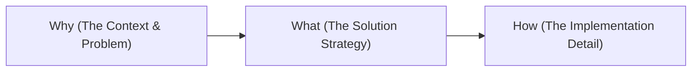

# Technical Mock Q&A and Behavioral Interview Drills

A practical guide to structured technical communication, typical senior fullstack questions, and response strategies for a 30-minute BairesDev technical evaluation.

---

## 1. Structured Communication Strategy (Why & What)

### Why Structure Your Answers?
In a short 30-minute evaluation, you cannot waste time rambling. If an evaluator asks, "How do you optimize a slow database query?", jumping straight into "I'd use indexing" shows a lack of seniority. You need to present your thought process systematically using the **Why-What-How** framework.



### The STAR Method for Behavioral Questions
For behavioral and project leadership questions, follow the **STAR** method:
* **Situation**: Briefly describe the context (e.g., "Our dashboard load time was exceeding 8 seconds...").
* **Task**: Explain the challenge and goal (e.g., "I was tasked with reducing it below 2 seconds...").
* **Action**: Detail *what you did* (e.g., "I optimized DB queries using window functions and implemented SWR caching on the frontend...").
* **Result**: Present metrics of success (e.g., "This reduced load times to 450ms and cut DB CPU usage by 40%...").

---

## 2. Technical Mock Q&A Drills (What & How)

### Question 1: "How do you handle real-time data visualization on a dashboard without overloading the PostgreSQL database?"

#### Spoken Strategy:
1. **Why**: Querying raw records continuously from Postgres for thousands of concurrently connected users will consume all DB connections and CPU cycles, causing the platform to fail.
2. **What**: Implement a tiered data synchronization architecture. Use **SWR Client-side Caching (polling/revalidation)**, **API-level Redis caching** for popular stats, and **Database Pre-aggregation (Materialized Views or scheduled Celery aggregation tables)**.
3. **How**:
   * For non-critical metrics (e.g., historical sales): Aggregate them hourly via Celery into a `daily_metrics_summary` table. Fetch from this table using simple, indexed SELECT queries.
   * For near-real-time metrics: Set SWR’s `dedupingInterval` to 5 seconds. If multiple components request the same data, SWR only hits the API once.
   * Use Redis to cache the API JSON response for 30 seconds.

---

### Question 2: "Explain the difference between SQLAlchemy's `joinedload` and `selectinload`. When would you choose one over the other?"

#### Spoken Strategy:
1. **Why**: Fetching relationships naively causes the N+1 query problem, creating high database overhead. We must choose the optimal eager loading strategy depending on the relationship type.
2. **What**: 
   * `joinedload` runs a SQL `LEFT OUTER JOIN` to fetch the parent and related child items in a single query.
   * `selectinload` runs two queries: one for the parent, and a second queries using `IN (parent_id_1, parent_id_2...)` to load child rows.
3. **How**:
   * Use **`joinedload`** for **Many-to-One** or **One-to-One** relationships (e.g., fetching a transaction and its parent tenant). The join is lightweight because there is only one child per parent.
   * Use **`selectinload`** for **One-to-Many** or **Many-to-Many** relationships (e.g., fetching a tenant and their 10,000 transactions). Doing a `joinedload` here would duplicate the tenant's data columns 10,000 times in the result set (Cartesian product), bloating network and memory usage.

---

### Question 3: "What is your strategy for optimizing rendering performance on a dashboard screen with multiple charts updating continuously?"

#### Spoken Strategy:
1. **Why**: In React, if a parent component updates its state, all child components re-render by default. If your parent container manages real-time socket events or timer ticks, all charts, metrics cards, and filters will re-render, dropping browser frames and causing lag.
2. **What**: Isolate rendering boundaries using **`React.memo`**, **`useMemo`**, and local state containment.
3. **How**:
   * Wrap individual Chart widgets in `React.memo` so they only re-render if their exact dataset input changes.
   * Pass data down to charts only after processing it inside a `useMemo` block, ensuring the transformations do not recalculate on unrelated state changes (like side-menu toggles).
   * Keep filter form inputs inside a separate child component (e.g., using Formik) so that typing in a filter field only re-renders the input panel, and not the heavy charts behind it.

---

## 3. Reference Cheat Sheet (Gist)

Use this quick-reference compilation of common syntactic constructs you might be asked to discuss conceptually or walk through.

```python
# Gist: quick_lookup_reference.py
# Quick syntactical cheat sheet for Python/SQLAlchemy/FastAPI tasks

from sqlalchemy import select, func
from sqlalchemy.orm import selectinload, joinedload
from fastapi import FastAPI, Depends

# 1. Eager Loading Example (To discuss N+1 queries)
async def get_tenants_with_transactions(db_session):
    stmt = (
        select(Tenant)
        .options(selectinload(Tenant.transactions))  # Use selectinload for One-to-Many
        .limit(10)
    )
    result = await db_session.execute(stmt)
    return result.scalars().all()

# 2. Raw SQL Index Reference (To discuss DB optimization)
"""
-- Indexing foreign keys and query search fields
CREATE INDEX idx_transactions_tenant_status 
ON transactions (tenant_id, status, created_at);

-- Partial index for active/uncompleted jobs
CREATE INDEX idx_transactions_pending
ON transactions (created_at)
WHERE status = 'pending';
"""

# 3. SQLAlchemy Window Function (To discuss Aggregations)
def get_ranked_tenant_sales():
    # RANK() OVER (PARTITION BY tenant_id ORDER BY amount DESC)
    rank_column = func.rank().over(
        partition_by=Transaction.tenant_id,
        order_by=Transaction.amount.desc()
    )
    
    stmt = select(
        Transaction.tenant_id,
        Transaction.amount,
        rank_column.label("sales_rank")
    )
    return stmt
```
