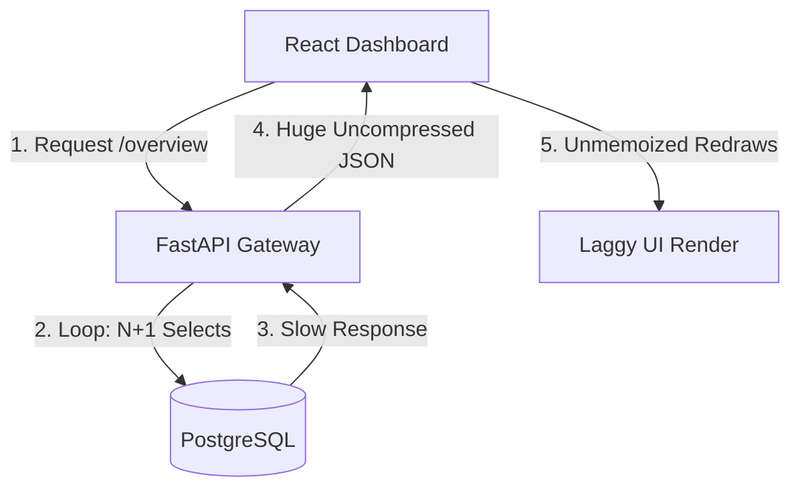
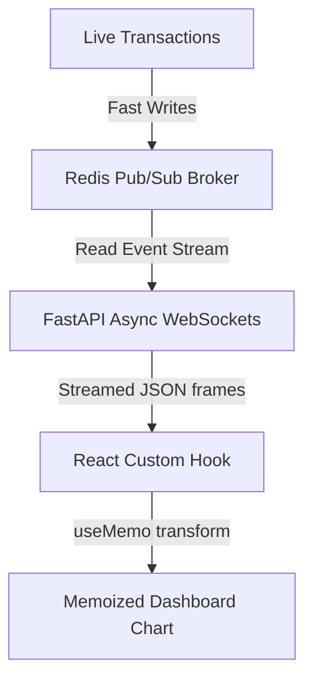
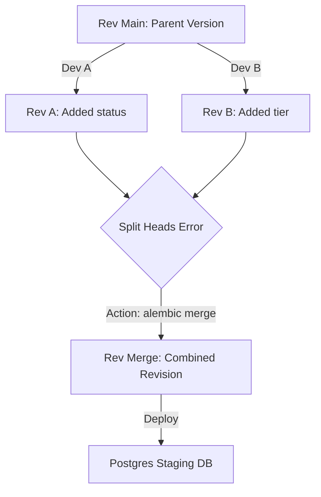

# Fullstack Mock Interview Scenarios & Evaluation Drills

A compilation of complex, senior-level system design scenarios, performance troubleshooting cases, and migration dilemmas designed to drill conceptual and architectural communication.

---

## Scenario 1: The Slow Loading Dashboard (Performance Optimization)

### 1. Case Description (Why & What)
**Situation**: The platform's enterprise clients report that their main dashboard metrics screen takes between 8 to 12 seconds to load. You inspect the network logs and observe that the loading spinner remains active for the duration of a single API fetch to `/api/v1/analytics/overview`.
**Task**: Diagnose, profile, and fix the latency to bring load times below 1 second.



### 2. Mock Interview Questions & Expected Rubrics (How)

#### Question A: "Walk me through your step-by-step diagnostic workflow to find the root cause of this lag."
* **Optimal Answer**:
  1. **Network Profiling**: Open Browser DevTools. Check if the delay is in connection handshake (CORS/SSL), payload download (network size), or Time to First Byte (TTFB - backend calculation).
  2. **API Profiling**: Check backend route execution times. If it's high, inspect database logs. Enable SQLAlchemy query logging (`echo=True`) or execute an APM profile (like Prometheus/Jaeger) to isolate slow functions.
  3. **Database Profiling**: Log raw queries. Execute `EXPLAIN ANALYZE` on PostgreSQL for the slow queries. Check if Postgres is running sequential table scans instead of index scans, or if there's a heavy cartesian join product.
  4. **Code Inspection**: Look for typical loops in Python code querying the database (the N+1 queries pattern).

#### Question B: "You discover the backend runs a query to fetch 100 Organizations, then loops over them to calculate aggregate transaction metrics per organization. How do you fix this?"
* **Optimal Answer**:
  * Identify this as a classic **N+1 query database bottleneck**.
  * **First Step (Eager Loading)**: If we must fetch child rows, use SQLAlchemy’s `selectinload()` to load all related transaction rows in exactly two queries, rather than executing a new query for each parent organization.
  * **Second Step (Push Aggregations to DB)**: Refactor the code. Instead of downloading all raw transactions into Python memory to compute sums, perform a database-level aggregation query using `GROUP BY` and return only the pre-calculated totals.

---

## Scenario 2: The Real-Time Transaction Stream (Scale & Transport)

### 1. Case Description (Why & What)
**Situation**: You are designing a dashboard displaying live transaction telemetry (throughput, active connections, alert triggers) updating at least once per second for 5,000 active tenants.
**Task**: Architect a communication pipeline between client and backend that updates instantly without overloading the PostgreSQL database or crashing React rendering loops.



### 2. Mock Interview Questions & Expected Rubrics (How)

#### Question A: "Which transport protocol do you select (Short Polling, Long Polling, SSE, WebSockets) and why?"
* **Optimal Answer**:
  * **I reject short polling**: Making 5,000 HTTP requests per second causes massive CPU overhead on both the gateway and PostgreSQL due to repeated TLS/TCP handshakes.
  * **I select Server-Sent Events (SSE) or WebSockets**: 
    * If the dashboard is **read-only** (only displaying metrics from server to client), I select **SSE**. It runs over HTTP/2, uses a single persistent TCP connection, automatically handles re-connections, and is simpler to scale behind reverse proxies.
    * If the dashboard requires **bidirectional interaction** (e.g. users editing widget thresholds while receiving live logs), I select **WebSockets**.

#### Question B: "How do you prevent the continuous data stream from causing performance lag on the React frontend?"
* **Optimal Answer**:
  * **Isolate State updates**: Do not trigger state changes in the root container on every message tick. Isolate the socket consumer hook inside a dedicated chart wrapper component.
  * **Data Debouncing / Batching**: Instead of re-drawing the chart on every single transaction, buffer incoming transactions in a local array and update the React state at set intervals (e.g. every 500ms).
  * **Memoize Transformations**: Wrap any data mapping (converting timestamps to labels) in `useMemo`, ensuring calculations only execute when the socket actually yields new metrics.

---

## Scenario 3: The Alembic Migration Lock (DevOps & Tooling)

### 1. Case Description (Why & What)
**Situation**: Developer A creates a migration to add a `status` column to table `tenants`. At the same time, Developer B creates a migration to add a `tier` column to table `tenants`. Both merge their PRs to main. When trying to deploy to staging, Alembic throws a fatal `alembic.util.exc.CommandError: Multiple heads are present; run 'alembic branches' to see them`.
**Task**: Resolve the database version fork securely without dropping database tables or losing columns.



### 2. Mock Interview Questions & Expected Rubrics (How)

#### Question A: "Why did this error occur and what is the command sequence to resolve it?"
* **Optimal Answer**:
  * **Reason**: Both migrations share the same parent revision (`down_revision`), creating a fork in the migration history line. Alembic does not know which migration to run first.
  * **Resolution Steps**:
    1. Run `alembic branches` to get the revision IDs for both heads (e.g., `rev_a_id` and `rev_b_id`).
    2. Run the merge command:
       ```bash
       alembic merge -m "merge_dev_a_and_dev_b_heads" rev_a_id rev_b_id
       ```
    3. This generates a new merge migration file. The `down_revision` will list both branch IDs as dependencies, resolving the fork.
    4. Run `alembic upgrade head` to apply the combined migration.

#### Question B: "How do you verify if the migration will break production databases (e.g. locking a table containing 10 million rows)?"
* **Optimal Answer**:
  * **Reason**: Running an `ALTER TABLE ADD COLUMN` with a non-nullable default value on a large table in PostgreSQL < 11 causes Postgres to rewrite the entire table, holding an exclusive lock and blocking all incoming API requests.
  * **Mitigation**:
    1. Run Alembic in offline mode: `alembic upgrade head --sql` to inspect the generated SQL scripts.
    2. Ensure new columns are created as **nullable** initially, or apply defaults without rewriting the table.
    3. Add a database index asynchronously if needed: `CREATE INDEX CONCURRENTLY` so query queries don't lock active transaction writes.
