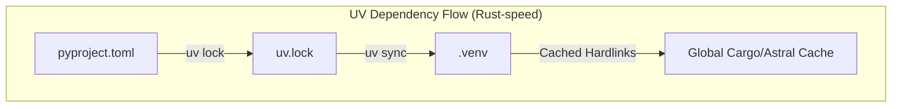
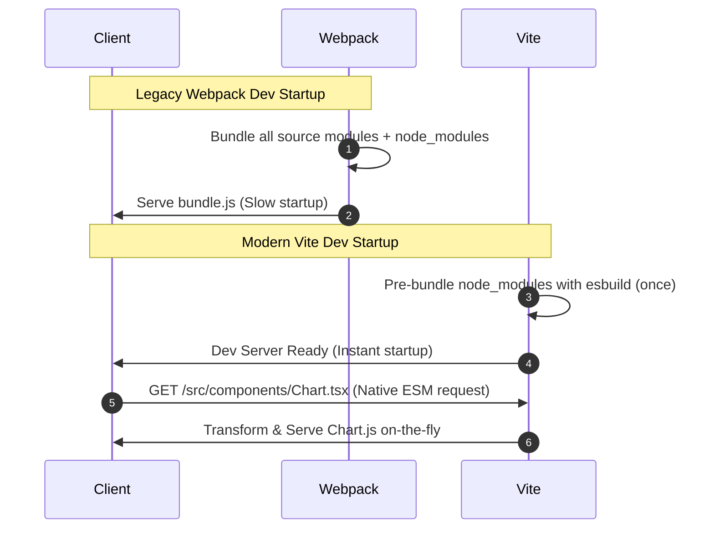

# Modern Tooling & Project Bootstrapping: UV and Vite

A senior-level guide to modern fullstack build systems and packaging pipelines, focusing on Vite (JavaScript/TypeScript) and UV (Python).

---

## 1. Modern Python Packaging with UV (Why, What, How)

### Why UV?
In legacy Python projects, dependency management using standard `pip` or even `Poetry` is notoriously slow. `uv` (written in Rust by Astral) is an extremely fast Python package installer and resolver.
* **Speed**: Up to 10-100x faster than `pip` and `pip-tools`.
* **Single Tooling**: Replaces `pip`, `pip-tools`, `virtualenv`, `poetry`, and `pyenv`. It manages Python versions, virtual environments, project dependencies, and package execution.
* **Deterministic Builds**: Uses a global package cache and a lockfile (`uv.lock`) to ensure identical builds across staging and production.



### How: UV Workflow Command Reference (Gist)
Common project operations using `uv`:

```bash
# Gist: uv_workflow.sh
# 1. Initialize a new Python project
uv init my-api --app
cd my-api

# 2. Add dependencies (installs and updates pyproject.toml / uv.lock automatically)
uv add fastapi uvicorn sqlalchemy asyncpg pydantic

# 3. Add development-only dependencies
uv add --dev pytest pytest-asyncio ruff

# 4. Sync the virtual environment (installs missing packages and removes unlisted ones)
uv sync

# 5. Run scripts or commands inside the virtual environment without manual activation
uv run uvicorn main:app --reload

# 6. Run tools directly (e.g., Ruff linter) without installing them globally
uv run ruff check .
```

---

## 2. Modern JS/TS Build Tooling with Vite (Why, What, How)

### Why Vite over Webpack / Create React App?
Legacy React configurations (like Create React App using Webpack) are slow because Webpack must bundle the entire application (source code + third-party node_modules) before the dev server can start.
* **Native ESM Dev Server**: Vite serves source code over native ES Modules (ESM). The browser requests exactly the files it needs for the current screen, and Vite transforms them on the fly.
* **Pre-Bundling Dependencies**: Vite pre-bundles heavy dependencies (like React, lodash, Redux) once using `esbuild` (written in Go), caching them to prevent slow reload cycles.
* **Hot Module Replacement (HMR)**: When a file changes, Vite only invalidates the edited module. Updates in the browser are instantaneous and preserve the React component state.



---

## 3. Configuration Blueprints (Gists)

### Gist 1: Optimized `pyproject.toml` (UV project format)
An optimized project configuration defining modern Python specifications, Ruff configurations, and dependency definitions.

```toml
# Gist: pyproject.toml
[project]
name = "dashboard-backend"
version = "0.1.0"
description = "FastAPI backend optimized for data aggregation and dashboards"
readme = "README.md"
requires-python = ">=3.11"
dependencies = [
    "fastapi>=0.100.0",
    "uvicorn[standard]>=0.22.0",
    "sqlalchemy[asyncio]>=2.0.0",
    "asyncpg>=0.28.0",
    "pydantic[email]>=2.0",
    "redis>=5.0.0",
]

[dependency-groups]
dev = [
    "pytest>=7.4.0",
    "pytest-asyncio>=0.21.0",
    "ruff>=0.1.0",
]

[tool.ruff]
line-length = 88
target-version = "py311"

[tool.ruff.lint]
select = ["E", "F", "I", "N", "UP", "ASYNC"]
ignore = []

[tool.pytest.ini_options]
asyncio_mode = "auto"
testpaths = ["tests"]
```

### Gist 2: Optimized `vite.config.ts` (React + TypeScript)
A production-ready Vite configuration, featuring paths aliases, API proxy settings to bypass local CORS, and custom chunk splitting.

```typescript
// Gist: vite.config.ts
import { defineConfig } from 'vite';
import react from '@vitejs/plugin-react';
import path from 'path';

export default defineConfig({
  plugins: [react()],
  resolve: {
    alias: {
      // Setup clean import paths (e.g. import { Chart } from '@/components/Chart')
      '@': path.resolve(__dirname, './src'),
    },
  },
  server: {
    port: 5173,
    host: true, // Listen on all network interfaces (needed for Docker containers)
    proxy: {
      // Proxy API requests to FastAPI dev server to avoid local CORS options checks
      '/api/v1': {
        target: 'http://localhost:8000',
        changeOrigin: true,
        secure: false,
      },
      // Proxy WebSocket channels
      '/ws': {
        target: 'ws://localhost:8000',
        ws: true,
      },
    },
  },
  build: {
    target: 'esnext',
    outDir: 'dist',
    sourcemap: false,
    minify: 'esbuild', // Faster minification than terser
    rollupOptions: {
      output: {
        // Splitting vendors into separate chunks to optimize browser caching
        manualChunks(id) {
          if (id.includes('node_modules')) {
            if (id.includes('react')) return 'vendor-react';
            if (id.includes('@reduxjs') || id.includes('redux')) return 'vendor-redux';
            if (id.includes('chart.js') || id.includes('react-chartjs-2')) return 'vendor-charts';
            return 'vendor-others';
          }
        },
      },
    },
  },
});
```
