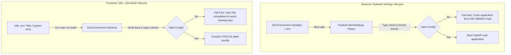

# 12-Factor App Configuration: Pydantic Settings and Vite + Zod

A masterclass in modern configuration architecture, aligning backend (Pydantic Settings) and frontend (Vite + Zod) setups with Factor III of the 12-Factor App methodology.

---

## 1. The 12-Factor App Configuration Philosophy (Why & What)

### Why Separate Configuration from Code?
**Factor III of the 12-Factor App** dictates: *Store config in the environment*. 
Configuration is everything that varies between deploys (such as database credentials, API endpoints, payment gateway keys, and debug modes). 

If configuration is hardcoded in source code:
1. **Security Vulnerability**: API keys and database passwords get leaked to GitHub.
2. **Build Friction**: You must build separate containers/bundles for development, staging, and production.
3. **Operational Drag**: Changing a config parameter requires rebuilding and redeploying the entire codebase.

### The Solution: Fail-Fast Validation
A common issue in cloud deployments is an application booting successfully, only to crash 10 minutes later when a specific route executes because an environment variable (e.g. `SENDGRID_API_KEY`) was missing or misspelled. 

The industry standard is to **validate environment variables at startup**:
* **Backend (Pydantic Settings)**: Reads environment variables, validates formats (e.g., verifying if a connection string is a valid Postgres URL), and crashes immediately on startup (fail-fast) if anything is invalid.
* **Frontend (Vite + Zod)**: Parses build-time environment variables against a Zod schema. If a key is missing, the build process fails, preventing a broken build from being deployed to production.



---

## 2. Backend Config Masterclass (How)

In Python, we use the `pydantic-settings` library to handle configurations.

### Gist: config_backend.py
A complete, production-grade configuration model loading from environment variables, validating schemas, handling database URLs, and reading secrets from files (Docker/K8s compliant).

```python
# Gist: config_backend.py
import os
from typing import Literal, Optional
from pydantic import Field, PostgresDsn, RedisDsn, field_validator
from pydantic_settings import BaseSettings, SettingsConfigDict

class AppSettings(BaseSettings):
    """
    Pydantic Settings configuration manager.
    Automatically reads environment variables, validates types, and falls back to .env files.
    """
    # 1. Configuration metadata: Enable reading from .env file and case-insensitivity
    model_config = SettingsConfigDict(
        env_file=".env",
        env_file_encoding="utf-8",
        case_sensitive=True,
        # Docker/K8s secret loading: reads files under /run/secrets/
        secrets_dir="/run/secrets" if os.path.exists("/run/secrets") else None
    )

    # 2. General Settings
    ENVIRONMENT: Literal["development", "staging", "production"] = "development"
    PROJECT_NAME: str = "Aesthetix API Gateway"
    DEBUG: bool = False

    # 3. Connection Strings (Auto-validated by Pydantic's specialized URL types)
    # Why: PostgresDsn/RedisDsn verify if scheme, user, host, and port conform to RFC specs
    DATABASE_URL: PostgresDsn
    REDIS_URL: RedisDsn

    # 4. Security Keys
    JWT_SECRET_KEY: str = Field(..., min_length=32)  # Enforces cryptographic strength
    ACCESS_TOKEN_EXPIRE_MINUTES: int = 30

    # 5. External API Services (Optional but validated if provided)
    SENDGRID_API_KEY: Optional[str] = None
    ADMIN_EMAIL: str

    # ---------------------------------------------------------
    # CUSTOM VALIDATORS
    # ---------------------------------------------------------
    @field_validator("DATABASE_URL")
    @classmethod
    def validate_async_pg_driver(cls, v: PostgresDsn) -> PostgresDsn:
        # Why: SQLAlchemy async engines require 'postgresql+asyncpg://' driver scheme
        # Pydantic's PostgresDsn parses this URL object. We verify the scheme.
        url_str = str(v)
        if not url_str.startswith("postgresql+asyncpg://"):
            raise ValueError(
                "DATABASE_URL must start with 'postgresql+asyncpg://' to support asyncpg execution"
            )
        return v

# Instantiate settings globally (Singleton pattern)
# Why: Validates the configuration IMMEDIATELY on module import (Fail-Fast)
try:
    settings = AppSettings()
except Exception as e:
    # App boot crashes here with detailed validation errors if .env is corrupt
    print("FATAL CONFIGURATION ERROR ENCOUNTERED:")
    raise e
```

---

## 3. Frontend Config Masterclass (How)

For React built with Vite, environment variables are loaded from `.env` files and exposed via `import.meta.env`. 
To ensure these variables are typed and verified, we parse them against a **Zod Schema** at startup.

### Gist: env_frontend.ts
A TypeScript module validating environment variables at build-time and exporting a strictly typed configuration object.

```typescript
// Gist: env_frontend.ts
import { z } from 'zod';

// 1. Define configuration schema constraints using Zod
const envSchema = z.object({
  // Enforces presence and structure of the backend API target URL
  VITE_API_URL: z.string().url('VITE_API_URL must be a valid connection URL'),
  
  // Enforce specific staging/production environments
  VITE_APP_ENV: z.enum(['development', 'staging', 'production']),
  
  // Optional flag (Coerces string values from Vite to actual booleans)
  VITE_ENABLE_MOCK_DATA: z
    .string()
    .transform((val) => val === 'true')
    .optional()
    .default('false'),
});

// 2. Safely parse Vite's import.meta.env object
// Why: If a developer forgets to declare a variable in .env, safeParse returns success: false
const result = envSchema.safeParse(import.meta.env);

if (!result.success) {
  console.error('❌ INVALID ENVIRONMENT CONFIGURATION DETECTED:');
  console.error(JSON.stringify(result.error.format(), null, 2));
  
  // Throw error to break Vite build compile step in CI/CD pipeline
  throw new Error('Build terminated due to missing or invalid configuration keys.');
}

// 3. Export validated, fully typed environment settings
// Why: Provides auto-completion and prevents spelling mistakes in React files
export const env = result.data;
```

#### Usage in React Code:
```typescript
import { env } from '@/config/env';

// Type autocomplete works perfectly here:
console.log(env.VITE_API_URL); // Typed as string
console.log(env.VITE_APP_ENV); // Typed as 'development' | 'staging' | 'production'
```
