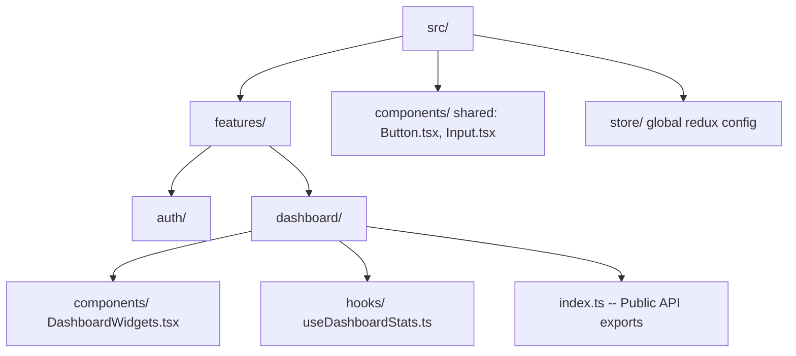
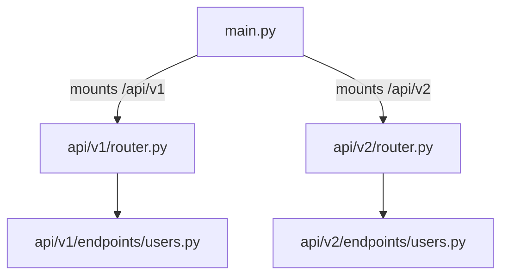

# Fullstack Project Structures: React Feature-Based and Versioned FastAPI

A senior-level guide to folder organization and modular structure for React (feature-based colocation) and FastAPI (router-versioned layers) codebases.

---

## 1. React Frontend Structure (Why, What, How)

### Why Feature-Based Folder Colocation?
In legacy React projects, folders were organized by technical role (e.g., a single `/components` folder for all components, `/hooks` for all hooks, and `/types` for all typings). As the project grows, this creates high cognitive load. To update a single "Billing" page, a developer has to open files scattered across 5 different root directories.

Modern frontends use **Feature-Based Colocation**:
* **The Rule**: Keep files that change together close together.
* **How**: Group components, hooks, utility functions, slices, and tests inside a modular feature folder (e.g. `features/dashboard`). 
* **Public API Pattern**: Each feature folder contains an `index.ts` file that acts as a gatekeeper, exporting only what the rest of the application is allowed to import. This prevents tight coupling.



### React Directory Layout Blueprint (How)
An industry-standard feature-based React directory structure:

```
src/
├── assets/          # Static assets (images, fonts, SVG graphics)
├── components/      # Global shared UI components (Button, Modal, Table)
├── config/          # Global configurations (env.ts, constants)
├── features/        # Feature modules
│   ├── auth/        # Auth Feature
│   │   ├── components/  # Auth-only UI (LoginForm, RegisterCard)
│   │   ├── hooks/       # Auth-only hooks (useLoginForm)
│   │   ├── services/    # API calls (authApi.ts)
│   │   └── index.ts     # Public API (Exports sign-in hooks and login forms)
│   └── dashboard/
├── hooks/           # Global shared React hooks (useLocalStorage, useDebounce)
├── providers/       # Global context providers wrapper (Redux, Chakra, SWR)
├── store/           # Redux Toolkit global store configuration
├── utils/           # Global helpers (formatting, dates, math calculations)
├── App.tsx          # Router layout configurations
└── main.tsx         # App mounting entry point
```

---

## 2. FastAPI Backend Versioned Structure (Why, What, How)

### Why URL-Based Routing Versioning?
API endpoints evolve. If you need to make breaking changes (e.g. renaming keys, modifying query params), doing so directly on an active API breaks current mobile clients or integrations.
* **The Rule**: Version your API endpoints via the URL scheme (e.g., `/api/v1/metrics`, `/api/v2/metrics`).
* **In Code**: Create separate directory structures for `/v1` and `/v2` routers, and mount them as distinct endpoints under the root application.



### FastAPI Directory Layout Blueprint (How)
A clean, scalable, and version-ready directory layout:

```
app/
├── api/                 # API Routing Layer
│   ├── v1/              # Version 1 Router Namespace
│   │   ├── endpoints/   # Route handlers (users.py, analytics.py)
│   │   └── router.py    # Merges all v1 endpoints
│   ├── v2/              # Version 2 Router Namespace (for upgrades)
│   │   ├── endpoints/
│   │   └── router.py
│   └── router.py        # Main router combining all API versions
├── core/                # Core Application Configs
│   ├── config.py        # Pydantic Settings
│   ├── database.py      # Async Engine & SessionMaker
│   └── security.py      # JWT hashing operations
├── models/              # SQLAlchemy Database Models (Declarative Base)
├── schemas/             # Pydantic Schemas for validation
├── services/            # Business Logic Layer (CRUD operations)
├── tests/               # Pytest suite
└── main.py              # Starlette App / ASGI entry point
```

---

## 3. Configuration & Mounting Blueprints (Gists)

### Gist 1: React Feature Gatekeeper (`index.ts`)
This pattern acts as a public API boundary for the `features/dashboard` module.

```typescript
// Gist: src/features/dashboard/index.ts
// Why: Exposes ONLY the main container and hook. Inner components (like layout wrappers, specific filters) are hidden from the rest of the application.

// 1. Export main components
export { DashboardContainer } from './components/DashboardContainer';

// 2. Export hooks
export { useDashboardMetrics } from './hooks/useDashboardMetrics';

// 3. Export types
export type { DashboardMetricType } from './types';
```

### Gist 2: FastAPI Version Mounting Routing Setup
Shows how routers are modularly structured and dynamically mounted in the core FastAPI app.

```python
# Gist: app/api/v1/router.py
# Why: Combines all endpoints for Version 1
from fastapi import APIRouter
from app.api.v1.endpoints import users, analytics

v1_router = APIRouter()

# Register routes under v1 Namespace
v1_router.include_router(users.router, prefix="/users", tags=["Users"])
v1_router.include_router(analytics.router, prefix="/analytics", tags=["Analytics"])
```

```python
# Gist: app/api/router.py
# Why: Merges v1 and v2 namespaces
from fastapi import APIRouter
from app.api.v1.router import v1_router
# from app.api.v2.router import v2_router (uncomment when v2 is released)

api_router = APIRouter()

# Mount API versions
api_router.include_router(v1_router, prefix="/v1")
# api_router.include_router(v2_router, prefix="/v2")
```

```python
# Gist: app/main.py
# Why: Main ASGI entry point
from fastapi import FastAPI
from app.api.router import api_router
from app.core.config import settings

app = FastAPI(title=settings.PROJECT_NAME)

# Mount all versioned API routes under the standard '/api' prefix
app.include_router(api_router, prefix="/api")
```
