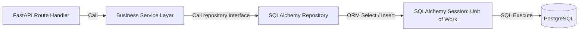
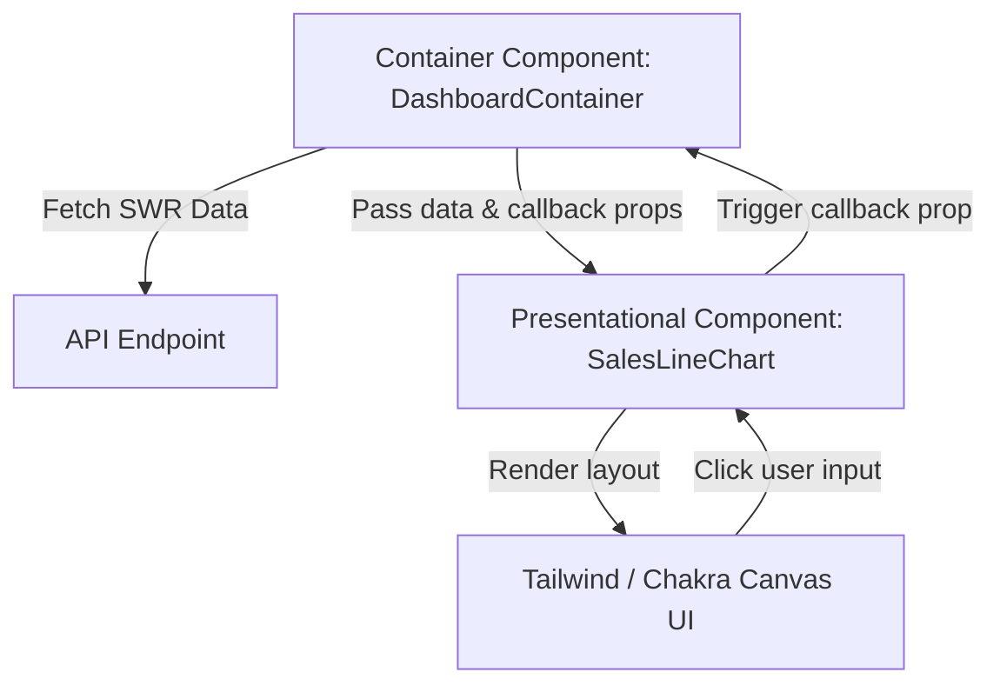

# Fullstack Design Patterns: Backend and Frontend Reference

A comprehensive, senior-level guide to software design patterns and architectural boundaries used in FastAPI and React applications.

---

## 1. Backend Design Patterns (Why, What, How)

When building web APIs, we use design patterns to decoupling business logic from databases and frameworks, making the application easier to test, extend, and maintain.

### The Repository & Unit of Work Patterns
In basic database applications, developers write SQLAlchemy query statements directly inside FastAPI route handlers. This creates tight coupling. If you migrate the database to MongoDB or need to mock data for unit tests, you must rewrite all route logic.

* **Repository Pattern**: Acts as an abstraction layer between the domain model and data mapping layers. It presents a collection-like interface for accessing data, hiding database-specific queries (`select`, `join`).
* **Unit of Work Pattern**: Tracks changes during business transactions and coordinates the writing of those changes (commits or rollbacks) in a single database transaction. SQLAlchemy's `Session` acts as a built-in Unit of Work.



### Dependency Injection (DI)
Instead of a class or function instantiating its own dependencies (like database connections or HTTP clients), those dependencies are passed ("injected") to it by an external assembler (FastAPI's `Depends` system). This allows you to swap out dependencies during testing easily (e.g., swapping a production database session for an in-memory SQLite test session).

---

## 2. Frontend Design Patterns (Why, What, How)

React applications handle complex visual states and networking flows. Using UI patterns prevents components from becoming bloated "spaghetti code."

### Container and Presentational Components
* **Container Components (Smart)**: Handle state management, SWR data fetching, Redux updates, and event handlers. They contain zero styling elements (HTML cards/grids) and focus entirely on *how things work*.
* **Presentational Components (Dumb)**: Receive data and callbacks strictly via props. They focus entirely on *how things look* (HTML, CSS classes, Tailwind styles) and are completely independent of where the data comes from.



### Custom Hooks (Logic Extraction)
Extracts stateful react logic (such as managing timers, scroll listeners, form validations, or SWR caching) out of components into a reusable function (e.g., `useMetricsData`). This keeps visual components clean and allows you to test the logic independently of the DOM.

---

## 3. Implementation Blueprints (How)

### Gist 1: Backend Repository Pattern
Demonstrates how to decouple data access logic from a FastAPI endpoint using a Repository structure in Python.

```python
# Gist: repository_pattern.py
from typing import List, Protocol
from sqlalchemy import select
from sqlalchemy.ext.asyncio import AsyncSession
from app.models import Transaction

# 1. Define Repository Interface (Protocol)
# Why: Allows swapping the SQLAlchemy implementation with a Mock repository during unit tests
class TransactionRepository(Protocol):
    async def get_by_tenant(self, tenant_id: int) -> List[Transaction]:
        ...
    async def create(self, transaction: Transaction) -> Transaction:
        ...

# 2. Database Implementation of Repository
class SQLTransactionRepository:
    def __init__(self, session: AsyncSession):
        self.session = session

    async def get_by_tenant(self, tenant_id: int) -> List[Transaction]:
        # Why: Encapsulates database-specific ORM query logic
        stmt = (
            select(Transaction)
            .where(Transaction.tenant_id == tenant_id)
            .order_by(Transaction.created_at.desc())
        )
        result = await self.session.execute(stmt)
        return list(result.scalars().all())

    async def create(self, transaction: Transaction) -> Transaction:
        self.session.add(transaction)
        await self.session.flush() # Sync with DB, generating database IDs
        return transaction

# 3. FastAPI Endpoint utilizing the Repository
# Why Depends: FastAPI injects the database session, which we pass to the repository constructor
from fastapi import APIRouter, Depends
from app.database import get_db_session

router = APIRouter()

@router.get("/transactions/{tenant_id}")
async def read_transactions(
    tenant_id: int,
    db: AsyncSession = Depends(get_db_session)
):
    # Instantiate repository dynamically
    repo: TransactionRepository = SQLTransactionRepository(db)
    
    # Endpoint logic remains clean and independent of SQL queries
    transactions = await repo.get_by_tenant(tenant_id)
    return transactions
```

### Gist 2: Frontend Container/Presentational and Custom Hook Pattern
Splitting business logic (Hook), data container management (Container), and CSS canvas drawing (Presentational) in React.

```typescript
// Gist: dashboardPatterns.tsx
import React, { useMemo } from 'react';
import useSWR from 'swr';

// ---------------------------------------------------------
// 1. CUSTOM HOOK (Business Logic Extraction)
// ---------------------------------------------------------
const useMetricsSummary = (url: string) => {
  const { data, error } = useSWR<{ value: number }[]>(url);
  
  // Memoize mathematical calculation
  const totalSum = useMemo(() => {
    if (!data) return 0;
    return data.reduce((sum, item) => sum + item.value, 0);
  }, [data]);

  return {
    totalSum,
    isLoading: !data && !error,
    isError: !!error,
  };
};

// ---------------------------------------------------------
// 2. PRESENTATIONAL COMPONENT (Dumb component - Layout & style only)
// ---------------------------------------------------------
interface StatsDisplayProps {
  title: string;
  value: number;
  isLoading: boolean;
}

// React.memo protects this visual container from redundant re-renders
const StatsDisplay: React.FC<StatsDisplayProps> = React.memo(({ title, value, isLoading }) => {
  if (isLoading) {
    return <div className="animate-pulse bg-gray-800 h-24 rounded-lg" />;
  }
  return (
    <div className="p-6 bg-gray-900 border border-gray-800 rounded-xl text-white">
      <h4 className="text-xs font-bold uppercase text-gray-400">{title}</h4>
      <p className="text-3xl font-black mt-2">${value.toLocaleString()}</p>
    </div>
  );
});
StatsDisplay.displayName = 'StatsDisplay';

// ---------------------------------------------------------
// 3. CONTAINER COMPONENT (Smart component - state & coordination)
// ---------------------------------------------------------
export const DashboardMetricsContainer: React.FC = () => {
  // Call custom hook to extract state logic
  const { totalSum, isLoading } = useMetricsSummary('/analytics/daily-totals');

  return (
    <div className="grid grid-cols-1 md:grid-cols-2 gap-6 p-6">
      {/* 
        Pass data down into Presentational components as plain props.
        Container does no CSS layout styling beyond grid columns.
      */}
      <StatsDisplay title="Total Daily Sales" value={totalSum} isLoading={isLoading} />
      <StatsDisplay title="Calculated Revenue Pool" value={totalSum * 0.95} isLoading={isLoading} />
    </div>
  );
};
```
