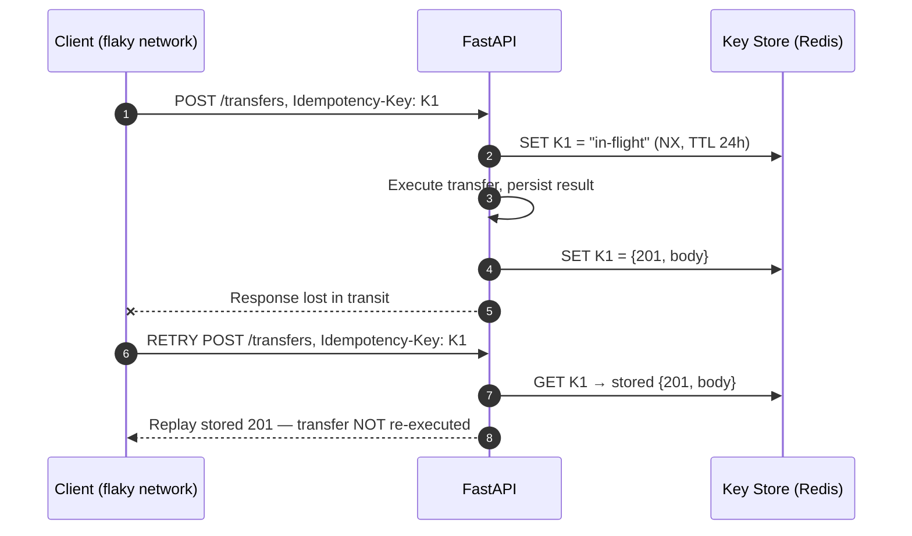

# API Contract Design Masterclass: Errors, Idempotency, Rate Limits & Pagination

The difference between a mid-level and a senior API designer is the assumption set: clients retry, networks duplicate, errors are parsed by machines, and lists grow without bound. This doc covers the four contracts that encode those assumptions.

---

## 1. Why API Contracts Are a Senior Concern (Why)

An endpoint that "works" in Postman still fails in production three ways: a mobile client on a flaky network **replays a POST** it thinks failed; a frontend **parses your error body** and finds a different shape per endpoint; a consumer **pages to offset 500,000** and times out. Contract design is deciding, up front and uniformly, what happens in each case — it is API *behavior*, not documentation.

## 2. Error Contracts: RFC 7807 Problem Details (What & How)

RFC 7807 (`application/problem+json`) standardizes the error body: `type` (a URI identifying the error class), `title`, `status`, `detail`, `instance`, plus extension fields. The value is uniformity — the frontend writes **one** error parser, and support can grep a stable `type`.

```python
# Gist: problem_details_handler.py
from fastapi import FastAPI, Request
from fastapi.responses import JSONResponse

class DomainError(Exception):
    status = 500
    type = "about:blank"
    title = "Internal error"

class InsufficientFunds(DomainError):
    status, type, title = 409, "https://api.example.com/errors/insufficient-funds", "Insufficient funds"

app = FastAPI()

@app.exception_handler(DomainError)
async def domain_error_handler(request: Request, exc: DomainError):
    return JSONResponse(
        status_code=exc.status,
        media_type="application/problem+json",
        content={
            "type": exc.type, "title": exc.title, "status": exc.status,
            "detail": str(exc), "instance": str(request.url.path),
        },
    )
```

Status-code discipline (interviewers probe this):

| Situation | Code | Not |
|---|---|---|
| Body fails schema validation | 422 (FastAPI default) | 400 for everything |
| Valid request, business rule refuses (insufficient funds, duplicate email) | 409 | 500 |
| Authenticated but not allowed | 403 | 401 (that means *unauthenticated*) |
| Rate limit exceeded | 429 + `Retry-After` | 503 |

## 3. Idempotency Keys (What & How)

**Idempotent** = calling once and calling N times leave the same state. `GET/PUT/DELETE` are idempotent by definition; **`POST` is not**, and `POST /transfers` retried by a flaky client moves money twice. The fix is a client-generated **`Idempotency-Key`** header (a UUID per logical operation) with store-and-replay semantics on the server:



Design decisions to name: scope keys **per endpoint per client**; persist the *full response* so replays are byte-identical; TTL around 24h; return 409 if the same key arrives with a *different* payload (client bug); the "in-flight" marker handles the concurrent-duplicate race. Runnable version: [fastapi_idempotency_and_rate_limit.py](../usable_gists/fastapi_idempotency_and_rate_limit.py).

## 4. Rate Limiting (What & How)

Three canonical algorithms:

| Algorithm | Mechanism | Tradeoff |
|---|---|---|
| Fixed window | Counter per `user:minute` bucket | Trivial (one Redis `INCR`+`EXPIRE`), but bursts 2× at window edges |
| Sliding window | Weighted blend of current + previous window | Smooths the edge burst, still cheap — the pragmatic default |
| Token bucket | Bucket refills at rate R, each request spends a token | Allows controlled bursts up to bucket size; the classic "burst-friendly" answer |

Where it lives is an architecture answer: **coarse limits at the edge** (nginx/API gateway — cheap, protects the whole app), **business limits in app middleware** (per-tenant, per-plan — needs your auth context). State goes in **Redis**, never process memory: with multiple workers, in-memory counters give each worker its own limit (see [09_deployment_scaling_statelessness.md](09_deployment_scaling_statelessness.md)). Always return `429` with `Retry-After` — well-behaved clients back off, which *reduces* your load during incidents.

## 5. Pagination: Offset vs Keyset (Why & How)

`LIMIT 50 OFFSET 500000` has two structural flaws:

1. **Cost grows with depth** — Postgres must produce and *discard* 500,000 rows before returning 50. Page 1 is fast; page 10,000 is a timeout.
2. **Drift under writes** — a row inserted while paging shifts every subsequent offset; users see duplicates or miss rows.

**Keyset (cursor) pagination** filters past the last-seen row instead of counting rows:

```sql
-- Gist: keyset_pagination.sql
-- Cursor = (created_at, id) of the last row on the previous page; id breaks timestamp ties.
SELECT id, amount, created_at
FROM transactions
WHERE (created_at, id) < (:cursor_created_at, :cursor_id)
ORDER BY created_at DESC, id DESC
LIMIT 50;
-- O(1) per page via an index on (created_at DESC, id DESC); immune to insert drift.
```

The API returns an **opaque cursor** (base64 of the tuple) as `next_cursor`, so the encoding stays a server implementation detail.

| | Offset | Keyset |
|---|---|---|
| Deep-page cost | O(offset) — degrades | O(1) with the right index |
| Stability under writes | Drifts | Stable |
| "Jump to page 37" | Yes | No — sequential only |
| Verdict | Small, static, admin-style lists | Feeds, infinite scroll, anything large |

The frontend half (SWR infinite loading) is covered in [frameworks_specifics/07_swr_axios.md](../frameworks_specifics/07_swr_axios.md); the index that makes keyset O(1) is covered in [01/04](../01_fastapi_sqlalchemy_postgres/04_explain_analyze_partitioning_matviews.md).

## 6. Interview Angles

**"Design POST /transfers so a flaky mobile client can retry it safely."**
Skeleton: name the double-execution risk → `Idempotency-Key` header, store-and-replay with TTL and in-flight marker → pair with `SELECT FOR UPDATE` inside the transfer itself ([01/03](../01_fastapi_sqlalchemy_postgres/03_connection_pools_locking_and_concurrency.md)) — idempotency handles *duplicate requests*, locking handles *concurrent different requests* → errors come back as RFC 7807 with a 409 for business refusals.

**"Your list endpoint is slow at page 10,000 — why, exactly, and what changes?"**
Skeleton: OFFSET forces production-and-discard of all skipped rows → switch to keyset on `(created_at, id)` with a matching composite index → API contract changes from `?page=N` to an opaque `next_cursor` → concede the lost capability (random page jumps) and why the product rarely needs it.

**"How would you rate-limit a multi-tenant API?"**
Skeleton: two layers (edge coarse, app per-tenant) → sliding window in Redis keyed `tenant:{id}:{window}` → 429 + `Retry-After` → limits derived from the tenant's plan, read from the auth context ([07_oauth2_jwt_lifecycle.md](07_oauth2_jwt_lifecycle.md)).
