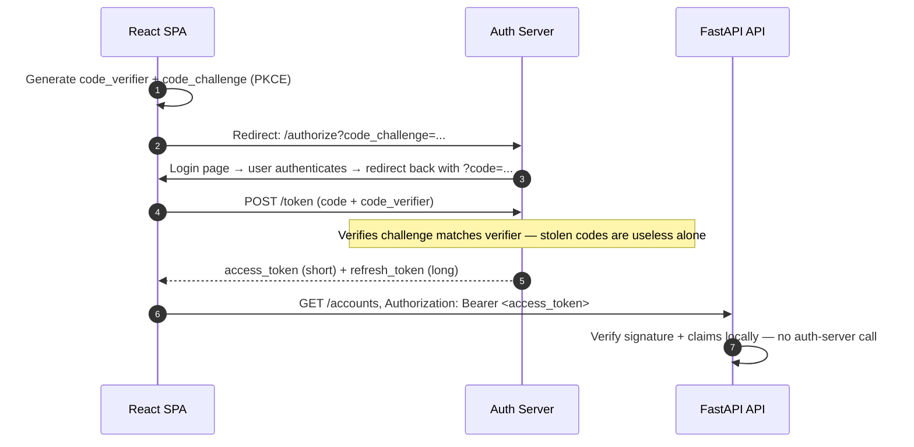
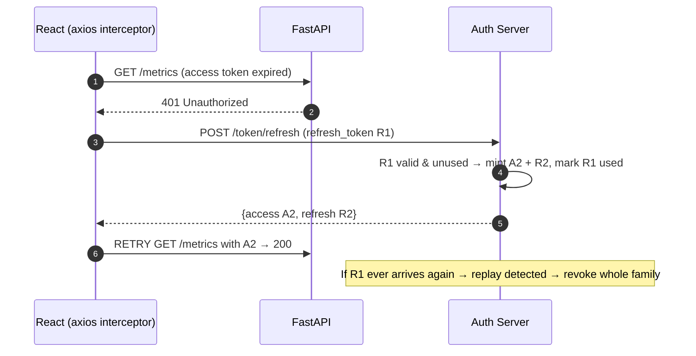

# OAuth2 & JWT Lifecycle Masterclass

Authentication is where interviewers separate people who copied the FastAPI tutorial from people who understand the protocol. This doc covers the flows worth naming, JWT mechanics, and the refresh-token lifecycle that makes stateless auth actually work.

---

## 1. Sessions vs Tokens: Why Stateless Auth (Why)

Classic server sessions store login state in server memory or a session table; the browser holds only an opaque cookie. That couples every request to the store — and with N replicas behind a load balancer you need sticky sessions or a shared session DB. **Token-based auth inverts this: the credential itself carries the state, cryptographically signed.** Any replica can verify a JWT with nothing but the signing key — the property that makes horizontal scaling trivial (see [09_deployment_scaling_statelessness.md](09_deployment_scaling_statelessness.md)). The price, covered in §4, is that statelessness makes *revocation* hard.

## 2. OAuth2 Flows You Must Name Correctly (What)

OAuth2 is a family of **grant flows**; using the right name is a senior signal:

| Flow | Who it's for | One-line mechanism |
|---|---|---|
| **Authorization Code + PKCE** | SPAs, mobile apps — anything that can't keep a secret | Redirect to auth server; code exchanged for tokens, bound by a PKCE proof pair |
| **Client Credentials** | Service-to-service (no human) | Backend trades its client id+secret directly for a token |
| **Password grant** (`OAuth2PasswordBearer`) | Legacy; FastAPI tutorials | User hands the app their raw password; deprecated in OAuth 2.1 because the client sees credentials |



The point of PKCE: an intercepted authorization code cannot be exchanged without the `code_verifier` that only the initiating client holds. Say "in a real product I'd integrate an identity provider (Auth0/Keycloak/Cognito) via auth-code + PKCE; the password flow is fine for an internal demo" — that sentence alone reads senior.

## 3. JWT Anatomy and Validation (What & How)

A JWT is three base64url segments: `header.payload.signature`. The header names the algorithm; the payload carries **claims**; the signature makes them tamper-evident. **Signed is not encrypted** — anyone can *read* a JWT, so no secrets in claims, ever.

* **HS256** (symmetric): one shared secret signs and verifies. Fine when the issuer and verifier are the same service.
* **RS256** (asymmetric): auth server signs with a private key; every API verifies with the public key (fetched via JWKS). Required once multiple services verify tokens — they never hold signing material.

Validation is more than checking the signature. Verify `exp` (expiry), `iss` (issuer you trust), and `aud` (this token was minted *for this API* — skipping `aud` lets a token for service A replay against service B).

```python
# Gist: jwt_dependency.py
import jwt  # PyJWT
from fastapi import Depends, HTTPException
from fastapi.security import OAuth2PasswordBearer

oauth2_scheme = OAuth2PasswordBearer(tokenUrl="auth/token")

async def get_current_user(token: str = Depends(oauth2_scheme)) -> dict:
    try:
        claims = jwt.decode(
            token, SETTINGS.jwt_public_key, algorithms=["RS256"],  # Pin the algorithm —
            audience="banking-api", issuer="https://auth.example.com",  # never trust the header's alg
        )
    except jwt.ExpiredSignatureError:
        raise HTTPException(401, "Token expired", headers={"WWW-Authenticate": "Bearer"})
    except jwt.InvalidTokenError:
        raise HTTPException(401, "Invalid token")
    return claims  # {"sub": "user-42", "tenant_id": 7, "scope": "accounts:read"}
```

Pinning `algorithms=["RS256"]` blocks the classic `alg: none` / HS-RS confusion attacks. Claims worth putting in: `sub`, `tenant_id`, scopes — data every request needs and that changes rarely.

## 4. The Refresh Lifecycle and Rotation (How)

Short-lived access tokens (5–15 min) cap the damage of a stolen token; long-lived refresh tokens (days–weeks) preserve the user session. The refresh token is the crown jewel, so it gets two protections:

1. **Rotation**: every refresh call returns a *new* refresh token and invalidates the old one — refresh tokens are single-use.
2. **Reuse detection**: if an already-used refresh token arrives again, someone replayed a stolen one. Revoke the entire token **family** and force re-login.



This resolves the **revocation-vs-statelessness tension**: access tokens stay stateless (verified locally, unrevocable, but expire in minutes); refresh tokens are *stateful by design* (a DB row you can kill instantly). Compromised account? Delete its refresh-token rows — the attacker holds at most 15 minutes of access. Frontend halves of this story: the 401→refresh→retry axios interceptor in [react_swr_axios_client.ts](../usable_gists/react_swr_axios_client.ts), and *where tokens live in the browser* (HttpOnly cookies vs localStorage, XSS) in [02_browser_apis_and_storage.md](../02_react_redux_swr_dashboard/02_browser_apis_and_storage.md) — defer to it rather than re-deriving.

| Token | Lifetime | Storage (server) | Revocable | Verified |
|---|---|---|---|---|
| Access (JWT) | 5–15 min | None — stateless | No (expiry is the cap) | Locally, per request |
| Refresh | Days–weeks | DB/Redis row per token | Yes, instantly | At auth server only |

## 5. Interview Angles

**"The access token expires mid-session — trace every hop until the user's next successful request."**
Skeleton: API rejects with 401 + `WWW-Authenticate` → axios response interceptor catches it, *queues concurrent 401s behind one refresh call* → POST refresh with R1 → rotation returns A2+R2, R1 burned → original request replayed with A2 → user never noticed. Name the concurrency detail (single-flight refresh) — it's the bit most candidates miss.

**"JWTs are stateless — so how do you revoke a compromised one?"**
Skeleton: you mostly don't — you make access tokens too short-lived to matter → real revocation lives at the refresh layer (stateful, single-use, family revocation on reuse) → if the product truly needs instant access-token kill, admit the cost: a Redis denylist checked per request, which reintroduces state.

**"HS256 or RS256?"**
Skeleton: same-service issue/verify → HS256 is fine; multiple verifying services → RS256 so APIs hold only the public key; always pin the algorithm server-side.
