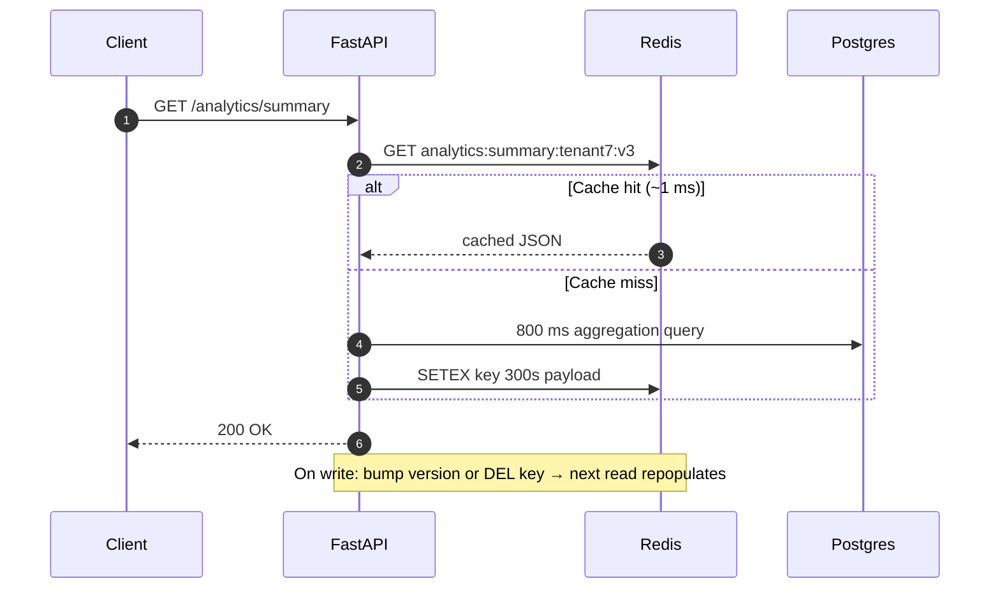

# Redis Caching Strategies Masterclass

Caching is the highest-leverage latency tool in a dashboard stack — and the fastest way to serve wrong data if invalidation is an afterthought. This doc covers cache-aside, invalidation, stampedes, and where Redis sits relative to materialized views and SWR.

---

## 1. Why a Cache Layer, and Why Redis (Why)

The latency ladder every answer should reference:

| Tier | Typical read | Consistency |
|---|---|---|
| Process memory (dict) | ~100 ns | Per-worker, invisible to siblings — broken under multi-worker deploys |
| Redis (same VPC) | ~0.5–1 ms | Shared by every worker and replica |
| Postgres, indexed query | ~1–10 ms | Source of truth |
| Postgres, heavy aggregation | 100 ms–seconds | Source of truth, expensively |

Redis is the default shared tier because it is **single-threaded** (every command atomic — `INCR` needs no locks), speaks rich data structures (strings, hashes, sorted sets), and has **native TTL** — expiry is a first-class primitive, not app logic. The same properties make it the store for rate-limit counters and idempotency keys ([06](06_api_contracts_idempotency_pagination.md)) and session/refresh-token state ([07](07_oauth2_jwt_lifecycle.md)).

When **not** to cache: data already served in ~1 ms by an index, write-heavy data whose cache would invalidate constantly, and anything where a staleness window is unacceptable (an account balance behind a transfer button). Caching is a *measured* response to a slow read, never a default.

## 2. Cache-Aside: The Default Pattern (What & How)

The application owns the logic: **look in the cache; on miss, read the DB, write the cache, return.** The cache is a disposable projection — flushing Redis must never lose data.



```python
# Gist: cache_aside_sketch.py — full runnable version in usable_gists/redis_cache_aside_fastapi.py
async def get_summary(tenant_id: int, db: AsyncSession, redis: Redis) -> dict:
    key = f"analytics:summary:{tenant_id}"
    if cached := await redis.get(key):
        return orjson.loads(cached)
    data = await run_expensive_aggregation(db, tenant_id)     # the 800 ms query
    await redis.set(key, orjson.dumps(data), ex=300)          # TTL = staleness budget
    return data
```

Craft details worth saying aloud: keys are **namespaced and versioned** (`analytics:summary:{tenant}:v3` — deploying a new payload shape bumps `v3`, orphaning stale entries instead of migrating them); serialize with `orjson` (fast, handles datetimes); and the TTL is not a magic number — **it is the staleness budget the product owner agreed to.**

## 3. Invalidation Strategies (How)

"There are only two hard things in computer science: cache invalidation and naming things." The interview-grade version of the joke is knowing the three strategies and their failure modes:

| Strategy | Mechanism | Staleness | Failure mode |
|---|---|---|---|
| **TTL-only** | Entries expire; writes don't touch cache | Up to full TTL | Users see pre-write data for minutes — fine for dashboards, wrong for balances |
| **Explicit delete-on-write** | Mutation path `DEL`s affected keys | Near zero | Every write path must know every dependent key — misses cause *permanent* staleness until TTL saves you |
| **Key versioning** | Writes bump a version key; readers compose it into cache keys | Near zero | One extra Redis GET per read; old versions linger until TTL |

The pragmatic senior answer is a hybrid: **explicit invalidation for correctness + TTL as the backstop** for the paths you forgot. Delete, don't update, on write — recomputing the value inside the write path reintroduces the race the cache was meant to hide.

## 4. Stampede, Stale-While-Revalidate, and Layering (What)

**The dogpile:** a hot key expires at 9:00 AM as 500 dashboard users load the page; all 500 miss simultaneously and all 500 fire the 800 ms aggregation — the cache's expiry just DDoSed your own database. Defenses, cheapest first:

1. **Jittered TTLs** — `300 + random(0, 60)` seconds, so co-created keys don't expire in unison.
2. **Per-key rebuild lock** — first miss takes `SET lock:key NX EX 10` and recomputes; the other 499 briefly wait or serve the just-stale value.
3. **Serve-stale-while-revalidate** — keep the expired value, return it, refresh in the background. This is *exactly* the SWR pattern the frontend library is named after — the same idea at a different tier, a parallel worth drawing explicitly in the room.

Which brings up the layering question — the stack has three staleness tools and they compose rather than compete:

| Layer | Lives in | Refreshes | Best for |
|---|---|---|---|
| SWR client cache | Browser | On focus/interval per user | Perceived snappiness, per-user views |
| Redis cache-aside | Infra | TTL + invalidation, shared | Hot expensive reads shared across users |
| Materialized view | Postgres | `REFRESH ... CONCURRENTLY` on schedule | Heavy aggregations queryable with SQL/joins ([01/04](../01_fastapi_sqlalchemy_postgres/04_explain_analyze_partitioning_matviews.md)) |

## 5. Interview Angles

**"The aggregation endpoint costs 800 ms; product wants under 100 ms. Walk me through your design."**
Skeleton: first confirm the query is already optimized (EXPLAIN, indexes — don't cache a fixable query) → cache-aside in Redis, key per tenant+parameters, orjson → negotiate the TTL as a staleness budget with product → explicit invalidation on the write paths that feed it, TTL backstop → jittered TTL + rebuild lock for the 9 AM herd → if staleness tolerance is minutes and the data is join-heavy, weigh a materialized view instead.

**"What is a cache stampede and how do you prevent one?"**
Skeleton: simultaneous misses on a hot expired key → concurrent recomputation crushes the DB → jitter, per-key lock, serve-stale-while-revalidate → bonus: point out SWR on the frontend is the same defense one tier up.

**"Why not cache in a module-level dict?"**
Skeleton: gunicorn runs N workers × M replicas — each dict is a private, drifting cache and invalidation can't reach siblings → process memory is fine only for per-process constants → shared mutable cache state belongs in Redis (the statelessness argument, [09](09_deployment_scaling_statelessness.md)).
