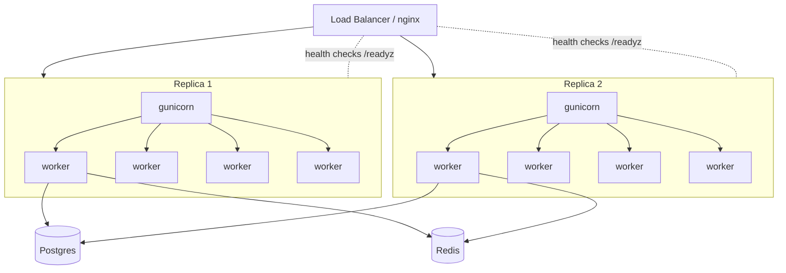

# Deployment, Scaling & Statelessness Masterclass

From `uvicorn main:app --reload` to a fleet behind a load balancer: process topology, worker sizing, the statelessness discipline that makes horizontal scaling possible, and the rollout mechanics that make deploys boring.

---

## 1. From Dev Server to Production Topology (Why & What)

A **worker is one OS process running one event loop**. One worker uses one core, and one crash kills every request in it — so production runs a **process manager** supervising several workers. The canonical pairing: **gunicorn as the manager** (forks, restarts dead workers, relays signals, coordinates graceful reloads) with **`uvicorn.workers.UvicornWorker`** as the worker class actually speaking ASGI. (Uvicorn alone with `--workers N` works but has weaker supervision; in Kubernetes, some teams instead run one worker per container and let the orchestrator be the process manager — knowing *that* tradeoff is itself a senior point.)

```bash
# Gist: gunicorn_launch.sh
gunicorn app.main:app \
  --worker-class uvicorn.workers.UvicornWorker \
  --workers 4 --bind 0.0.0.0:8000 \
  --graceful-timeout 30 --max-requests 10000 --max-requests-jitter 500
  # max-requests: recycle workers periodically — cheap insurance against slow leaks
```



Two axes of scale: **vertical within a replica** (more workers per box) and **horizontal** (more replicas behind the LB). Horizontal is the one that also buys availability — and it only works if §3 holds.

## 2. Sizing Workers (How)

The famous `2 × cores + 1` heuristic is for **sync** workers, where a worker is fully occupied per request and the extras cover I/O waits. **Async workers invert the math**: each already multiplexes thousands of concurrent requests on its loop, so you provision for *CPU*, not concurrency — start at **one worker per core** (maybe cores+1) and load-test from there.

| Worker type | Concurrency per worker | Sizing start | More workers helps when |
|---|---|---|---|
| Sync (WSGI/Flask) | 1 request | `2×cores+1` | Requests block on I/O |
| Async (UvicornWorker) | Thousands | `≈ cores` | CPU-bound sections, GIL pressure |

The constraint people forget: **workers multiply database connections.** Each worker owns its own SQLAlchemy pool, so 2 replicas × 4 workers × (10+5) = 120 potential connections against a default `max_connections=100` — run the sizing math from [01/03](../01_fastapi_sqlalchemy_postgres/03_connection_pools_locking_and_concurrency.md) *before* raising worker counts, and reach for PgBouncer when replicas multiply. Memory is per-process too (interpreter + imports + pool, easily 150–300 MB each): oversizing workers OOMs pods before it wins throughput.

## 3. Statelessness as the Scaling Precondition (What)

Horizontal scaling assumes **any replica can serve any request**. Every piece of state that sneaks into a process breaks that silently at N=1 and loudly at N=5:

| State that sneaks in | Symptom at 5 replicas | Where it moves |
|---|---|---|
| Module-level dict cache | Stale/inconsistent data per replica | Redis ([08](08_redis_caching_strategies.md)) |
| In-memory rate-limit counters | Every limit is effectively 5× | Redis |
| Server-side login sessions in memory | Random logouts as LB rotates | Signed JWTs ([07](07_oauth2_jwt_lifecycle.md)) or Redis sessions |
| Uploads on local disk | 404s from 4 of 5 replicas | Object storage (S3) + signed URLs |
| In-process WebSocket registry | Broadcasts reach ⅕ of clients | Redis pub/sub fan-out ([05/01](../05_networking_and_data_transport/01_networking_protocols_dashboard.md)) |
| Scheduled jobs inside the app | Job runs 5× | Dedicated scheduler / worker queue with locks |

The tempting workaround — **sticky sessions** (pin each user to a replica) — is an anti-pattern: it defeats load distribution, breaks the moment a pod dies, and merely hides the state instead of moving it. The discipline in one line: **a replica must be killable at any moment with zero user-visible loss.** That is 12-factor's *processes* and *disposability* factors ([03_twelve_factor_config.md](03_twelve_factor_config.md)) made concrete.

## 4. Rollouts, Health Checks, Graceful Shutdown (How)

**Two probes, two meanings.** *Liveness* — "is this process wedged?" — failure restarts the pod. *Readiness* — "can it take traffic *right now*?" — failure just removes it from the LB (e.g. while warming up or draining). Conflating them turns a slow dependency into a restart storm: readiness should check the app's ability to serve; liveness should be dumb and cheap.

**Graceful shutdown** is a chain, and every link must hold: LB stops sending (readiness fails) → orchestrator sends **SIGTERM** → gunicorn stops accepting and lets in-flight requests finish (`graceful-timeout`) → **lifespan teardown** disposes engine and clients ([01/02](../01_fastapi_sqlalchemy_postgres/02_fastapi_runtime_internals.md)) → exit before SIGKILL. With that chain, a rolling deploy (replace replicas one at a time behind the LB) drops zero requests.

**Migrations deploy before code, expand/contract.** Rolling deploys mean old and new code run *simultaneously* against one schema, so every migration must be backward-compatible with the previous release: **expand** (add nullable column / new table — old code ignores it) → deploy code that writes both / reads new → backfill in batches → **contract** (drop the old column) only after nothing references it. Locking mechanics and the batched backfill pattern live in [06/01](../06_testing_and_migrations/01_testing_and_migrations.md) — the deploy-ordering argument is the piece to narrate here.

## 5. Interview Angles

**"You scale from 1 to 5 replicas and things break — list what breaks and why."**
Skeleton: enumerate the sneaked-state table — per-replica caches drift, rate limits multiply, sessions log users out, uploads 404, websocket broadcasts fragment, cron runs 5× → root cause is one sentence: state lived in the process → name each destination (Redis, S3, pub/sub, external scheduler) → close with the kill-test: "any replica must die without a user noticing."

**"How many gunicorn workers on a 4-core box for async FastAPI, and why?"**
Skeleton: ~4 — one per core, because async workers provision for CPU, not concurrency; `2×cores+1` is the sync heuristic → immediately raise the second-order constraint: workers × pool_size vs `max_connections` → close with "then load-test; the formula is a starting point, not an answer."

**"Walk me through a zero-downtime deploy of an API + migration."**
Skeleton: expand-phase migration first (backward-compatible, no exclusive locks) → rolling replicas: drain via readiness, SIGTERM, in-flight drain, lifespan teardown → both code versions coexist mid-roll, which is *why* expand/contract is non-negotiable → contract migration ships in a later release.
