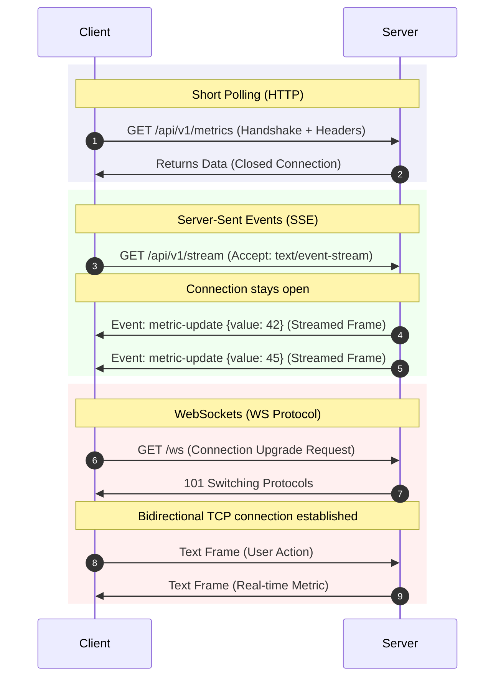
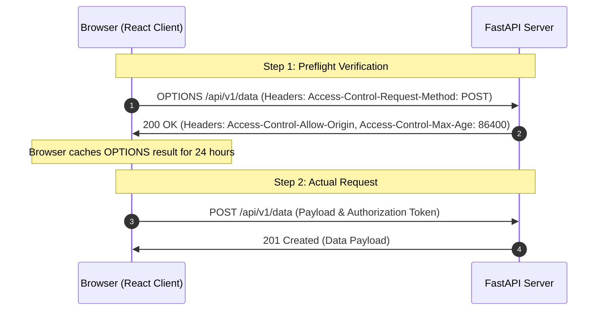

# Networking Protocols & Transport Optimizations for Dashboards

A comprehensive guide to network protocols, real-time data streaming (WebSockets/SSE), CORS preflight optimization, and HTTP compression for dashboard applications.

---

## 1. Real-Time Communication Protocols (Why & What)

When displaying aggregated metrics in React, you must choose how the client fetches updates from the FastAPI backend. Choosing the wrong protocol can lead to high database CPU load, redundant network overhead, or high battery consumption on mobile clients.

### Protocol Comparison: Polling vs. SSE vs. WebSockets

| Protocol | Type | Direction | Overhead | Best Use Case |
| :--- | :--- | :--- | :--- | :--- |
| **Short Polling** | HTTP/1.1 or 2 | Client $\rightarrow$ Server | **High**: Initiates a complete HTTP handshake on every request. | Simple stats with low update frequency (e.g., daily sales). |
| **Server-Sent Events (SSE)** | HTTP/2 | Server $\rightarrow$ Client | **Low**: Single persistent connection, streams events as simple text frames. | Unidirectional data streams (e.g., continuous server monitoring logs, stock tickers). |
| **WebSockets** | Custom (TCP) | Bidirectional | **Medium**: Initial HTTP upgrade handshake, then runs full-duplex TCP frames. | Interactive apps requiring bi-directional low-latency sync (e.g., collaborative editing, live chat). |



---

## 2. CORS Preflight & Payload Compression (Why & What)

### Cross-Origin Resource Sharing (CORS) & Preflight Check
When your React client (`localhost:5173`) talks to your FastAPI server (`localhost:8000`), the browser blocks cross-origin requests unless correct headers are present.
* **Preflight Request**: For complex requests (e.g., containing JSON body payload, Authorization headers, or custom headers), the browser sends an initial **`OPTIONS`** request to verify safety.
* **Performance Impact**: If you do not configure your API gateway or FastAPI server to cache preflight requests, *every click* on the dashboard will double the network latency due to the blocking `OPTIONS` trip before the actual `GET`/`POST` executes.
* **The Solution**: Set the `Access-Control-Max-Age` header, telling the browser to cache preflight responses (typically up to 24 hours).



### Response Compression: Brotli vs. Gzip
Large dashboard tables with thousands of nested JSON objects take time to download.
* **Brotli**: Modern compression algorithm (developed by Google). It compresses text/JSON up to 20-30% better than Gzip with comparable decompression speed.
* **Gzip**: Standard fallback supported by virtually 100% of legacy systems.
* **The Solution**: Configure FastAPI middleware or Nginx to compress responses dynamically when client requests contain `Accept-Encoding: br, gzip`.

---

## 3. Implementation Code (How)

### Gist 1: FastAPI CORS Middleware Configuration
An optimized backend setup allowing cross-origin requests, custom headers, and preflight caching.

```python
# Gist: cors_setup.py
from fastapi import FastAPI
from fastapi.middleware.cors import CORSMiddleware
from fastapi.middleware.gzip import GZipMiddleware

app = FastAPI()

# 1. Enable Compression Middleware
# Why: Reduces network transfer size of large JSON aggregation payloads
app.add_middleware(GZipMiddleware, minimum_size=1000)  # Compress responses > 1KB

# 2. CORS Middleware Configuration
# Why: Allows React client to fetch metrics, while caching preflight checks to prevent OPTIONS delays
app.add_middleware(
    CORSMiddleware,
    allow_origins=[
        "http://localhost:5173",  # Local React dev server
        "https://dashboard.myplatform.com" # Production domain
    ],
    allow_credentials=True,
    allow_methods=["GET", "POST", "PUT", "DELETE", "OPTIONS"],
    allow_headers=["Content-Type", "Authorization", "X-Tenant-ID"],
    # Access-Control-Max-Age: 600 (Cache preflight options checks in browser for 10 minutes)
    max_age=600, 
)
```

### Gist 2: FastAPI WebSockets and React Consumer Hook
A minimal implementation of a WebSocket endpoint pushing telemetry metrics, paired with a React client hook.

```python
# Gist: websocket_backend.py
import asyncio
from fastapi import FastAPI, WebSocket, WebSocketDisconnect

app = FastAPI()

class ConnectionManager:
    def __init__(self):
        self.active_connections: list[WebSocket] = []

    async def connect(self, websocket: WebSocket):
        await websocket.accept()
        self.active_connections.append(websocket)

    def disconnect(self, websocket: WebSocket):
        self.active_connections.remove(websocket)

    async def broadcast_json(self, message: dict):
        for connection in self.active_connections:
            try:
                await connection.send_json(message)
            except Exception:
                # Handle connection dead or closed
                pass

manager = ConnectionManager()

@app.websocket("/ws/metrics/{tenant_id}")
async def websocket_metrics_endpoint(websocket: WebSocket, tenant_id: int):
    """
    WebSocket endpoint pushing periodic metrics for a tenant
    """
    await manager.connect(websocket)
    try:
        while True:
            # Simulate real-time metric polling from Redis or DB
            mock_metrics = {
                "tenant_id": tenant_id,
                "current_throughput": 45.2,
                "active_users": 184
            }
            await websocket.send_json(mock_metrics)
            # Sleep 2 seconds before pushing next update
            await asyncio.sleep(2)
    except WebSocketDisconnect:
        manager.disconnect(websocket)
```

```typescript
// Gist: useWebSocketMetrics.ts
import { useEffect, useState } from 'react';

interface LiveTelemetry {
  tenant_id: number;
  current_throughput: number;
  active_users: number;
}

export const useWebSocketMetrics = (tenantId: number) => {
  const [telemetry, setTelemetry] = useState<LiveTelemetry | null>(null);
  const [status, setStatus] = useState<'connecting' | 'open' | 'closed'>('connecting');

  useEffect(() => {
    const wsUrl = `ws://localhost:8000/ws/metrics/${tenantId}`;
    const socket = new WebSocket(wsUrl);

    socket.onopen = () => {
      setStatus('open');
    };

    socket.onmessage = (event) => {
      try {
        const data: LiveTelemetry = JSON.parse(event.data);
        setTelemetry(data);
      } catch (err) {
        console.error('Failed parsing live message payload', err);
      }
    };

    socket.onclose = () => {
      setStatus('closed');
    };

    socket.onerror = (error) => {
      console.error('WebSocket encountered an error:', error);
    };

    // Cleanup: close connection when component unmounts
    return () => {
      socket.close();
    };
  }, [tenantId]);

  return { telemetry, status };
};
```
