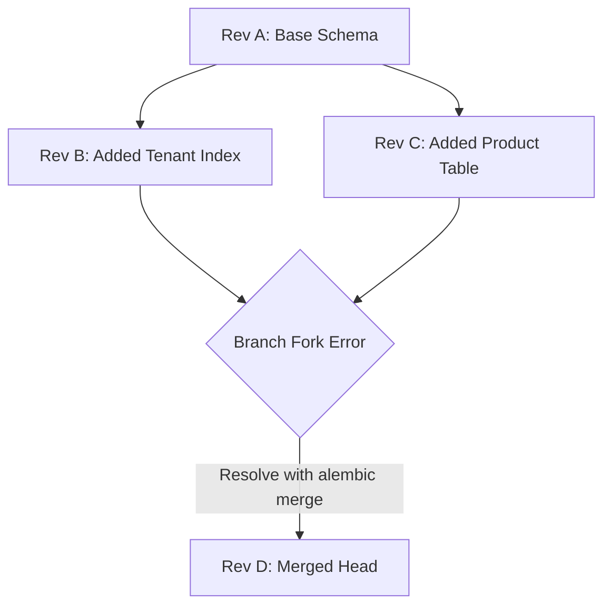
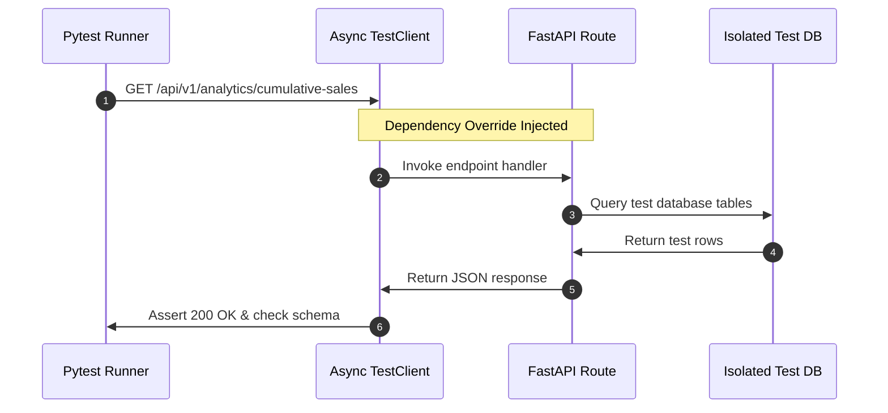

# Testing Async APIs and Managing Database Migrations

A senior-level guide to setting up async test suites in FastAPI, mocking SWR caching in React dashboards, and managing database migrations using Alembic.

---

## 1. Database Migrations with Alembic (Why, What, How)

### Why Use Alembic?
In a team environment, database schemas change frequently (e.g., adding metrics columns, creating indexes). Manually running `ALTER TABLE` scripts leads to drift between developers' local databases, staging, and production. Alembic acts as "Git for database schemas," ensuring changes are version-controlled, reproducible, and easily applied or rolled back.

### What to Do in Migration Conflicts?
If two developers create migrations independently, git merges will result in two different files pointing to the same parent revision, causing a "branch fork" error when running migrations on deployment.



### How: Command Reference Sheet (Gist)
Common CLI operations for managing migrations:

```bash
# Gist: alembic_commands.sh
# 1. Initialize Alembic in the project root
alembic init alembic

# 2. Generate a migration script automatically by comparing models to database
# Note: Ensure env.py imports your target DeclarativeBase metadata
alembic revision --autogenerate -m "add_indexes_to_transactions"

# 3. Upgrade local database to the latest revision
alembic upgrade head

# 4. Roll back the last applied migration
alembic downgrade -1

# 5. Resolve branch forks (if two revisions share the same down_revision)
# This creates a merge revision file joining the branches.
alembic merge -m "merge_branch_b_and_c" revision_b_id revision_c_id
```

---

## 2. Testing Async FastAPI Backends (Why, What, How)

### Why Test Async Database Connections Dynamically?
FastAPI routes that execute database calls depend on an active session (`AsyncSession`). When writing tests, you must:
1. **Isolate Test Data**: Do not write test records to your active development or production database.
2. **Override Dependencies**: Swap out the database connection session dependency with an in-memory database (`sqlite+aiosqlite`) or a separate test Postgres instance dynamically.
3. **Handle Event Loop**: Ensure pytest runs within the same async event loop as your database engine.



### How: Pytest Configuration (Gist)
A complete `conftest.py` setup using an in-memory SQLite database to test async FastAPI routes.

```python
# Gist: conftest.py
import pytest
import pytest_asyncio
from typing import AsyncGenerator
from httpx import AsyncClient
from sqlalchemy.ext.asyncio import create_async_engine, async_sessionmaker, AsyncSession
from app.main import app, get_db_session
from app.models import Base

# 1. Setup isolated in-memory test database engine
TEST_DATABASE_URL = "sqlite+aiosqlite:///:memory:"
test_engine = create_async_engine(TEST_DATABASE_URL, echo=False)
TestSessionLocal = async_sessionmaker(bind=test_engine, expire_on_commit=False, class_=AsyncSession)

# 2. Database setup and teardown fixture
@pytest_asyncio.fixture(scope="function", autouse=True)
async def setup_db():
    # Create tables before each test runs
    async with test_engine.begin() as conn:
        await conn.run_sync(Base.metadata.create_all)
    yield
    # Drop tables after each test completes
    async with test_engine.begin() as conn:
        await conn.run_sync(Base.metadata.drop_all)

# 3. Override dependency fixture
@pytest_asyncio.fixture
async def db_session() -> AsyncGenerator[AsyncSession, None]:
    async with TestSessionLocal() as session:
        yield session
        await session.close()

# 4. HTTP client fixture running against the overridden app
@pytest_asyncio.fixture
async def client(db_session: AsyncSession) -> AsyncGenerator[AsyncClient, None]:
    # Override FastAPI dependency injection
    app.dependency_overrides[get_db_session] = lambda: db_session
    async with AsyncClient(app=app, base_url="http://test") as ac:
        yield ac
    # Clean overrides
    app.dependency_overrides.clear()
```

```python
# Gist: test_analytics.py
import pytest
from httpx import AsyncClient
from sqlalchemy.ext.asyncio import AsyncSession
from app.models import Tenant, Transaction

@pytest.mark.asyncio
async def test_get_cumulative_sales_success(client: AsyncClient, db_session: AsyncSession):
    # 1. Seed test database data
    test_tenant = Tenant(id=1, name="Acme Corp")
    db_session.add(test_tenant)
    await db_session.commit()

    test_transaction = Transaction(tenant_id=1, amount=100.0, status="completed")
    db_session.add(test_transaction)
    await db_session.commit()

    # 2. Execute target route
    response = await client.get("/api/v1/analytics/cumulative-sales")

    # 3. Assert correct response structure
    assert response.status_code == 200
    data = response.json()
    assert len(data) == 1
    assert data[0]["tenant_name"] == "Acme Corp"
    assert data[0]["daily_sales"] == 100.0
    assert data[0]["running_cumulative_sales"] == 100.0
```

---

## 3. Testing React Dashboard Widgets (Why, What, How)

### Why Mock SWR Cache?
When testing React dashboard widgets (e.g., checking if a sales chart renders correctly), you must avoid sending network requests to the actual backend server. SWR provides a provider wrapper (`SWRConfig`) that allows you to seed the cache with mock data during tests.

### How: React Widget Testing (Gist)
A TypeScript unit test using React Testing Library to verify that a widget handles loading and displays metrics correctly.

```typescript
// Gist: SalesWidget.test.tsx
import React from 'react';
import { render, screen } from '@testing-library/react';
import { SWRConfig } from 'swr';
import { SalesWidget } from './SalesWidget';

// Mock data to seed the SWR cache
const mockData = [
  {
    tenant_id: 1,
    tenant_name: 'Acme Corp',
    sales_date: '2026-07-18',
    daily_sales: 150.0,
    running_cumulative_sales: 150.0,
  },
];

describe('SalesWidget Component', () => {
  it('renders loading skeleton initial state', () => {
    // Render without seed cache to trigger isLoading state
    render(
      <SWRConfig value={{ provider: () => new Map() }}>
        <SalesWidget />
      </SWRConfig>
    );

    expect(screen.getByTestId('loading-skeleton')).toBeInTheDocument();
  });

  it('renders sales metrics correctly when data is fetched', async () => {
    const cacheMap = new Map();
    // Seed SWR cache for the specific API endpoint
    cacheMap.set('/analytics/cumulative-sales', mockData);

    render(
      <SWRConfig value={{ provider: () => cacheMap, dedupingInterval: 0 }}>
        <SalesWidget />
      </SWRConfig>
    );

    // Assert that metric text is rendered
    expect(await screen.findByText('Acme Corp')).toBeInTheDocument();
    expect(screen.getByText('$150.00')).toBeInTheDocument();
  });
});
```
