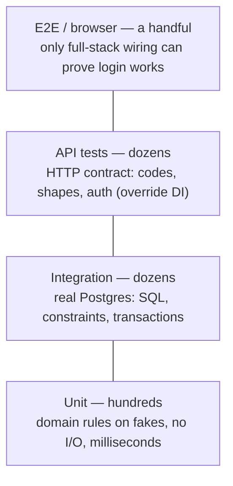

# Test Strategy Masterclass: The Pyramid, Fakes & Contracts

Test *mechanics* (async fixtures, dependency overrides) live in [01_testing_and_migrations.md](01_testing_and_migrations.md). This doc is the strategy layer: how many tests of which kind, why fakes beat mocks, and how two independently-deployed apps keep one API contract honest.

---

## 1. The Test Pyramid, Argued Not Recited (Why)

The pyramid is not dogma about ratios — it is a **cost argument**. Every test buys confidence and charges you in run time, flakiness, and maintenance. Unit tests are microseconds and deterministic; tests touching Postgres cost milliseconds-to-seconds and a real service; end-to-end tests cost seconds-to-minutes and fail for reasons unrelated to your change. You buy as much confidence as possible from the cheap layers and reserve the expensive ones for what *only they* can verify.



For a typical FastAPI service honest numbers look like: hundreds of unit tests, a few dozen integration and API tests, single-digit E2E. An inverted pyramid — everything through HTTP against a live DB — is the classic mid-level tell: a 20-minute suite nobody runs before pushing.

## 2. Fakes over Mocks: Leveraging the Repository Protocol (How)

The repository Protocol ([repository_pattern_sqlalchemy.py](../usable_gists/repository_pattern_sqlalchemy.py)) exists precisely so business logic never touches SQLAlchemy directly — which means tests can substitute the data layer. The senior distinction is *what* you substitute with:

* A **mock** (`MagicMock`) records calls and returns whatever you stubbed. It has no behavior, happily returns nonsense, and couples the test to call signatures — rename a method and thirty tests break with the code still correct.
* A **fake** is a real, tiny implementation of the Protocol — an in-memory dict with actual store/retrieve behavior. Tests read as *scenarios*, survive refactors, and one fake serves the whole suite.

```python
# Gist: fake_repository.py
from app.models import Transaction

class FakeTransactionRepository:
    """In-memory implementation of TransactionRepository — satisfies the Protocol structurally."""
    def __init__(self) -> None:
        self._rows: dict[int, Transaction] = {}
        self._next_id = 1

    async def get_by_tenant(self, tenant_id: int) -> list[Transaction]:
        rows = [t for t in self._rows.values() if t.tenant_id == tenant_id]
        return sorted(rows, key=lambda t: t.created_at, reverse=True)  # mirrors the real ORDER BY

    async def create(self, transaction: Transaction) -> Transaction:
        transaction.id, self._next_id = self._next_id, self._next_id + 1
        self._rows[transaction.id] = transaction
        return transaction

# A service test now needs zero database, zero event-loop tricks beyond pytest-asyncio:
async def test_transfer_rejects_insufficient_funds():
    repo = FakeTransactionRepository()
    service = TransferService(repo)
    with pytest.raises(InsufficientFunds):
        await service.transfer(src=1, dst=2, amount=999_999)
```

Reserve `unittest.mock` for true third-party edges (an email gateway, a payment SDK) where the assertion genuinely *is* "we called it once with X". Anything you own that has behavior deserves a fake.

## 3. What Each Layer Should Assert (What)

The layers stay cheap only if each asserts *its own* concern and nothing twice:

| Layer | Substitutes | Asserts | Must NOT assert |
|---|---|---|---|
| Unit | Fake repos | Domain rules: limits, fees, state transitions | SQL, HTTP codes |
| Integration | Nothing — real Postgres ([conftest](../usable_gists/pytest_conftest_async_db.py)) | Queries return correct rows; constraints and transactions behave | Business rules (already covered above) |
| API | DB via [dependency overrides](01_testing_and_migrations.md); real routing/validation | Status codes, response shapes, auth enforcement ([assertions gist](../usable_gists/pytest_async_api_assertions.py)) | Query correctness |
| Frontend | HTTP via fetch-mocking ([react_swr_widget_test.tsx](../usable_gists/react_swr_widget_test.tsx)) | Rendering per API state: loading/error/data | Backend behavior |

The load-bearing sentence for interviews: **what the fake can't prove is exactly what the integration layer exists to prove.** The fake asserts the service refuses an overdraft; only Postgres can assert the `CHECK` constraint, the `FOR UPDATE` lock, and the real `ORDER BY` collation agree with it.

## 4. Contract Testing (What)

Unit through API tests all live inside one repo. The remaining failure mode is **drift between deployables**: backend renames `created_at` → `createdAt`, its own tests pass, the frontend discovers it in production. Contract tests pin the *seam*.

The pragmatic version for one team, and the strong answer for this stack: **the OpenAPI schema FastAPI already generates is the contract.** In CI, regenerate TypeScript types (and Zod schemas — see [frameworks_specifics/08_zod_formik.md](../frameworks_specifics/08_zod_formik.md)) from `openapi.json`; a breaking rename now fails the frontend *build*, not the user. Cheap, automatic, no new infrastructure.

The scaled version is **consumer-driven contracts (Pact)**: each consumer records the requests/responses it depends on; providers replay those expectations in *their* CI, so a provider learns it broke a consumer before merging. The vocabulary that signals seniority: *consumers drive, providers verify*. Equally senior is knowing it's overkill for one frontend and one backend in adjacent folders — name the tool, then decline it with reasons.

## 5. Interview Angles

**"How do you test business logic without spinning up Postgres, and what do you lose?"**
Skeleton: repository Protocol → in-memory fake → service tests become millisecond scenario tests → state plainly what's lost (real SQL, constraints, locking, collation) → and where it's recovered: a thin integration layer running the real repository against real Postgres. Naming the loss is the senior half of the answer.

**"Mock or fake — do you have a preference and why?"**
Skeleton: fakes for owned interfaces (behavior, refactor-proof, readable scenarios); mocks only at third-party edges where the call itself is the assertion → bonus: fakes are what make the pyramid's base *wide* — they're why unit tests can cover hundreds of cases cheaply.

**"Frontend and backend deploy independently — how do you stop the contract drifting?"**
Skeleton: OpenAPI as the source of truth → generated TS/Zod in CI turns runtime breakage into build failure → escalate to Pact when consumers multiply, with the consumers-drive/providers-verify framing → tie-off: this is the same "fail at the cheapest possible layer" logic as the pyramid itself.
