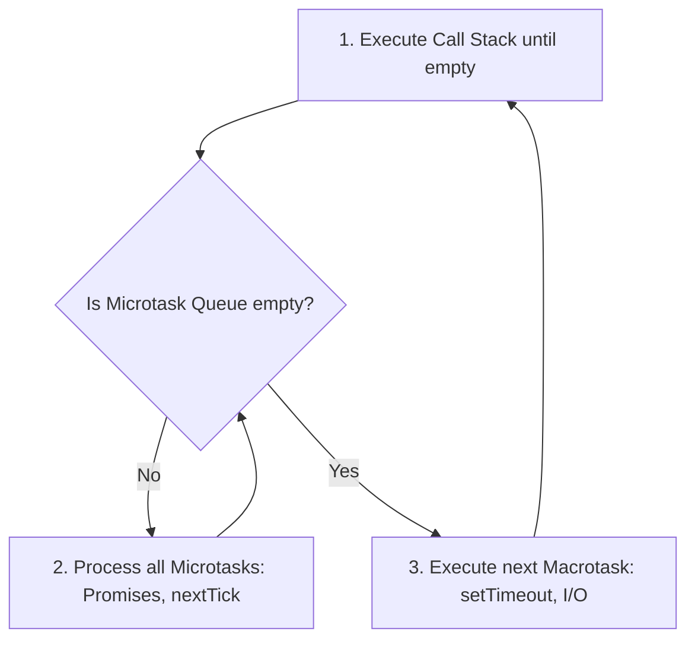

# Advanced Runtimes, Execution Loops, and Compilers Masterclass

A deep-dive academic guide to the execution models of Python and Node.js runtimes, event loop architectures, and strict TypeScript compilation checks.

---

## 1. Concurrency Runtimes & Event Loops (Why & What)

Fullstack developers must understand how code executes in different runtime environments (Python/Uvicorn vs. Node.js/V8) to debug performance bottlenecks and lockups.

### Python Asyncio Event Loop & GIL
Python uses the **Global Interpreter Lock (GIL)**, which prevents multiple native threads from executing Python bytecodes at once.
* **`asyncio` Mechanics**: Python's `asyncio` framework uses a single thread to execute asynchronous code. When a coroutine awaits an I/O operation (like a database query), it yields execution back to the event loop, allowing other tasks to run.
* **The Block Trap**: If a developer calls a blocking, synchronous function (e.g. `urllib.request.urlopen()`) directly inside an `async def` function, the single thread is blocked. The event loop cannot process any other requests, freezing the entire application server.
* **The Fix**: Offload synchronous, blocking operations to a thread pool using `loop.run_in_executor()`.

### Node.js (V8) Event Loop & Task Queues
Node.js also runs on a single thread, utilizing **Libuv** to execute I/O operations asynchronously.

Node.js manages execution order using three distinct queues:
1. **The Call Stack**: Sync execution tasks are pushed here.
2. **The Microtask Queue**: Houses resolved Promises and `process.nextTick()` callbacks.
3. **The Macrotask Queue**: Houses timers (`setTimeout`), I/O callbacks, and setImmediate.

* **Execution Order**: The Microtask Queue is prioritized and emptied completely between every phase change of the Event Loop (Timers, I/O, Close callbacks), before the next Macrotask is processed.



---

## 2. Compiler Configuration Gates (Why & How)

TypeScript provides compiler validation checks to catch bugs before code runs in the browser.

### Strict Compiler Properties (`tsconfig.json`)
* **`strict: true`**: Enables a broad range of type checking behaviors, including:
  * **`noImplicitAny: true`**: Raises an error if a variable lacks a type definition, preventing developers from fallback variables to the unsafe `any` type.
  * **`strictNullChecks: true`**: Enforces explicit null checks. You must verify if a value exists before accessing its properties.
* **`noUnusedLocals: true`**: Prevents code bloating by raising compile-time errors if variables are declared but never used.

---

## 3. Advanced Implementation Blueprints (How)

### Gist: python_thread_pooling.py
How to safely execute blocking synchronous code inside an async FastAPI handler.

```python
# Gist: python_thread_pooling.py
import asyncio
import time
import requests
from fastapi import FastAPI

app = FastAPI()

def blocking_http_fetch(url: str) -> str:
    # A. Synchronous blocking request
    # Running this directly in an async handler would freeze the server!
    response = requests.get(url, timeout=5)
    return response.text

@app.get("/api/v1/fetch")
async def async_fetch_handler():
    loop = asyncio.get_running_loop()
    
    # B. Offload blocking execution to a worker thread pool
    # Why: Event loop remains completely unblocked to handle other requests
    result = await loop.run_in_executor(
        None,                 # Uses default ThreadPoolExecutor
        blocking_http_fetch,  # Target blocking function
        "https://api.github.com"
    )
    return {"data": result}
```

### Gist: tsconfig.json
A strict, production-ready TypeScript compiler configuration.

```json
{
  "compilerOptions": {
    "target": "ES2022",
    "module": "ESNext",
    "lib": ["DOM", "DOM.Iterable", "ES2022"],
    
    /* Strict Type-Checking Rules */
    "strict": true,
    "noImplicitAny": true,
    "strictNullChecks": true,
    "strictFunctionTypes": true,
    "noImplicitThis": true,
    "alwaysStrict": true,

    /* Code Quality Gates */
    "noUnusedLocals": true,
    "noUnusedParameters": true,
    "noImplicitReturns": true,
    "noFallthroughCasesInSwitch": true,

    /* Module Resolution */
    "moduleResolution": "node",
    "resolveJsonModule": true,
    "allowSyntheticDefaultImports": true,
    "esModuleInterop": true,
    "skipLibCheck": true
  },
  "include": ["src"]
}
```
