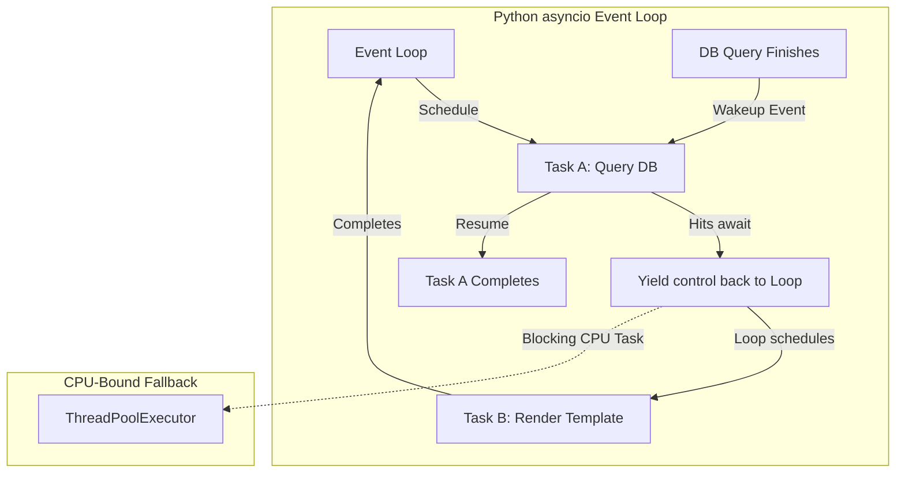
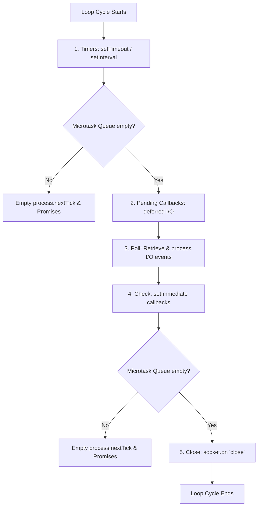

# Advanced Runtimes & Compilers: Python asyncio, V8 Event Loop, and TypeScript TSC

A senior-level guide to runtime concurrency models, JavaScript event loop execution phases, and TypeScript compiler configurations.

---

## 1. Python asyncio & Concurrency (Why, What, How)

### Why asyncio and How Does It Evade the GIL?
Python’s **Global Interpreter Lock (GIL)** prevents multiple native threads from executing Python bytecodes at the same time in a single process. This makes standard multi-threading ineffective for CPU-bound scaling.
* **asyncio (Cooperative Multitasking)**: Instead of relying on the OS to switch threads contextually (Preemptive Multitasking), `asyncio` runs on a single thread. It uses an **Event Loop** that schedules tasks. When a coroutine hits an `await` statement (e.g. database query, API fetch), it yields execution control back to the event loop, allowing other tasks to run while the I/O operation resolves in the background.



---

## 2. The Node.js / V8 Event Loop (Why, What, How)

### Why is Node.js High-Throughput Despite Being Single-Threaded?
Like Python's `asyncio`, Node.js runs JS execution on a single thread. It offloads I/O tasks (file system, networking) to the operating system kernel or the **Libuv thread pool** (written in C++). Once the tasks complete, their callbacks are placed in queues to be executed by the V8 engine.

### The Event Loop Phases
The event loop executes in a loop through distinct phases. Between each phase, Node.js checks and empties the **Microtask Queue** (which contains `process.nextTick` and resolved Promise callbacks).

1. **Timers**: Executes callbacks scheduled by `setTimeout()` and `setInterval()`.
2. **Pending Callbacks**: Executes I/O callbacks deferred from the previous loop iteration.
3. **Poll**: Retrieves new I/O events; executes I/O-related callbacks. Node.js can block here waiting for updates.
4. **Check**: Executes callbacks scheduled by `setImmediate()`.
5. **Close Callbacks**: Executes close event callbacks (e.g., `socket.on('close', ...)`).



### Execution Priority Example (The Classic Interview Filter)
What is the console output order for the following code?
```javascript
setTimeout(() => console.log('Timeout'), 0);
setImmediate(() => console.log('Immediate'));
Promise.resolve().then(() => console.log('Promise'));
process.nextTick(() => console.log('NextTick'));
console.log('Synchronous');
```
**Output Order**:
1. `Synchronous` (Executes instantly on the call stack).
2. `NextTick` (Microtask queue: nextTick queue runs before promise queue).
3. `Promise` (Microtask queue: promise queue runs immediately after nextTick).
4. `Timeout` or `Immediate` (Depends on timer instantiation timing, though `Timeout` generally runs first if V8 starts fast enough).

---

## 3. TypeScript Compilation & TSC Configuration (Why, What, How)

### Why Strict Compiler Configuration?
By default, TypeScript is permissive. If you do not configure compiler options correctly, `tsc` will allow implicit `any` variables, silent null dereferences, and mismatching module resolutions, defeating the purpose of using TypeScript.

---

## 4. Code & Configuration Blueprints (Gists)

### Gist 1: Python Custom Async Connection Context Manager
A reusable, asynchronous context manager handling resource allocation and exception rollbacks.

```python
# Gist: async_context_manager.py
import asyncio

class AsyncConnectionPoolMock:
    def __init__(self, connection_string: str):
        self.connection_string = connection_string
        self.is_connected = False

    async def __aenter__(self):
        # Why: Setups async database connection hook
        print(f"Connecting to: {self.connection_string}")
        await asyncio.sleep(0.5)  # Simulate network latency
        self.is_connected = True
        return self

    async def __aexit__(self, exc_type, exc_val, exc_tb):
        # Why: Safely handles disconnects and transaction rollbacks on failures
        print("Closing database connection pool...")
        await asyncio.sleep(0.1)
        self.is_connected = False
        
        if exc_type is not None:
            # An exception occurred inside the 'with' block
            print(f"Transaction failed with error: {exc_val}. Rolling back.")
            return False  # Propagate the exception
        
        print("Transaction committed successfully.")
        return True  # Suppress exceptions if any occurred (none did)

# Usage Example
async def main():
    db_url = "postgresql+asyncpg://admin@localhost:5432/dashboard"
    try:
        async with AsyncConnectionPoolMock(db_url) as conn:
            print(f"Pool state active: {conn.is_connected}")
            # Simulate operation
            raise ValueError("Invalid metric write detected!")
    except ValueError:
        print("Caught propagated error in outer block.")

if __name__ == "__main__":
    asyncio.run(main())
```

### Gist 2: Advanced TypeScript Generics & Mapped Types
A reusable utility configuration demonstrating generic mappings, type checking constraints, and utility modifiers.

```typescript
// Gist: advanced_generics.ts

// 1. Generic API Response Wrapper
interface ApiResponse<T> {
  data: T;
  status: 'success' | 'error';
  timestamp: string;
}

// 2. Sample Data Model
interface Metric {
  id: string;
  name: string;
  value: number;
  recordedBy: string;
}

// 3. Advanced Type Manipulation (Utility Types)
// Omit: Creates a type by removing specific keys from Metric
type MetricSubmission = Omit<Metric, 'id'>;

// Readonly: Makes all attributes immutable
type ReadonlyMetric = Readonly<Metric>;

// 4. Conditional and Mapped Types
// Mapped Type: Transforms all string properties of an object to functions returning strings
type StringPropertiesOnly<T> = {
  [K in keyof T as T[K] extends string ? K : never]: T[K];
};

type MetricStringProperties = StringPropertiesOnly<Metric>;
// Resulting type is: { id: string; name: string; recordedBy: string; }

// 5. Generic Class Implementation
class DataStore<T extends { id: string }> {
  private cache = new Map<string, T>();

  public save(item: T): void {
    this.cache.set(item.id, item);
  }

  public get(id: string): T | undefined {
    return this.cache.get(id);
  }
}

// Test implementation
const store = new DataStore<Metric>();
store.save({ id: '1', name: 'CPU Load', value: 92.5, recordedBy: 'agent-1' });
```

### Gist 3: Production-Ready `tsconfig.json` Configuration
A performance-optimized, strict `tsconfig.json` structure for a React Vite project.

```json
// Gist: tsconfig.json
{
  "compilerOptions": {
    "target": "ESNext",
    "useDefineForClassFields": true,
    "lib": ["DOM", "DOM.Iterable", "ESNext"],
    "module": "ESNext",
    "skipLibCheck": true, // Speeds up compilation by skipping checking external d.ts files

    /* Bundler mode */
    "moduleResolution": "bundler",
    "allowImportingTsExtensions": true,
    "resolveJsonModule": true,
    "isolatedModules": true,
    "noEmit": true, // Vite handles compilation; tsc only handles type-checking
    "jsx": "react-jsx",

    /* Strict Type-Checking Rules (Mandatory for Senior setups) */
    "strict": true, // Enables all strict options (noImplicitAny, strictNullChecks, etc.)
    "noImplicitAny": true, // Raise error on expressions and declarations with an implied 'any' type
    "strictNullChecks": true, // Ensures null and undefined are handled explicitly
    "strictFunctionTypes": true, // Enforce strict checking of function types
    "noImplicitThis": true, // Raise error on 'this' expressions with an implied 'any' type

    /* Additional Linting Checks */
    "noUnusedLocals": true, // Report errors on unused local variables
    "noUnusedParameters": true, // Report errors on unused parameters
    "noImplicitReturns": true, // Report error when not all code paths in function return a value
    "noFallthroughCasesInSwitch": true, // Report errors for fallthrough cases in switch statement

    "paths": {
      "@/*": ["./src/*"]
    }
  },
  "include": ["src"],
  "references": [{ "path": "./tsconfig.node.json" }]
}
```
