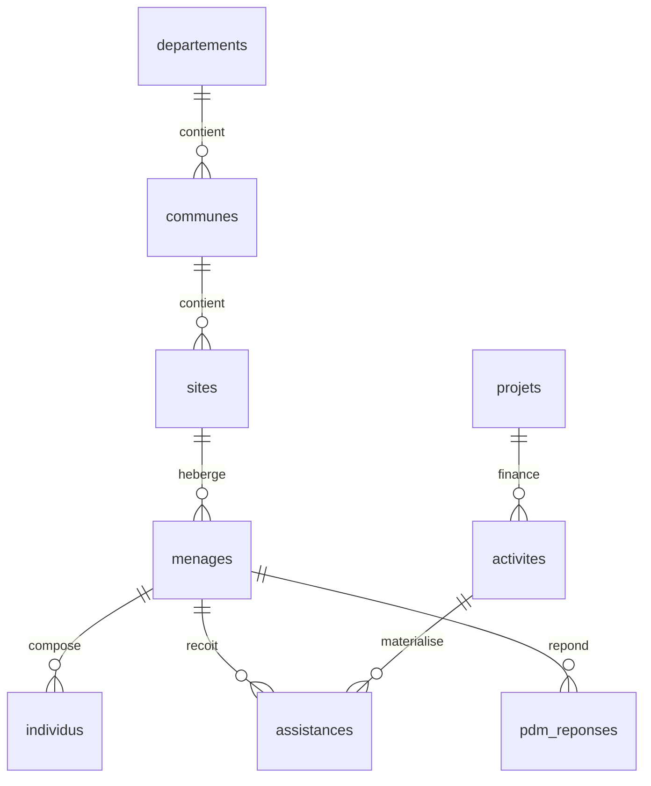

# Modéliser et concevoir une base de données projet

*Piste ACTED — Assistant Base de Données (Réf. ASSISTBDD_2607). Base d'exercice : `exercices/acted_bdd.db`, générée par `exercices/generer_base_acted.py`. Toutes les requêtes de ce module ont été exécutées sur cette base et les résultats affichés sont réels.*

---

## Pourquoi ce module existe

Le premier objectif inscrit dans le TDR ACTED n'est pas d'analyser des données. Il est de « créer et maintenir des bases de données appropriées pour tous les projets ». Le verbe est *créer*. On ne te demande pas seulement d'interroger une base que quelqu'un d'autre a conçue : on te demande de la concevoir, puis de la faire évoluer quand un nouveau bailleur impose un nouvel indicateur.

C'est un métier différent de celui d'analyste. L'analyste répond à la question du jour. Le concepteur décide de ce que la base rendra possible ou impossible pendant les trois ans du projet. Une mauvaise conception ne se voit pas la première semaine ; elle se voit au douzième mois, quand le rapport bailleur demande le nombre de bénéficiaires uniques et que personne dans le bureau ne sait le produire.

Ce module part d'un fichier plat réel, montre précisément où il casse, et le reconstruit en base relationnelle.

---

## 1. La vie sans base de données

Voici le fichier que tu trouveras en arrivant dans un bureau terrain. Il s'appelle en général quelque chose comme `liste_beneficiaires_final_v7_VRAI_corrigé.xlsx`, et il ressemble à ceci.

| code_menage | nom_chef | commune | departement | taille | activite | date | montant | enqueteur | tel |
|---|---|---|---|---|---|---|---|---|---|
| MEN-00012 | Pierre | Gonaives | Artibonite | 6 | Cash inconditionnel | 12/04/2025 | 9000 | Mirlande | +50937... |
| MEN-00012 | Pierre | Gonaïves | Artibonite | 6 | Kit hygiene | 03/06/2025 | 0 | Mirlande | +50937... |
| MEN-00012 | Pierre | GONAIVES | Artibonite | 7 | Bon alimentaire | 19/08/2025 | 7500 | Kervens | +50937... |
| MEN-00013 | Jean-Baptiste | St-Marc | Artibonite | 4 | Cash inconditionnel | 15/04/2025 | 9000 | Kervens | 3712-4498 |

Regarde le ménage MEN-00012. Il occupe trois lignes parce qu'il a reçu trois assistances. Et parce qu'il occupe trois lignes, son nom de commune est écrit de trois façons, sa taille de ménage vaut 6 puis 6 puis 7, et son numéro de téléphone est recopié trois fois. Ce ne sont pas des fautes de frappe malheureuses : ce sont les **conséquences mécaniques** de la structure du fichier.

Nomme les trois pathologies, parce que ce sont exactement les termes qu'un jury attend.

**L'anomalie de mise à jour.** Le ménage déménage et change de numéro de téléphone. Il faut modifier trois lignes. Si on en oublie une, le fichier contient désormais deux vérités contradictoires, et rien ne dit laquelle est la bonne.

**L'anomalie d'insertion.** Une nouvelle commune ouvre à Gros-Morne, mais aucune distribution n'y a encore eu lieu. Impossible de l'enregistrer : dans ce fichier, une commune n'existe que portée par une ligne d'assistance. On ne peut pas décrire le monde avant que quelque chose n'y arrive.

**L'anomalie de suppression.** On annule la distribution de MEN-00013 pour erreur de saisie et on supprime la ligne. Le ménage disparaît entièrement de la base, avec son enregistrement, sa taille et son téléphone. On voulait effacer un événement, on a effacé une personne.

Une base relationnelle n'est rien d'autre que la réponse systématique à ces trois anomalies. Elle repose sur une seule idée : **chaque fait est écrit à un seul endroit**.

---

## 2. Le vocabulaire de la conception

En contexte francophone, et ACTED Haïti l'est, le vocabulaire de conception est celui de MERISE. Il vaut mieux le maîtriser, car un responsable MEAL formé en France ou à Québec posera la question avec ces mots-là.

Une **entité** est une chose dont on veut mémoriser l'existence : un ménage, un site, une activité. Une **association** est un lien entre entités : un ménage *reçoit* une assistance. Une **propriété** est un attribut d'une entité : le nom du chef de ménage.

La **cardinalité** dit combien de fois une entité participe à une association, et elle s'écrit sous la forme d'un minimum et d'un maximum. Entre `menages` et `assistances`, on lit d'un côté « un ménage reçoit de zéro à plusieurs assistances », noté `0,n`, et de l'autre « une assistance concerne un et un seul ménage », noté `1,1`. Cette paire `0,n` / `1,1` est la signature d'une relation un-à-plusieurs, et elle se traduit toujours de la même manière : la clé du côté `1,1` va chercher la clé du côté `0,n`. Concrètement, `assistances` porte une colonne `id_menage`.

Le **MCD**, modèle conceptuel de données, décrit le métier sans se soucier de la technique. Le **MLD**, modèle logique, traduit le MCD en tables et en clés étrangères. Le **MPD**, modèle physique, ajoute les types du moteur choisi, les index et les contraintes. On descend du conceptuel au physique, jamais l'inverse.

Le cas particulier à connaître est la cardinalité plusieurs-à-plusieurs. Si un ménage peut participer à plusieurs activités et qu'une activité touche plusieurs ménages, on lit `0,n` des deux côtés, et **aucune des deux tables ne peut porter la clé de l'autre**. On crée alors une **table d'association**, ici `assistances`, qui porte les deux clés étrangères plus les propriétés propres à la rencontre : la date, le montant, l'agent qui a saisi. Savoir que toute relation plusieurs-à-plusieurs devient une table est probablement la question de modélisation la plus fréquente en entretien.

---

## 3. Le modèle reconstruit

Voici le schéma qui remplace le fichier plat, tel qu'il est réellement implémenté dans `acted_bdd.db`.



Lis-le comme une phrase. Un département contient des communes, une commune contient des sites d'intervention, un site héberge des ménages, un ménage est composé d'individus, reçoit des assistances et répond à des enquêtes post-distribution. Chaque assistance matérialise une activité, et chaque activité appartient à un projet financé par un bailleur.

Le fait qui compte : **le nom du chef de ménage n'est écrit qu'une fois**, dans `menages`. Le nom de la commune n'est écrit qu'une fois, dans `communes`. Les trois anomalies de la section 1 ont disparu, non pas parce qu'on a fait attention, mais parce que la structure les rend impossibles.

### 3.1 Le code de création, commenté

```sql
CREATE TABLE menages (
  id_menage           INTEGER PRIMARY KEY,
  code_menage         TEXT NOT NULL UNIQUE,
  code_site           TEXT NOT NULL,
  nom_chef            TEXT NOT NULL,
  prenom_chef         TEXT NOT NULL,
  sexe_chef           TEXT NOT NULL CHECK (sexe_chef IN ('F','M')),
  date_naissance_chef DATE,
  piece_identite      TEXT,
  telephone           TEXT,
  taille_menage       INTEGER NOT NULL CHECK (taille_menage BETWEEN 1 AND 20),
  nb_enfants_moins5   INTEGER NOT NULL DEFAULT 0 CHECK (nb_enfants_moins5 >= 0),
  statut_deplacement  TEXT CHECK (statut_deplacement IN ('Deplace','Hote','Residant','Retourne')),
  date_enregistrement DATE NOT NULL,
  score_vulnerabilite INTEGER CHECK (score_vulnerabilite BETWEEN 0 AND 100),
  statut_selection    TEXT NOT NULL CHECK (statut_selection IN ('Selectionne','Non selectionne','En attente')),
  FOREIGN KEY (code_site) REFERENCES sites(code_site),
  CHECK (nb_enfants_moins5 <= taille_menage)
);
```

Chaque ligne de contrainte porte une décision qu'il faut savoir défendre.

`id_menage INTEGER PRIMARY KEY` est une **clé technique**, dite aussi de substitution : un entier sans signification métier, stable pour toujours. `code_menage TEXT NOT NULL UNIQUE` est la **clé métier** : celle qu'on imprime sur la carte du bénéficiaire et que les équipes terrain utilisent. Pourquoi les deux ? Parce que la clé métier peut changer — une réforme de nomenclature, une fusion de projets, un préfixe de bailleur ajouté après coup — et si toutes les tables filles la référencent, ce changement devient un chantier. La clé technique absorbe le choc. C'est une réponse d'entretien qui vaut le détour : **la clé primaire ne doit jamais porter de sens métier, parce que le sens métier change.**

`NOT NULL` sur `taille_menage` déclare qu'un ménage sans taille connue n'est pas un enregistrement valide, et le formulaire Kobo doit donc rendre le champ obligatoire. C'est le premier maillon de la chaîne de qualité, celle qui va du formulaire au schéma puis, en dernier recours seulement, au nettoyage.

`CHECK (sexe_chef IN ('F','M'))` est la version base de données de la liste déroulante. Sans elle, la base accueillera « F », « f », « Femme », « feminin » et « 1 », et l'analyse par sexe sera fausse pour toujours.

`CHECK (nb_enfants_moins5 <= taille_menage)` est une **contrainte de table** parce qu'elle porte sur deux colonnes à la fois. C'est la règle de triangulation la plus élémentaire — un sous-groupe ne peut pas dépasser le total — et l'écrire dans le schéma signifie qu'aucune application, aucun import, aucun stagiaire pressé ne pourra jamais la violer.

`FOREIGN KEY (code_site) REFERENCES sites(code_site)` garantit l'**intégrité référentielle** : impossible d'enregistrer un ménage sur un site qui n'existe pas. Dans le fichier Excel, une faute de frappe sur le nom du site créait silencieusement un site fantôme ; ici, l'insertion échoue.

Attention à un piège SQLite très classique en examen pratique : **les clés étrangères ne sont pas vérifiées par défaut**. Il faut écrire `PRAGMA foreign_keys = ON;` à chaque ouverture de connexion. Le savoir et le dire spontanément fait bonne impression.

### 3.2 La contrainte d'unicité métier

```sql
CREATE TABLE assistances (
  id_assistance   INTEGER PRIMARY KEY,
  id_menage       INTEGER NOT NULL,
  id_activite     INTEGER NOT NULL,
  date_assistance DATE NOT NULL,
  modalite        TEXT NOT NULL CHECK (modalite IN ('Cash','Kit','Bon','Service')),
  montant_htg     REAL CHECK (montant_htg >= 0),
  FOREIGN KEY (id_menage)   REFERENCES menages(id_menage),
  FOREIGN KEY (id_activite) REFERENCES activites(id_activite),
  UNIQUE (id_menage, id_activite, date_assistance)
);
```

La dernière ligne mérite qu'on s'y arrête, parce que c'est la protection la plus utile de tout le schéma. `UNIQUE (id_menage, id_activite, date_assistance)` déclare qu'un même ménage ne peut pas recevoir deux fois la même activité le même jour. Le double paiement — l'agent enregistre, le réseau tombe, l'agent réenregistre — devient physiquement impossible. Aucun contrôle a posteriori, aucun script de dédoublonnage : la base refuse la deuxième insertion.

Vérifions que la protection fonctionne réellement.

```sql
INSERT INTO assistances (id_menage, id_activite, date_assistance, modalite, montant_htg, quantite)
SELECT id_menage, id_activite, date_assistance, modalite, montant_htg, quantite
FROM assistances WHERE id_assistance = 1;
```

```
Runtime error: UNIQUE constraint failed:
assistances.id_menage, assistances.id_activite, assistances.date_assistance
```

La base a refusé. **C'est cette démonstration qu'il faut savoir faire en examen pratique** : montrer la contrainte, tenter de la violer, montrer le refus. Elle prouve qu'on ne conçoit pas des tables, on conçoit des garanties.

### 3.3 Le comportement en cascade

Que se passe-t-il si l'on supprime un ménage qui a reçu des assistances ? Trois politiques existent, et le choix est un choix de gestion, pas de technique.

`ON DELETE RESTRICT` interdit la suppression tant que des lignes filles existent. C'est le comportement par défaut, et c'est le bon pour `menages` : on ne supprime pas quelqu'un qui a reçu de l'argent, on garde la trace.

`ON DELETE CASCADE` supprime les lignes filles avec le parent. C'est le bon choix pour `individus` : si le ménage part de la base, les membres du ménage n'ont plus d'existence propre. C'est un choix dangereux partout ailleurs, parce qu'une seule commande peut effacer des milliers de lignes.

`ON DELETE SET NULL` détache la ligne fille sans la détruire. Utile pour un lien optionnel, par exemple une plainte rattachée à un ménage qui se révèle ne pas exister.

La formulation à retenir pour l'entretien : **on ne supprime pratiquement jamais une donnée bénéficiaire, on la marque comme inactive**. Une colonne `date_desactivation` ou `actif INTEGER` préserve l'historique, garde les rapports passés reproductibles, et respecte la piste d'audit qu'un bailleur peut réclamer trois ans plus tard.

---

## 4. La normalisation, appliquée au fichier de la section 1

La normalisation est souvent enseignée abstraitement. Elle devient évidente si on l'applique à notre tableau.

**Première forme normale : chaque cellule contient une valeur atomique.** Le fichier terrain contient souvent une colonne `activites_recues` valant « Cash, Kit hygiene, Bon ». Impossible de compter les kits distribués, impossible de filtrer proprement, parce que la valeur n'est pas une valeur mais une liste. La première forme normale impose une ligne par activité reçue, ce qui donne la table `assistances`. La règle pratique : si tu es tenté d'écrire une virgule dans une cellule, c'est qu'il te manque une table.

**Deuxième forme normale : tout attribut non clé dépend de la totalité de la clé.** Dans notre fichier, la clé qui identifie une ligne est le couple ménage-activité-date. Or `nom_chef` ne dépend que du ménage, pas de l'activité ni de la date. Il ne dépend donc que d'une partie de la clé : il est en violation, et c'est précisément pourquoi il est recopié trois fois. On le sort dans `menages`.

**Troisième forme normale : aucun attribut non clé ne dépend d'un autre attribut non clé.** Dans le fichier, `departement` dépend de `commune`, et pas du ménage. C'est une dépendance transitive. On la casse en créant `communes` reliée à `departements`. Résultat concret : quand une commune est réaffectée à un autre département — cela arrive, les découpages administratifs bougent — on modifie une ligne au lieu de plusieurs centaines.

La formule à retenir, attribuée à Bill Kent, est excellente en entretien parce qu'elle est courte et exacte : **chaque attribut non clé dépend de la clé, de toute la clé, et de rien que la clé.**

### La dénormalisation assumée

Il faut aussi savoir dire quand on s'en écarte, sinon on passe pour un théoricien. Le rapport mensuel du bailleur recalcule chaque nuit le nombre de bénéficiaires uniques par commune et par mois. La requête traverse cinq tables. Pour un tableau de bord consulté cent fois par jour sur des données figées, on accepte de stocker le résultat dans une table de synthèse rafraîchie une fois par nuit.

C'est un **arbitrage entre intégrité en écriture et performance en lecture**, pas une faute. La règle qui l'encadre : la table dénormalisée est toujours *dérivée*, jamais *saisie*. Personne ne tape dedans, un script la reconstruit, et si elle diverge, la vérité reste dans les tables normalisées.

---

## 5. Le dictionnaire de données

Le TDR demande de « maintenir et développer la structure ou le format des bases de données selon les besoins » et de « formuler des exigences techniques et des procédures opérationnelles ». Concrètement, cela veut dire produire et tenir à jour un dictionnaire de données. C'est un livrable modeste, souvent absent des bureaux terrain, et le proposer spontanément lors de l'entretien te distinguera.

Un dictionnaire décrit, pour chaque champ, son nom technique, son libellé métier, son type, son caractère obligatoire, ses valeurs autorisées, sa règle de contrôle et sa source. Voici l'extrait correspondant à `menages`.

| Champ | Libellé | Type | Oblig. | Valeurs / règle | Source |
|---|---|---|---|---|---|
| `code_menage` | Code ménage | Texte 9 | Oui | Format `MEN-#####`, unique | Généré à l'enregistrement |
| `sexe_chef` | Sexe du chef de ménage | Texte 1 | Oui | `F` ou `M` | Kobo, question `sexe_chef` |
| `taille_menage` | Nombre de personnes | Entier | Oui | Entre 1 et 20 | Kobo, calcul sur roster |
| `nb_enfants_moins5` | Enfants de moins de 5 ans | Entier | Oui | ≥ 0 et ≤ `taille_menage` | Kobo, roster |
| `statut_deplacement` | Statut de déplacement | Texte | Non | Déplacé, Hôte, Résidant, Retourné | Kobo, liste fermée |
| `score_vulnerabilite` | Score de vulnérabilité | Entier | Non | 0 à 100, calculé | Calculé, voir module 05 |
| `statut_selection` | Décision de ciblage | Texte | Oui | Sélectionné, Non sélectionné, En attente | Comité de ciblage |

La colonne « Source » est la plus importante et la plus souvent oubliée. Elle relie chaque champ de la base à la question du formulaire Kobo qui l'alimente. Sans elle, personne ne sait, six mois plus tard, si `nb_enfants_moins5` vient d'une question directe ou d'un calcul sur le roster — et donc personne ne sait comment le corriger quand il est faux.

---

## 6. Tracer la vie d'un ménage à travers le schéma

Suivons un enregistrement du terrain jusqu'au rapport, étape par étape. C'est l'exercice qui fait le mieux comprendre à quoi sert la structure.

Une équipe de ciblage arrive à Gonaïves. L'enquêtrice ouvre le formulaire Kobo sur sa tablette et enregistre le ménage de Rosemène Pierre : sept personnes, deux enfants de moins de cinq ans, déplacée depuis les violences de mars. Le formulaire calcule un score de vulnérabilité de 62 et l'envoie au serveur dès qu'un réseau est disponible.

Côté base, l'import crée **une ligne dans `menages`**, avec `code_menage = 'MEN-00704'`, `code_site` pointant vers le site de Gonaïves, `score_vulnerabilite = 62` et `statut_selection = 'Selectionne'` parce que le score dépasse le seuil de 44 points fixé par le comité. Le roster du formulaire crée en même temps **sept lignes dans `individus`**, toutes portant `id_menage` du ménage.

Un mois plus tard, la distribution a lieu. L'agent scanne la carte, la base crée **une ligne dans `assistances`** liant le ménage à l'activité « Cash inconditionnel » du projet PRJ-SECAL-24, à la date du jour, pour 9 000 gourdes. La contrainte `UNIQUE` empêche que le même transfert soit enregistré deux fois si le réseau lâche.

Six semaines après, l'enquête post-distribution passe. Une ligne apparaît dans **`pdm_reponses`** : satisfaction 4 sur 5, délai de réception 9 jours, montant déclaré 9 000 gourdes, connaissance du mécanisme de plainte oui.

Le rapport mensuel se contente alors de traverser ces liens.

```sql
SELECT d.nom_departement,
       COUNT(DISTINCT m.id_menage)                                     AS menages_enregistres,
       COUNT(DISTINCT CASE WHEN m.statut_selection = 'Selectionne'
                           THEN m.id_menage END)                       AS menages_cibles,
       COUNT(DISTINCT a.id_menage)                                     AS menages_atteints
FROM menages m
JOIN sites        s ON s.code_site      = m.code_site
JOIN communes     c ON c.id_commune     = s.id_commune
JOIN departements d ON d.id_departement = c.id_departement
LEFT JOIN assistances a ON a.id_menage  = m.id_menage
GROUP BY d.nom_departement
ORDER BY menages_enregistres DESC;
```

| nom_departement | menages_enregistres | menages_cibles | menages_atteints |
|---|---|---|---|
| Artibonite | 550 | 267 | 266 |
| Ouest | 332 | 167 | 167 |
| Centre | 171 | 86 | 86 |
| Nord | 165 | 81 | 81 |

Trois colonnes, trois notions distinctes que le fichier plat confondait : enregistré, ciblé, atteint. Le seul ménage manquant dans l'Artibonite est identifiable en une requête, et c'est de la redevabilité concrète — quelqu'un a été sélectionné et n'a rien reçu, il faut savoir pourquoi.

Note le `LEFT JOIN` sur `assistances` : avec un `INNER JOIN`, les ménages enregistrés mais jamais assistés disparaîtraient du tableau, et les trois colonnes seraient égales. Le rapport paraîtrait parfait et serait faux.

---

## 7. Faire évoluer un schéma en cours de projet

Ce qui arrive vraiment : au huitième mois, un nouveau bailleur exige de désagréger les bénéficiaires par tranche d'âge et par situation de handicap, ce que le formulaire initial ne collectait pas.

La mauvaise réaction est d'ouvrir la base avec un outil graphique et d'ajouter la colonne à la main. Elle est mauvaise pour trois raisons : rien ne trace le changement, l'environnement de test diverge de la production, et personne ne peut revenir en arrière.

La bonne réaction est un **script de migration versionné**, numéroté, conservé dans le dossier du projet et appliqué de la même façon partout.

```sql
-- Gist: migrations/002_ajout_handicap.sql
-- Date    : 2026-03-14
-- Auteur  : Assistant BDD
-- Motif   : exigence de desagregation du bailleur BHA (avenant n°2)
-- Rollback: voir 002_ajout_handicap_rollback.sql

BEGIN TRANSACTION;

ALTER TABLE menages ADD COLUMN nb_handicap INTEGER NOT NULL DEFAULT 0
  CHECK (nb_handicap >= 0);

-- Les 1 218 menages deja enregistres prennent la valeur 0, qui signifie ici
-- « non collecte » et non « aucun ». La distinction est documentee dans le
-- dictionnaire de donnees et le rapport doit la mentionner en note de bas de page.
UPDATE menages SET nb_handicap = 0 WHERE nb_handicap IS NULL;

INSERT INTO journal_audit
  (table_cible, cle_cible, action, champ, ancienne_valeur, nouvelle_valeur,
   identifiant_util, horodatage, motif)
VALUES
  ('menages', 'SCHEMA', 'UPDATE', 'nb_handicap', NULL, 'colonne ajoutee',
   'adisla', datetime('now'), 'Avenant bailleur BHA n°2');

COMMIT;
```

Trois principes sont visibles dans ce script et méritent d'être énoncés à l'oral. Le changement est **atomique** : la transaction garantit que la colonne et sa valeur par défaut arrivent ensemble ou pas du tout. Il est **documenté** : le motif est dans le fichier, pas dans la mémoire de celui qui l'a écrit. Il est **réversible** : un script de retour arrière existe et a été testé.

Le piège technique à connaître : `ALTER TABLE` en SQLite est très limité — on peut ajouter une colonne et renommer, mais pas supprimer une contrainte. La procédure de contournement standard consiste à créer une nouvelle table avec le bon schéma, y copier les données, supprimer l'ancienne et renommer. C'est exactement ce que fait Alembic en interne quand on travaille avec SQLAlchemy.

---

## 8. Sept exercices de conception

Le premier consiste à dessiner le MCD d'un volet WASH : un point d'eau est réhabilité, un comité de gestion en est responsable, et des relevés de qualité de l'eau sont pris chaque mois. Identifie les entités, les cardinalités, puis écris le code de création.

Le deuxième porte sur une relation plusieurs-à-plusieurs : un enquêteur intervient sur plusieurs sites, un site est couvert par plusieurs enquêteurs. Écris la table d'association et justifie ses colonnes propres.

Le troisième est un exercice de correction : on te donne une table où la colonne `activites_recues` contient « Cash, Kit, Bon ». Décris la mise en première forme normale et écris la requête d'éclatement.

Le quatrième te demande d'ajouter à `acted_bdd.db` une table `points_eau` correctement contrainte, avec clé étrangère vers `sites`, contrôle de coordonnées et unicité métier, puis d'y insérer trois lignes et de démontrer qu'une quatrième, en doublon, est refusée.

Le cinquième porte sur le choix des clés : justifie en trois phrases pourquoi `code_menage` n'est pas la clé primaire de `menages`, et ce qui se passerait si elle l'était le jour où le bailleur impose de préfixer tous les codes par l'année.

Le sixième consiste à écrire le dictionnaire de données complet de la table `pdm_reponses`, en remplissant la colonne « Source » pour chaque champ.

Le septième est le plus formateur : rédige le script de migration qui ajoute une colonne `mode_paiement` à `assistances`, avec liste de valeurs contrainte, valeur par défaut pour l'existant, entrée dans le journal d'audit et script de retour arrière.

---

## Angles d'entretien

**« Comment concevriez-vous une base de données pour un nouveau projet de distribution ? »**

Je commence toujours par les questions auxquelles la base devra répondre, jamais par les tables. Concrètement, je demande au responsable MEAL et au chargé de programme quels indicateurs figurent dans le cadre logique et quels rapports le bailleur attend, parce que ce sont eux qui déterminent ce qu'il faut pouvoir compter. Ensuite j'identifie les entités du métier : le ménage, l'individu, le site, l'activité, l'assistance, l'enquête de suivi. Je précise les cardinalités entre elles, et je retiens la règle qu'une relation plusieurs-à-plusieurs devient toujours une table d'association — c'est le cas entre les ménages et les activités, et cette table porte la date, le montant et l'agent qui a saisi. Je normalise jusqu'à la troisième forme normale pour que chaque fait ne soit écrit qu'à un seul endroit, ce qui élimine par construction les anomalies de mise à jour. Puis je descends au niveau physique : je choisis des clés primaires techniques sans signification métier, avec la clé métier en contrainte d'unicité à côté, je mets des contraintes de vérification sur toutes les listes fermées, et surtout je pose une contrainte d'unicité sur la clé métier de l'assistance, c'est-à-dire le triplet ménage, activité et date, ce qui rend le double paiement impossible plutôt que détectable. Enfin je produis un dictionnaire de données qui relie chaque champ à la question du formulaire Kobo qui l'alimente, parce que sans ce lien la base et l'outil de collecte divergent au bout de quelques mois.

**« Quelle est la différence entre une clé primaire et une clé étrangère, et pourquoi utiliser une clé technique ? »**

La clé primaire identifie une ligne de façon unique dans sa table : elle est obligatoirement non nulle et unique, et il n'y en a qu'une par table. La clé étrangère est une colonne qui référence la clé primaire d'une autre table, et son rôle est de garantir l'intégrité référentielle : la base refuse d'enregistrer une assistance pour un ménage qui n'existe pas, ce qui élimine toute une famille d'erreurs qu'un fichier Excel laisse passer silencieusement. Quant au choix d'une clé technique, il vient d'une observation simple : tout identifiant qui porte du sens métier finit par changer. Le code bénéficiaire change quand le bailleur impose une nouvelle nomenclature, le numéro de pièce d'identité change quand la personne refait sa carte, le code de site change quand un découpage administratif est révisé. Si ces valeurs sont référencées par toutes les tables filles, chaque changement devient une opération lourde et risquée. Avec un entier technique comme clé primaire et la clé métier posée à côté en contrainte d'unicité, on obtient les deux garanties : la stabilité des liens internes et l'unicité de l'identifiant que les équipes terrain manipulent.

**« Vous héritez d'un fichier Excel de 40 colonnes utilisé depuis deux ans. Que faites-vous ? »**

Je ne le remplace pas tout de suite, parce que des gens travaillent avec et que le projet ne s'arrête pas. Je commence par le profiler pour comprendre ce qu'il contient réellement : le nombre de lignes, le taux de remplissage de chaque colonne, les valeurs distinctes, et surtout la répétition de certaines colonnes d'une ligne à l'autre, qui révèle les entités cachées. Typiquement, si le nom du chef de ménage se répète à l'identique sur trois lignes, c'est qu'il y a une entité ménage et une entité assistance mélangées dans la même feuille. Je dessine ensuite le modèle cible et j'écris un script d'import qui éclate la feuille en tables, en journalisant dans une table de rejets tout ce qui ne passe pas les contraintes, parce que ce journal est précieux : il documente la dette de qualité accumulée depuis deux ans. Je fais tourner l'ancien fichier et la nouvelle base en parallèle pendant un cycle de reporting complet, et je compare les indicateurs produits par les deux. S'ils divergent, j'explique la divergence avant de basculer, parce que dans neuf cas sur dix c'est la nouvelle base qui a raison et il faut pouvoir le démontrer plutôt que de l'affirmer. Ce n'est qu'après cette période de recouvrement que je bascule, avec une formation courte aux équipes de saisie et une procédure écrite.

---

*Suite du parcours : [SQL analyste et gestion de base](01_sql_analyste_et_gestion_bdd.md) · [Administration de base de données](03_administration_bdd.md) · [Sécurité et protection des données](04_securite_protection_donnees.md) · [Fiche de révision](00_fiche_revision_examen.md)*
