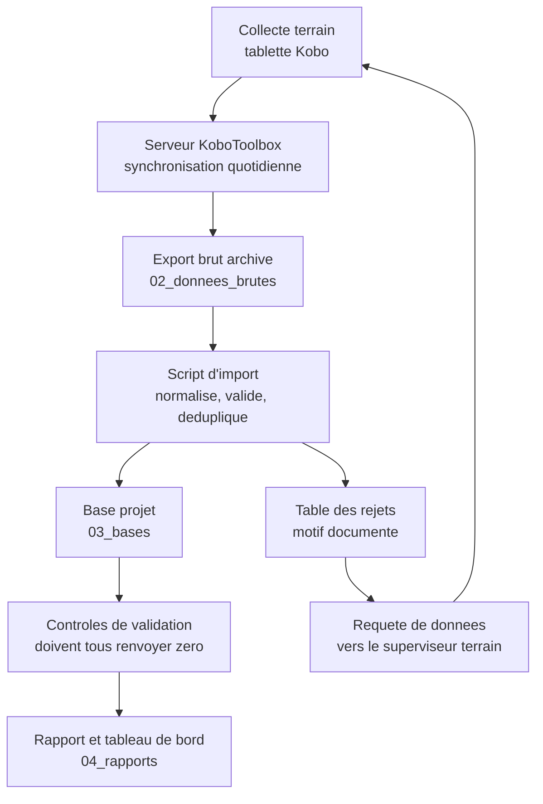

# Gestion de l'information, archivage et support technique

*Piste ACTED — Assistant Base de Données (Réf. ASSISTBDD_2607). Script d'audit livré : `exercices/verifier_nomenclature.py`. La sortie reproduite dans ce module a été réellement produite sur un dossier de démonstration.*

---

## Pourquoi ce module existe

Une partie importante du TDR ne parle ni de SQL ni de statistiques. Elle parle d'organisation : « assurer le classement approprié des copies papier et électroniques des questionnaires d'enquête, des listes de bénéficiaires ou d'autres outils ou documents de collecte de données », « assurer la liaison avec le personnel de terrain en ce qui concerne les données manquantes, les erreurs éventuelles, les divergences », « fournir un support technique aux équipes d'ACTED pour les bases de données et résoudre les problèmes de matériel et de logiciel », « fournir des mises à jour régulières et opportunes sur les progrès et les défis aux superviseurs », « participer à des ateliers et des réunions ».

Ce sont les tâches les moins glorieuses du poste et celles qui occupent le plus d'heures. Un candidat qui les traite avec autant de sérieux que les requêtes SQL se distingue, parce que c'est là que se joue la différence entre un bureau où l'information circule et un bureau où chacun refait le travail des autres.

---

## 1. Le problème : « tu peux m'envoyer le dernier fichier ? »

Voici ce qu'on trouve dans le dossier partagé d'un projet au huitième mois.

```
liste beneficiaires gonaives FINAL.xlsx
liste beneficiaires gonaives FINAL v2.xlsx
Copie de liste_bénéficiaires_v2 (1).xlsx
liste_benef_gonaives_MJ_corrigé.xlsx
rapport_final_vrai_ok.docx
```

Cinq fichiers, aucune date, aucune indication d'auteur, et surtout aucun moyen de savoir lequel fait foi. Le mot « final » apparaît dans trois noms différents, ce qui est la preuve la plus sûre qu'aucun ne l'est.

Les conséquences se paient en heures et en erreurs. Le chargé de programme travaille sur la version d'avant-hier sans le savoir et transmet au bailleur un chiffre périmé. L'assistant base de données passe vingt minutes par jour à répondre à des messages demandant où se trouve le dernier fichier. Et le jour du départ de la personne qui savait, l'information part avec elle.

Ce n'est pas un problème de discipline individuelle. C'est un problème de **règle absente**. Une règle de nommage tient en une ligne, s'apprend en cinq minutes, et supprime le problème définitivement — à condition que quelqu'un la vérifie.

---

## 2. La nomenclature et l'arborescence

### 2.1 La règle

```
AAAAMMJJ_PROJET_TYPE_DESCRIPTION_vN.ext
```

Par exemple, `20260315_PRJ-SECAL-24_PDM_rapport-mensuel_v2.xlsx`.

Chaque élément a une raison d'être. La **date en tête au format année-mois-jour** fait que le tri alphabétique du système de fichiers est aussi le tri chronologique, ce qui n'est vrai avec aucun autre format. Le **code projet** permet de retrouver tous les documents d'un financement au moment de l'audit, qui arrive toujours. Le **type** en majuscules donne une liste fermée, ce qui rend la recherche fiable : `CIBLAGE`, `PDM`, `DISTRIB`, `RAPPORT`, `BASE`, `FORM`, `SAUV`, `PLAINTE`. La **description en minuscules avec des traits d'union** évite les espaces, qui cassent les scripts, et les accents, qui cassent les échanges entre Windows, macOS et Linux. Le **numéro de version** est un entier qui s'incrémente, jamais un adjectif.

Deux interdits absolus. Jamais de mot de version dans la description : « final », « vrai », « définitif », « copie de », « bis ». Jamais d'espace ni de caractère accentué dans un nom de fichier.

### 2.2 L'arborescence

```
PRJ-SECAL-24/
├── 01_formulaires/          formulaires XLSForm et leurs versions deployees
├── 02_donnees_brutes/       exports Kobo tels quels, jamais modifies
├── 03_bases/                base projet et scripts d'import
├── 04_rapports/             livrables analytiques et rapports bailleur
├── 05_donnees_restreintes/  listes nominatives, plaintes sensibles — acces limite
└── 06_archives_papier/      inventaire et scans des registres physiques
```

Le dossier `02_donnees_brutes` obéit à une règle qui n'admet aucune exception : **on n'y modifie jamais rien**. L'export Kobo y est déposé tel quel, daté, et tout le nettoyage se fait par script vers `03_bases`. C'est ce qui rend la chaîne rejouable et l'analyse défendable. Le jour où un bailleur demande à voir la donnée d'origine, elle existe.

Le dossier `05_donnees_restreintes` est le seul à contenir des listes nominatives, et ses droits d'accès sont limités à deux ou trois personnes désignées. Cette séparation physique fait plus pour la protection des données que n'importe quelle politique écrite, parce qu'elle rend l'erreur difficile plutôt qu'interdite.

### 2.3 Une règle qui n'est pas vérifiée n'existe pas

C'est l'objet du script `exercices/verifier_nomenclature.py`, qui parcourt le dossier et signale ce qui dévie. Voici sa sortie réelle sur un dossier de démonstration de dix fichiers.

```
Fichiers examines : 10

   1  caractere accentue ou special
        02_donnees_brutes/Copie de liste_bénéficiaires_v2 (1).xlsx

   2  espace dans le nom
        02_donnees_brutes/Copie de liste_bénéficiaires_v2 (1).xlsx
        02_donnees_brutes/liste beneficiaires gonaives FINAL.xlsx

   3  fichier potentiellement nominatif hors dossier restreint
        01_formulaires/20260112_PRJ-SECAL-24_FORM_ciblage-menage_v3.xlsx
        02_donnees_brutes/Copie de liste_bénéficiaires_v2 (1).xlsx
        02_donnees_brutes/liste beneficiaires gonaives FINAL.xlsx

   3  nom non conforme au gabarit
   1  type de document inconnu
   3  versionnage improvise (final, copie, vrai...)
   2  versions concurrentes du meme document
        04_rapports/20260320_PRJ-SECAL-24_RAPPORT_pdm-mensuel_v1.docx
        04_rapports/20260320_PRJ-SECAL-24_RAPPORT_pdm-mensuel_v2.docx
```

Deux résultats méritent un commentaire, et le second est le plus instructif.

Les **versions concurrentes** sont détectées par regroupement : deux fichiers partageant date, projet, type et description mais portant des numéros de version différents signalent qu'on a laissé traîner l'ancienne. La règle qui accompagne le contrôle est de déplacer les versions dépassées dans un sous-dossier `_archive` plutôt que de les supprimer, parce qu'un rapport transmis au bailleur doit rester reproductible.

Le contrôle « fichier potentiellement nominatif hors dossier restreint » remonte trois fichiers, dont un **faux positif** : le formulaire de ciblage `FORM_ciblage-menage_v3.xlsx` contient le mot « menage » et se fait signaler alors qu'il ne contient aucune donnée. C'est délibéré, et c'est la même leçon que celle du contrôle de cohérence dans le module Excel : sur un contrôle de sécurité, **on préfère une alerte de trop à une liste de bénéficiaires oubliée dans un dossier partagé**. Un faux positif coûte trois secondes de lecture ; un faux négatif coûte une fuite. Savoir arbitrer consciemment entre les deux, et le dire, est un signe de maturité.

---

## 3. Le flux de données, écrit une fois pour toutes

Le TDR demande de « formuler des exigences techniques et des procédures opérationnelles liées à la gestion de l'information ». Concrètement, la procédure la plus utile est celle qui décrit le flux complet, du terrain au rapport, avec les responsables et les délais.



La boucle qui remonte de la table des rejets vers la collecte est la partie que les procédures oublient presque toujours, et c'est la plus importante. Sans elle, les données rejetées restent rejetées et la qualité ne s'améliore jamais. Avec elle, l'enquêteur apprend que sa saisie a posé problème, et il ne refait pas l'erreur.

Chaque étape a un responsable nommé et un délai. La synchronisation Kobo est quotidienne et relève du superviseur de collecte. L'import et les contrôles sont hebdomadaires et relèvent de l'assistant base de données. La requête de données part sous 48 heures après l'import. Le rapport est mensuel et relève du responsable MEAL, avec l'assistant base de données en appui.

### La requête de données

Voici l'outil concret de la liaison avec les équipes terrain, celui que le TDR appelle « assurer la liaison avec le personnel de terrain en ce qui concerne les données manquantes, les erreurs éventuelles, les divergences ». C'est un tableau simple, envoyé au superviseur, qui liste ce qu'il faut vérifier.

| Réf | Date envoi | Enquêteur | Code ménage | Champ | Valeur reçue | Problème | Réponse | Statut |
|---|---|---|---|---|---|---|---|---|
| RQ-045 | 2026-03-16 | ENQ03 | MEN-00412 | satisfaction | `ND` | Valeur hors échelle 1-5 | 4 | Corrigé |
| RQ-046 | 2026-03-16 | ENQ05 | MEN-00877 | duree_entretien | 2 min | Entretien trop court | Formulaire rempli après coup | À refaire |
| RQ-047 | 2026-03-16 | ENQ01 | MEN-01004 | montant_recu | `9 000` | Espace dans un champ numérique | 9000 | Corrigé |

Trois principes gouvernent cet outil. Chaque ligne porte une **référence unique**, ce qui permet d'en parler au téléphone sans ambiguïté. Chaque ligne attend une **réponse écrite**, pas un accord verbal. Et le tableau se **clôt** : les lignes non résolues au bout de deux semaines remontent au responsable MEAL, parce qu'une requête sans échéance ne se traite jamais.

Le ton compte autant que le contenu. Une requête de données n'est pas un reproche : elle dit ce qui est arrivé au bureau, pas ce que l'enquêteur a mal fait. La formule « la valeur reçue pour ce champ est ND, peux-tu vérifier ce qui a été noté ? » obtient une réponse ; la formule « tu as encore mal saisi » obtient une justification.

---

## 4. L'archive papier

Le numérique n'a pas supprimé le papier, et en distribution il ne le supprimera pas : la feuille d'émargement signée ou marquée d'une empreinte est la pièce justificative que l'auditeur du bailleur demandera. Le TDR le mentionne explicitement.

L'organisation tient en quelques principes qu'on peut énoncer rapidement.

Chaque lot physique reçoit une **référence unique** qui suit la même logique que la nomenclature numérique, inscrite sur la chemise et reportée dans un inventaire. L'inventaire est un simple classeur, mais il existe : sans lui, retrouver la feuille d'émargement d'une distribution de mars 2025 prend une demi-journée.

La **chaîne de responsabilité** est tracée. Qui a emporté les fiches sur le terrain, qui les a rapportées, qui les a rangées, à quelle date. Une feuille d'émargement égarée entre le site et le bureau est un problème d'audit, pas un incident mineur.

Les documents sont **numérisés** et le scan porte le même nom que le lot physique, ce qui relie l'archive numérique et l'archive papier par une simple recherche. Le scan ne remplace pas l'original quand le bailleur exige la signature manuscrite, mais il le protège : un incendie ou une inondation détruit le papier, pas le fichier sauvegardé hors site.

Le **stockage physique** est fermé à clé, surélevé pour résister à une inondation, et la liste des personnes ayant la clé est courte et écrite. Les listes nominatives papier ne sortent pas du bureau.

Enfin la **conservation** suit la même politique que le numérique, décrite dans [Sécurité et protection des données](04_securite_protection_donnees.md) : une durée par catégorie, et une destruction réelle — un broyeur, pas une poubelle — quand la durée est écoulée.

---

## 5. Le support technique

Le TDR demande de « fournir un support technique aux équipes d'ACTED pour les bases de données et résoudre les problèmes de matériel et de logiciel ». En pratique, une part significative des journées y passe, et savoir en parler avec méthode est un atout, parce que beaucoup de candidats traitent ce point comme une corvée.

### 5.1 Une méthode de diagnostic

Le réflexe naturel devant un problème est de proposer une solution. Le bon réflexe est de **reproduire d'abord**. La séquence tient en cinq questions posées dans l'ordre : que voulais-tu faire, qu'as-tu fait exactement, qu'attendais-tu, qu'est-il arrivé, et est-ce que cela arrive à chaque fois. La cinquième question est la plus rentable, parce qu'un problème intermittent et un problème systématique n'ont jamais la même cause.

Ensuite on isole. Le problème vient-il de la machine, du compte, du fichier ou du réseau ? On teste le même fichier sur une autre machine, le même compte sur une autre machine, un autre fichier sur la même machine. Trois tests et la cause est presque toujours cernée.

### 5.2 Le catalogue des pannes réelles

Voici les incidents qui reviennent, et la réponse à chacun. Les connaître fait gagner un temps considérable et permet, en entretien, de répondre avec du concret.

**La tablette ne synchronise pas avec Kobo.** Neuf fois sur dix, c'est le réseau, et la bonne réponse est de rappeler que les données sont en sécurité localement et qu'il ne faut surtout pas désinstaller l'application ni « nettoyer » l'appareil. Sinon, vérifier que le compte est le bon, que le formulaire déployé n'a pas changé de version pendant la collecte — cause classique et sournoise — et que l'espace de stockage n'est pas saturé, ce qui arrive vite quand le formulaire collecte des photos.

**Le formulaire ne se déploie pas.** L'erreur vient presque toujours du classeur : un nom de question dupliqué, un nom commençant par un chiffre, une référence `${...}` vers une question qui n'existe pas ou qui est définie plus bas, ou une liste de choix mentionnée dans `survey` mais absente de `choices`. Compiler localement avec pyxform avant de téléverser évite le va-et-vient.

**Le fichier Excel est corrompu ou ne s'ouvre plus.** Tenter l'ouverture et la réparation d'Excel, puis la récupération de version dans OneDrive ou SharePoint si l'organisation les utilise, puis l'ouverture avec LibreOffice, qui est souvent plus tolérant. La vraie leçon est en amont : un fichier Excel n'est pas un système de stockage, et c'est l'argument pour migrer les données vraiment importantes en base.

**Les caractères s'affichent en charabia après un export.** C'est un problème d'encodage : le fichier est en UTF-8 et Excel l'ouvre en Latin-1, ou l'inverse. La solution est d'importer le CSV par l'assistant d'importation en choisissant explicitement UTF-8, plutôt que de double-cliquer sur le fichier.

**Le classeur met une minute à s'ouvrir.** Formules volatiles recalculées en permanence, mise en forme conditionnelle appliquée à des colonnes entières, plages nommées pointant vers un million de lignes. Le diagnostic est rapide et la conclusion souvent la même que ci-dessus.

**« La base est lente. »** Là, on ne devine pas : on lit le plan d'exécution, comme le montre le module [Administration](03_administration_bdd.md).

### 5.3 Le registre des incidents

Chaque demande de support entre dans un tableau : date, demandeur, description, cause identifiée, résolution, temps passé. L'intérêt n'est pas bureaucratique. Au bout de trois mois, le registre montre que quarante pour cent des incidents relèvent du même problème — par exemple la synchronisation Kobo — et cela justifie une session de formation d'une heure qui supprimera le problème à la source. **Un registre transforme des interruptions subies en priorités d'amélioration**, et c'est exactement le genre d'initiative qu'un responsable MEAL apprécie.

---

## 6. Rendre compte

Le TDR demande de « fournir des mises à jour régulières et opportunes sur les progrès et les défis aux superviseurs ». Le format qui fonctionne tient en cinq lignes, envoyé chaque vendredi, et se lit en trente secondes.

> **Semaine du 16 au 20 mars — Assistant base de données**
>
> *Fait* : import PDM semaine 11 terminé, 515 enquêtes chargées sur 589 reçues ; sauvegardes quotidiennes vérifiées ; formulaire endline v2 déployé.
> *Chiffres* : taux de rejet 9,5 %, en baisse par rapport aux 14 % de la semaine précédente ; 39 écarts de montant détectés en PDM, liste transmise au chargé de distribution.
> *Bloqué* : 20 soumissions avec durée d'entretien inférieure à 8 minutes chez ENQ05, requête envoyée au superviseur, sans réponse depuis 6 jours.
> *Semaine prochaine* : nettoyage des doublons d'identité, formation d'une heure sur la synchronisation Kobo.
> *Besoin* : un arbitrage du responsable MEAL sur la règle de conservation en cas de double enregistrement.

Quatre qualités font tenir ce format. Les **chiffres** remplacent les adjectifs : « taux de rejet 9,5 % » vaut mieux que « la qualité s'améliore ». Le **bloqué** est nommé, parce qu'un superviseur ne peut débloquer que ce qu'il connaît. Le **besoin** est explicite et demande une décision, pas de l'attention. Et le tout tient en un écran, ce qui fait qu'il sera lu.

Quant aux ateliers et réunions mentionnés dans le TDR, la contribution attendue de l'assistant base de données y est spécifique : il apporte les chiffres, il dit ce qu'ils permettent de conclure et surtout ce qu'ils ne permettent pas de conclure. C'est souvent la personne qui connaît le mieux les limites de la donnée, et le dire à voix haute évite des décisions bâties sur un chiffre fragile.

---

## 7. Six exercices

Applique la nomenclature à un dossier réel de ton ordinateur, exécute `verifier_nomenclature.py` dessus, et corrige jusqu'à ce que le script ne signale plus rien.

Ajoute au script un contrôle qui détecte les fichiers de plus de six mois n'ayant jamais été ouverts, et explique en quoi c'est utile pour la politique de conservation.

Rédige la procédure de flux de données du projet sur une page, avec les responsables et les délais, en t'inspirant du diagramme de la section 3.

Construis le modèle de requête de données et remplis-le avec les rejets réels produits par `importer_kobo.py`, puis rédige le message d'accompagnement au superviseur.

Écris le registre d'inventaire de l'archive papier pour une distribution : lot, contenu, nombre de fiches, responsable, date d'entrée, emplacement, date de numérisation.

Enfin, rédige ta mise à jour hebdomadaire type, celle que tu enverras chaque vendredi. C'est un livrable que tu peux montrer en entretien, et il en dit long sur ta façon de travailler.

---

## Angles d'entretien

**« Comment organiseriez-vous les fichiers d'un projet ? »**

Je pars du problème que je rencontre partout : au bout de quelques mois, le dossier partagé contient cinq versions du même fichier, dont trois s'appellent « final », et personne ne sait laquelle fait foi. Ma réponse tient en trois éléments. D'abord une nomenclature unique, date en tête au format année-mois-jour pour que le tri alphabétique soit chronologique, puis le code projet pour retrouver tous les documents d'un financement le jour de l'audit, puis un type pris dans une liste fermée, une description sans espace ni accent, et un numéro de version qui est un entier et jamais un adjectif. Ensuite une arborescence à six dossiers, avec deux règles fortes : le dossier des données brutes ne se modifie jamais, l'export Kobo y reste tel quel et tout le nettoyage se fait par script vers la base, ce qui rend la chaîne rejouable et l'analyse défendable ; et les listes nominatives vivent dans un dossier séparé à accès restreint, parce que cette séparation physique protège mieux que n'importe quelle politique écrite. Enfin, et c'est le point qui fait la différence, un script d'audit qui parcourt le dossier et signale les écarts, parce qu'une convention que personne ne vérifie n'est pas une convention. Il détecte les noms non conformes, les versions concurrentes du même document, et les fichiers potentiellement nominatifs posés hors du dossier restreint. Sur ce dernier contrôle j'accepte volontairement des faux positifs : un fichier de formulaire signalé à tort coûte trois secondes de lecture, une liste de bénéficiaires oubliée dans un dossier partagé coûte une fuite.

**« Un enquêteur vous appelle : sa tablette ne synchronise plus. Comment procédez-vous ? »**

Je ne propose pas de solution avant d'avoir compris, parce que la mauvaise manipulation à ce moment-là peut faire perdre des données. Je pose cinq questions dans l'ordre : ce qu'il voulait faire, ce qu'il a fait exactement, ce qu'il attendait, ce qui s'est passé, et si cela arrive à chaque fois ou seulement parfois. La dernière est la plus utile, parce qu'un problème intermittent et un problème systématique n'ont pas la même cause. Ma première phrase rassurante est importante aussi : les formulaires remplis sont enregistrés localement sur la tablette, il ne les a pas perdus, et surtout il ne doit ni désinstaller l'application ni nettoyer l'appareil. Ensuite j'isole : je fais tester une autre connexion, je vérifie que le compte utilisé est le bon, je regarde si le formulaire déployé sur le serveur a changé de version pendant la collecte, ce qui est une cause classique et sournoise, et je contrôle l'espace de stockage qui sature vite quand le formulaire collecte des photos. Neuf fois sur dix c'est le réseau, et la réponse est d'attendre une meilleure couverture ou de rentrer au bureau. Ce que je fais après compte autant : j'inscris l'incident dans un registre avec la cause et la résolution. Au bout de trois mois, ce registre montre quels problèmes reviennent, et si la synchronisation représente quarante pour cent des appels, je programme une session d'une heure qui supprime le problème à la source au lieu de le traiter cas par cas.

**« Comment assurez-vous la liaison avec les équipes terrain sur les erreurs de données ? »**

J'utilise un outil simple qu'on appelle la requête de données : un tableau où chaque ligne porte une référence unique, la date d'envoi, l'enquêteur, l'enregistrement concerné, le champ, la valeur reçue, le problème constaté, l'espace pour la réponse et le statut. Il est alimenté automatiquement par la table des rejets de mon script d'import, donc je ne rédige pas des messages au fil de l'eau : j'envoie une liste consolidée après chaque import, sous quarante-huit heures, parce qu'une correction demandée trois semaines après la collecte n'aboutit jamais. Trois principes gouvernent son usage. La référence unique permet d'en parler au téléphone sans ambiguïté. La réponse doit être écrite, parce qu'un accord verbal ne se retrouve pas six mois plus tard devant un auditeur. Et le tableau se clôt : ce qui n'est pas résolu au bout de deux semaines remonte au responsable MEAL. Le ton compte autant que la méthode : une requête de données décrit ce qui est arrivé au bureau, pas ce que l'enquêteur a mal fait, et cette formulation-là obtient une correction là où le reproche obtient une justification. Enfin, je considère cette boucle comme faisant partie du système de qualité, pas comme du service après-vente : c'est elle qui fait baisser le taux de rejet d'une semaine à l'autre, et je suis ce taux comme un indicateur, que je fais figurer dans ma mise à jour hebdomadaire au superviseur.

---

*Suite du parcours : [Sécurité et protection des données](04_securite_protection_donnees.md) · [Kobo, ciblage et PDM](05_kobo_ciblage_et_pdm.md) · [Analyse et visualisation](07_analyse_visualisation_reporting.md) · [Fiche de révision](00_fiche_revision_examen.md)*
