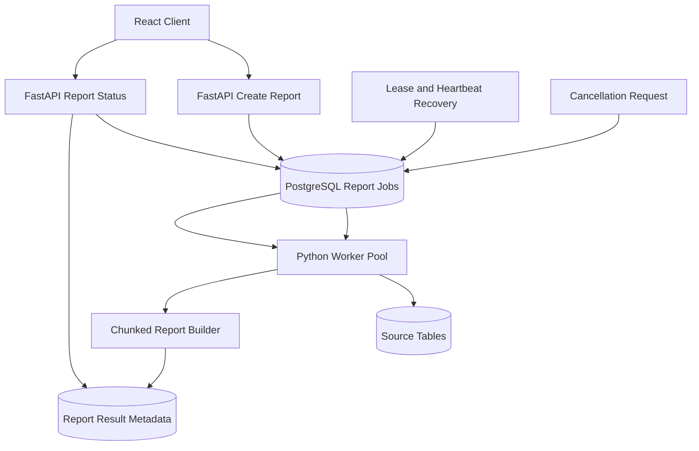
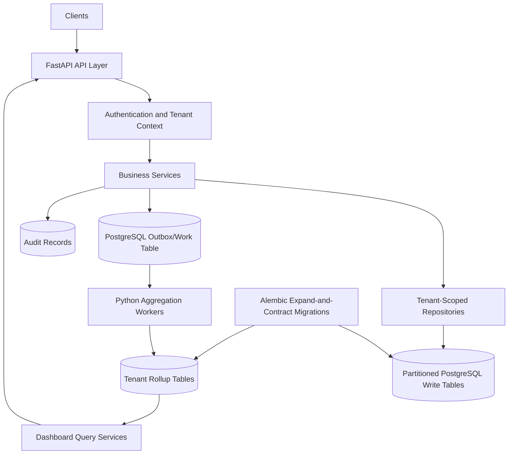

# BairesDev Backend Mock Interviews by Difficulty

## Scenario 1: Explaining a Backend Service to a Recruiter (Difficulty: Recruiter Screen)

### 1. Case Description (Why & What)
**Situation**: You developed a Python backend for a reporting application. The recruiter wants to assess whether you can explain your work clearly, describe your responsibilities, and connect technical decisions to business outcomes.
**Task**: Explain what the backend does, why a database is needed, and how you collaborate with frontend developers and other team members.

### 2. Mock Interview Questions & Expected Rubrics (How)

#### Question A: "What does the backend of a web application do?"
* **Optimal Answer**:
  - Defines the backend as the part that processes requests, applies business rules, accesses data, and returns results.
  - Gives a concrete example such as retrieving dashboard metrics or saving a form.
  - Explains that FastAPI exposes controlled API operations.
  - Explains that PostgreSQL stores reliable shared data.
  - Mentions security and validation in plain language.
  - Avoids unexplained jargon or defines it briefly.
  - Describes the user's benefit, such as accurate information or faster processing.

#### Question B: "How do you work with frontend developers when building a feature?"
* **Optimal Answer**:
  - Agrees on the API request and response format.
  - Clarifies required fields, validation rules, and error cases.
  - Shares examples or API documentation.
  - Coordinates changes before breaking an existing contract.
  - Tests the complete flow with realistic data.
  - Communicates blockers and trade-offs early.
  - Uses a concise real example and distinguishes individual and team responsibilities.

## Scenario 2: Create a Secure Notes API (Difficulty: Junior/Associate Technical)

### 1. Case Description (Why & What)
**Situation**: A notes application needs an endpoint to create a note and another endpoint to retrieve a single note. Each note has a title, body, owner ID, created timestamp, and optional archived timestamp. A user must never read another user's note.
**Task**: Describe or implement the FastAPI routes, Pydantic models, and asynchronous SQLAlchemy queries with correct authorization behavior.

### 2. Mock Interview Questions & Expected Rubrics (How)

#### Question A: "How would you implement the create-note endpoint?"
* **Optimal Answer**:
  - Uses a request model that accepts only client-editable fields.
  - Applies Pydantic limits to title and body.
  - Gets the authenticated user from a dependency rather than accepting `owner_id` from the request body.
  - Creates the ORM object with the authenticated user's ID.
  - Uses an `AsyncSession`.
  - Adds, commits, and refreshes the note.
  - Returns `201 Created` with a typed response model.
  - Does not expose internal fields unnecessarily.
  - Handles validation through FastAPI/Pydantic.
  - A strong implementation may resemble:

```python
from typing import Annotated

from fastapi import APIRouter, Depends, status
from pydantic import BaseModel, ConfigDict, Field
from sqlalchemy.ext.asyncio import AsyncSession

router = APIRouter()


class NoteCreate(BaseModel):
    title: str = Field(min_length=1, max_length=150)
    body: str = Field(min_length=1, max_length=10_000)


class NoteRead(BaseModel):
    model_config = ConfigDict(from_attributes=True)

    id: int
    title: str
    body: str
    created_at: datetime
    archived_at: datetime | None


@router.post(
    "/notes",
    response_model=NoteRead,
    status_code=status.HTTP_201_CREATED,
)
async def create_note(
    payload: NoteCreate,
    user: Annotated[User, Depends(get_current_user)],
    session: Annotated[AsyncSession, Depends(get_session)],
) -> Note:
    note = Note(
        owner_id=user.id,
        title=payload.title,
        body=payload.body,
    )
    session.add(note)
    await session.commit()
    await session.refresh(note)
    return note
```

#### Question B: "How would you retrieve a note without exposing another user's data?"
* **Optimal Answer**:
  - Queries by both note ID and authenticated owner ID.
  - Does not fetch by note ID first and authorize later when a tenant-scoped predicate can be included directly.
  - Returns `404 Not Found` for both missing and unauthorized notes when the product wants to avoid revealing existence.
  - Uses SQLAlchemy 2.0 `select()` syntax.
  - Excludes archived notes unless the endpoint explicitly includes them.
  - Avoids synchronous database access in an async route.
  - Includes tests for:
    - Owner can retrieve.
    - Different user receives `404`.
    - Missing note receives `404`.
    - Archived-note behavior.
  - A suitable query is:

```python
statement = select(Note).where(
    Note.id == note_id,
    Note.owner_id == user.id,
    Note.archived_at.is_(None),
)

result = await session.execute(statement)
note = result.scalar_one_or_none()
```

## Scenario 3: Prevent Duplicate Payments Under Concurrent Requests (Difficulty: Mid-Level Technical)

### 1. Case Description (Why & What)
**Situation**: A payment endpoint occasionally creates two payment rows when a client retries after a timeout or when users double-click the submit button. The application runs multiple FastAPI instances, so an in-memory lock does not protect all requests.
**Task**: Design a database-backed idempotency and transaction strategy that prevents duplicates and returns a consistent response.

### 2. Mock Interview Questions & Expected Rubrics (How)

#### Question A: "Why is checking for an existing payment before inserting insufficient?"
* **Optimal Answer**:
  - Identifies a race condition:
    - Request A checks and finds no row.
    - Request B checks and finds no row.
    - Both insert.
  - Explains that application-level checks alone are not atomic across processes.
  - Requires a database uniqueness constraint, for example on `(account_id, idempotency_key)`.
  - Accepts an idempotency key from a request header or documented request field.
  - Stores enough information to determine whether a repeated request is equivalent.
  - Rejects reuse of the same key with a different payload.
  - Handles `IntegrityError` safely:
    - Rolls back the failed transaction.
    - Reads and returns the existing operation.
  - Does not rely on a Python global lock.
  - Mentions that the external side effect, if any, must also support idempotency or an outbox-style workflow.

#### Question B: "How would you define the transaction and API behavior?"
* **Optimal Answer**:
  - Starts a short transaction around the idempotency record and payment state change.
  - Uses a clear state machine such as `pending`, `completed`, and `failed`.
  - Returns the previously completed response for an exact retry.
  - Defines behavior for a retry while the first request is still pending:
    - Return `202 Accepted`, or
    - Wait for a bounded period, depending on the API contract.
  - Does not hold a database transaction open during a slow external network call.
  - Uses a durable outbox or work table when a later external action must occur.
  - Ensures the worker is idempotent.
  - Records request fingerprint, status, resource ID, and timestamps.
  - Adds indexes for idempotency lookup and operational cleanup.
  - Tests:
    - Simultaneous identical requests.
    - Same key with different payload.
    - Retry after timeout.
    - Worker retry after partial failure.
    - Transaction rollback.

## Scenario 4: Build a Durable Report-Generation Pipeline (Difficulty: Senior Technical)

### 1. Case Description (Why & What)
**Situation**: Users request reports that scan up to 30 million rows and may take 2-8 minutes to generate. HTTP requests currently time out, duplicate report jobs are created, and a failed process loses its work. The solution must stay within Python, FastAPI, PostgreSQL, SQLAlchemy, Alembic, and Pydantic.
**Task**: Design the API, durable job model, worker coordination, progress tracking, cancellation behavior, and database strategy.

### 2. Mock Interview Questions & Expected Rubrics (How)

#### Question A: "How would you design the report workflow?"
* **Optimal Answer**:
  - Makes report generation asynchronous from the user's HTTP request.
  - `POST /reports` validates input, creates a durable job row, and returns `202 Accepted`.
  - Provides `GET /reports/{id}` for status and result metadata.
  - Uses a unique request fingerprint or idempotency key to avoid duplicate equivalent jobs.
  - Stores job states such as:
    - Queued.
    - Running.
    - Completed.
    - Failed.
    - Cancel-requested.
    - Cancelled.
  - Uses Python workers that claim jobs in PostgreSQL with `FOR UPDATE SKIP LOCKED`.
  - Keeps claim transactions short.
  - Uses leases or heartbeat timestamps so abandoned jobs can be reclaimed.
  - Writes progress updates at a controlled frequency rather than on every row.
  - Generates results in chunks or streams them to a controlled destination rather than loading the entire report into memory.
  - Ensures every query is scoped to the requesting tenant/user.
  - Uses keyset iteration over large datasets instead of deep offsets.
  - Includes suitable indexes for job claiming and report source queries.
  - A defensible architecture is:



#### Question B: "How would you handle crashes, cancellation, and schema changes?"
* **Optimal Answer**:
  - Recovers jobs whose lease expired after a worker crash.
  - Makes processing resumable by storing checkpoints such as the last processed key.
  - Ensures repeated chunks do not duplicate output.
  - Checks cancellation between chunks rather than attempting unsafe thread termination.
  - Distinguishes user cancellation from system failure.
  - Retains failure reason and retry count.
  - Sends poison jobs to a terminal failed state after a bounded number of retries.
  - Versions the report definition and stores the version on each job.
  - Keeps running jobs compatible during deployments:
    - Old workers can finish old-version jobs.
    - New workers understand new-version jobs.
  - Uses expand-and-contract database migrations.
  - Avoids long migrations that rewrite the full source table during peak traffic.
  - Defines operational metrics:
    - Queue depth.
    - Oldest queued age.
    - Running duration.
    - Failure rate.
    - Retry count.
    - Rows processed per second.

## Scenario 5: Evolve a Multi-Tenant API Under Heavy Read and Write Load (Difficulty: Staff/Architect)

### 1. Case Description (Why & What)
**Situation**: A multi-tenant SaaS platform expects 15,000 tenants, 25,000 writes per second at peak, and several dashboard APIs that combine current and historical metrics. Some tenants are 1,000 times larger than others. Customers require strict isolation, auditable changes, online schema evolution, and predictable latency without introducing Kafka, Kubernetes, or NoSQL.
**Task**: Propose the backend architecture, tenant isolation, data model, partition/index strategy, API boundaries, migration plan, and operational controls. There is no single correct answer; evaluation focuses on assumptions and trade-offs.

### 2. Mock Interview Questions & Expected Rubrics (How)

#### Question A: "How would you design the data and service boundaries?"
* **Optimal Answer**:
  - States missing assumptions:
    - Peak row size.
    - Query windows.
    - Retention.
    - Largest tenant rate.
    - Recovery objectives.
    - Audit requirements.
  - Makes `tenant_id` mandatory on all tenant-owned rows.
  - Enforces isolation in:
    - Authentication and authorization dependencies.
    - Tenant-scoped repository functions.
    - Database constraints and optional Row-Level Security as defense in depth.
  - Prevents accidental unscoped queries through code-review rules, abstractions, and tests.
  - Separates write models from read-optimized rollups where dashboard latency requires it.
  - Uses PostgreSQL-backed durable work/outbox rows for asynchronous aggregation.
  - Makes workers idempotent and horizontally claim work with `SKIP LOCKED`.
  - Evaluates partitioning options:
    - Time range partitions for retention and time-window queries.
    - Tenant hashing for write distribution.
    - Time range plus tenant-hash subpartitioning where justified.
  - Avoids unbounded partition counts.
  - Designs indexes from actual predicates and ordering.
  - Limits write amplification by avoiding unnecessary indexes.
  - Uses explicit audit tables or append-only audit records for important state changes.
  - Defines API boundaries by business capability rather than database table.
  - Uses Pydantic schemas that separate create, update, and read representations.
  - Uses stable pagination contracts and deterministic ordering.
  - A suitable logical architecture is:



#### Question B: "How would you migrate and operate this architecture safely?"
* **Optimal Answer**:
  - Uses expand-and-contract changes:
    1. Add nullable or backward-compatible structures.
    2. Deploy code that writes old and new forms where necessary.
    3. Backfill in bounded batches.
    4. Validate counts, checksums, and tenant-level invariants.
    5. Shift reads gradually.
    6. Enforce new constraints after data is clean.
    7. Remove old structures in a later release.
  - Separates long data backfills from a single Alembic transaction.
  - Uses lock-aware index creation and monitors blocking.
  - Defines rollback for each phase rather than reversing destructive changes.
  - Applies connection-pool limits and backpressure so overload does not collapse PostgreSQL.
  - Uses request timeouts and cancellation where supported.
  - Distinguishes retryable errors from validation or authorization failures.
  - Defines service-level indicators:
    - API p95/p99.
    - Database saturation.
    - Lock wait time.
    - Queue lag.
    - Rollup freshness.
    - Error rate by tenant.
  - Detects noisy tenants and applies fair-use rate limits or workload isolation.
  - Tests with skewed tenant distributions, not uniform synthetic data.
  - Runs cross-tenant security tests and verifies that caches, logs, exports, and background jobs preserve tenant context.
  - Plans retention and deletion operations that do not cause uncontrolled table bloat.
  - Documents trade-offs and identifies thresholds that would trigger a redesign.
