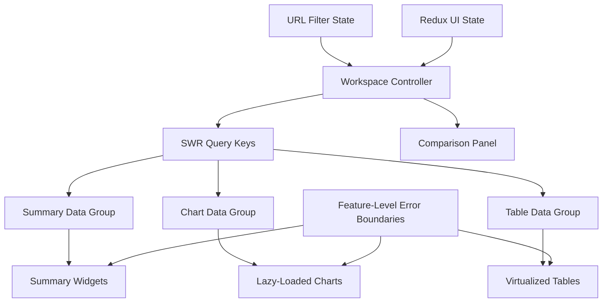
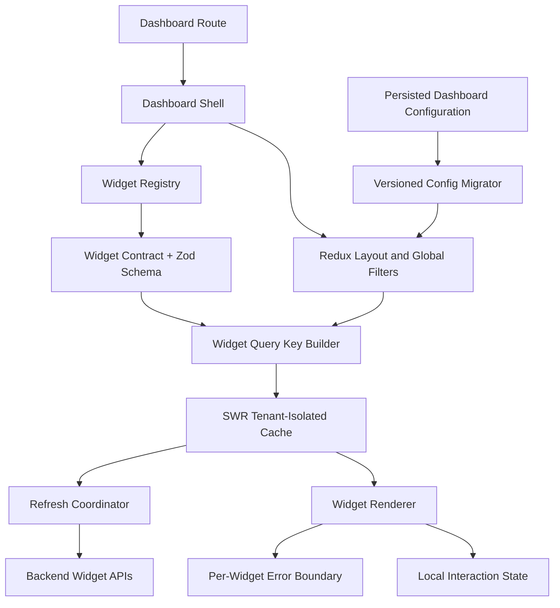

# BairesDev Frontend Mock Interviews by Difficulty

## Scenario 1: Explaining a React Dashboard to a Recruiter (Difficulty: Recruiter Screen)

### 1. Case Description (Why & What)
**Situation**: You worked on a React dashboard used by operations staff to monitor daily activity. The recruiter is not deeply technical and wants to evaluate your English fluency, your understanding of frontend responsibilities, and your ability to explain your contribution clearly.
**Task**: Explain what the frontend does, how users interact with it, and how you collaborate with backend developers and designers.

### 2. Mock Interview Questions & Expected Rubrics (How)

#### Question A: "What is the frontend of an application?"
* **Optimal Answer**:
  - Defines the frontend as the part of an application users see and interact with.
  - Gives concrete examples such as pages, buttons, forms, filters, tables, and charts.
  - Explains that React helps organize the interface into reusable components.
  - Explains that the frontend requests data from the backend through an API.
  - Avoids unexplained jargon or defines terms in simple language.
  - Connects the explanation to a real user need rather than discussing technology only.

#### Question B: "How do you make sure a feature meets the user's needs?"
* **Optimal Answer**:
  - Clarifies the requirement before implementation.
  - Reviews mockups, acceptance criteria, and expected user behavior.
  - Communicates uncertainties early with the product owner, designer, or backend developer.
  - Tests the feature manually and, where applicable, with automated tests.
  - Verifies loading, empty, error, and success states.
  - Describes receiving feedback professionally and adjusting the feature.
  - Uses a concise real example and distinguishes personal work from team work.

## Scenario 2: Build a Validated Profile Form (Difficulty: Junior/Associate Technical)

### 1. Case Description (Why & What)
**Situation**: A user profile page needs a form with full name, email, phone number, and preferred language. The form must prevent invalid submissions, show field-level errors, disable submission while saving, and display the saved server response.
**Task**: Describe or implement the form using React, TypeScript, Formik, Zod, and Axios or SWR mutation.

### 2. Mock Interview Questions & Expected Rubrics (How)

#### Question A: "How would you structure and validate this form?"
* **Optimal Answer**:
  - Defines a TypeScript type for the form values.
  - Uses Zod as the validation source of truth.
  - Connects Zod validation to Formik without duplicating rules in multiple places.
  - Defines practical rules:
    - Full name is required and has a reasonable maximum length.
    - Email must be valid.
    - Phone is optional or follows a documented format.
    - Preferred language must be one of the supported values.
  - Shows validation errors only after a field is touched or after submission.
  - Associates labels and error messages with inputs for accessibility.
  - Avoids uncontrolled-to-controlled warnings by providing complete initial values.
  - A strong schema may resemble:

```ts
import { z } from "zod";

export const profileSchema = z.object({
  fullName: z
    .string()
    .trim()
    .min(2, "Full name is required")
    .max(100, "Full name is too long"),
  email: z.string().trim().email("Enter a valid email"),
  phone: z
    .string()
    .trim()
    .regex(/^\+?[0-9]{8,15}$/, "Enter a valid phone number")
    .or(z.literal("")),
  preferredLanguage: z.enum(["en", "fr", "ht"]),
});

export type ProfileFormValues = z.infer<typeof profileSchema>;
```

#### Question B: "What should happen when the user submits the form?"
* **Optimal Answer**:
  - Prevents duplicate submissions by using Formik's submitting state.
  - Sends only validated fields to the API.
  - Handles success and server-side validation errors separately.
  - Maps field-specific API errors back to the correct fields when possible.
  - Shows a general error message for network or unexpected errors.
  - Updates the displayed profile with the canonical server response.
  - Avoids assuming the submitted client values are identical to the saved server values.
  - Resets or preserves dirty state intentionally.
  - Includes tests for:
    - Invalid email.
    - Missing name.
    - Successful submission.
    - API error.
    - Double-clicking the submit button.

## Scenario 3: Fix a Filterable Table With Stale and Repeated Requests (Difficulty: Mid-Level Technical)

### 1. Case Description (Why & What)
**Situation**: A customer table contains 50,000 records and supports text search, status filters, sorting, and pagination. Typing quickly causes several API requests, earlier responses sometimes overwrite newer results, and navigating back loses the selected filters.
**Task**: Diagnose the behavior and design a reliable data-fetching and URL-state strategy.

### 2. Mock Interview Questions & Expected Rubrics (How)

#### Question A: "Why can older results replace newer results, and how would you prevent it?"
* **Optimal Answer**:
  - Identifies a race condition between requests triggered by rapidly changing filters.
  - Explains that network responses can arrive in a different order from the requests.
  - Uses a debounced search value rather than debouncing every state update.
  - Uses AbortController with Axios or a fetch-compatible request layer to cancel obsolete requests.
  - Alternatively relies on SWR keys and ignores results whose key no longer matches the active query.
  - Builds a stable request key from all server-relevant parameters:
    - Search term.
    - Status.
    - Sort field and direction.
    - Page cursor or page number.
  - Resets pagination when filters or sorting change.
  - Does not mutate shared parameter objects in place.
  - Tests rapid typing and out-of-order mocked responses.

#### Question B: "How would you preserve filters and choose a pagination strategy?"
* **Optimal Answer**:
  - Stores shareable navigation state in the URL query string.
  - Initializes component state from the URL and updates the URL when filters change.
  - Avoids storing the same source of truth independently in Redux, local state, and URL.
  - Uses local state for temporary input where appropriate and commits a debounced value to the URL.
  - Chooses pagination based on backend guarantees:
    - Offset pagination is simple for shallow, stable pages.
    - Cursor/keyset pagination is better for deep navigation and changing datasets.
  - Requires deterministic sorting, such as `(createdAt, id)`.
  - Preserves browser back/forward behavior.
  - Handles invalid query parameters by applying safe defaults.
  - Makes loading, empty, and error states visually distinct.
  - Keeps previously loaded data visible during revalidation when that improves usability.

## Scenario 4: Design a High-Performance Analytics Workspace (Difficulty: Senior Technical)

### 1. Case Description (Why & What)
**Situation**: An analytics workspace contains 18 charts, six filters, two large tables, and a side panel. Initial JavaScript is 1.8 MB compressed, low-end laptops freeze when filters change, and users often compare two date ranges. The target is interactive content within 2.5 seconds on a typical corporate laptop and responsive filter updates under 300 ms after data arrives.
**Task**: Design the frontend architecture, rendering strategy, data-fetching boundaries, and performance measurement plan.

### 2. Mock Interview Questions & Expected Rubrics (How)

#### Question A: "How would you redesign the component and state architecture?"
* **Optimal Answer**:
  - Separates state by ownership:
    - URL for shareable filters and comparison ranges.
    - SWR for server data and request lifecycle.
    - Redux Toolkit for cross-workspace client state such as layout or synchronized selections.
    - Local state for isolated UI behavior.
  - Avoids copying all SWR response data into Redux.
  - Groups widgets by shared filters, refresh timing, and failure boundary.
  - Uses typed selector functions and narrow Redux subscriptions.
  - Keeps props stable where memoization is useful.
  - Uses React.memo selectively after measuring, not everywhere by default.
  - Moves expensive data transformations out of render:
    - Prefer backend aggregation when practical.
    - Use memoized selectors for client-only derivations.
    - Consider a Web Worker only as a beyond-scope option if a measured CPU-heavy transformation must remain client-side.
  - Virtualizes large tables and long option lists.
  - Lazy-loads below-the-fold or rarely used panels.
  - Splits code by route or feature using dynamic imports.
  - Avoids rendering hidden charts when a tab or panel is inactive.
  - Defines component-level error boundaries or equivalent failure isolation.
  - A defensible structure is:



#### Question B: "How would you verify that the redesign actually improves performance?"
* **Optimal Answer**:
  - Establishes a baseline before optimization.
  - Measures:
    - Bundle size by route and chunk.
    - Largest Contentful Paint.
    - Interaction to Next Paint.
    - Time to usable dashboard.
    - React commit duration.
    - Number of renders per filter change.
    - Request count and payload size.
  - Uses React DevTools Profiler to identify expensive components and repeated commits.
  - Uses browser performance tools to separate scripting, rendering, and network delays.
  - Adds realistic data volumes and low-end CPU throttling to performance tests.
  - Defines performance budgets and fails CI or raises alerts when they regress.
  - Verifies that memoization produces a measurable benefit and does not add unnecessary complexity.
  - Tests accessibility and correctness after virtualization and lazy loading.
  - Compares cold load, warm cache, filter update, and route revisit scenarios.

## Scenario 5: Architecture for Dozens of Independently Updating Widgets (Difficulty: Staff/Architect)

### 1. Case Description (Why & What)
**Situation**: A configurable dashboard may contain 40 widgets from different product domains. Some refresh every 5 seconds, others every 5 minutes, users can drag and resize widgets, filters can be global or widget-specific, and switching tenants must never display cached data from the previous tenant. Product teams need to add widgets independently without destabilizing the entire application.
**Task**: Define the frontend platform architecture, state boundaries, extension model, cache isolation, error handling, and migration strategy. There is no single correct answer; evaluation focuses on reasoning and trade-offs.

### 2. Mock Interview Questions & Expected Rubrics (How)

#### Question A: "How would you design the widget platform and its contracts?"
* **Optimal Answer**:
  - Defines an explicit widget contract containing:
    - Unique widget type.
    - Typed configuration schema.
    - Supported filters.
    - Data-query builder.
    - Refresh policy.
    - Rendering component.
    - Empty, loading, and error behavior.
  - Uses Zod to validate persisted widget configuration at runtime.
  - Keeps a registry of approved widget definitions rather than arbitrary dynamic code execution.
  - Separates:
    - Dashboard layout and widget instances.
    - Widget configuration.
    - Remote widget data.
    - Global filters.
    - Local transient interaction state.
  - Uses Redux Toolkit for layout, global filters, selected widget, and persisted configuration editing.
  - Uses SWR for widget server data with tenant-aware keys.
  - Includes tenant ID, permissions version, widget type, configuration, and applicable filters in cache keys.
  - Clears or isolates caches during tenant changes and ignores late responses from the previous tenant.
  - Coordinates refresh intervals by freshness class to prevent 40 independent timers from producing request bursts.
  - Pauses polling for hidden tabs, offscreen widgets, or inactive dashboards when product requirements allow.
  - Supports batched endpoints only for widgets that share tenant, filters, freshness, and authorization boundaries.
  - Uses per-widget error boundaries so one failed widget does not crash the dashboard.
  - Version-controls persisted widget configuration and includes migration functions.
  - Provides feature flags or staged registration for new widget types.
  - A possible platform architecture is:



#### Question B: "What trade-offs and failure modes would you evaluate before standardizing this architecture?"
* **Optimal Answer**:
  - Compares independent widget requests with batched requests:
    - Independent requests improve isolation and ownership.
    - Batching reduces overhead but increases coupling and over-fetching.
  - Discusses polling synchronization and server load.
  - Prevents cache-key omissions that could leak data between tenants or filter combinations.
  - Handles permission changes by invalidating affected keys and removing inaccessible widgets.
  - Defines behavior for partial failures, stale data, offline transitions, and retry storms.
  - Applies exponential retry behavior or disables retries for non-retryable errors.
  - Prevents a global filter update from rerendering every widget unnecessarily through narrow subscriptions and derived selectors.
  - Sets limits on widget count, payload size, and refresh frequency based on measured budgets.
  - Avoids a plugin architecture that permits incompatible dependencies or unrestricted runtime imports.
  - Plans migration from an existing monolithic dashboard:
    1. Introduce the widget contract around existing widgets.
    2. Move data fetching to tenant-safe SWR keys.
    3. Separate layout/configuration from remote data.
    4. Add refresh coordination.
    5. Migrate widgets incrementally behind feature flags.
  - Defines success measures:
    - Tenant-switch correctness.
    - Render count per update.
    - Request rate per dashboard.
    - Widget failure isolation.
    - Time to add a new widget.
    - Bundle growth per widget family.
