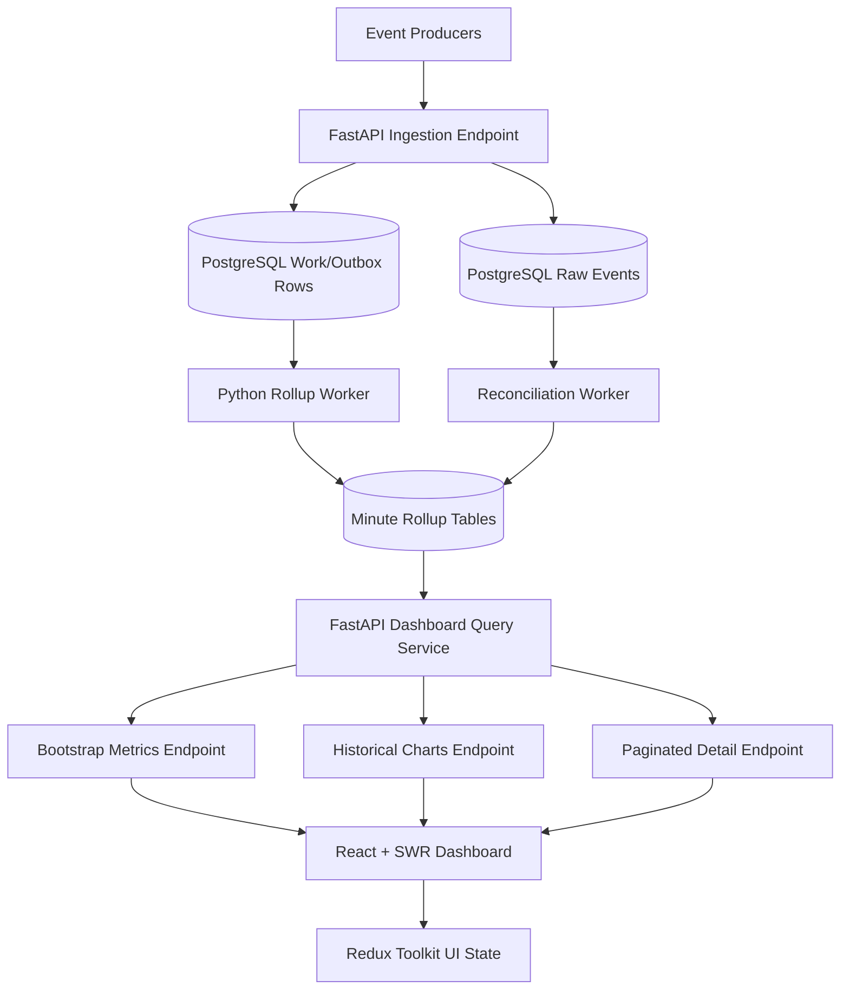
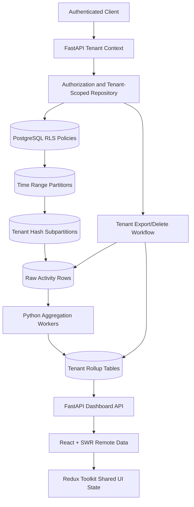

# BairesDev Fullstack Python Mock Interviews by Difficulty

## Scenario 1: Explaining a Dashboard Product Clearly (Difficulty: Recruiter Screen)

### 1. Case Description (Why & What)
**Situation**: You worked on a web dashboard that replaced a spreadsheet-based reporting process. The recruiter is not expected to evaluate code, but wants to confirm that you can explain technical work in clear English, connect your experience to business value, and describe how you collaborate with others.
**Task**: Explain the solution, the technologies involved, and your contribution without relying on unexplained technical jargon.

### 2. Mock Interview Questions & Expected Rubrics (How)

#### Question A: "What is an API, and how did your dashboard use one?"
* **Optimal Answer**:
  - Defines an API in plain English as a controlled way for two software components to exchange information.
  - Gives a concrete example: the React interface requests dashboard data from a FastAPI backend, and the backend returns structured data.
  - Explains the separation of responsibilities:
    - React displays information and handles user interaction.
    - FastAPI applies business rules and retrieves data.
    - PostgreSQL stores reliable, shared records.
  - Explains at least one benefit, such as security, reuse, consistency, or easier maintenance.
  - Avoids unexplained terms; if a term such as "endpoint" is used, defines it briefly as a specific API address for an operation.

#### Question B: "Why would a team use PostgreSQL instead of continuing with a spreadsheet, and how do you work when requirements change?"
* **Optimal Answer**:
  - Explains that a spreadsheet can be useful for small, manual tasks but becomes risky when many users, large data volumes, permissions, or simultaneous updates are involved.
  - Identifies practical PostgreSQL advantages:
    - Consistent data rules and validation.
    - Safe concurrent access by multiple users.
    - Searchable relationships between records.
    - Controlled permissions, backups, and auditability.
  - Connects the technology choice to a business outcome, such as fewer reporting errors or faster access to current metrics.
  - Describes an Agile response to changing requirements:
    - Clarify the new need and its priority.
    - Evaluate its effect on scope, data, and delivery.
    - Break the change into a manageable task.
    - Communicate trade-offs early.
    - Validate the result with the relevant stakeholder.
  - Uses a coherent first-person example and clearly distinguishes personal contribution from team contribution.

## Scenario 2: Create and Query Project Tasks (Difficulty: Junior/Associate Technical)

### 1. Case Description (Why & What)
**Situation**: A project-management application needs an endpoint that creates a task and another endpoint that lists open tasks for a project. A task has a title, priority from 1 to 5, an optional due date, and a status. The project must exist, titles must contain 3-120 characters, and a due date cannot be earlier than the current date.
**Task**: Describe or implement the FastAPI routes, Pydantic validation, and basic asynchronous SQLAlchemy 2.0 queries.

### 2. Mock Interview Questions & Expected Rubrics (How)

#### Question A: "How would you validate the request and implement the create-task route?"
* **Optimal Answer**:
  - Defines separate request and response models rather than accepting an unrestricted dictionary.
  - Uses Pydantic constraints for simple rules and a validator for the due-date rule.
  - Does not accept database-controlled fields such as `id` or `created_at` from the client.
  - Injects an `AsyncSession` through a FastAPI dependency.
  - Checks that the parent project exists and returns `404 Not Found` when it does not.
  - Creates the ORM entity, adds it to the session, commits, and refreshes it before returning.
  - Returns `201 Created` and a typed response model.
  - Handles validation errors through FastAPI/Pydantic instead of manually returning a successful response with an error message.
  - A strong implementation may resemble:

```python
from datetime import date
from typing import Annotated

from fastapi import APIRouter, Depends, HTTPException, status
from pydantic import BaseModel, ConfigDict, Field, field_validator
from sqlalchemy.ext.asyncio import AsyncSession

router = APIRouter()


class TaskCreate(BaseModel):
    title: str = Field(min_length=3, max_length=120)
    priority: int = Field(ge=1, le=5)
    due_date: date | None = None

    @field_validator("due_date")
    @classmethod
    def due_date_cannot_be_in_the_past(cls, value: date | None) -> date | None:
        if value is not None and value < date.today():
            raise ValueError("due_date cannot be in the past")
        return value


class TaskRead(BaseModel):
    model_config = ConfigDict(from_attributes=True)

    id: int
    project_id: int
    title: str
    priority: int
    due_date: date | None
    status: str


@router.post(
    "/projects/{project_id}/tasks",
    response_model=TaskRead,
    status_code=status.HTTP_201_CREATED,
)
async def create_task(
    project_id: int,
    payload: TaskCreate,
    session: Annotated[AsyncSession, Depends(get_session)],
) -> Task:
    project = await session.get(Project, project_id)
    if project is None:
        raise HTTPException(status_code=404, detail="Project not found")

    task = Task(
        project_id=project_id,
        title=payload.title,
        priority=payload.priority,
        due_date=payload.due_date,
        status="open",
    )
    session.add(task)
    await session.commit()
    await session.refresh(task)
    return task
```

#### Question B: "How would you list the project's open tasks, and what correctness issues would you check?"
* **Optimal Answer**:
  - Uses SQLAlchemy 2.0 `select()` syntax rather than legacy query syntax.
  - Filters by both `project_id` and `status`.
  - Applies deterministic ordering, for example priority descending and identifier ascending.
  - Uses `await session.execute(statement)` and `result.scalars().all()`.
  - Returns a typed list response.
  - Distinguishes an empty task list from a missing project:
    - Existing project with no open tasks: `200 OK` with `[]`.
    - Missing project: `404 Not Found`, if the API contract requires project validation.
  - Does not call synchronous database methods inside an async route.
  - Mentions tests for:
    - Invalid priority.
    - Short or overly long title.
    - Past due date.
    - Missing project.
    - Correct filtering and ordering.
  - A suitable query is:

```python
from sqlalchemy import select

statement = (
    select(Task)
    .where(
        Task.project_id == project_id,
        Task.status == "open",
    )
    .order_by(Task.priority.desc(), Task.id.asc())
)

result = await session.execute(statement)
tasks = result.scalars().all()
```

## Scenario 3: Correct Revenue Aggregation Without Double Counting (Difficulty: Mid-Level Technical)

### 1. Case Description (Why & What)
**Situation**: A sales dashboard calculates revenue from 15 million orders. After a many-to-many `order_tags` table was added, totals become too high whenever users filter by multiple tags, and the revenue endpoint now has a p95 latency of 4.5 seconds. The business accepts data that is up to 15 minutes old, but drill-down results must remain exact.
**Task**: Diagnose the aggregation problem and choose an appropriate design for summary metrics and paginated drill-down data.

### 2. Mock Interview Questions & Expected Rubrics (How)

#### Question A: "Why can the tag join inflate revenue, and how would you correct the query?"
* **Optimal Answer**:
  - Identifies join fan-out: one order can match multiple `order_tags` rows, causing the order amount to appear more than once before `SUM`.
  - Verifies the diagnosis by comparing:
    - The number of joined rows.
    - The number of distinct order IDs.
    - The expected sum for a small known dataset.
  - Avoids the unsafe assumption that `SUM(DISTINCT order.amount)` fixes the problem; two legitimate orders may have the same amount.
  - Proposes one of the following correct query shapes:
    - Select distinct matching order IDs in a subquery, then join those IDs to `orders` and aggregate once.
    - Use `EXISTS` to test whether each order has a matching tag without multiplying order rows.
    - Aggregate at the order level before joining to other one-to-many relationships.
  - Keeps tenant, date-range, and authorization predicates in the query.
  - Reviews indexes based on actual filters, for example:
    - `orders(tenant_id, created_at, id)`.
    - `order_tags(tag_id, order_id)` and, where needed, the reverse order.
  - Uses `EXPLAIN (ANALYZE, BUFFERS)` in a safe test environment to verify row estimates, scans, and execution time.
  - Adds regression tests with one order assigned to multiple selected tags.

#### Question B: "Would you calculate every dashboard total with live joins or create a denormalized read model?"
* **Optimal Answer**:
  - States the decision criteria: freshness requirement, query frequency, write volume, filter dimensions, operational complexity, and correctness.
  - Recommends a summary table or PostgreSQL materialized view for repeated high-level metrics because 15-minute freshness is acceptable.
  - Defines a useful grain, such as one row per tenant, day, sales channel, and product category; avoids storing a summary whose grain cannot answer required filters.
  - Keeps raw normalized orders as the source of truth.
  - Describes an incremental or scheduled refresh strategy and records a `refreshed_at` timestamp so the UI can disclose data freshness.
  - Recognizes that arbitrary tag combinations may not fit a fixed summary table:
    - Use exact live queries for less-common filters.
    - Precompute only high-value dimensions.
    - Measure before expanding the read model.
  - Uses keyset pagination for large drill-down lists, based on a stable tuple such as `(created_at, id)`, rather than deep offset pagination.
  - Returns summary metrics and drill-down rows through separate endpoints when they have different freshness and performance requirements.
  - Defines validation metrics: exactness against the source tables, refresh lag, endpoint p95, and row counts.

## Scenario 4: Operations Dashboard With Durable Near-Real-Time Rollups (Difficulty: Senior Technical)

### 1. Case Description (Why & What)
**Situation**: An operations dashboard contains 24 widgets backed by 80 million event rows. Approximately 120 users may be active concurrently. Six headline metrics should be no more than 10 seconds old, historical charts may be 5 minutes old, and the dashboard must reach a p95 initial-load time below 2 seconds without adding infrastructure outside Python, FastAPI, PostgreSQL, and the stated React stack.
**Task**: State assumptions and design the backend aggregation path, API contract, failure behavior, and frontend data-fetching/rendering strategy.

### 2. Mock Interview Questions & Expected Rubrics (How)

#### Question A: "Design the end-to-end architecture and explain the main trade-offs."
* **Optimal Answer**:
  - States assumptions before designing, including:
    - Approximate event write rate and peak multiplier.
    - Whether events may arrive late or be duplicated.
    - Required dimensions and tenant boundaries.
    - Whether 10-second freshness means ingestion time or event time.
  - Separates raw event storage from dashboard read models.
  - Writes accepted events to PostgreSQL with a unique event identifier or idempotency key.
  - Uses a durable PostgreSQL-backed work pattern rather than relying on FastAPI `BackgroundTasks` for critical aggregation:
    - A Python worker claims unprocessed work with short transactions.
    - `FOR UPDATE SKIP LOCKED` permits multiple workers without processing the same row concurrently.
    - Processing is idempotent so retries do not double count.
  - Maintains minute-level or similarly appropriate rollup tables for headline metrics and historical charts.
  - Uses a bounded correction window or reconciliation job for late events.
  - Defines indexes around the read path and avoids excessive indexes on the raw high-write table.
  - Exposes a coarse-grained bootstrap endpoint for the initial dashboard instead of forcing 24 independent requests.
  - Separates freshness classes:
    - Fast polling for the six headline metrics.
    - Slower polling for historical charts.
    - On-demand loading for lower-priority details.
  - Uses SWR request deduplication and stable cache keys that include tenant and filter values.
  - Cancels or ignores stale requests when filters change.
  - Limits rendering work through normalized client state, narrow Redux selectors where global state is justified, stable component props, and virtualization for large tables.
  - Avoids placing all server data in Redux when SWR already owns remote-cache state; Redux is reserved for cross-widget UI state such as selected tenant, date range, and layout.
  - Includes observability targets: ingestion lag, rollup lag, failed work count, endpoint p95, database CPU, and stale-widget rate.
  - A suitable architecture is:



#### Question B: "What happens if the rollup worker stops for 20 minutes or processes an event twice?"
* **Optimal Answer**:
  - Treats worker failure as recoverable because raw events and pending work remain durable in PostgreSQL.
  - Reports stale data explicitly through `generated_at`, `data_through`, or lag fields in API responses.
  - Defines a product behavior for excessive lag, such as a visible warning rather than silently presenting old values as current.
  - Restarts processing from unprocessed or leased-expired work rows.
  - Makes updates idempotent:
    - Records processed event IDs, or
    - Uses an aggregation ledger/upsert design that cannot increment the same contribution twice.
  - Explains the transaction boundary between claiming work, updating rollups, and marking work complete.
  - Uses retry counts and a failed-work state for poison records rather than retrying forever.
  - Reconciles rollups against raw events for recent time buckets and repairs discrepancies.
  - Applies load shedding or prioritization during recovery so headline buckets catch up before low-priority historical recalculations.
  - Tests duplicate delivery, out-of-order events, worker termination during a transaction, and late-arriving events.

## Scenario 5: Tenant-Isolated Analytics Under Extreme Data Skew (Difficulty: Staff/Architect)

### 1. Case Description (Why & What)
**Situation**: A multi-tenant analytics product is projected to reach 20,000 tenants and two billion activity rows per year. One percent of tenants generate 60% of all writes, customers require two years of retention, a tenant must be exportable or deletable without exposing another tenant's data, and common dashboards must remain below 3 seconds at p95. The platform must evolve within PostgreSQL, FastAPI, SQLAlchemy/Alembic, and the stated React stack, with no planned downtime.
**Task**: Propose and defend a tenant-isolation model, table/partition/index strategy, read architecture, migration path, and frontend state boundary. There is no single required design; the evaluation focuses on assumptions, trade-offs, and operational realism.

### 2. Mock Interview Questions & Expected Rubrics (How)

#### Question A: "How would you design storage and isolation when a small number of tenants dominate traffic?"
* **Optimal Answer**:
  - Begins with missing information that affects the choice:
    - Peak writes per second and row width.
    - Query time ranges.
    - Largest-tenant size.
    - Number of regions or legal data-location constraints.
    - Deletion deadline and acceptable maintenance windows.
  - Makes `tenant_id` mandatory in every tenant-owned table and relationship.
  - Enforces isolation in more than one layer:
    - Authenticated tenant context in FastAPI.
    - Repository/query methods that require tenant scope.
    - PostgreSQL Row-Level Security as defense in depth where operationally acceptable.
  - Explains the connection-pool risk of session-scoped tenant variables and ensures every transaction sets and clears tenant context safely.
  - Compares partitioning candidates rather than asserting one universal answer:
    - Range by time simplifies retention and recent-range scans but can create hot current partitions.
    - Hash by tenant distributes writes but makes time-based retention and deletion more complex.
    - Range-by-time with hash subpartitions can balance both concerns at the cost of more objects and operational complexity.
  - Proposes a bounded partition count, for example monthly range partitions with a measured number of tenant-hash subpartitions, and validates it through load testing rather than guessing indefinitely.
  - Considers isolating a few extreme tenants into dedicated partitions or tables only when metrics justify the operational cost.
  - Designs indexes from query shapes:
    - `(tenant_id, occurred_at DESC, id)` for tenant time-range access and keyset pagination.
    - Additional indexes only for frequent selective predicates.
    - Partial indexes for narrowly defined active-state queries when appropriate.
  - Avoids indexing every dashboard dimension on the raw table because each index increases write amplification and storage.
  - Uses rollup tables with an explicit grain for common dashboards and keeps raw events as the source of truth.
  - Makes deletion practical:
    - Deletes or drops tenant-specific data where the partition strategy permits.
    - Otherwise deletes in bounded batches and vacuums according to measured impact.
    - Removes corresponding rollups and verifies no cross-tenant remnants.
  - Treats tenant export as a server-side, tenant-scoped process with stable pagination and auditable authorization.
  - Defines tests that intentionally attempt cross-tenant reads, updates, exports, and cache-key collisions.
  - A defensible logical architecture is:



#### Question B: "How would you roll out the design without downtime, and how would you prevent 40 dashboard widgets from becoming a client-state bottleneck?"
* **Optimal Answer**:
  - Uses an expand-and-contract rollout:
    1. Add new structures without removing old ones.
    2. Begin dual-writing or capture a durable backfill boundary.
    3. Backfill in bounded, resumable batches.
    4. Compare old and new counts, sums, and tenant-level checksums.
    5. Shift reads gradually behind a controlled configuration.
    6. Stop old writes only after validation.
    7. Remove old structures in a later release.
  - Keeps schema changes backward-compatible while old and new application versions may overlap.
  - Uses Alembic for versioned changes but separates long data movement from a single long-running schema transaction.
  - Builds or validates expensive indexes with PostgreSQL-safe online techniques where supported and monitors lock behavior.
  - Defines rollback by phase; it does not describe rollback as simply reversing a destructive migration.
  - Measures write amplification, replication/backup impact, query latency by tenant size, partition-pruning effectiveness, and backfill lag.
  - Separates frontend state by ownership:
    - SWR owns server responses, freshness, request deduplication, and revalidation.
    - Redux Toolkit owns shared client-only state such as tenant, global filters, permissions snapshot, layout, and cross-widget selections.
    - Formik and Zod own form state and validation.
    - Local React state owns isolated presentation behavior.
  - Avoids one giant Redux object that changes whenever any widget receives data.
  - Uses stable, tenant-aware SWR keys and never reuses cached data across tenant context changes.
  - Groups widgets that share the same filters and freshness into a small number of backend responses, while keeping independently refreshed areas separate.
  - Applies per-widget error and loading boundaries so one failure does not blank the entire dashboard.
  - Uses selectors with narrow subscriptions, lazy loading for below-the-fold widgets, and virtualization for long tables.
  - Defines behavior for partial data, permission changes, tenant switching, and stale responses arriving after a switch.
  - Articulates trade-offs:
    - Fewer aggregated endpoints reduce request overhead but may over-fetch and increase coupling.
    - More independent endpoints improve isolation but increase request count and consistency coordination.
    - The final boundary should be based on shared filters, shared freshness, payload size, and failure independence.
