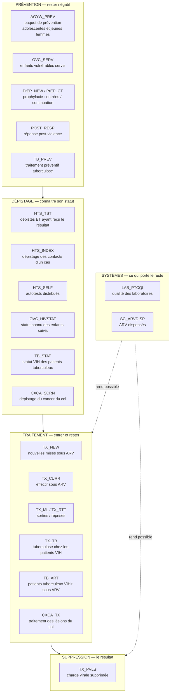
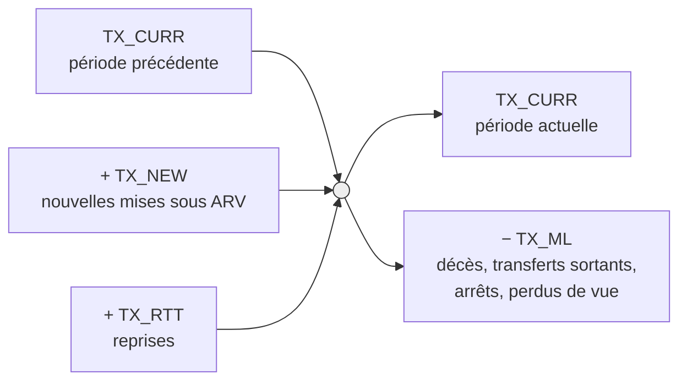
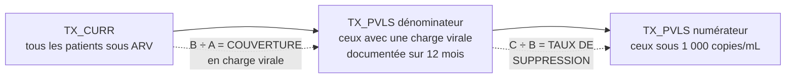
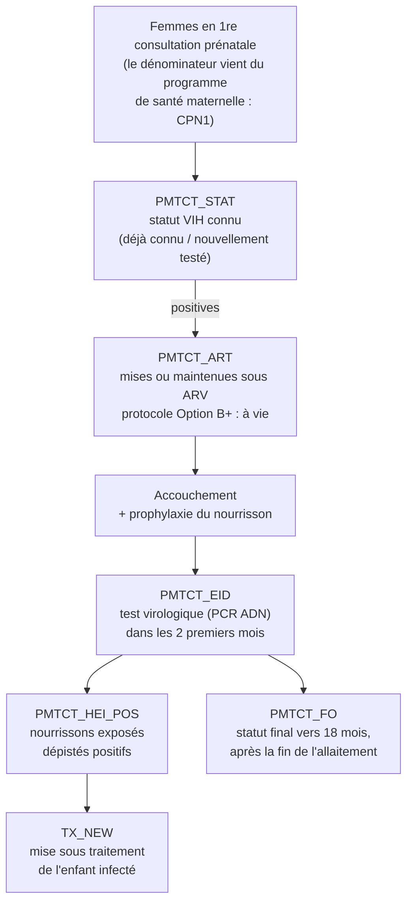
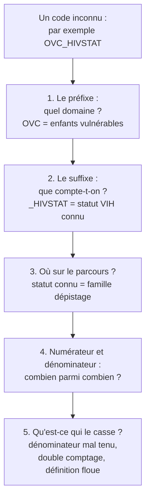

# Les indicateurs MER de l'USAID — la revue de trente minutes

*Fiche complémentaire à `FICHE_SYNTHESE.md` — construite à partir de l'infographie **PEPFAR FY25 Q1 et Q2 MER Indicators** et de la
**MER v2.8.2 FY25 Q1 and Q2 Reporting Frequency Table**. Vingt-sept indicateurs. Personne ne les
maîtrise tous, et personne ne te demandera de le faire. Ce module t'apprend à les traverser
intelligemment plutôt qu'à les mémoriser.*

---

## 1. La seule idée à retenir de ce module

**Les vingt-sept indicateurs ne sont pas vingt-sept sujets. C'est un seul parcours de patient,
découpé en cinq actes.** Le PEPFAR les regroupe exactement ainsi : **Prevention**, **Testing**,
**Treatment**, **Viral Suppression**, **Health Systems**. Cette structure n'est pas un classement
administratif — c'est la cascade de soins, avec les systèmes qui la portent.

Si tu comprends le parcours, tu peux **raisonner** sur n'importe quel indicateur, y compris ceux
que tu n'as jamais rapportés. C'est exactement ce qu'on attend d'un officier de suivi-évaluation :
pas de réciter un référentiel, mais de savoir où un indicateur se situe, ce qu'il compte, et ce
qui le casse.

**La stratégie pour l'entretien, en une phrase** : connais la **colonne vertébrale** (les six
indicateurs qui portent tout), connais la **convention de nommage** (qui te donne accès aux vingt
et un autres), connais la **grammaire de la fréquence et du niveau** (que presque aucun candidat
ne maîtrise), et sache **dire proprement quand tu ne sais pas**.

---

## 2. La convention de nommage : ton multiplicateur

Chaque code est construit en deux parties : un **préfixe** qui dit le domaine, et un **suffixe**
qui dit ce qu'on compte. Une fois ce décodeur en tête, un code inconnu cesse d'être opaque.

| Préfixe | Domaine |
|---|---|
| `HTS_` | *HIV testing services* — le dépistage |
| `TX_` | *Treatment* — le traitement antirétroviral |
| `PMTCT_` | La prévention de la transmission mère-enfant |
| `PrEP_` | La prophylaxie pré-exposition |
| `TB_` | La tuberculose, vue depuis le programme tuberculose |
| `OVC_` | *Orphans and vulnerable children* — orphelins et enfants vulnérables |
| `AGYW_` | *Adolescent girls and young women* — adolescentes et jeunes femmes |
| `CXCA_` | *Cervical cancer* — le cancer du col de l'utérus |
| `LAB_` | Le laboratoire |
| `SC_` | *Supply chain* — la chaîne d'approvisionnement |
| `POST_` | La réponse post-violence |

Et les suffixes les plus fréquents : `_TST` un test réalisé, `_STAT` un **statut connu**, `_NEW`
une entrée dans le service, `_CURR` un effectif à l'instant *t*, `_ART` une mise sous traitement,
`_PREV` un paquet de prévention, `_SCRN` un dépistage de masse, `_ML` des sorties, `_RTT` des
retours.

**Le suffixe `_STAT` mérite un arrêt**, parce qu'il revient trois fois et qu'il piège. `PMTCT_STAT`
et `TB_STAT` ne comptent pas des tests : ils comptent des personnes **dont le statut VIH est
connu**, que ce statut ait été établi ce jour-là ou avant. C'est pourquoi ils se ventilent toujours
entre **statut déjà connu** à l'arrivée et **nouvellement testé** sur place. Confondre « testé » et
« statut connu » est l'erreur classique.

---

## 3. La carte globale

Voici les vingt-sept indicateurs posés sur le parcours réel d'une personne.

**La chaîne PTME traverse ce parcours en parallèle**, parce qu'elle suit deux personnes à la fois.
Elle a son propre schéma en section 6.

**Ce que la carte t'apprend immédiatement.** La prévention et le dépistage produisent des
**événements** que l'on compte. Le traitement produit un **état** que l'on maintient. La
suppression virale est le **seul indicateur de résultat** de toute la liste — un contre
vingt-six. Et les deux indicateurs de systèmes ne mesurent aucun patient : ils mesurent ce sans
quoi rien ne fonctionne, le laboratoire et l'approvisionnement en médicaments.

---

## 4. La colonne vertébrale : les six qui portent tout

Si tu ne dois maîtriser que six indicateurs, ce sont ceux-là. Ils sont tous **trimestriels** et
tous **au niveau institution sanitaire**.

**`HTS_TST`** — personnes dépistées **et ayant reçu leur résultat**. La seconde condition fait
partie de la définition : un test réalisé dont le résultat n'a pas été rendu ne compte pas. Se
ventile par modalité et par résultat. La part positive rapportée au total donne la **positivité**,
qui mesure la qualité du ciblage.

**`TX_NEW`** — nouvelles mises sous traitement pendant la période. Un **flux**.

**`TX_CURR`** — effectif actuellement sous traitement à la fin de la période. Un **stock**, et
l'indicateur roi : c'est lui qui porte les cibles, les budgets et les commandes de médicaments.

**`TX_ML`** — *treatment: missed loss*. Les patients sans contact clinique depuis la date
attendue, **ventilés par devenir** : décédés, transférés sortants, ayant refusé ou arrêté, perdus
de vue depuis moins de trois mois, perdus de vue depuis trois mois ou plus.

**`TX_RTT`** — *return to treatment*. Les patients ayant interrompu puis **repris**.

**`TX_PVLS`** — la suppression virale. Dénominateur : patients sous traitement ayant un
**résultat de charge virale documenté dans les douze derniers mois**. Numérateur : ceux dont la
charge virale est **inférieure à 1 000 copies par millilitre**.

### L'équation de cohorte, à savoir dessiner

C'est le cœur technique du domaine, et le premier contrôle qualité à mettre en place.

**Stock final = stock initial + nouveaux + reprises − sorties.** Si l'équation ne tombe pas juste,
**il manque des sorties documentées** — et c'est presque toujours le cas. La phrase à dire : *le
numérateur est facile, c'est le dénominateur qui fait le métier ; quand un site est débordé, il
continue à saisir ses actes et cesse de documenter ses sorties.*

### Le piège TX_PVLS, à ne jamais rater

`TX_PVLS` **ne mesure pas la couverture du test**. Un site qui ne teste que ses patients les mieux
suivis affichera un taux de suppression magnifique sur un dénominateur minuscule.

**On ne commente jamais un taux de suppression sans annoncer sa couverture dans la même phrase.**
Un 98 % sur une couverture de 30 % n'est pas un bon résultat, c'est une information manquante.

---

## 5. Le dépistage : quatre portes d'entrée

Au-delà de `HTS_TST`, la famille dépistage décrit **par quelle porte** les gens arrivent, et c'est
une question de stratégie autant que de comptage.

**`HTS_INDEX`** — le dépistage indexé : on part d'une personne diagnostiquée et on propose le test
à ses partenaires, ses enfants, ses contacts. C'est la modalité **au plus fort rendement** de
toutes, parce qu'on teste des personnes réellement exposées plutôt que la population générale.
C'est aussi la plus **sensible sur le plan éthique** — elle suppose de solliciter les proches
d'une personne sans jamais révéler son statut, avec un consentement explicite et un protocole de
protection contre les violences que la démarche peut déclencher. Savoir nommer ce risque est un
signal fort.

**`HTS_SELF`** — les autotests distribués. Ils atteignent les personnes qui ne viendraient jamais
en clinique. Leur difficulté de mesure est évidente et vaut d'être dite : **on distribue un kit,
on ne voit pas le résultat**. L'indicateur compte donc une distribution, pas un diagnostic, et le
défi programmatique est le **lien vers le soin** de ceux qui se testent positifs chez eux.

**`TB_STAT`** — la proportion de patients tuberculeux dont le statut VIH est connu. Porte d'entrée
majeure, la tuberculose étant la première cause de mortalité chez les personnes vivant avec le VIH.

**`OVC_HIVSTAT`** — le statut connu des enfants suivis par les programmes pour orphelins et
enfants vulnérables.

**`CXCA_SCRN`** — le dépistage du cancer du col chez les femmes vivant avec le VIH, qui y sont
nettement plus exposées. `CXCA_TX` compte le traitement des lésions précancéreuses trouvées. Le
rapport des deux mesure si le dépistage débouche sur quelque chose — un dépistage sans traitement
disponible est un dépistage qui ne sert à rien.

---

## 6. La chaîne PTME : deux personnes, un indicateur à la fois

C'est la famille la plus structurée de toute la liste, parce qu'elle suit **un couple mère-enfant**
dans le temps.

**Trois choses à savoir dire sur ce schéma.**

D'abord, **pourquoi un test rapide ne marche pas sur un nourrisson** : les tests rapides sont
sérologiques, ils cherchent les anticorps, et le bébé porte **les anticorps de sa mère** jusqu'à
dix-huit mois. Il faut un test **virologique**, une PCR ADN. C'est toute la raison d'être de
`PMTCT_EID`.

Ensuite, **pourquoi `PMTCT_FO` est annuel** — l'infographie de fréquence le montre, et la raison
est structurelle : le statut définitif ne peut être établi qu'après la fin de l'exposition, donc
après l'allaitement, vers dix-huit mois. **Un indicateur dont la définition impose un délai de
dix-huit mois ne peut pas être trimestriel.** Faire ce lien entre la clinique et la fréquence de
rapportage est le genre de remarque qui distingue.

Enfin, **le piège des cohortes décalées** : la cohorte de nourrissons se constitue neuf mois après
la cohorte de femmes dépistées. Comparer sur une même période le nombre de femmes traitées et le
nombre d'enfants testés compare **deux populations décalées**, et produit des couvertures absurdes
sans qu'aucun service ait changé.

*Note : l'infographie des vingt-sept indicateurs écrit `PMTCT_HEI` là où la table de fréquence
écrit `PMTCT_HEI_POS`. C'est le même indicateur ; la v2.8.2 emploie la forme longue.*

---

## 7. La prévention et les co-morbidités

**`AGYW_PREV`** — les adolescentes et jeunes femmes ayant complété un **paquet de services de
prévention**, dans le cadre de l'initiative **DREAMS**. Deux traits le rendent atypique, et la
table de fréquence les confirme tous les deux : il est le seul de la liste à être rapporté
**uniquement au niveau communautaire** et **au semestre**.

**Et c'est structurellement l'un des plus difficiles à rapporter correctement**, pour une raison
qui vaut d'être expliquée. `TX_CURR` est un stock qu'on photographie ; `HTS_TST` est un événement
qu'on incrémente. `AGYW_PREV` est un **paquet complété** : il faut suivre des individus
identifiés, dans le temps, à travers plusieurs types de services rendus par plusieurs acteurs, et
déterminer pour chacun si la combinaison reçue atteint le seuil de complétude. Cela suppose un
identifiant unique communautaire, une déduplication entre partenaires, et une définition partagée
de ce qui compte comme « complété ». Si tu as travaillé dessus, tu as travaillé sur le plus exigeant
du lot en matière de traçabilité individuelle — c'est une chose à dire.

**`OVC_SERV`** — orphelins et enfants vulnérables bénéficiaires. Même logique de paquet et de
suivi individuel, mêmes difficultés de déduplication.

**`PrEP_NEW`** et **`PrEP_CT`** — la prophylaxie pré-exposition, traitement préventif pour les
personnes séronégatives à haut risque. Le premier compte les **entrées**, le second la
**continuation**. Le couple entrées/continuation est le même schéma conceptuel que `TX_NEW` et
`TX_CURR` : entrer est facile, rester est le sujet.

**`POST_RESP`** — les services de réponse post-violence. Il est rattaché à la prévention parce que
la violence basée sur le genre est à la fois un facteur de risque d'infection et une conséquence
possible de la révélation d'un statut.

**`TB_PREV`** — le traitement préventif de la tuberculose chez les personnes vivant avec le VIH.
À ne pas confondre avec `TX_TB`, qui est le dépistage et la prise en charge de la tuberculose chez
les patients déjà sous traitement VIH, ni avec `TB_ART`, qui prend le problème par l'autre bout :
les patients **tuberculeux** vivant avec le VIH mis sous antirétroviraux. Trois indicateurs, deux
programmes, un même patient — **la distinction est celle du point de vue** : `TB_STAT` et `TB_ART`
regardent depuis le programme tuberculose, `TX_TB` et `TB_PREV` depuis le programme VIH.

**`LAB_PTCQI`** et **`SC_ARVDISP`** — les deux indicateurs de systèmes : la qualité et
l'accréditation des laboratoires, et les antirétroviraux dispensés. Ils ne comptent pas des
patients, ils comptent **ce sans quoi les autres indicateurs sont impossibles**. `SC_ARVDISP` est
d'ailleurs le seul indicateur qui parle directement de la rupture de stock — et une rupture de
stock est la cause opérationnelle la plus fréquente d'une chute de `TX_CURR`.

---

## 8. La grammaire de la fréquence et du niveau

**C'est la partie que presque aucun candidat ne connaît, et elle est entièrement dans la seconde
infographie.** Elle est aussi la plus directement utile au poste, puisque l'annonce demande de
superviser la collecte de rapports « mensuels, trimestriels, semestriels et annuels ».

**Quatre rythmes.** Les **trimestriels** rapportent **trois mois de résultats à chaque cycle** :
`HTS_TST`, `HTS_INDEX`, `HTS_SELF`, `PMTCT_ART`, `PMTCT_EID`, `PMTCT_HEI_POS`, `PMTCT_STAT`,
`PrEP_CT`, `PrEP_NEW`, `TB_STAT`, `TX_CURR`, `TX_ML`, `TX_NEW`, `TX_PVLS`, `TX_RTT`. Les
**semestriels** rapportent **six mois de résultats, aux cycles Q2 et Q4** : `AGYW_PREV`,
`CXCA_SCRN`, `CXCA_TX`, `POST_RESP`, `OVC_HIVSTAT`, `OVC_SERV`, `SC_ARVDISP`, `TB_PREV`, `TX_TB`.
Les **annuels** rapportent **douze mois au cycle Q4** : `LAB_PTCQI`, `PMTCT_FO`, `TB_ART`. Et les
indicateurs **pays hôte** — `DIAGNOSED`, `PMTCT_ART`, `PMTCT_STAT`, `TX_CURR`, `VL_SUPPRESSION` —
sont rapportés annuellement, les cibles pendant le COP et les résultats au Q4.

**La logique derrière ces rythmes**, à savoir formuler : plus l'indicateur décrit un **état qui
bouge vite et sur lequel on pilote**, plus il est fréquent. `TX_CURR` détermine les commandes de
médicaments, donc il est trimestriel. `PMTCT_FO` exige d'attendre dix-huit mois, donc il est
annuel. La fréquence n'est pas une convention bureaucratique, elle est **dictée par la nature de
ce qu'on mesure**.

**Quatre niveaux de rapportage**, marqués par une lettre dans un cercle sur l'infographie. **(F)
Facility** : au niveau de l'institution sanitaire, un point géographique fixe. **(C) Community** :
au niveau d'une zone géographique plus large définie par l'équipe-pays PEPFAR, pas une structure
unique — c'est le niveau de `AGYW_PREV`, `OVC_SERV`, `POST_RESP` et de la part communautaire du
dépistage. **(A) Above-site** : au niveau du pays, par mécanisme de mise en œuvre. **(P) Point of
service delivery** : encore plus fin que l'institution, au point de service à l'intérieur du site.

**Et une subtilité qui distingue vraiment.** Les indicateurs **pays hôte**, marqués **(N)
national** et **(S) subnational**, sont d'une nature différente des autres : ils sont saisis dans
DATIM **par le personnel du gouvernement américain**, et ils doivent refléter les résultats de
**tout le pays** — appui PEPFAR **et** non-PEPFAR confondus. Les indicateurs standards, eux, ne
comptent que ce que le partenaire a produit.

**C'est pour cela qu'un `TX_CURR` national ne sera jamais égal à la somme des `TX_CURR` des
partenaires.** Ce n'est pas une erreur de données, c'est une différence de périmètre. Savoir dire
cela — que la même étiquette recouvre deux univers de comptage — te place immédiatement au-dessus
du candidat qui a seulement appris la liste.

---

## 9. Comment raisonner sur un indicateur que tu ne connais pas

Voici la méthode à appliquer si l'on te lance un code que tu n'as jamais rapporté. Elle marche à
tous les coups, parce que tous les indicateurs MER sont construits pareil.

Applique-la à voix haute une fois, sur un indicateur au hasard de la liste, avant de fermer ce
document. Tu verras qu'elle tient.

**Et la formulation à utiliser quand tu ne sais pas.** Ne bluffe jamais un numérateur — c'est le
seul type d'erreur dont on ne se relève pas en entretien technique.

> « Celui-là, je ne l'ai pas rapporté personnellement, donc je préfère ne pas vous en donner la
> définition exacte de mémoire. Ce que je peux vous dire, c'est où il se situe : le préfixe le
> rattache à [domaine], le suffixe indique qu'on compte [ce que compte le suffixe], donc il vit
> dans la famille [dépistage / traitement / prévention]. Et ce que je vérifierais en premier en
> arrivant, c'est sa fiche dans le guide de référence MER, parce que la définition exacte du
> dénominateur et des désagrégations est ce qui décide de tout le reste. »

Cette réponse est **meilleure** qu'une définition approximative. Elle montre que tu connais la
structure, que tu connais l'existence du guide de référence, et que tu as le réflexe de vérifier
plutôt que de supposer. C'est exactement le comportement qu'on veut chez quelqu'un dont les
chiffres partent chez un bailleur.

---

## 10. Ce que tu dis de ton expérience

**La règle est inchangée et elle est absolue** : tu étais **producteur de données** — préparer,
valider, soumettre les indicateurs MER dans DATIM, avec les désagrégations exigées et les échéances
du PEPFAR. **Tu n'étais pas administrateur de la plateforme DHIS2.**

**Sur l'étendue de ton expérience indicateur**, sois exact. Tu as travaillé sur un périmètre
précis — `AGYW_PREV` dans le cadre de DREAMS en est un exemple concret — et tu n'as pas une
connaissance intime des vingt-sept. **Le dire toi-même vaut infiniment mieux que de se faire
prendre.** La formulation :

> « Mon expérience directe porte sur le périmètre d'indicateurs de mon projet — par exemple
> AGYW_PREV, dans le cadre de DREAMS, qui est un indicateur communautaire à rapportage semestriel.
> Je ne prétends pas connaître intimement les vingt-sept indicateurs de la version en cours. Ce
> que je maîtrise, c'est le **processus** : appliquer une définition telle qu'elle est écrite dans
> le guide de référence, construire les désagrégations, faire tomber les contrôles de cohérence,
> faire valider, et soumettre dans les délais. C'est ce processus qui est le même quel que soit
> l'indicateur, et c'est lui qui fait qu'un chiffre passe ou ne passe pas un audit. »

**Et si l'on te demande ce qui est le plus difficile dans le rapportage MER**, tu as une vraie
réponse, qui ne dépend d'aucun indicateur en particulier : « la cohérence entre les
désagrégations et le total, parce que la somme des désagrégats doit égaler le total et qu'un
patient dont la date de naissance est mal saisie casse cette égalité — et le fait que les
définitions évoluent d'une version du guide à l'autre, ce qui casse la comparabilité entre années
si on ne le documente pas. »

---

## 11. La révision de trois minutes, la veille

Vingt-sept indicateurs, cinq familles : **prévention, dépistage, traitement, suppression,
systèmes**. Un seul indicateur de résultat dans toute la liste : `TX_PVLS`.

Les six qui portent tout, tous trimestriels et au niveau institution : `HTS_TST`, `TX_NEW`,
`TX_CURR`, `TX_ML`, `TX_RTT`, `TX_PVLS`.

L'équation : **stock final = stock initial + nouveaux + reprises − sorties**. Si elle ne tombe pas
juste, il manque des sorties documentées.

La phrase : **on ne commente jamais un taux de suppression sans annoncer sa couverture**.

Le préfixe donne le domaine, le suffixe donne ce qu'on compte, et `_STAT` compte un **statut
connu**, pas un test.

La fréquence est **dictée par la nature de ce qu'on mesure** : `TX_CURR` pilote les commandes de
médicaments donc il est trimestriel, `PMTCT_FO` attend dix-huit mois donc il est annuel.

Les indicateurs **pays hôte** couvrent **tout le pays, PEPFAR et non-PEPFAR** — c'est pourquoi un
`TX_CURR` national n'égale jamais la somme des partenaires.

Et quand tu ne sais pas : **préfixe, suffixe, place dans le parcours, numérateur sur dénominateur,
ce qui le casse** — puis « je vérifierais sa fiche dans le guide de référence MER avant de vous
donner une définition de mémoire ».

---

*Les noms, catégories, fréquences et niveaux de ce module viennent des deux infographies PEPFAR
FY25 Q1/Q2 (MER v2.8.2). Les définitions de numérateur et de dénominateur sont l'usage standard du
domaine ; **l'autorité est le* MER 2.8 Indicator Reference Guide *publié par le Département
d'État**, et c'est lui qu'on cite en entretien plutôt qu'une mémoire. Voir
[`sources.md`](sources.md).*
