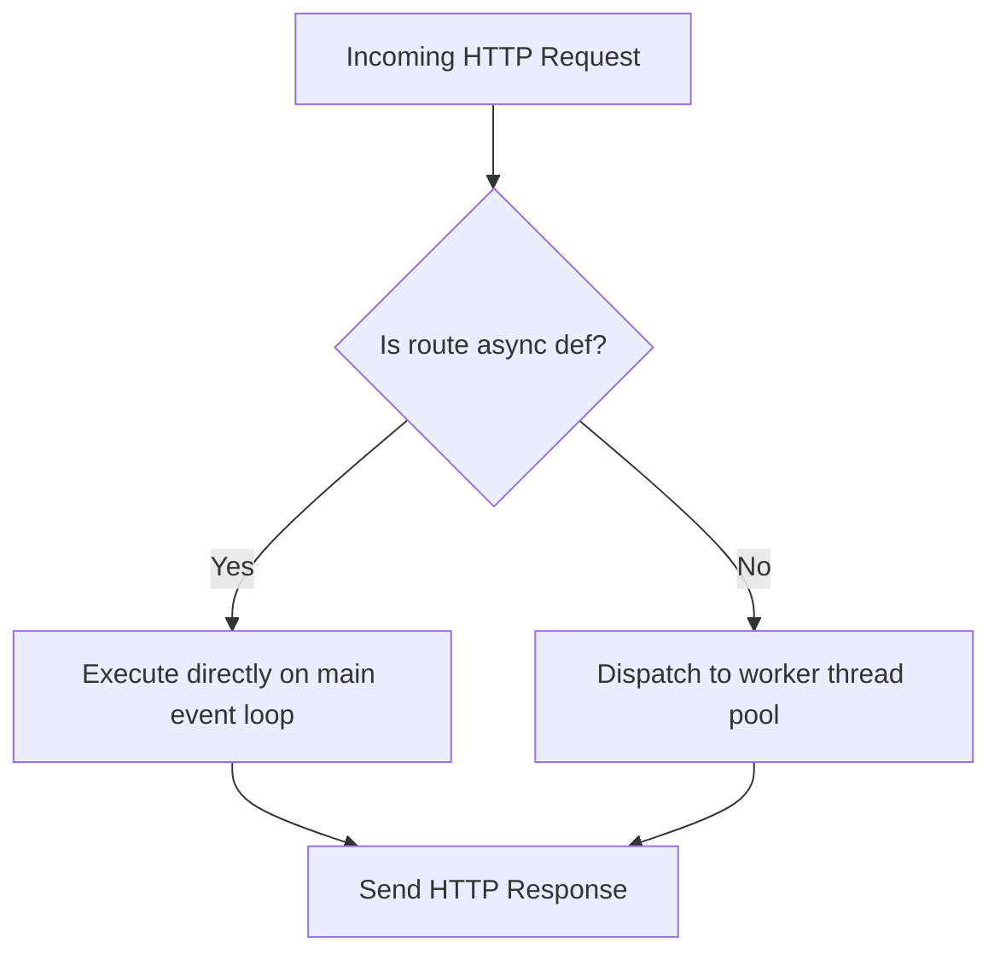

# FastAPI Framework Specification (Comprehensive Masterclass)

FastAPI is a high-performance web framework for building APIs with Python 3.8+ based on standard Python type hints. This guide covers its architecture, async execution mechanics, dependency injection, and core parameters.

---

## 1. Core Mechanics & Architecture (Why & What)

### Why Choose FastAPI?
FastAPI is built on top of two robust libraries:
1. **Starlette**: A lightweight ASGI framework/toolkit, which provides asynchronous web routing, WebSockets, and middleware management.
2. **Pydantic**: A data validation and settings management library using Python type annotations.

Key architectural benefits include:
* **Asynchronous Performance**: Built on ASGI, matching Node.js and Go in execution speeds.
* **Automatic Interactive Documentation**: Yields interactive Swagger UI (`/docs`) and ReDoc (`/redoc`) configurations automatically based on standard OpenAPI schema declarations.
* **Type-Safe Validation**: Validates client requests (path params, query params, headers, and request bodies) using Pydantic, rejecting invalid payloads with detailed `422 Unprocessable Entity` structures before hitting endpoint logic.

### Async vs. Sync Route Execution
FastAPI handles asynchronous (`async def`) and synchronous (`def`) route handlers differently:

* **`async def` (Asynchronous Handlers)**:
  * **Execution**: Runs directly on Starlette's main async event loop.
  * **Critical Constraint**: You must never run blocking I/O (like standard `requests.get()`, synchronous PostgreSQL database drivers, or `time.sleep()`) or heavy CPU-bound tasks inside an `async def` handler. Doing so blocks the single event loop thread, stalling all other incoming API requests on the server.
  * **Requirement**: Use async libraries (like `httpx.AsyncClient` or `sqlalchemy.ext.asyncio`).
* **`def` (Synchronous Handlers)**:
  * **Execution**: Dispatched automatically to a thread pool managed by `anyio`.
  * **Purpose**: Safe for executing blocking CPU operations or legacy synchronous database queries. FastAPI handles thread creation and context switching under the hood.



### Dependency Injection (DI)
FastAPI features an integrated dependency injection system (`Depends`) to handle authentication, database sessions, and configurations.
* **Caching**: If multiple sub-dependencies depend on the same parent dependency (e.g., three dependencies all call `get_db_session`), FastAPI runs the parent dependency exactly once per request and caches the result. You can disable this by setting `Depends(get_db_session, use_cache=False)`.

---

## 2. Basic & Core API Usage (How)

### Path and Query Parameters
FastAPI maps path parameters from the URL path. Any query parameters not in the path are parsed as query params.

```python
from typing import Optional
from fastapi import FastAPI, Path, Query

app = FastAPI()

@app.get("/items/{item_id}")
async def read_item(
    item_id: int = Path(..., description="The ID of the item", gt=0),
    q: Optional[str] = Query(None, max_length=50, description="Search query")
):
    return {"item_id": item_id, "q": q}
```

### Request Bodies & Pydantic Validation
To receive a JSON request body, define a model using Pydantic `BaseModel`.

```python
from pydantic import BaseModel, Field

class Item(BaseModel):
    name: str = Field(..., min_length=1)
    price: float = Field(..., gt=0.0)
    tax: Optional[float] = None

@app.post("/items")
async def create_item(item: Item):
    return {"item": item, "total_price": item.price + (item.tax or 0)}
```

### Form Data & File Uploads
To accept HTML form data or multi-part files, use `Form` and `UploadFile`.

```python
from fastapi import Form, File, UploadFile

@app.post("/submit")
async def handle_submit(
    username: str = Form(...),
    avatar: UploadFile = File(...)
):
    contents = await avatar.read()
    return {"username": username, "filename": avatar.filename, "size": len(contents)}
```

### Cookies, Headers, and Responses
Define cookies and headers explicitly. Customize response schemas and status codes using the decorator.

```python
from fastapi import Cookie, Header, Response, status

@app.get("/headers", status_code=status.HTTP_200_OK)
async def read_meta(
    response: Response,
    user_agent: Optional[str] = Header(None),
    session_id: Optional[str] = Cookie(None)
):
    response.set_cookie(key="session_tracker", value="active")
    return {"User-Agent": user_agent, "session_id": session_id}
```

---

## 3. Advanced API Mechanics (How)

### Gist: production_fastapi_app.py
A production-grade template demonstrating Middlewares, Custom Error Handlers, Background Tasks, and Dynamic Sub-dependencies.

```python
# Gist: production_fastapi_app.py
import time
from typing import Annotated, List
from fastapi import FastAPI, Depends, APIRouter, HTTPException, Request, BackgroundTasks, status
from fastapi.responses import JSONResponse
from pydantic import BaseModel

app = FastAPI(title="Production Blueprint", version="1.0.0")

# 1. CUSTOM API EXCEPTION HANDLING
class BankingException(Exception):
    def __init__(self, message: str, code: int = 400):
        self.message = message
        self.code = code

@app.exception_handler(BankingException)
async def banking_exception_handler(request: Request, exc: BankingException):
    # Why: Standardizes error outputs globally for React frontends
    return JSONResponse(
        status_code=exc.code,
        content={"success": False, "error": exc.message}
    )

# 2. PROFILING MIDDLEWARE
@app.middleware("http")
async def profile_request_latency(request: Request, call_next):
    # Why: Injects response timing headers dynamically
    start_time = time.time()
    response = await call_next(request)
    duration = time.time() - start_time
    response.headers["X-Response-Time-Seconds"] = str(duration)
    return response

# 3. NESTED DEPENDENCY INJECTION GRAPH
async def verify_auth_header(request: Request) -> str:
    auth_token = request.headers.get("Authorization")
    if not auth_token or not auth_token.startswith("Bearer "):
        raise HTTPException(
            status_code=status.HTTP_401_UNAUTHORIZED,
            detail="Missing or invalid Bearer authentication header"
        )
    return auth_token.split(" ")[1]

async def get_current_user_id(token: Annotated[str, Depends(verify_auth_header)]) -> int:
    # Sub-dependency: Parses token to return user ID. Resolves in order.
    if token == "invalid":
        raise BankingException("Token expired or revoked", code=401)
    return 101

# 4. BACKGROUND TASKS & APIRouter
router = APIRouter(prefix="/api/v1/banking", tags=["Banking"])

def process_transaction_ledger(user_id: int, amount: float):
    # Sync worker helper running in background thread pool
    time.sleep(1)  # Simulate ledger locking operations
    print(f"Ledger synced: User {user_id} posted ${amount}")

class TransactionSchema(BaseModel):
    amount: float

@router.post("/post-tx")
async def post_transaction(
    tx: TransactionSchema,
    user_id: Annotated[int, Depends(get_current_user_id)],
    background_tasks: BackgroundTasks
):
    if tx.amount <= 0:
        raise BankingException("Amount must be greater than zero", code=400)
        
    # Queue CPU-heavy or blocking tasks to run after returning the HTTP response
    background_tasks.add_task(process_transaction_ledger, user_id, tx.amount)
    return {"status": "processing", "user_id": user_id}

app.include_router(router)
```
