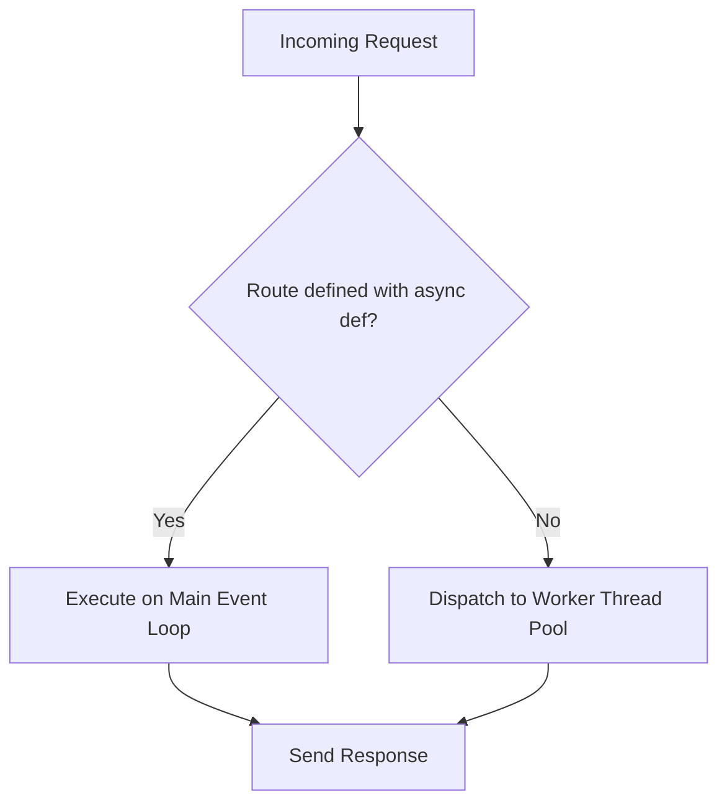

# FastAPI Framework Specification

A deep-dive reference guide to FastAPI's architecture, async mechanics, dependency injection, and request-response lifecycle.

---

## 1. Core Mechanics & Architecture (Why & What)

### Why Choose FastAPI?
FastAPI is a modern, high-performance web framework built on top of **Starlette** (for ASGI web capabilities) and **Pydantic** (for data validation).
1. **Speed**: Async execution capabilities place it on par with Node.js and Go.
2. **Automatic OpenAPI/Swagger**: Generates standard interactive API documentation from your Python code types, reducing friction when integrating with React clients.
3. **Pydantic Validation**: Ensures input JSON is validated and parsed into typed objects before hitting routing logic.

### Async vs. Sync Routers
FastAPI supports both synchronous (`def`) and asynchronous (`async def`) endpoints. It handles them differently under the hood:
* **`async def`**: Runs directly on Starlette's main async event loop.
  * *Constraint*: You **must never** run blocking CPU operations (like heavy mathematical computations) or blocking I/O (like `requests.get` or synchronous database drivers) here. Doing so blocks the entire event loop, freezing the server for all other incoming requests.
* **`def`**: Runs in an external thread pool managed by Starlette (using `anyio`). FastAPI spawns a thread to process the request and returns the result, preventing blocking operations from stalling the main loop.



### Dependency Injection (DI)
FastAPI’s DI system (`Depends`) manages shared resources (like database sessions, security tokens, or user validation).
* **Caching**: By default, if a dependency is referenced multiple times in a single request (e.g., three child dependencies all depend on `get_db`), FastAPI executes it once and caches the result for that request lifecycle. You can override this using `Depends(dependency, use_cache=False)`.

---

## 2. Implementation Blueprint (How)

### Gist: fastapi_app_blueprint.py
A complete FastAPI application structure demonstrating routers, custom dependency injection graphs, exception handling, and custom request profiling middleware.

```python
# Gist: fastapi_app_blueprint.py
import time
from typing import Annotated
from fastapi import FastAPI, Depends, APIRouter, HTTPException, Request, status
from fastapi.responses import JSONResponse

# 1. Initialize Application
app = FastAPI(title="Production FastAPI Blueprint", version="1.0.0")

# ---------------------------------------------------------
# EXCEPTION HANDLING
# ---------------------------------------------------------
class CustomAPIException(Exception):
    def __init__(self, detail: str, status_code: int = 400):
        self.detail = detail
        self.status_code = status_code

@app.exception_handler(CustomAPIException)
async def custom_exception_handler(request: Request, exc: CustomAPIException):
    # Why: Standardizes error shapes across endpoints for frontend client consumption
    return JSONResponse(
        status_code=exc.status_code,
        content={"success": False, "error": exc.detail},
    )

# ---------------------------------------------------------
# MIDDLEWARE
# ---------------------------------------------------------
@app.middleware("http")
async def add_process_time_header(request: Request, call_next):
    # Why: Profiles route latency dynamically for application logging
    start_time = time.time()
    response = await call_next(request)
    process_time = time.time() - start_time
    response.headers["X-Process-Time"] = str(process_time)
    return response

# ---------------------------------------------------------
# DEPENDENCY INJECTION GRAPH
# ---------------------------------------------------------
async def get_api_key(request: Request) -> str:
    # Why: Simple shared validation extraction
    auth_header = request.headers.get("X-API-KEY")
    if not auth_header:
        raise HTTPException(
            status_code=status.HTTP_401_UNAUTHORIZED,
            detail="Missing API Key",
        )
    return auth_header

async def get_current_user(api_key: Annotated[str, Depends(get_api_key)]) -> dict:
    # Why: Sub-dependency (depends on get_api_key). Demonstrates DI chain nesting.
    # In a real app, verify api_key in database here.
    return {"user_id": 123, "role": "admin", "key_used": api_key}

# ---------------------------------------------------------
# ROUTING
# ---------------------------------------------------------
router = APIRouter(prefix="/api/v1/users", tags=["users"])

@router.get("/me")
async def read_current_user(
    current_user: Annotated[dict, Depends(get_current_user)]
):
    """
    Returns authenticated user information.
    Resolves dependency chain: request -> get_api_key -> get_current_user -> router handler
    """
    return current_user

@router.get("/heavy-calculation")
def heavy_cpu_bound_task():
    """
    Runs a CPU-bound operation.
    Defined as sync 'def' so FastAPI pushes it to a thread pool, keeping event loop free.
    """
    total = sum(i * i for i in range(10_000_000))
    return {"result": total}

app.include_router(router)
```
