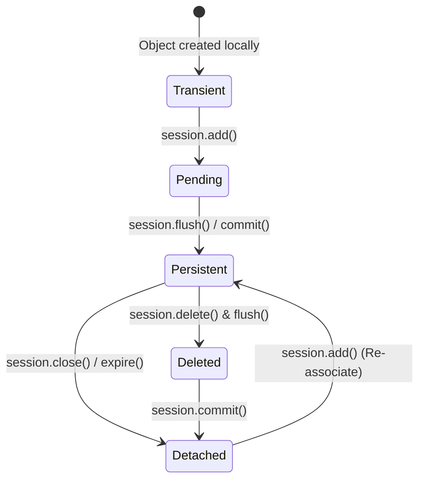

# SQLAlchemy v2 Specification

A deep-dive reference guide to SQLAlchemy 2.0 ORM architecture, asynchronous mapping, state lifecycle, and query optimizations.

---

## 1. ORM Architecture & Lifecycles (Why & What)

### Why SQLAlchemy v2?
SQLAlchemy is Python's leading Object Relational Mapper (ORM). Version 2.0 introduced a clean, type-safe API matching modern Python typing constraints, and natively supports asynchronous execution (using libraries like `asyncpg` or `aiosqlite`).

### SQLAlchemy Session State Lifecycle
An object mapped by SQLAlchemy flows through distinct states relative to a session connection. Knowing these states is vital for debugging detached session errors or transaction aborts.

* **Transient**: Object is created locally in memory but not added to a session (no DB representation).
* **Pending**: Object is added to a session via `session.add()`. No SQL database write has occurred yet.
* **Persistent**: Object is synced with the DB. This occurs when `session.commit()` or `session.flush()` runs.
* **Detached**: The session is closed or expired, but the object still exists in Python memory. Attempting to access unloaded relationships at this stage throws the infamous `DetachedInstanceError`.



### Async vs. Sync session execution
In SQLAlchemy 2.0 async mode:
* Operations that fetch database rows (like `.execute()`, `.scalars()`, `.commit()`) are awaited using `await`.
* Lazy loading relationships (accessing a relationship attribute like `user.addresses` directly) is **disabled** because accessing Python attributes cannot be awaited in standard syntax. Therefore, you must use explicit eager loading methods (`joinedload`, `selectinload`).

---

## 2. Implementation Blueprint (How)

### Gist: db_setup_and_crud.py
A complete script configuring async engines, declarative bases with relationships, transaction handling, and optimized joins.

```python
# Gist: db_setup_and_crud.py
import asyncio
from typing import List
from sqlalchemy import select, update, delete, ForeignKey
from sqlalchemy.ext.asyncio import create_async_engine, async_sessionmaker, AsyncSession
from sqlalchemy.orm import DeclarativeBase, Mapped, mapped_column, relationship, selectinload

# 1. Base Class Setup (SQLAlchemy v2 typed base)
class Base(DeclarativeBase):
    pass

# 2. Models Mapping
class Organization(Base):
    __tablename__ = "organizations"
    
    id: Mapped[int] = mapped_column(primary_key=True)
    name: Mapped[str] = mapped_column(nullable=False)
    
    # One-to-Many Relationship
    members: Mapped[List["Member"]] = relationship(
        back_populates="organization", 
        cascade="all, delete-orphan"
    )

class Member(Base):
    __tablename__ = "members"
    
    id: Mapped[int] = mapped_column(primary_key=True)
    name: Mapped[str] = mapped_column(nullable=False)
    organization_id: Mapped[int] = mapped_column(ForeignKey("organizations.id", ondelete="CASCADE"))
    
    # Many-to-One Relationship
    organization: Mapped["Organization"] = relationship(back_populates="members")

# 3. Connection Configuration
DATABASE_URL = "sqlite+aiosqlite:///:memory:"  # Local mock sqlite async DB
engine = create_async_engine(DATABASE_URL, echo=False)
AsyncSessionLocal = async_sessionmaker(bind=engine, expire_on_commit=False, class_=AsyncSession)

# 4. CRUD and Transaction Operations
async def run_database_operations():
    # Setup tables
    async with engine.begin() as conn:
        await conn.run_sync(Base.metadata.create_all)
        
    async with AsyncSessionLocal() as session:
        # A. Create & Insert Transaction
        async with session.begin():  # Auto-commits on success, rolls back on error
            org = Organization(name="Innovate Corp")
            member_1 = Member(name="Alice", organization=org)
            member_2 = Member(name="Bob", organization=org)
            session.add_all([org, member_1, member_2])
            
        # B. Read with Optimized Eager Loading (Avoiding N+1)
        # Why selectinload: Organization -> Members is One-to-Many
        stmt = (
            select(Organization)
            .options(selectinload(Organization.members))
            .where(Organization.name == "Innovate Corp")
        )
        result = await session.execute(stmt)
        org_fetched = result.scalars().first()
        
        if org_fetched:
            print(f"Organization: {org_fetched.name}")
            for member in org_fetched.members:
                print(f" - Member: {member.name}")

        # C. Update Query (Bulk)
        update_stmt = (
            update(Member)
            .where(Member.name == "Alice")
            .values(name="Alice Smith")
        )
        await session.execute(update_stmt)
        await session.commit()

        # D. Delete Query
        delete_stmt = delete(Member).where(Member.name == "Bob")
        await session.execute(delete_stmt)
        await session.commit()

if __name__ == "__main__":
    asyncio.run(run_database_operations())
```
