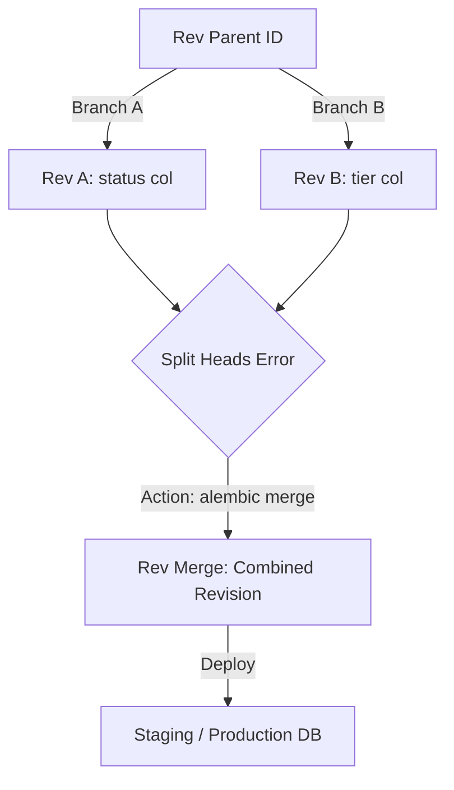

# Alembic Migrations Specification (Comprehensive Masterclass)

Alembic is a lightweight database migration tool for usage with SQLAlchemy. It tracks database schema evolution, auto-generates migration scripts from SQLAlchemy models, and manages execution version branches.

---

## 1. Core Mechanics & Setup Flow (Why & What)

### Why Use Alembic?
In production, database schemas change. You cannot drop and recreate tables because you would lose production data. 
* **The Solution**: Alembic tracks schema changes as incremental python version scripts. Each script has a unique identifier (revision ID) and a parent pointer (`down_revision`), creating a linked list of database schema versions.

### The Initial Configuration Flow
To initialize Alembic in an async SQLAlchemy project, run:

```bash
# Initialize using the async database template
alembic init -t async alembic
```

This creates the following directory structure:
* `alembic/`: Migration environment folder.
  * `env.py`: Script executed when Alembic runs. Loads database configurations and runs migrations.
  * `script.py.mako`: Template file for generating new migrations.
  * `versions/`: Directory containing generated migration scripts.
* `alembic.ini`: Core configuration file containing database connection strings and logger formats.

### Configuring env.py for SQLAlchemy Auto-Generation
By default, Alembic does not know about your custom SQLAlchemy models. You must import your model's declarative `metadata` inside `alembic/env.py`:

```python
# In alembic/env.py
from app.core.database import Base  # Import declarative base containing metadata
from app.models.banking import Account, Transaction  # Explicitly import models to register them

# Set target metadata so Alembic can compare database states with codebase models
target_metadata = Base.metadata
```

---

## 2. Standard Migration Lifecycle Commands (How)

### Step 1: Creating migrations
To auto-generate a migration script comparing local SQLAlchemy model files with the database schema:

```bash
alembic revision --autogenerate -m "add_status_column_to_transactions"
```

* **Important Note**: Alembic's `--autogenerate` matches column additions/removals, index creations, and constraints. However, it **does not detect table name changes, constraint name modifications, or custom enum values changes**. Always inspect the generated script before applying it!

### Step 2: Applying migrations
To apply all pending migrations and bring the database up to date:

```bash
alembic upgrade head
```

To rollback the last migration applied:

```bash
alembic downgrade -1
```

To upgrade or downgrade to a specific revision ID:

```bash
alembic upgrade rev_id_abc123
```

---

## 3. Advanced Migration Branching & Versioning (How)

### Multiple Heads Forking Conflict
When two developers create database migrations concurrently in separate git branches, they both assign the same parent `down_revision`. Merging both branches into main creates a **migration history fork**. Alembic halts execution with:
`CommandError: Multiple heads are present; run 'alembic branches' to see them`



### Gist: alembic_history_resolution.sh
Shell command workflows to resolve split heads and verify migration SQL outputs in dry run mode.

```bash
# Gist: alembic_history_resolution.sh
# Why: Standard troubleshooting script for Alembic branching errors

# 1. Inspect the migration tree to find active heads
echo "=== Listing active branch heads ==="
alembic heads

# This returns:
# rev_a_id (active head)
# rev_b_id (active head)

# 2. Merge heads into a combined parent revision
# -m: Adds a descriptive message to the generated merge migration script
echo "=== Merging branch heads ==="
alembic merge -m "Merge branch A and branch B migration heads" rev_a_id rev_b_id

# This creates a new version file inside alembic/versions/ where:
# down_revision = ("rev_a_id", "rev_b_id")

# 3. Verify the combined version tree is clean
echo "=== Verifying history path ==="
alembic history

# 4. Generate SQL Output offline without altering database states (Dry Run)
# Why: Production DBA teams require raw SQL review before applying migrations on live clusters
echo "=== Running offline migration to inspect SQL ==="
alembic upgrade head --sql > migration_dryrun.sql

# Review migration_dryrun.sql to verify it does not contain table-locking statement conflicts.

# 5. Apply the migration online
echo "=== Upgrading database schema ==="
alembic upgrade head
```
