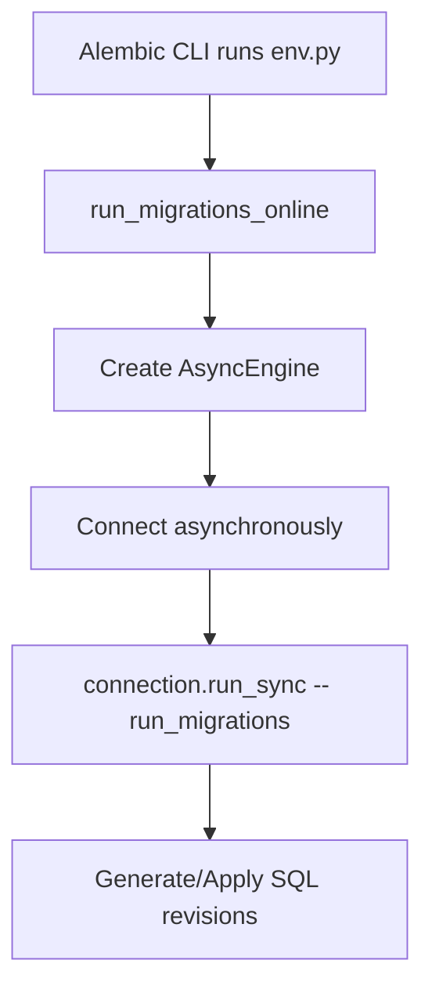

# Alembic Migration Specification

A deep-dive reference guide to Alembic configuration, async `env.py` mapping, autogenerate capabilities, and version management.

---

## 1. Migration Mechanics & Environment (Why & What)

### Why Alembic?
Alembic handles SQL migrations for SQLAlchemy. It parses model metadata definitions and creates versioned revision files inside a version folder, which are applied to the target database in sequence.

### Under the Hood: Autogenerate Limitations
Alembic's `--autogenerate` tool checks your current database schema against your SQLAlchemy model metadata declarations. However, it is not omniscient.

* **What it detects**: Table additions/deletions, column additions/deletions, nullable adjustments, basic indexes, and foreign keys.
* **What it misses (by default)**: Table/column name changes (detects them as drop + add, destroying data!), custom check constraints, database schema namespaces, and index type details (e.g. GIN/GiST).
* **Workaround**: You must inspect autogenerated migration code before running it in production, modifying it to use `op.alter_column` instead of drop + add when renaming attributes.

### Async `env.py` Architecture
In an async FastAPI application, your database connection uses an async engine. By default, Alembic runs synchronously. To support async database connections, your `env.py` must run migrations using `connection.run_sync()`.



---

## 2. Configuration Blueprint (How)

### Gist: env.py (Async Migration Template)
A production-ready `env.py` configuration designed to support asynchronous engines, autogenerate indexing, and metadata bindings.

```python
# Gist: env.py
import asyncio
from logging.config import fileConfig
from sqlalchemy import pool
from sqlalchemy.ext.asyncio import async_engine_from_config
from alembic import context

# 1. Config object gives access to alembic.ini values
config = context.config

# Interpret the config file for Python logging.
if config.config_file_name is not None:
    fileConfig(config.config_file_name)

# 2. IMPORT TARGET METADATA
# Why: Autogenerate needs access to base metadata to compare models with the DB
from app.models import Base  # Import DeclarativeBase
target_metadata = Base.metadata

def run_migrations_offline() -> None:
    """Run migrations in 'offline' mode.
    Only prints target SQL scripts instead of modifying database directly.
    """
    url = config.get_main_option("sqlalchemy.url")
    context.configure(
        url=url,
        target_metadata=target_metadata,
        literal_binds=True,
        dialect_opts={"paramstyle": "named"},
    )

    with context.begin_transaction():
        context.run_migrations()

def do_run_migrations(connection):
    # Why: Helper runner executed inside sync context wrapper
    context.configure(
        connection=connection,
        target_metadata=target_metadata,
        compare_type=True, # Compares column data type changes (e.g. String(50) -> String(100))
        compare_server_default=True # Compares default value alterations
    )

    with context.begin_transaction():
        context.run_migrations()

async def run_migrations_online() -> None:
    """Run migrations in 'online' mode.
    Connects to database dynamically and runs migrations.
    """
    # Create configuration dict, reading connection URL
    connectable = async_engine_from_config(
        config.get_section(config.config_ini_section, {}),
        prefix="sqlalchemy.",
        poolclass=pool.NullPool,
    )

    async with connectable.connect() as connection:
        # Why: Wrap async connection into run_sync execution loop
        await connection.run_sync(do_run_migrations)

    await connectable.dispose()

# Run online/offline depending on CLI invocation
if context.is_offline_mode():
    run_migrations_offline()
else:
    asyncio.run(run_migrations_online())
```
