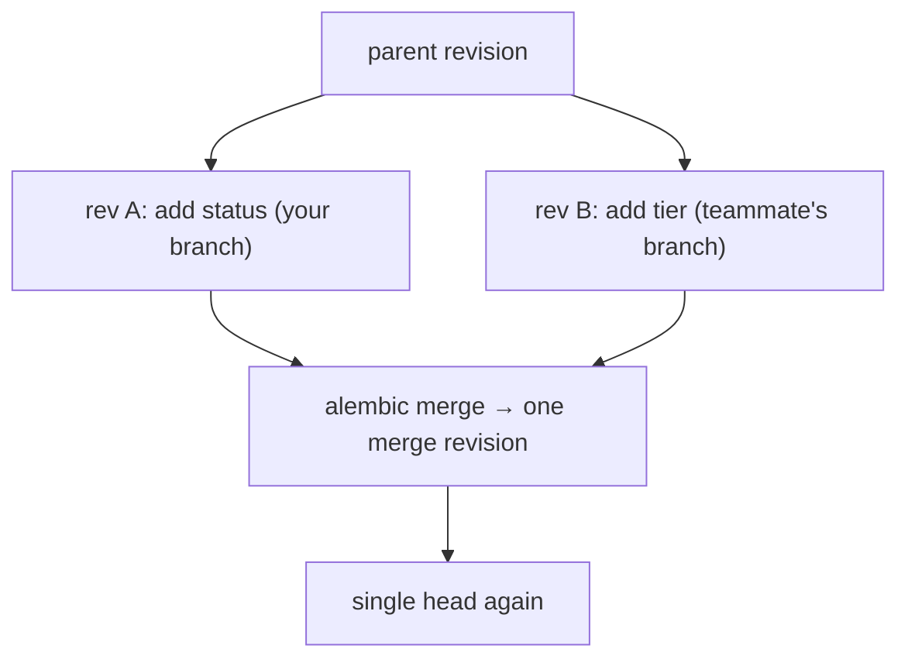

# Alembic, From Zero

Your SQLAlchemy models describe what the schema *should* be. Alembic's job is getting a real database — one that already holds production data — from what it *is* to what it should be, safely and repeatably. This article builds the setup, walks one migration end to end, breaks the two things that actually break, and finishes with the discipline that keeps migrations from taking production down.

---

## 1. The Problem: The Schema Changes but the Data Must Survive

In development you can drop the database and recreate it from your models whenever they change. The moment real data exists, that option is gone forever. Now every model change — a new column, an index, a renamed field — needs a *transformation* applied to a live database: precise SQL, run exactly once, in the right order, on every environment from your laptop to production.

Doing that by hand means a folder of `.sql` files and a wiki page about which ones ran where. Alembic replaces that with **migrations as code**: each schema change is a small Python script with an `upgrade()` and a `downgrade()`, a unique revision id, and a pointer to its parent revision. Chained together they form a linked list from "empty database" to "current schema," and Alembic records which revision each database has reached in a one-row table called `alembic_version`. Any database, any environment: run `alembic upgrade head` and it applies exactly the missing steps.

## 2. Setup: Teaching Alembic About Your Models (How)

```bash
pip install alembic
alembic init -t async alembic   # -t async matches our async engine
```

That creates `alembic.ini` (config, including the database URL), and an `alembic/` folder with `env.py` — the script that runs on every Alembic command — and `versions/`, where migration scripts will live.

One edit makes the whole thing work. Alembic's killer feature is *comparing your models to the live database* and writing the migration for you, but out of the box it has no idea where your models are. You point it at them in `env.py`:

```python
# Gist: alembic/env.py (the two lines that matter)
from app.models import Base   # the DeclarativeBase from 02_sqlalchemy.md
# Importing the models module registers every table on Base.metadata.

target_metadata = Base.metadata
```

Now Alembic can see both sides: `Base.metadata` says what the schema should be; the database connection says what it is. The difference between them is a migration.

## 3. One Migration, End to End

Say the fraud team needs a `status` column on transactions. Step one: change the model, because **the model is the source of truth** —

```python
class Transaction(Base):
    __tablename__ = "transactions"
    # ...existing columns...
    status: Mapped[str] = mapped_column(String(20), server_default="completed")
```

Step two: ask Alembic to diff models against the database:

```bash
alembic revision --autogenerate -m "add status to transactions"
```

Step three — and this is the step that separates juniors from seniors — **read what it generated** before running it:

```python
# Gist: alembic/versions/3f2a91c4d7b8_add_status_to_transactions.py
revision = "3f2a91c4d7b8"
down_revision = "9c1e0aa27f41"   # parent pointer: this is the linked list

def upgrade() -> None:
    op.add_column(
        "transactions",
        sa.Column("status", sa.String(20), server_default="completed", nullable=False),
    )

def downgrade() -> None:
    op.drop_column("transactions", "status")
```

Step four, apply it: `alembic upgrade head`. Alembic checks `alembic_version`, sees the database is at `9c1e0aa27f41`, walks the chain forward, runs your `upgrade()`, and stamps the new revision. Run it again and nothing happens — already at head. That idempotence is the whole point: the same command is safe on your laptop, in CI, and in the deploy pipeline. `alembic downgrade -1` steps back one revision (useful in dev; section 5 explains why production rollbacks usually roll *forward* instead).

## 4. Break It On Purpose: Two Classic Failures

**Failure one: the rename that deletes your data.** Rename `owner` to `owner_name` in the model and autogenerate. Alembic cannot know that's a rename — it diffs two snapshots, and what it sees is "a column named `owner` no longer exists, a new column `owner_name` appeared." So it generates `drop_column` + `add_column`, which on a real database **destroys every value in that column**. It will do this silently, and it will pass in dev where the data doesn't matter. The fix is writing the intent yourself:

```python
def upgrade() -> None:
    op.alter_column("transactions", "owner", new_column_name="owner_name")
```

This generalizes into the rule: **autogenerate is a diff, not a plan.** It also misses data backfills entirely and mishandles some type and constraint changes. Review every generated script like code, because it is code — code that runs against production with no test suite in front of it.

**Failure two: two developers, two heads.** You and a teammate branch from the same commit. Each of you adds a migration; both new revisions point to the same parent. Merge both branches and Alembic now sees a fork — two "heads" — and refuses to run:

```text
FAILED: Multiple head revisions are present
```



The fix is mechanical: `alembic heads` to list them, then `alembic merge -m "merge heads" revA revB` creates an empty revision whose parent is *both* heads, restoring a single chain. It's the migration equivalent of a git merge commit. Knowing this workflow cold matters because it happens on every team, usually the week someone claims it never happens.

## 5. Production Discipline (Why & How)

Everything above works. What follows is what keeps it working *at 2 PM on a Tuesday under live traffic*.

**Know which DDL locks.** Some schema changes take an `ACCESS EXCLUSIVE` lock on the table — and here's the ugly part: if that lock has to *wait* behind one long-running query, every subsequent query on the table queues behind the waiting DDL. A one-second migration becomes a full outage. Defenses: set a `lock_timeout` in the migration so it gives up instead of ambushing traffic, and create indexes on live tables with `op.create_index(..., postgresql_concurrently=True)`, which builds without blocking writes. The lock mechanics are worked through in [06/01](../06_testing_and_migrations/01_testing_and_migrations.md).

**Backfill in batches, outside the DDL.** "Add column, then populate it for 200M rows" must not be one transaction — that's a multi-hour lock and a giant WAL spike. Add the column nullable in one revision; backfill in chunked `UPDATE ... WHERE id BETWEEN ...` statements (a script or a separate data migration); add the `NOT NULL` constraint in a later revision once the data is there.

**Migrations deploy before code, and must be backward-compatible.** During a rolling deploy, old and new application code run against the same schema simultaneously. So every migration has to leave the database usable by the *previous* release. That's the expand/contract pattern: **expand** (add the new nullable column — old code ignores it), deploy code that writes both shapes, backfill, and only releases later **contract** (drop the old column, add strict constraints). The deployment side of this argument lives in [04/09](../04_architecture_and_system_design/09_deployment_scaling_statelessness.md).

**Rollback honestly.** `downgrade()` is valuable in development. In production, once a contract-phase migration has dropped data, no script can un-drop it — so real-world production rollback is usually *roll forward*: write a new revision that fixes the problem. This is exactly why contract waits until nothing references the old shape.

## 6. Interview Angles

**"Walk me through your migration workflow on a team."** Change the model, autogenerate, then review the script like the production code it is — checking for renames disguised as drop-and-create, for missing backfills, and for DDL that locks a hot table. Dry-run with `alembic upgrade head --sql` when a DBA wants to see raw SQL. Merge concurrent heads with `alembic merge` as routinely as you'd merge git branches. Deploy migrations before code, keeping each one backward-compatible with the release still running.

**"A migration is 'stuck' and now the whole API is timing out. What happened?"** The migration's DDL is waiting for an exclusive lock behind some long-running transaction, and every new query has queued up behind the waiting DDL — so a stuck migration reads as a site outage. Find the blocker in `pg_stat_activity`, kill it or abort the migration, and prevent the recurrence with `lock_timeout` and off-peak migration windows. (This exact scenario is drilled as mock Scenario 3 in [03/02](../03_mock_interviews_and_scenarios/02_mock_interview_drills_scenarios.md).)

**"How do you add a NOT NULL column to a 200M-row table with zero downtime?"** In three separate steps, not one: add the column nullable with a server default (fast, metadata-only on modern Postgres); backfill existing rows in batches outside any long transaction; then add the constraint once every row complies. One revision per step, each backward-compatible — the expand/contract pattern applied at column scale.
