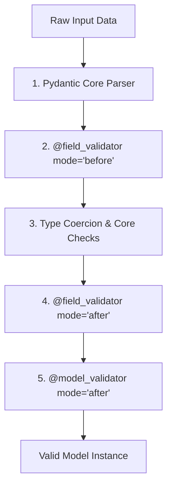

# Pydantic v2 Specification

A deep-dive reference guide to Pydantic v2's core architecture, validation lifecycles, strict parsing, serialization, and FastAPI schema configurations.

---

## 1. Validation Mechanics & Rust Core (Why & What)

### Why Pydantic v2?
Pydantic is the leading validation library for Python. Version 2.0 was a complete rewrite, with the core validation logic moved to a Rust library (`pydantic-core`), making it 5-50x faster.

### Strict vs. Lax Validation Mode
* **Lax Mode (Default)**: Pydantic tries to coerce types. If a field expects a string and receives an integer (`123`), Pydantic converts it to `"123"`.
* **Strict Mode**: Pydantic forbids type coercion. If a field is typed as `str` and receives an integer, validation fails instantly. This prevents silent bugs (like accidentally accepting floats into integer IDs).

### The Validation and Hook Lifecycle
When data is fed to a Pydantic model:
1. **Pydantic Core (Rust)** parses input JSON/Dict keys, verifying basic structures.
2. **Before Field Validators** (`@field_validator(..., mode='before')`) allow custom changes to the raw input (e.g. trimming whitespaces, parsing stringified dates) before type coercion.
3. **Pydantic Type Check** validates matching types.
4. **After Field Validators** (`@field_validator(..., mode='after')`) perform validation checks on the validated type (e.g., verifying if an email domain matches allowed domains).
5. **Model-level Validators** (`@model_validator(mode='after')`) compare multiple fields (e.g., checking that `password` equals `confirm_password`).



---

## 2. Validation Blueprint (How)

### Gist: pydantic_v2_validation.py
A complete Pydantic model blueprint illustrating strict validation, aliases, before/after validators, model-level validation, and serialization control.

```python
# Gist: pydantic_v2_validation.py
from datetime import datetime
from typing import List, Optional
from pydantic import BaseModel, Field, EmailStr, field_validator, model_validator, ValidationError

# 1. Custom Address Schema
class UserAddress(BaseModel):
    street: str
    city: str
    postal_code: str = Field(..., pattern=r"^\d{5}(-\d{4})?$")  # Enforces ZIP pattern

# 2. Main User Schema (Strict Validation Enabled)
class UserRegistrationSchema(BaseModel):
    # Enforces strict mode globally for this model (no type coercions allowed)
    model_config = {"strict": True, "populate_by_name": True}

    # Field mappings and configuration
    email: EmailStr
    username: str = Field(..., min_length=3, max_length=50)
    
    # Aliasing: Map 'accessKey' from incoming JSON payload to 'access_key'
    access_key: str = Field(..., alias="accessKey")
    
    password: str = Field(..., min_length=8)
    confirm_password: str = Field(..., min_length=8)
    
    # Nested configurations
    address: Optional[UserAddress] = None
    created_at: Optional[datetime] = None

    # ---------------------------------------------------------
    # FIELD VALIDATORS
    # ---------------------------------------------------------
    @field_validator("username", mode="before")
    @classmethod
    def clean_username(cls, v: str) -> str:
        # Why: Clean up inputs before type checking
        if isinstance(v, str):
            return v.strip().lower()
        return v

    @field_validator("password", mode="after")
    @classmethod
    def verify_password_complexity(cls, v: str) -> str:
        # Why: Runs validation logic after standard type validations pass
        special_chars = "!@#$%^&*(),.?\":{}|<>"
        if not any(char in special_chars for char in v):
            raise ValueError("Password must contain at least one special character")
        return v

    # ---------------------------------------------------------
    # MODEL-LEVEL VALIDATORS
    # ---------------------------------------------------------
    @model_validator(mode="after")
    def verify_password_match(self) -> "UserRegistrationSchema":
        # Why: Cross-field checks must happen at the model level
        if self.password != self.confirm_password:
            raise ValueError("password and confirm_password must match")
        return self

# ---------------------------------------------------------
# EXECUTION TESTING
# ---------------------------------------------------------
if __name__ == "__main__":
    valid_payload = {
        "email": "alice@innovate.com",
        "username": "  AliceSmith  ",
        "accessKey": "secret_key_123",
        "password": "SecurePassword123!",
        "confirm_password": "SecurePassword123!",
        "address": {
            "street": "123 Main St",
            "city": "Boston",
            "postal_code": "02108"
        }
    }

    try:
        user = UserRegistrationSchema(**valid_payload)
        # Serialization: model_dump ignores aliases, returning pythonic snake_case
        print("Validated Model Dump:")
        print(user.model_dump())
        
        # Serialization: model_dump_json serializes fields back using original alias names
        print("\nJSON Output (with aliases):")
        print(user.model_dump_json(by_alias=True, indent=2))
        
    except ValidationError as e:
        print("Validation errors encountered:")
        print(e.json(indent=2))
```
