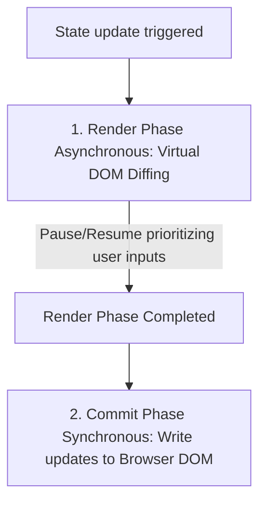

# React Framework Specification (Comprehensive Masterclass)

React is a declarative component-based UI library. Understanding its core rendering phases, reconciliation engine (React Fiber), and hook dependencies is critical to building performant dashboards.

---

## 1. Reconciliation Engine & React Fiber (Why & What)

### React Fiber Architecture
React Fiber is the core reconciliation engine introduced in React 16. It handles diffing the Virtual DOM tree and mapping changes to the physical DOM. 

Key architectural components include:
* **The Render Phase (Asynchronous)**:
  * React builds a tree of Fiber nodes and computes the diff between the current tree and the new tree.
  * This phase is pure computation and does not make changes to the actual DOM. It can be paused, discarded, or resumed by React to prioritize high-urgency user events (like input typing) over low-urgency tasks (like rendering charts).
* **The Commit Phase (Synchronous)**:
  * React applies changes (inserts, updates, deletes) to the physical DOM tree.
  * This phase cannot be paused, ensuring the browser DOM remains consistent.



### The Key Reconciliation Rule
When rendering lists of elements, you must assign a unique `key` prop to each element:
* **Why**: The Fiber reconciliation engine uses the `key` to identify which items in a list have changed, been added, or been removed. 
* **The Trap**: Using index positions (e.g. `key={index}`) as keys is an anti-pattern. If the list is sorted, filtered, or has items inserted in the middle, the index changes, forcing React to destroy and recreate all DOM nodes instead of reusing them. Always use a unique identifier (like database IDs).

---

## 2. Core Hooks & Lifecycle Boundaries (How)

### Core State Hooks
* **`useState`**: Schedules state updates. React batches multiple state updates inside event handlers into a single re-render pass to prevent layout thrashing.
* **`useEffect`**: Handles side effects (like data fetching, event listeners, or WebSocket connections).
  * **Critical Rule**: Always return a cleanup function in `useEffect` to close sockets, clear intervals, or remove listeners. Failing to do so causes memory leaks.

```typescript
useEffect(() => {
  const handleScroll = () => console.log('scroll event');
  window.addEventListener('scroll', handleScroll);
  
  // Cleanup hook
  return () => window.removeEventListener('scroll', handleScroll);
}, []); // Empty dependencies array: runs only on mount and unmount
```

### Performance Optimization Hooks
* **`useMemo`**: Caches the result of a computationally expensive function.
  * *Example*: Filtering or sorting large datasets before passing them to charts.
* **`useCallback`**: Caches a function definition itself between rendering passes.
  * **Why**: Every time a component renders, all functions declared inside it are recreated. Passing an inline function to a child component causes the child to re-render (since the function reference changed). Wrapping the function in `useCallback` keeps the reference stable.

---

## 3. Advanced Context & Performance (How)

### Gist: react_performance_mastery.tsx
A reference implementation demonstrating custom state extraction, `React.memo` caching, stable callback injections, and Context optimization.

```tsx
// Gist: react_performance_mastery.tsx
import React, { useState, useCallback, useMemo, useContext, createContext } from 'react';

// 1. CREATE PERFORMANCE-SAFE CONTEXT
interface ThemeContextType {
  theme: 'light' | 'dark';
  toggleTheme: () => void;
}
const ThemeContext = createContext<ThemeContextType | null>(null);

// 2. PRESENTATIONAL COMPONENT (Dumb component wrapped in React.memo)
interface ChartCardProps {
  title: string;
  data: number[];
  onReset: () => void;
}

// React.memo: Child only re-renders if props change (shallow comparison)
const ChartCard: React.FC<ChartCardProps> = React.memo(({ title, data, onReset }) => {
  console.log(`Rendering ChartCard: ${title}`);
  const total = data.reduce((a, b) => a + b, 0);
  
  return (
    <div className="p-6 bg-gray-900 border border-gray-800 rounded-xl text-white">
      <h3 className="text-xs font-bold uppercase text-gray-400">{title}</h3>
      <p className="text-2xl font-black mt-2">Sum: {total}</p>
      <button 
        onClick={onReset}
        className="mt-4 text-xs bg-blue-600 hover:bg-blue-700 px-3 py-1 rounded"
      >
        Clear Data
      </button>
    </div>
  );
});
ChartCard.displayName = 'ChartCard';

// 3. CONTAINER COMPONENT (Smart controller managing states and contexts)
export const DashboardController: React.FC = () => {
  const [theme, setTheme] = useState<'light' | 'dark'>('dark');
  const [metrics, setMetrics] = useState<number[]>([10, 20, 30, 40]);
  const [logs, setLogs] = useState<string[]>([]);

  // Stable Callback: reference remains identical across parent re-renders
  // Why: If we pass this function without useCallback to ChartCard, the child 
  // will re-render every time we add a log, even though the metrics prop didn't change!
  const resetMetrics = useCallback(() => {
    setMetrics([]);
  }, []);

  const toggleTheme = useCallback(() => {
    setTheme(prev => prev === 'light' ? 'dark' : 'light');
  }, []);

  // Memoized Calculation: prevents sorting array on unrelated state updates (e.g. logging)
  const sortedMetrics = useMemo(() => {
    console.log('Calculating sorted metrics...');
    return [...metrics].sort((a, b) => b - a);
  }, [metrics]);

  // Memoize Context Value object
  // Why: If we pass the object directly (value={{ theme, toggleTheme }}), a new object
  // reference is created on every render, forcing all context consumers to re-render.
  const contextValue = useMemo(() => ({
    theme,
    toggleTheme
  }), [theme, toggleTheme]);

  return (
    <ThemeContext.Provider value={contextValue}>
      <div className={`p-8 ${theme === 'dark' ? 'bg-[#030712]' : 'bg-white'}`}>
        <div className="grid grid-cols-1 md:grid-cols-2 gap-6">
          <ChartCard 
            title="Revenue Telemetry" 
            data={sortedMetrics} 
            onReset={resetMetrics} 
          />
          
          <div className="p-6 bg-gray-900 rounded-xl">
            <button 
              onClick={toggleTheme}
              className="bg-purple-600 hover:bg-purple-700 px-4 py-2 rounded text-white text-xs font-bold"
            >
              Toggle Theme
            </button>
            <button 
              onClick={() => setLogs(prev => [...prev, `log at ${Date.now()}`])}
              className="ml-4 bg-gray-700 hover:bg-gray-800 px-4 py-2 rounded text-white text-xs font-bold"
            >
              Add Log
            </button>
            <div className="mt-4 text-xs text-gray-400 space-y-1">
              {logs.slice(-3).map((log, idx) => (
                <div key={idx}>{log}</div> // Static debug list: index key is acceptable here
              ))}
            </div>
          </div>
        </div>
      </div>
    </ThemeContext.Provider>
  );
};
