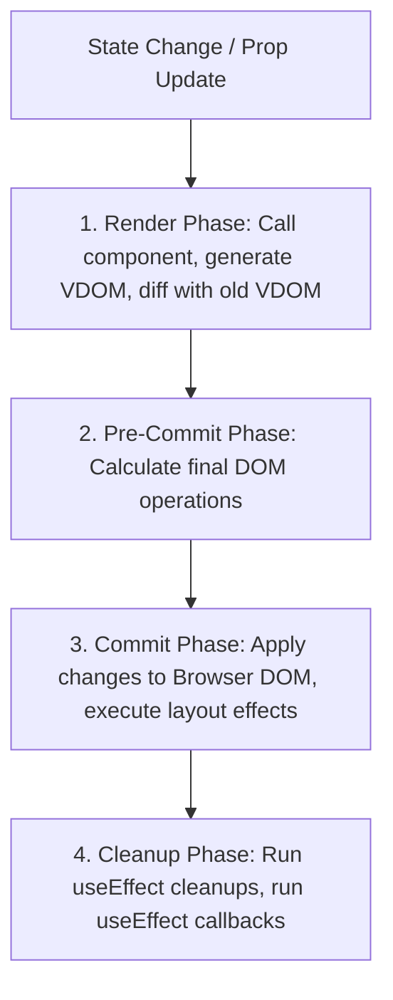

# React Framework Specification

A deep-dive reference guide to React's architecture, Fiber engine reconciliation, state batching, hook optimizations, and custom render flows.

---

## 1. Core Architecture & Render Flow (Why & What)

### Why React 18 & Fiber Engine?
React uses a virtual representation of the DOM. The core reconciliation engine, **Fiber**, allows React to split rendering work into chunks and pause/resume updates to prevent freezing the main thread.

### The Render and Commit Cycle
React UI updates flow through three main phases:
1. **Render Phase**: Compares virtual elements. React walks down the component tree calling component functions to calculate changes (the Diffing process). This phase is purely computational and has no side effects on the DOM.
2. **Pre-Commit Phase (Reconciliation)**: Walks the tree to calculate final changes using the `key` prop to identify reused elements.
3. **Commit Phase**: React applies the changes to the actual browser DOM (inserts, updates, deletes).



### Hook Optimizations
* **`useEffect`**: Runs asynchronously *after* the render is committed to the screen. Always return a **cleanup function** to cancel socket connections, API requests, or interval timers.
* **`useMemo`**: Cache the result of expensive calculations (e.g., parsing raw metrics arrays).
* **`useCallback`**: Cache function definitions. Essential when passing event handlers as props to child components optimized with `React.memo` (otherwise, a new function instance is created on every render, breaking the memoization).
* **`useRef`**: Persist mutable values across renders without triggering a new render cycle. Useful for storing previous state values or timer references.

---

## 2. Optimization Blueprint (How)

### Gist: OptimizedDashboardContainer.tsx
A TypeScript React component illustrating custom hooks, hook optimizations, cleanup patterns, and React.memo integrations.

```typescript
// Gist: OptimizedDashboardContainer.tsx
import React, { useState, useEffect, useMemo, useCallback, useRef } from 'react';

// 1. Memoized Child Component
// Why: Prevents re-rendering this card if parent state changes but metric props remain equal
interface MetricCardProps {
  label: string;
  value: number;
}

const MetricCard: React.FC<MetricCardProps> = React.memo(({ label, value }) => {
  console.log(`Rendering MetricCard: ${label}`);
  return (
    <div className="p-4 bg-gray-800 text-white rounded shadow">
      <h3 className="text-sm font-semibold text-gray-400">{label}</h3>
      <p className="text-2xl font-bold">{value.toFixed(2)}</p>
    </div>
  );
});
MetricCard.displayName = 'MetricCard';

// 2. Main Dashboard Component
export const OptimizedDashboardContainer: React.FC = () => {
  const [ticker, setTicker] = useState<number>(0);
  const [rawMetrics, setRawMetrics] = useState<number[]>([10, 20, 30, 40]);
  
  // useRef to keep track of intervals
  const intervalRef = useRef<NodeJS.Timeout | null>(null);

  // ---------------------------------------------------------
  // LIFECYCLE & CLEANUP
  // ---------------------------------------------------------
  useEffect(() => {
    // Why: Creates polling interval, clean it up when component unmounts
    intervalRef.current = setInterval(() => {
      setTicker((prev) => prev + 1);
    }, 1000);

    return () => {
      if (intervalRef.current) {
        clearInterval(intervalRef.current);
      }
    };
  }, []); // Empty array ensures this effect runs once on mount

  // ---------------------------------------------------------
  // MEMOIZED CALCULATION
  // ---------------------------------------------------------
  // Why: Avoids recalculating math functions on every ticker change
  const processedMetricsSum = useMemo(() => {
    console.log('Calculating heavy metrics sum...');
    return rawMetrics.reduce((sum, item) => sum + item, 0);
  }, [rawMetrics]);

  // ---------------------------------------------------------
  // MEMOIZED EVENT HANDLERS
  // ---------------------------------------------------------
  // Why: useCallback ensures function reference is identical across render passes
  const handleAddMetric = useCallback(() => {
    setRawMetrics((prev) => [...prev, Math.random() * 100]);
  }, []);

  return (
    <div className="p-6 bg-gray-900 min-h-screen">
      <div className="flex justify-between items-center mb-6">
        <h1 className="text-xl font-bold text-white">Live Monitoring Board</h1>
        <span className="text-gray-400 text-sm">System Uptime: {ticker}s</span>
      </div>

      <div className="grid grid-cols-2 gap-4 mb-6">
        <MetricCard label="Total Aggregated Sum" value={processedMetricsSum} />
        <MetricCard label="Average Performance" value={processedMetricsSum / rawMetrics.length} />
      </div>

      <button
        onClick={handleAddMetric}
        className="bg-blue-600 hover:bg-blue-700 text-white font-bold px-4 py-2 rounded transition-colors"
      >
        Push New Data Point
      </button>
    </div>
  );
};
```
