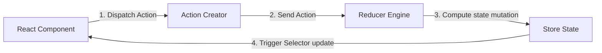

# Redux Toolkit Specification (Comprehensive Masterclass)

Redux Toolkit (RTK v2.12.0 stable in 2026) is the official, opinionated toolset for efficient Redux state management. It solves legacy Redux boilerplates by integrating Immer.js for mutating state declarations and standardizing middleware configurations.

---

## 1. Redux Architecture & Immer Integration (Why & What)

### Redux Core Flow
Redux enforces a unidirectional data flow to make state changes predictable:
1. **Components** query global state using selectors and dispatch **Actions** to trigger changes.
2. **Actions** represent payload structures detailing what occurred.
3. **Reducers** accept the current State and Action, computing the new State.
4. The **Store** holds the global state tree, notifying subscribed components to re-render.



### Why Choose Redux Toolkit?
Legacy Redux required writing massive boilerplate code (actions, action creators, constants, reducers, and immutable copy operations using spread operators `...state`). 

RTK resolves this using:
* **`createSlice`**: Consolidates action creators and reducers into a single interface.
* **Immer.js Integration**: Under the hood, RTK wraps your reducer logic in Immer. You can write standard JavaScript mutating syntax (e.g. `state.todos.push(todo)`) inside your reducers. Immer intercepts these operations and converts them to safe, immutable copy updates.
* **Middleware Integration**: Automatically configures Redux DevTools and mounts `redux-thunk` by default to handle asynchronous operations.

---

## 2. Basic Setup & Slice Creation (How)

### Step 1: Create a Slice
Use `createSlice` to declare state properties, synchronous actions, and Immer-driven mutators.

```typescript
import { createSlice, PayloadAction } from '@reduxjs/toolkit';

interface UserState {
  id: number | null;
  name: string;
  isLoggedIn: boolean;
}

const initialState: UserState = {
  id: null,
  name: '',
  isLoggedIn: false,
};

const userSlice = createSlice({
  name: 'user',
  initialState,
  reducers: {
    loginUser: (state, action: PayloadAction<{ id: number; name: string }>) => {
      // Immer allows direct mutations safely
      state.id = action.payload.id;
      state.name = action.payload.name;
      state.isLoggedIn = true;
    },
    logoutUser: (state) => {
      state.id = null;
      state.name = '';
      state.isLoggedIn = false;
    },
  },
});

export const { loginUser, logoutUser } = userSlice.actions;
export const userReducer = userSlice.reducer;
```

### Step 2: Configure Global Store
Combine reducers and register middlewares.

```typescript
import { configureStore } from '@reduxjs/toolkit';

export const store = configureStore({
  reducer: {
    user: userReducer,
  },
  // DevTools and Thunk middlewares are pre-configured automatically
});

export type RootState = ReturnType<typeof store.getState>;
export type AppDispatch = typeof store.dispatch;
```

---

## 3. Advanced Async Thunks & Selectors (How)

### Gist: rtk_thunks_selectors.ts
A production-grade implementation of asynchronous side-effects using `createAsyncThunk` and memoized selector composition.

```typescript
// Gist: rtk_thunks_selectors.ts
import { createSlice, createAsyncThunk, createSelector, PayloadAction } from '@reduxjs/toolkit';
import axios from 'axios';

interface Transaction {
  id: string;
  amount: number;
  status: 'pending' | 'success' | 'failed';
}

interface BankingState {
  transactions: Transaction[];
  loading: boolean;
  error: string | null;
}

const initialState: BankingState = {
  transactions: [],
  loading: false,
  error: null,
};

// 1. CREATE ASYNCHRONOUS THUNK ACTION
// Why: Encapsulates network operations, auto-dispatching pending/fulfilled/rejected actions
export const fetchTransactions = createAsyncThunk(
  'banking/fetchTransactions',
  async (accountId: number, { rejectWithValue }) => {
    try {
      const response = await axios.get<Transaction[]>(`/api/v1/accounts/${accountId}/transactions`);
      return response.data;
    } catch (err: any) {
      return rejectWithValue(err.response?.data?.detail || 'Network transaction fetch failed');
    }
  }
);

// 2. CREATE SLICE REGISTERING EXTRA REDUCERS
const bankingSlice = createSlice({
  name: 'banking',
  initialState,
  reducers: {
    clearTransactions: (state) => {
      state.transactions = [];
    },
  },
  extraReducers: (builder) => {
    builder
      .addCase(fetchTransactions.pending, (state) => {
        state.loading = true;
        state.error = null;
      })
      .addCase(fetchTransactions.fulfilled, (state, action: PayloadAction<Transaction[]>) => {
        state.loading = false;
        state.transactions = action.payload; // Replaces state cache
      })
      .addCase(fetchTransactions.rejected, (state, action) => {
        state.loading = false;
        state.error = action.payload as string;
      });
  },
});

export const { clearTransactions } = bankingSlice.actions;
export const bankingReducer = bankingSlice.reducer;

// ---------------------------------------------------------
// 3. MEMOIZED SELECTOR COMPOSITION
// ---------------------------------------------------------
interface RootStoreState {
  banking: BankingState;
}

const selectBankingState = (state: RootStoreState) => state.banking;

// Select raw transactions
export const selectAllTransactions = createSelector(
  [selectBankingState],
  (banking) => banking.transactions
);

// Memoized Sub-Selector: filters transactions dynamically
// Why: This selector only recalculates if transactions array changes. If other state
// fields update (like loading flags), the cached result is returned directly, avoiding re-renders.
export const selectSuccessfulTransactions = createSelector(
  [selectAllTransactions],
  (transactions) => {
    console.log('Filtering successful transactions...');
    return transactions.filter((tx) => tx.status === 'success');
  }
);
```
