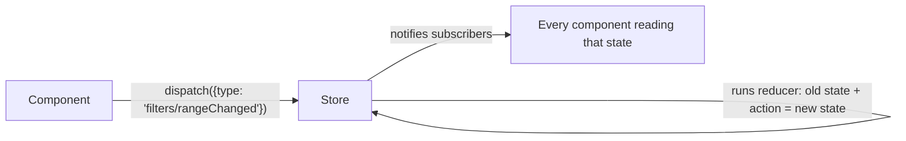

# Redux Toolkit, From Zero

You have never used Redux. By the end of this article you will have built a working store, understood why every piece of it exists, and — just as important — you'll know when Redux is the wrong tool. Everything here runs; nothing assumes prior Redux experience.

---

## 1. The Problem: Shared State With No Good Home

Start with a situation you have already lived. Your dashboard has a date-range filter in the header. The chart grid in the middle of the page needs it to know what to render. The summary bar at the bottom needs it too, to label its totals. Three components, far apart in the tree, all depending on one piece of state.

React's answer is "lift state up": move the filter state to the closest common ancestor. Here, that ancestor is `App` itself. So `App` holds the state and passes it down as props — through the header, through a layout component, through the chart grid container, down to the chart that finally uses it. Every component in that chain now accepts and forwards a prop it personally has no interest in. Add a second piece of shared state (say, the selected account) and you thread it through the same chain again. This is **prop drilling**, and it doesn't fail loudly — it just makes every refactor slower, because moving a component means rewiring its plumbing.

React Context can eliminate the drilling, and for small apps it's often enough. But context gives you no story for *how* state changes are organized. Updates are whatever functions you happened to pass down, there's no log of what changed and why, and every consumer of a context re-renders whenever any part of its value changes.

Redux takes a different position: shared client state shouldn't live in the component tree at all. It lives in a single **store** outside React, and any component, anywhere, can read from it or request a change — no drilling, no common-ancestor hunting.

## 2. The Mental Model: A Ledger, Not a Variable

Redux has a reputation for being complicated. The core is actually three rules:

1. All shared state lives in one object, the **store**.
2. You never modify that object directly. Instead you **dispatch an action** — a plain object that *describes what happened*, like `{ type: "filters/rangeChanged", payload: "30d" }`.
3. A **reducer** — an ordinary function — receives the current state and the action, and returns the next state.

Since you're interviewing at a banking-flavored company, here's the analogy that makes it stick: a Redux store works like a **bank ledger**, not like a balance scribbled on a whiteboard. Nobody walks up and edits the balance. You append a transaction — "deposit 50", "withdraw 20" — and the balance is whatever the history adds up to. That's why Redux calls the changes "actions": they're entries in a log. It's also where Redux's superpower comes from. Because every change is a named, recorded event, the Redux DevTools can show you the exact sequence of actions that produced the current screen, and you can step back through them when something looks wrong.



So where does **Redux Toolkit** fit? Original Redux made you write each piece by hand: action type constants, action creator functions, reducers full of `...state` spreads to avoid mutation. It worked, but a single feature took four files of ceremony. Redux Toolkit (RTK) is the official fix. One function, `createSlice`, generates the actions and the reducer together, and it wires in a library called **Immer** so you can write what *looks like* mutation and get safe immutable updates. RTK isn't a different state manager — it's Redux with the boilerplate removed.

## 3. Build It: A Shared Dashboard Filter (How)

Let's build the header-filter scenario for real. Two packages:

```bash
npm install @reduxjs/toolkit react-redux
```

### Step 1 — the slice

A "slice" is one feature's slice of the global state: its data plus the ways it can change.

```typescript
// Gist: src/features/filters/filtersSlice.ts
import { createSlice, PayloadAction } from '@reduxjs/toolkit';

export type DateRange = '7d' | '30d' | '90d';

interface FiltersState {
  range: DateRange;
  accountId: number | null; // null = "all accounts"
}

const initialState: FiltersState = {
  range: '30d',
  accountId: null,
};

const filtersSlice = createSlice({
  name: 'filters', // becomes the action-type prefix: "filters/rangeChanged"
  initialState,
  reducers: {
    rangeChanged: (state, action: PayloadAction<DateRange>) => {
      state.range = action.payload;
    },
    accountSelected: (state, action: PayloadAction<number | null>) => {
      state.accountId = action.payload;
    },
  },
});

export const { rangeChanged, accountSelected } = filtersSlice.actions;
export default filtersSlice.reducer;
```

Read the reducer bodies again: `state.range = action.payload`. That looks like mutation, which rule 2 said was forbidden. This is Immer at work. Inside `createSlice`, your function receives a *draft* — a proxy that records what you did to it — and Immer uses that recording to produce a brand-new immutable state object. You get the readable syntax; Redux gets the immutability it needs to detect changes by comparing references. You never install or import Immer; RTK does it for you.

Notice also what you did *not* write: no action-type strings, no action-creator functions. `createSlice` generated `rangeChanged` and `accountSelected` for you, and calling `rangeChanged('7d')` simply builds the object `{ type: 'filters/rangeChanged', payload: '7d' }`.

### Step 2 — the store

```typescript
// Gist: src/app/store.ts
import { configureStore } from '@reduxjs/toolkit';
import filtersReducer from '../features/filters/filtersSlice';

export const store = configureStore({
  reducer: {
    filters: filtersReducer, // state.filters is owned by filtersSlice
    // future slices mount here: wizard: wizardReducer, session: sessionReducer...
  },
});

// These two types let the rest of the app stay fully typed.
export type RootState = ReturnType<typeof store.getState>;
export type AppDispatch = typeof store.dispatch;
```

`configureStore` also sets up the Redux DevTools connection and some development-mode safety checks (it will yell at you if you accidentally put something non-serializable in state). In legacy Redux each of those was manual setup.

### Step 3 — typed hooks, written once

`react-redux` gives you `useSelector` and `useDispatch`, but they don't know your state's shape. The standard pattern is to wrap them once:

```typescript
// Gist: src/app/hooks.ts
import { useDispatch, useSelector } from 'react-redux';
import type { RootState, AppDispatch } from './store';

export const useAppDispatch = useDispatch.withTypes<AppDispatch>();
export const useAppSelector = useSelector.withTypes<RootState>();
```

Now every component gets autocomplete on `state.filters.range` for free, and you never repeat the type annotations again.

### Step 4 — connect React to the store

```tsx
// Gist: src/main.tsx
import { Provider } from 'react-redux';
import { store } from './app/store';

createRoot(document.getElementById('root')!).render(
  <Provider store={store}>
    <App />
  </Provider>
);
```

`Provider` is the only place Redux touches your component tree. Under the hood it's a context provider carrying the store — which is why any component below it can reach the store without props.

### Step 5 — use it from two distant components

```tsx
// Gist: src/features/filters/FilterPanel.tsx  (lives in the header)
import { useAppDispatch, useAppSelector } from '../../app/hooks';
import { rangeChanged, DateRange } from './filtersSlice';

export function FilterPanel() {
  const range = useAppSelector((state) => state.filters.range);
  const dispatch = useAppDispatch();

  return (
    <div>
      {(['7d', '30d', '90d'] as DateRange[]).map((r) => (
        <button
          key={r}
          disabled={r === range}
          onClick={() => dispatch(rangeChanged(r))}
        >
          {r}
        </button>
      ))}
    </div>
  );
}
```

```tsx
// Gist: src/features/summary/SummaryBar.tsx  (lives in the footer, far away)
import { useAppSelector } from '../../app/hooks';

export function SummaryBar() {
  const range = useAppSelector((state) => state.filters.range);
  return <footer>Showing totals for the last {range}</footer>;
}
```

No props connect these two components. Neither knows the other exists.

Now trace one click, because this loop is the whole framework. The user clicks **7d**. The handler calls `dispatch(rangeChanged('7d'))`, which sends `{ type: 'filters/rangeChanged', payload: '7d' }` to the store. The store runs your reducer, gets back a new state object where `filters.range` is `'7d'`, and then notifies subscribed components. Here's the part worth remembering: each component re-renders **only if the value its own selector returned has changed**. `SummaryBar` selected `state.filters.range`, that changed, so it re-renders. A component selecting `state.filters.accountId` would not. Selectors are your subscription filter.

## 4. The Selector Trap (and the Fix)

That "only re-renders if the selected value changed" rule has a sharp edge: the comparison is by reference. This selector breaks it:

```typescript
// Re-renders on EVERY dispatch, related or not:
const failed = useAppSelector((s) => s.transactions.items.filter((t) => t.status === 'failed'));
```

`filter` returns a *new array* every time the selector runs, so the reference always differs and the component always re-renders. The fix is `createSelector`, which memoizes: it only recomputes (and only returns a new reference) when its inputs actually changed.

```typescript
// Gist: src/features/transactions/selectors.ts
import { createSelector } from '@reduxjs/toolkit';
import type { RootState } from '../../app/store';

const selectItems = (s: RootState) => s.transactions.items;

export const selectFailedTransactions = createSelector(
  [selectItems],
  (items) => items.filter((t) => t.status === 'failed')
);
```

If dispatches elsewhere in the app leave `items` untouched, subscribers of this selector get the cached array back and skip the re-render. When a Redux app "re-renders everything on every keystroke," an unmemoized selector is the usual culprit.

## 5. The Honest Boundary: What Does NOT Go in Redux

Here is the mistake nearly every Redux codebase contains: transactions fetched from the API, stored in a slice, next to `loading` and `error` flags, updated by a `createAsyncThunk`. You will see this pattern constantly (and RTK does support it), so recognize it:

```typescript
export const fetchTransactions = createAsyncThunk(
  'transactions/fetch',
  async (accountId: number) => {
    const res = await axios.get(`/api/v1/accounts/${accountId}/transactions`);
    return res.data;
  }
);
// ...then extraReducers handles pending / fulfilled / rejected by hand.
```

The problem isn't that it doesn't work. It's that server data is a *cache* — it goes stale, needs revalidating, and needs request-deduping — and this pattern makes you rebuild all of that by hand, badly. Dedicated server-cache tools (SWR, covered next in [07_swr_axios.md](07_swr_axios.md), or RTK's own **RTK Query**) do it for free. The clean division of labor:

* **Redux owns client state**: filters, multi-step wizard progress, selected rows, UI preferences — things whose source of truth *is your app*.
* **SWR / RTK Query owns server state**: anything whose source of truth is the backend.

If you find a slice that mostly mirrors API responses, that's the smell. The fuller argument lives in [02/01](../02_react_redux_swr_dashboard/01_react_dashboard_rendering_state.md).

And sometimes the honest answer is *no Redux at all*: if your shared state is a theme flag and a user object, context is fine. Redux earns its setup cost when several unrelated features read and write shared client state and you want that traffic visible in one debuggable log.

## 6. Interview Angles

**"When would you pick Redux, and when not?"** Pick it when shared *client-owned* state is written from many places and you want every change named and traceable — cross-widget filters, wizard flows, undo/redo. Skip it for server data (that's a cache; SWR or RTK Query own it) and for state a single subtree owns (local state or context). The strongest thing you can say is where the boundary sits, because most Redux misuse is server data in disguise.

**"Why is it safe to 'mutate' state inside createSlice?"** Because you're mutating an Immer draft, not the state. Immer records the changes and produces a new immutable object with structural sharing, so reference-equality change detection — the thing selectors and DevTools depend on — still works. The syntax is ergonomic; the semantics never changed.

**"A dispatch is re-rendering components that shouldn't care. Where do you look?"** At the selectors. Any selector returning a freshly built object or array re-renders its component on every dispatch. Memoize the derivation with `createSelector`, and select the narrowest value each component actually needs.
