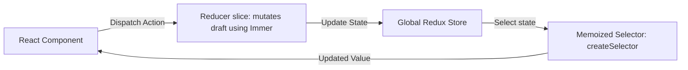

# Redux Toolkit (RTK) Specification

A deep-dive reference guide to Redux Toolkit architecture, state immutability with Immer, slice mapping, selectors, and store configuration.

---

## 1. State Management Architecture (Why & What)

### Why Use Redux Toolkit?
Legacy Redux required massive boilerplate (actions, action creators, reducers, constants, middleware setup). Redux Toolkit (RTK) simplifies this by providing APIs like `createSlice` and `configureStore`, automatically configuring dev tools and middleware (like Redux Thunk).

### Immer Integration Under the Hood
In standard Redux, reducers must never mutate state. You had to copy objects using spread operators (`...state`). RTK’s `createSlice` integrates **Immer.js**. Immer wraps state changes in a "Draft" proxy, allowing you to write mutating code (e.g. `state.items.push(x)`) while translating it into a secure, immutable update under the hood.

### Memoized Selectors (`createSelector`)
When components select data from the store (`useSelector`), they re-render if the returned value changes. If your selector performs calculations (like filtering an array), it returns a new array reference every time, causing re-renders even if the underlying data didn't change. Memoized selectors cache their outputs, only recalculating if inputs change.



---

## 2. Store Configuration Blueprint (How)

### Gist: redux_store_setup.ts
A complete Redux Toolkit setup demonstrating store configuration, IMMER-driven slices, async thunks, and memoized selectors.

```typescript
// Gist: redux_store_setup.ts
import { configureStore, createSlice, createSelector, PayloadAction } from '@reduxjs/toolkit';

// ---------------------------------------------------------
// 1. STATE DEFINITION & SLICE
// ---------------------------------------------------------
interface Notification {
  id: string;
  message: string;
  type: 'info' | 'error' | 'success';
}

interface SystemState {
  notifications: Notification[];
  loadingState: 'idle' | 'pending' | 'succeeded' | 'failed';
}

const initialState: SystemState = {
  notifications: [],
  loadingState: 'idle',
};

const systemSlice = createSlice({
  name: 'system',
  initialState,
  reducers: {
    // Why Immer: We can use array.push() directly. Immer translates it to an immutable copy.
    addNotification: (state, action: PayloadAction<Omit<Notification, 'id'>>) => {
      const newNotification = {
        ...action.payload,
        id: Math.random().toString(36).substring(7),
      };
      state.notifications.push(newNotification);
    },
    removeNotification: (state, action: PayloadAction<string>) => {
      state.notifications = state.notifications.filter((n) => n.id !== action.payload);
    },
    clearAllNotifications: (state) => {
      state.notifications = [];
    },
    setLoadingState: (state, action: PayloadAction<SystemState['loadingState']>) => {
      state.loadingState = action.payload;
    },
  },
});

// Export slice actions
export const {
  addNotification,
  removeNotification,
  clearAllNotifications,
  setLoadingState,
} = systemSlice.actions;

// ---------------------------------------------------------
// 2. STORE CONFIGURATION
// ---------------------------------------------------------
export const store = configureStore({
  reducer: {
    system: systemSlice.reducer,
  },
  // DevTools and Redux Thunk middleware are pre-configured automatically
  middleware: (getDefaultMiddleware) => getDefaultMiddleware(),
});

// Infer RootState and AppDispatch types
export type RootState = ReturnType<typeof store.getState>;
export type AppDispatch = typeof store.dispatch;

// ---------------------------------------------------------
// 3. MEMOIZED SELECTORS
// ---------------------------------------------------------
const selectSystemState = (state: RootState) => state.system;

// Select raw notifications
export const selectNotifications = createSelector(
  [selectSystemState],
  (system) => system.notifications
);

// Select filtered notifications (Memoized to prevent unnecessary component re-renders)
// Why: Only recalculates if notifications array changes, ignoring loadingState changes
export const selectErrorNotifications = createSelector(
  [selectNotifications],
  (notifications) => notifications.filter((n) => n.type === 'error')
);
```
