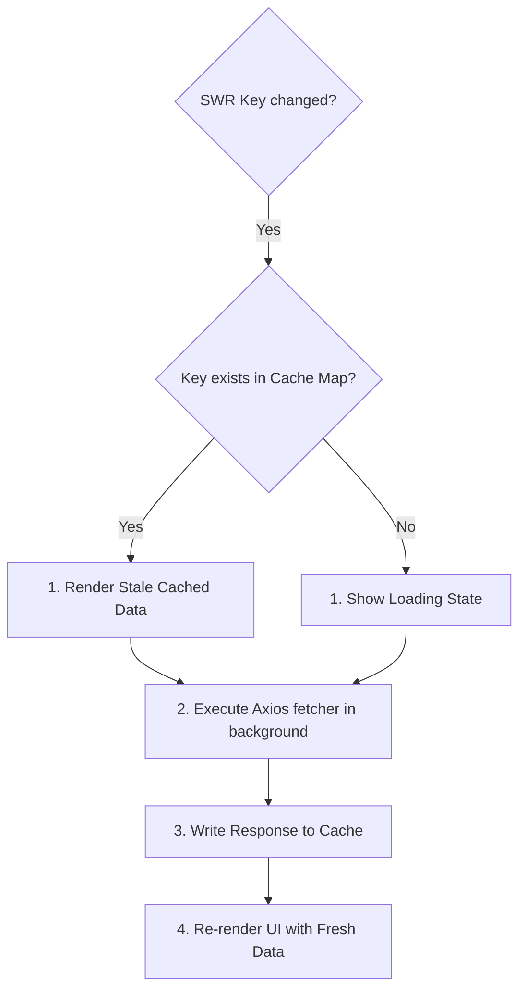

# SWR and Axios Client Specification

A deep-dive reference guide to SWR caching keys, optimistic mutations, dependent fetching, and Axios interceptor configurations.

---

## 1. Network Caching & Client Architecture (Why & What)

### Why Combine SWR and Axios?
SWR manages cache states, timing configurations, background revalidations, and connection recovery. Axios handles connection setups, HTTP verb configurations, serializations, and header interceptions. Combining them creates a clean, robust data-fetching layer.

### SWR Cache Key Design
SWR resolves cache entries based on the **key** passed as the first argument to `useSWR(key, fetcher)`.
* **String Keys**: Simple endpoints (e.g., `"/users"`).
* **Object / Array Keys**: Encompasses complex filter dependencies (e.g., `["/metrics", tenantId, dateRange]`). If any parameter in the key changes, SWR automatically invalidates the cache and fetches new data.
* **Function Keys**: Dynamic endpoints. If the function throws or returns a falsy value, SWR suspends execution. This is essential for **dependent fetching** (waiting for User ID before fetching User Profiles).



---

## 2. Implementation Blueprint (How)

### Gist: swr_axios_integration.ts
A complete TypeScript module configuring Axios clients with JWT token insertion, error interceptors, and custom SWR hooks for dependent fetching.

```typescript
// Gist: swr_axios_integration.ts
import axios, { AxiosError } from 'axios';
import useSWR from 'swr';

// ---------------------------------------------------------
// 1. AXIOS CLIENT SETUP WITH INTERCEPTORS
// ---------------------------------------------------------
export const httpClient = axios.create({
  baseURL: 'http://localhost:8000/api/v1',
  timeout: 5000,
});

// Request Interceptor: Inject JWT token into authorization headers
httpClient.interceptors.request.use(
  (config) => {
    const token = localStorage.getItem('access_token');
    if (token && config.headers) {
      config.headers.Authorization = `Bearer ${token}`;
    }
    return config;
  },
  (error) => Promise.reject(error)
);

// Response Interceptor: Intercept 401 Unauthorized errors to trigger logout/refresh
httpClient.interceptors.response.use(
  (response) => response,
  (error: AxiosError) => {
    if (error.response?.status === 401) {
      localStorage.removeItem('access_token');
      window.location.href = '/login';
    }
    return Promise.reject(error);
  }
);

// Generic SWR Fetcher using Axios Client
export const apiFetcher = (url: string) => 
  httpClient.get(url).then((res) => res.data);

// ---------------------------------------------------------
// 2. CUSTOM SWR HOOKS (Conditional & Dependent Fetching)
// ---------------------------------------------------------
interface UserProfile {
  id: number;
  name: string;
  organization_id: number;
}

interface OrgStats {
  member_count: number;
  active_projects: number;
}

// Dependent Fetch Hook
export const useOrganizationAnalytics = () => {
  // Step 1: Fetch User Profile
  const { data: userProfile, error: userError } = useSWR<UserProfile>(
    '/users/me', 
    apiFetcher
  );

  // Step 2: Fetch Organization Analytics, dependent on userProfile loading successfully
  // Why Function Key: SWR checks if the function returns null/falsy.
  // If userProfile isn't loaded yet, it returns null and SWR suspends the request.
  const { data: orgStats, error: statsError, mutate } = useSWR<OrgStats>(
    () => (userProfile ? `/orgs/${userProfile.organization_id}/stats` : null),
    apiFetcher,
    {
      revalidateOnFocus: false, // Prevents aggressive refresh on tab change
      dedupingInterval: 10000,   // Cache is considered fresh for 10 seconds
    }
  );

  // Optimistic Cache Mutation
  const incrementProjectCount = async () => {
    if (!orgStats || !userProfile) return;

    const targetUrl = `/orgs/${userProfile.organization_id}/stats`;

    // 1. Optimistic Update (increment projects locally immediately)
    const optimisticData = { ...orgStats, active_projects: orgStats.active_projects + 1 };
    mutate(optimisticData, false);

    try {
      // 2. API Write Request
      await httpClient.post(`/orgs/${userProfile.organization_id}/projects/create`);
      // 3. Force revalidation
      mutate();
    } catch (err) {
      // 4. Rollback to original stats on error
      mutate(orgStats, true);
      throw err;
    }
  };

  return {
    userProfile,
    orgStats,
    isLoading: !userProfile && !userError && !orgStats && !statsError,
    isError: !!userError || !!statsError,
    incrementProjectCount,
  };
};
```
