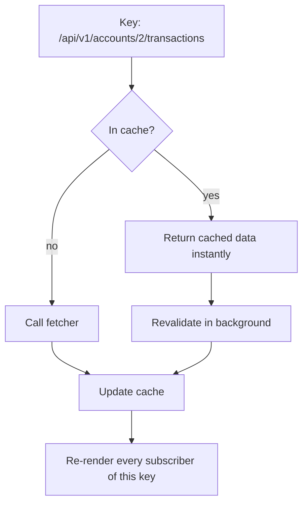

# SWR + Axios, From Zero

You have never used SWR. This article starts from the code you would write without it, shows where that code betrays you, and then builds up the SWR + Axios setup a real dashboard uses — one piece at a time, each one runnable.

---

## 1. The Problem: Fetching by Hand

Without any library, fetching data in React looks like this. You've probably written it:

```tsx
// The hand-rolled version — read it, then we'll break it
function TransactionList({ accountId }: { accountId: number }) {
  const [data, setData] = useState<Transaction[] | null>(null);
  const [error, setError] = useState<Error | null>(null);
  const [loading, setLoading] = useState(true);

  useEffect(() => {
    setLoading(true);
    fetch(`/api/v1/accounts/${accountId}/transactions`)
      .then((res) => {
        if (!res.ok) throw new Error(`API ${res.status}`);
        return res.json();
      })
      .then(setData)
      .catch(setError)
      .finally(() => setLoading(false));
  }, [accountId]);

  if (loading) return <Spinner />;
  if (error) return <p>Something broke</p>;
  return <ul>{data!.map((t) => <li key={t.id}>{t.amount}</li>)}</ul>;
}
```

It works in the demo. Then four problems surface, roughly in this order:

1. **You write it again. And again.** Every component that needs data repeats the three-state dance (`data`, `error`, `loading`). Twenty components in, you have twenty slightly different copies.
2. **Duplicate requests.** The summary card and the chart both need the account list, so they both fetch it. Same URL, two network calls, and briefly two different answers on one screen.
3. **The data goes stale silently.** The user opens your dashboard Monday, leaves the tab open, comes back Wednesday. The numbers are two days old and nothing will ever refresh them.
4. **The race condition.** The user clicks account 1, then quickly account 2. Two requests are now in flight. If account 1's response arrives *last* — slow query, cold cache, bad luck — it overwrites account 2's data. The screen shows account 2 selected and account 1's transactions. This bug is timing-dependent, so it passes review and appears in production.

None of these are exotic. They are the default behavior of hand-rolled fetching, and fixing all four by hand means building a caching layer. SWR *is* that caching layer.

## 2. The Same Component With SWR

```bash
npm install swr axios
```

```tsx
import useSWR from 'swr';

const fetcher = (url: string) => fetch(url).then((res) => res.json());

function TransactionList({ accountId }: { accountId: number }) {
  const { data, error, isLoading } = useSWR<Transaction[]>(
    `/api/v1/accounts/${accountId}/transactions`,
    fetcher
  );

  if (isLoading) return <Spinner />;
  if (error) return <p>Something broke</p>;
  return <ul>{data!.map((t) => <li key={t.id}>{t.amount}</li>)}</ul>;
}
```

Two arguments. The first is the **key** — a string identifying *what data this is*. The second is the **fetcher** — any function that takes the key and returns a promise of data. SWR calls the fetcher, hands you `data`, `error`, and `isLoading`, and the three-state dance is gone.

That alone only solves problem 1. The other three are solved by the thing the key unlocks: a cache.

## 3. The Mental Model: A Cache With a Refresh Policy (Why)

SWR keeps a global, in-memory cache, and **the key is the cache address**. Everything interesting follows from that one design decision.

**Duplicate requests disappear.** When the summary card and the chart both call `useSWR('/api/v1/accounts', fetcher)`, they hit the same cache entry. SWR sees two subscribers and one key, makes **one** network request, and both components receive the same answer. You don't coordinate the components; using the same key *is* the coordination.

**Staleness is handled by the name of the library.** SWR stands for *stale-while-revalidate*: when a component asks for data that's already cached, SWR returns the cached (possibly stale) version **immediately** — no spinner — and quietly refetches in the background. If the fresh response differs, the component re-renders with it. Your Monday-to-Wednesday user alt-tabs back, sees the dashboard instantly with Monday's numbers, and one second later the numbers are Wednesday's. Out of the box, SWR revalidates when a component mounts, when the window regains focus, and when the network reconnects; add `refreshInterval` for live-ish polling.

**The race condition dies by design.** When `accountId` changes from 1 to 2, the *key changes*, and the component is now subscribed to a different cache entry. Whatever eventually arrives for account 1's key lands in account 1's cache slot — it cannot overwrite what's on screen, because the screen is no longer reading that slot. The bug that required a careful `AbortController` cleanup in the hand-rolled version (see the effect discussion in [05_react.md](05_react.md)) simply has no place to happen.



One tie to the rest of your stack worth making out loud in an interview: this stale-first-then-refresh trade appears three times in a well-built system — SWR in the browser, Redis serve-stale in the API tier ([04/08](../04_architecture_and_system_design/08_redis_caching_strategies.md)), and materialized views in Postgres ([01/04](../01_fastapi_sqlalchemy_postgres/04_explain_analyze_partitioning_matviews.md)). Same idea each time: accept bounded staleness, buy latency.

## 4. Axios: One Configured Client Instead of Twenty fetch Calls (How)

Plain `fetch` works, but every call needs the full URL, its own error handling, and its own auth header. Axios lets you build a **configured instance** once and give every request the same behavior:

```typescript
// Gist: src/api/httpClient.ts
import axios from 'axios';

export const httpClient = axios.create({
  baseURL: import.meta.env.VITE_API_URL, // e.g. http://localhost:8000/api/v1
  timeout: 5000,
  headers: { 'Content-Type': 'application/json' },
});

// The one fetcher every useSWR call in the app shares.
// Axios also throws on 4xx/5xx by default, which is exactly what SWR's
// `error` return value wants (fetch does NOT throw on HTTP errors).
export const fetcher = <T>(url: string): Promise<T> =>
  httpClient.get<T>(url).then((res) => res.data);
```

Now components write `useSWR('/accounts/2/transactions', fetcher)` with relative paths, and switching environments means changing one env var.

The reason Axios earns its place, though, is **interceptors** — functions that run on every request or response. This is where authentication stops being every component's problem.

The request side is one line of intent: before each request goes out, attach the access token.

```typescript
httpClient.interceptors.request.use((config) => {
  const token = getAccessToken(); // in-memory accessor — see the note below
  if (token) config.headers.Authorization = `Bearer ${token}`;
  return config;
});
```

The response side is where the craft is. Access tokens expire on purpose after a few minutes ([04/07](../04_architecture_and_system_design/07_oauth2_jwt_lifecycle.md) explains why). So mid-session, some request will come back 401. The naive interceptor redirects to the login page, logging out a user whose session is perfectly refreshable. The right behavior is: catch the 401, call the refresh endpoint, then **replay the original request** with the new token — invisibly.

There's a subtlety that separates a working implementation from a broken one. A dashboard fires several requests at once, so when the token expires, *five* requests may fail together. If each one triggers its own refresh call, and your backend rotates refresh tokens (each one is single-use), the first refresh succeeds and the other four burn dead tokens — logging the user out. The fix is **single-flight**: all concurrent 401s share one refresh promise.

```typescript
// Gist: src/api/httpClient.ts (continued)
let refreshPromise: Promise<string> | null = null;

httpClient.interceptors.response.use(
  (response) => response,
  async (error) => {
    const original = error.config;
    if (error.response?.status === 401 && !original._retried) {
      original._retried = true; // each request retries once, never loops
      // First 401 creates the refresh promise; the other four await the SAME one.
      refreshPromise ??= refreshAccessToken().finally(() => (refreshPromise = null));
      try {
        const newToken = await refreshPromise;
        original.headers.Authorization = `Bearer ${newToken}`;
        return httpClient(original); // replay the original request
      } catch {
        window.location.href = '/login'; // only a failed REFRESH ends the session
      }
    }
    return Promise.reject(error);
  }
);
```

A note on `getAccessToken()`: tutorials read the token from `localStorage`, and you shouldn't — anything in `localStorage` is readable by any script that gets injected into your page. Keep the access token in a module-level variable (memory) and let the refresh token live in an HttpOnly cookie the browser attaches automatically. The storage argument is made properly in [02/02](../02_react_redux_swr_dashboard/02_browser_apis_and_storage.md).

## 5. Writing Data: Mutations (How)

SWR reads; for writes you call the API yourself, then tell SWR its cache is out of date. The simplest correct version:

```typescript
import { useSWRConfig } from 'swr';

function useCreateTransaction(accountId: number) {
  const { mutate } = useSWRConfig();
  const key = `/accounts/${accountId}/transactions`;

  return async (tx: NewTransaction) => {
    await httpClient.post(key, tx);
    mutate(key); // "this key is stale — refetch it"
  };
}
```

That's honest and slow: the user waits a round-trip before seeing their row. The **optimistic** version shows the change instantly and repairs the cache if the server disagrees:

```typescript
// Gist: src/features/transactions/useCreateTransaction.ts
const createTransaction = async (tx: NewTransaction) => {
  await mutate(
    key,
    async (current: Transaction[] = []) => {
      const saved = await httpClient.post<Transaction>(key, tx).then((r) => r.data);
      return [...current, saved];
    },
    {
      optimisticData: (current = []) => [...current, { ...tx, id: 'temp', pending: true }],
      rollbackOnError: true, // POST failed -> cache snaps back, UI shows the truth
      revalidate: true,      // afterwards, re-sync with the server's version
    }
  );
};
```

Read the options as a promise to the user: *you'll see your row immediately; if the server rejects it, it will vanish rather than lie; and the final state always comes from the server.* That last clause is the invariant to say in an interview: an optimistic cache may lead the server briefly, but it must never *end* in a state the server didn't confirm.

## 6. Two Everyday Patterns

**Don't fetch yet.** Pass `null` as the key and SWR does nothing. This is how "wait until we know the user" works without effect gymnastics:

```typescript
const { data: user } = useSWR('/me', fetcher);
// Second request waits for the first: key is null until user exists.
const { data: accounts } = useSWR(user ? `/users/${user.id}/accounts` : null, fetcher);
```

When `user` arrives, the key becomes real and the second fetch fires on its own. Dependent requests become a data declaration instead of choreography.

**Keys with parameters.** Once a request depends on several values, use an array key: `useSWR(['/transactions', accountId, range], ([url, id, r]) => fetcher(`${url}?account=${id}&range=${r}`))`. The array is compared element-wise, so each distinct combination gets its own cache entry — which is exactly what "the filter changed, this is different data" should mean.

## 7. When SWR Is the Wrong Tool

SWR assumes the server owns data that the client periodically re-asks for. That breaks down in three places. Live streams — prices ticking, transactions flowing in — want the server to *push*, which is SSE/WebSocket territory ([05/01](../05_networking_and_data_transport/01_networking_protocols_dashboard.md)); polling with `refreshInterval` is a stopgap, not the design. One-shot commands ("export this report") aren't cacheable data, so just call Axios directly. And client-owned state — filters, wizard steps — has no server to revalidate against; that's local state or Redux ([06_redux_toolkit.md](06_redux_toolkit.md)). The boundary sentence: **SWR manages what the server owns; Redux manages what the client owns.**

## 8. Interview Angles

**"Two widgets need the same endpoint — how do you avoid fetching twice?"** By doing nothing: give them the same SWR key and they share one cache entry and one deduplicated request. The mistake would be lifting the data into a parent or a store "to share it," which hand-rebuilds what the cache already does.

**"Walk me through an optimistic update, including the failure path."** Write the expected result into the cache immediately so the UI responds, fire the real request, roll the cache back if the request fails, and revalidate afterwards so the server has the last word. Then name the invariant: the cache may briefly lead the server, but it must never *end* somewhere the server didn't confirm.

**"How does your app survive an expired access token mid-session?"** The response interceptor catches the 401, refreshes once — a single shared promise even if five requests failed together, because rotated refresh tokens are single-use — then replays the original requests with the new token. The user notices nothing; only a failed refresh logs them out. The backend half of this handshake is in [04/07](../04_architecture_and_system_design/07_oauth2_jwt_lifecycle.md).
