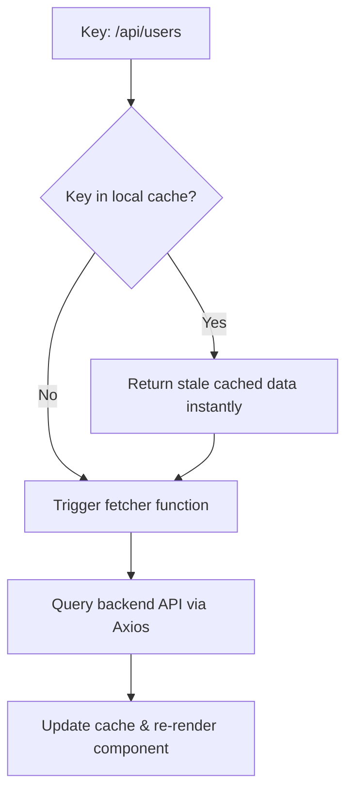

# SWR and Axios Integration Specification (Comprehensive Masterclass)

SWR (v2.4.2 stable / v2.5.0-beta.0 in 2026) is a React hook library for data fetching. It simplifies network state by returning cached data first (stale), then sending a fetch request in the background (revalidate), and finally updating the UI with the fresh data. Axios (v1.7.9 in 2026) acts as the underlying HTTP client managing HTTP requests and token interception. SWR v2.5+ introduces RSC cache prefilling.

---

## 1. Caching Philosophy & Interception Architecture (Why & What)

### Stale-While-Revalidate Lifecycle
SWR eliminates the need for global state managers (like Redux) to store server data. 
1. **Request**: SWR identifies a request by a unique "cache key" string (typically the API URL).
2. **Stale Delivery**: If the key exists in the cache, SWR instantly returns the cached data, allowing the page to load with no spinner delay.
3. **Revalidation**: SWR fetches fresh data from the server in the background.
4. **Update**: Once the request resolves, SWR updates the cache and re-renders the component.



### Axios Interceptor Architecture
Axios allows you to configure interceptors to run before requests are sent or after responses are received.
* **Why**: Inject authorization tokens (JWT) into outgoing headers, catch expired tokens (401 Unauthorized), and handle automatic logouts or token refreshes without duplicating authentication logic across individual API calls.

---

## 2. Basic Setup & Client Configuration (How)

### Step 1: Axios Client with Interceptors
Create a centralized HTTP client instance.

```typescript
import axios from 'axios';

export const bankingClient = axios.create({
  baseURL: 'http://localhost:8000/api/v1',
  headers: { 'Content-Type': 'application/json' },
  timeout: 5000,
});

// Request Interceptor: Inject JWT token from localStorage
bankingClient.interceptors.request.use((config) => {
  const token = localStorage.getItem('token');
  if (token && config.headers) {
    config.headers.Authorization = `Bearer ${token}`;
  }
  return config;
});

// Response Interceptor: Redirect to login on 401 errors
bankingClient.interceptors.response.use(
  (response) => response,
  (error) => {
    if (error.response?.status === 401) {
      localStorage.removeItem('token');
      window.location.href = '/login';
    }
    return Promise.reject(error);
  }
);

// Generic SWR Fetcher
export const swrFetcher = (url: string) => 
  bankingClient.get(url).then((res) => res.data);
```

---

## 3. Advanced Mutation & Infinite Loading (How)

### Gist: swr_mutations_infinite.ts
A production-grade implementation of local optimistic updates and infinite scrolling lists.

```typescript
// Gist: swr_mutations_infinite.ts
import useSWR, { useSWRConfig } from 'swr';
import useSWRInfinite from 'swr/infinite';
import { bankingClient, swrFetcher } from './httpClient';

interface LedgerItem {
  id: string;
  amount: number;
  description: string;
}

// ---------------------------------------------------------
// 1. MUTATION & OPTIMISTIC UPDATES HOOK
// ---------------------------------------------------------
export const useLedger = () => {
  const { mutate } = useSWRConfig();
  const cacheKey = '/banking/ledger';
  const { data, error, mutate: localMutate } = useSWR<LedgerItem[]>(cacheKey, swrFetcher);

  const postLedgerEntry = async (newEntry: Omit<LedgerItem, 'id'>) => {
    if (!data) return;

    // A. Create optimistic dummy object
    const optimisticEntry: LedgerItem = { ...newEntry, id: `temp-${Date.now()}` };
    const updatedData = [...data, optimisticEntry];

    // B. Write to local cache instantly, disabling background validation for now
    localMutate(updatedData, false);

    try {
      // C. Run actual network write call
      await bankingClient.post('/banking/ledger', newEntry);
      
      // D. Force trigger global cache re-validation to sync state
      mutate(cacheKey);
    } catch (err) {
      // E. Rollback local cache to original data state on network failure
      localMutate(data, true);
      throw err;
    }
  };

  return {
    ledger: data,
    isLoading: !data && !error,
    postLedgerEntry,
  };
};

// ---------------------------------------------------------
// 2. INFINITE SCROLLING PAGINATION HOOK
// ---------------------------------------------------------
export const useInfiniteLedger = (pageSize = 10) => {
  // Key generator function mapping page index to URL query params
  const getKey = (pageIndex: number, previousPageData: LedgerItem[] | null) => {
    // End reached
    if (previousPageData && !previousPageData.length) return null;
    // Returns key URL
    return `/banking/ledger/infinite?page=${pageIndex + 1}&limit=${pageSize}`;
  };

  const { data, error, size, setSize, isValidating } = useSWRInfinite<LedgerItem[]>(
    getKey,
    swrFetcher,
    { revalidateFirstPage: false }
  );

  // Flatten nested pages array into single flat list
  const ledgerItems = data ? data.flat() : [];
  const isLoadingMore =
    isLoading || (size > 0 && data && typeof data[size - 1] === 'undefined');
  const isReachedEnd =
    data && (data[data.length - 1]?.length < pageSize);

  const loadMore = () => {
    if (!isLoadingMore && !isReachedEnd) {
      setSize(size + 1);
    }
  };

  const isLoading = !data && !error;

  return {
    ledgerItems,
    isLoading,
    isLoadingMore,
    isReachedEnd,
    loadMore,
  };
};
```
