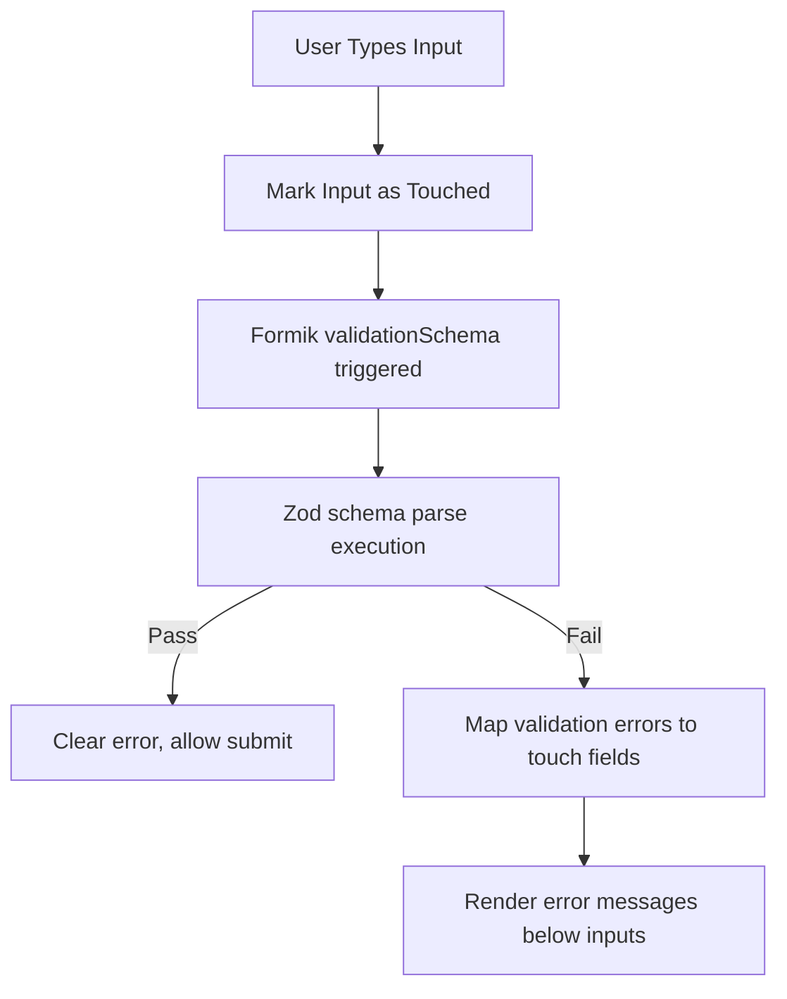

# Zod and Formik Form Specification

A deep-dive reference guide to client-side input validation, Zod schema configurations, type coercions, and Formik form state tracking.

---

## 1. Schema Validation & Form Tracking (Why & What)

### Why Use Formik & Zod?
Form state management is complex, tracking value changes, error states, and "touched" inputs (so we only show validation errors if the user has focused and exited the input field).
* **Formik** manages values, errors, touch state, and form submissions.
* **Zod** handles schema definitions and schema parsing. It ensures inputs are validated before sending them to the backend, mirroring Pydantic's role on the backend.
* **Typing Benefits**: Zod schema types can be inferred directly into TypeScript interfaces (`z.infer<typeof schema>`), avoiding duplicate interface definitions.



### Zod Coercion
Form values collected from HTML inputs are always string objects.
* **Coercion**: Zod can dynamically coerce types before validation using `z.coerce.number()` or `z.coerce.date()`. If the input is `"42"`, Zod coerces it to the number `42` before running validation checks.

---

## 2. Validation Blueprint (How)

### Gist: FormikZodForm.tsx
A complete TypeScript React component configuring a schema, inferring types, and binding fields to Formik.

```typescript
// Gist: FormikZodForm.tsx
import React from 'react';
import { useFormik } from 'formik';
import { z } from 'zod';

// 1. Define schema validation using Zod
// Why: Enforces strict type limits, custom regex validation, and cross-field checks
export const userFormSchema = z.object({
  fullName: z.string().min(2, 'Name must be at least 2 characters').max(100),
  email: z.string().email('Invalid email address'),
  age: z.coerce.number().min(18, 'Must be at least 18 years old').max(120),
  role: z.enum(['admin', 'user', 'manager'], {
    invalid_type_error: 'Role must be admin, user, or manager',
  }),
});

// 2. Infer TypeScript types from Zod schema directly
// Why: Single source of truth for typings (no redundant typescript interface)
type UserFormData = z.infer<typeof userFormSchema>;

// 3. Validation Adapter Bridge
// Why: Custom bridge to parse Formik values against Zod schema safely
const validateWithZod = (values: UserFormData) => {
  const result = userFormSchema.safeParse(values);
  if (result.success) return {};

  const errors: Record<string, string> = {};
  for (const issue of result.error.issues) {
    const path = issue.path[0];
    if (path) {
      errors[path.toString()] = issue.message;
    }
  }
  return errors;
};

export const FormikZodForm: React.FC = () => {
  const formik = useFormik<UserFormData>({
    initialValues: {
      fullName: '',
      email: '',
      age: 18,
      role: 'user',
    },
    validate: validateWithZod,
    onSubmit: (values) => {
      console.log('Valid Form Submission values:', values);
    },
  });

  return (
    <div className="max-w-md mx-auto p-6 bg-gray-900 rounded-lg shadow-lg">
      <h2 className="text-xl font-bold text-white mb-6">User Onboarding Profile</h2>
      
      <form onSubmit={formik.handleSubmit} className="space-y-4 text-white">
        
        {/* Full Name Input */}
        <div>
          <label className="block text-sm font-medium mb-1">Full Name</label>
          <input
            name="fullName"
            type="text"
            onChange={formik.handleChange}
            onBlur={formik.handleBlur} // Tracks touched state
            value={formik.values.fullName}
            className="w-full bg-gray-800 p-2 border border-gray-700 rounded focus:ring-2 focus:ring-blue-600 outline-none"
          />
          {formik.touched.fullName && formik.errors.fullName && (
            <div className="text-red-500 text-xs mt-1">{formik.errors.fullName}</div>
          )}
        </div>

        {/* Email Input */}
        <div>
          <label className="block text-sm font-medium mb-1">Email</label>
          <input
            name="email"
            type="email"
            onChange={formik.handleChange}
            onBlur={formik.handleBlur}
            value={formik.values.email}
            className="w-full bg-gray-800 p-2 border border-gray-700 rounded focus:ring-2 focus:ring-blue-600 outline-none"
          />
          {formik.touched.email && formik.errors.email && (
            <div className="text-red-500 text-xs mt-1">{formik.errors.email}</div>
          )}
        </div>

        {/* Age Input */}
        <div>
          <label className="block text-sm font-medium mb-1">Age</label>
          <input
            name="age"
            type="number"
            onChange={formik.handleChange}
            onBlur={formik.handleBlur}
            value={formik.values.age}
            className="w-full bg-gray-800 p-2 border border-gray-700 rounded focus:ring-2 focus:ring-blue-600 outline-none"
          />
          {formik.touched.age && formik.errors.age && (
            <div className="text-red-500 text-xs mt-1">{formik.errors.age}</div>
          )}
        </div>

        {/* Role Select Dropdown */}
        <div>
          <label className="block text-sm font-medium mb-1">Role</label>
          <select
            name="role"
            onChange={formik.handleChange}
            onBlur={formik.handleBlur}
            value={formik.values.role}
            className="w-full bg-gray-800 p-2 border border-gray-700 rounded focus:ring-2 focus:ring-blue-600 outline-none"
          >
            <option value="user">User</option>
            <option value="manager">Manager</option>
            <option value="admin">Admin</option>
          </select>
          {formik.touched.role && formik.errors.role && (
            <div className="text-red-500 text-xs mt-1">{formik.errors.role}</div>
          )}
        </div>

        <button
          type="submit"
          disabled={formik.isSubmitting}
          className="w-full bg-blue-600 hover:bg-blue-700 disabled:bg-gray-700 text-white font-bold p-2 rounded transition-colors"
        >
          Submit User Profile
        </button>
      </form>
    </div>
  );
};
```
