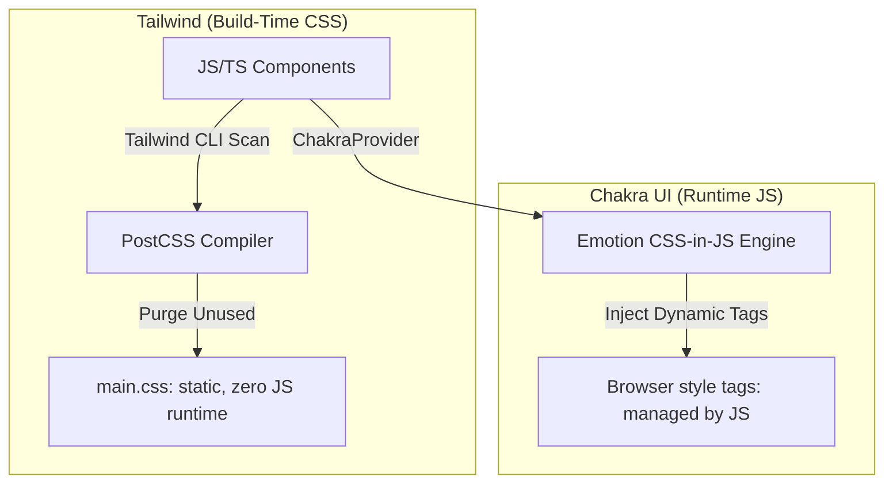

# TailwindCSS and Chakra UI Specification

A deep-dive reference guide to styling dashboard interfaces using utility CSS (Tailwind) and runtime component UI engines (Chakra UI).

---

## 1. Styling Engines & Themes (Why & What)

### Why Combine Tailwind and Chakra UI?
Dashboards need to be visually premium and built quickly. Combining Tailwind and Chakra UI gives you the best of both worlds:
1. **TailwindCSS (Build-Time Utility)**:
   * **Why**: High-performance grid layouts, padding/margin adjustments, responsive styling, and fast responsive cards. Because it compiles at build-time, it adds zero runtime JavaScript overhead to your dashboard.
2. **Chakra UI (Runtime CSS-in-JS Component Library)**:
   * **Why**: Built-in accessible components with complex keyboard states and focus management (e.g. modals, drawer menus, drop-down menus, alert dialogs).

### Under the Hood: Compilation vs. Runtime Engines
* **TailwindCSS Compilation**: Tailwind scans your HTML/JS files for class strings (e.g. `p-4 bg-gray-900`) and generates a static stylesheet during build time, discarding any classes you didn't use.
* **Chakra UI Runtime**: Chakra uses styled-components and Emotion under the hood. It processes styling props (e.g. `bg="gray.900"`) at runtime, creating and injecting CSS style tags dynamically.



---

## 2. Configuration & Styling Blueprint (How)

### Gist: DashboardThemeWrapper.tsx
A TypeScript React module demonstrating:
1. Configuring custom themes in Chakra UI.
2. Building components using Tailwind utility grids for widgets.
3. Incorporating accessible modal panels from Chakra UI.

```typescript
// Gist: DashboardThemeWrapper.tsx
import React, { useState } from 'react';
import { 
  ChakraProvider, 
  extendTheme, 
  Button, 
  Modal, 
  ModalOverlay, 
  ModalContent, 
  ModalHeader, 
  ModalBody, 
  ModalCloseButton 
} from '@chakra-ui/react';

// 1. Extend Chakra UI Default Theme
// Why: Integrates consistent color tokens matching the Tailwind design system
const customTheme = extendTheme({
  colors: {
    dashboard: {
      900: '#0b0f19',
      800: '#151c2c',
      700: '#1f293d',
      activeBlue: '#2563eb',
    },
  },
  config: {
    initialColorMode: 'dark',
    useSystemColorMode: false,
  },
});

export const DashboardLayout: React.FC = () => {
  const [isModalOpen, setIsModalOpen] = useState(false);

  return (
    <ChakraProvider theme={customTheme}>
      {/* 
        Tailwind Grid Layout (Build-time class compiling)
        Why Tailwind: Lightweight layout handling without JS runtime overhead
      */}
      <div className="min-h-screen bg-gray-950 p-6 flex flex-col justify-between">
        
        {/* Header Widget */}
        <header className="flex justify-between items-center mb-8 border-b border-gray-800 pb-4">
          <h1 className="text-2xl font-black text-white tracking-wide">
            AESTHETIX <span className="text-blue-500">DASHBOARD</span>
          </h1>
          
          {/* Chakra Accessible Button Primitives */}
          <Button 
            colorScheme="blue" 
            onClick={() => setIsModalOpen(true)}
            size="md"
          >
            Open Connection Configuration
          </Button>
        </header>

        {/* Widgets Grid */}
        <main className="grid grid-cols-1 md:grid-cols-3 gap-6 mb-8 flex-grow">
          <div className="bg-gray-900 border border-gray-800 p-6 rounded-xl hover:border-gray-700 transition-colors">
            <span className="text-gray-400 text-xs font-bold uppercase">Aggregations Pool</span>
            <div className="text-3xl font-extrabold text-white mt-2">1,204,502</div>
          </div>
          <div className="bg-gray-900 border border-gray-800 p-6 rounded-xl hover:border-gray-700 transition-colors">
            <span className="text-gray-400 text-xs font-bold uppercase">Average Processing Lag</span>
            <div className="text-3xl font-extrabold text-green-400 mt-2">12ms</div>
          </div>
          <div className="bg-gray-900 border border-gray-800 p-6 rounded-xl hover:border-gray-700 transition-colors">
            <span className="text-gray-400 text-xs font-bold uppercase">Network IO Channels</span>
            <div className="text-3xl font-extrabold text-white mt-2">Active</div>
          </div>
        </main>

        {/* 
          Chakra Modal Overlay (Runtime CSS-in-JS Component)
          Why Chakra: Automatically manages focus locking, trap-focus, and Esc key hooks
        */}
        <Modal isOpen={isModalOpen} onClose={() => setIsModalOpen(false)} isCentered size="md">
          <ModalOverlay backdropFilter="blur(8px)" />
          <ModalContent bg="dashboard.800" color="white" borderRadius="xl">
            <ModalHeader borderBottomWidth="1px" borderBottomColor="gray.700">
              Database Connection State
            </ModalHeader>
            <ModalCloseButton />
            <ModalBody py={6}>
              <p className="text-gray-300 text-sm mb-4">
                Configure your database synchronization credentials. Ensure Postgres connection pooling uses an async engine configuration.
              </p>
              <Button colorScheme="red" mr={3} onClick={() => setIsModalOpen(false)}>
                Disconnect Pool
              </Button>
              <Button variant="ghost" color="white" hover={{ bg: 'gray.700' }} onClick={() => setIsModalOpen(false)}>
                Cancel
              </Button>
            </ModalBody>
          </ModalContent>
        </Modal>
        
      </div>
    </ChakraProvider>
  );
};
```
