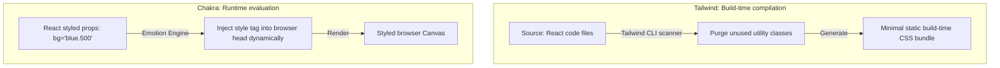

# TailwindCSS and Chakra UI Specification (Comprehensive Masterclass)

TailwindCSS and Chakra UI are two distinct styling systems. Tailwind is a utility-first utility class compiler, while Chakra UI is a component-driven CSS-in-JS library. Understanding their architectural trade-offs allows you to use them together in a performant, accessible dashboard.

---

## 1. Styling Philosophies & Architectures (Why & What)

### TailwindCSS vs. Chakra UI Comparison

| Dimension | TailwindCSS | Chakra UI |
|---|---|---|
| **Architecture** | Utility-first compiler (analyzes code classes at build-time). | Component-driven runtime (uses CSS-in-JS under the hood). |
| **Performance** | Zero runtime CSS overhead. Compiles to a single minimal CSS file. | Runtime overhead. Dynamically generates class names at execution. |
| **Accessibility (A11y)** | Requires writing custom semantic HTML structures/ARIA parameters. | Built-in accessible components (WAI-ARIA specifications pre-integrated). |
| **Customization** | Configured via `tailwind.config.js` theme file. | Configured via `extendTheme` theme providers in React. |



### Integration Strategy (The Combo Pattern)
To build high-performance dashboards that are also accessible, use both tools together:
* **Tailwind**: Handles page grids, outer structural flexboxes, text colors, and dashboard borders. This keeps the application layout runtime extremely fast.
* **Chakra UI**: Handles interactive components that require complex accessibility logic (such as Modals, Drawers, Tooltips, Menu buttons, and Accessible dropdown selects).

---

## 2. Basic Setup & Configuration (How)

### Step 1: Tailwind Theme Configuration
Extend colors and enable class-based dark mode switches.

```javascript
// tailwind.config.js
module.exports = {
  content: ["./src/**/*.{js,ts,jsx,tsx}"],
  darkMode: 'class', // Toggles dark styles when parent HTML has class="dark"
  theme: {
    extend: {
      colors: {
        banking: {
          bg: '#030712',
          card: '#111827',
          accent: '#3b82f6',
          text: '#f3f4f6',
        }
      }
    }
  },
  plugins: [],
}
```

### Step 2: Chakra UI Custom Theme setup
Extend Chakra's theme and override default components.

```typescript
import { extendTheme } from '@chakra-ui/react';

export const customChakraTheme = extendTheme({
  config: {
    initialColorMode: 'dark',
    useSystemColorMode: false,
  },
  colors: {
    banking: {
      500: '#3b82f6', // Matches Tailwind accent color
    }
  },
  components: {
    Button: {
      baseStyle: {
        borderRadius: 'lg',
        fontWeight: 'bold',
      }
    }
  }
});
```

---

## 3. Advanced Layout Implementation (How)

### Gist: tailwind_chakra_dashboard.tsx
A reference dashboard container showing how to integrate both systems (using Tailwind for layout/performance and Chakra for accessible modals).

```tsx
// Gist: tailwind_chakra_dashboard.tsx
import React from 'react';
import { 
  ChakraProvider, 
  Modal, 
  ModalOverlay, 
  ModalContent, 
  ModalHeader, 
  ModalBody, 
  ModalCloseButton, 
  useDisclosure 
} from '@chakra-ui/react';
import { customChakraTheme } from './chakraTheme';

export const DashboardLayout: React.FC = () => {
  // Chakra's hook managing modal open/close accessibility state transitions
  const { isOpen, onOpen, onClose } = useDisclosure();

  return (
    <ChakraProvider theme={customChakraTheme}>
      {/* 
        Tailwind Utility Classes (Outer Frame Layout)
        Why: Outer page layout uses Tailwind for maximum layout performance and zero runtime CSS lag.
      */}
      <div className="min-h-screen bg-gray-950 text-gray-100 flex flex-col">
        
        {/* Navigation bar header using Tailwind flex */}
        <header className="h-16 border-b border-gray-800 bg-gray-900 px-6 flex items-center justify-between">
          <h1 className="text-lg font-black tracking-widest text-blue-500">🏦 AESTHETIX</h1>
          <button 
            onClick={onOpen}
            className="bg-blue-600 hover:bg-blue-700 text-white px-4 py-2 rounded-lg text-xs font-bold transition-all shadow-md"
          >
            Adjust Limits
          </button>
        </header>

        {/* Dashboard grid panel */}
        <main className="flex-1 p-6 grid grid-cols-1 md:grid-cols-3 gap-6">
          <div className="md:col-span-2 bg-gray-900 border border-gray-800 rounded-2xl p-6">
            <h3 className="text-sm font-bold text-gray-400 uppercase">System Telemetry Output</h3>
            <div className="mt-4 h-48 bg-gray-950 border border-gray-800 rounded-lg flex items-center justify-center">
              <p className="text-gray-600 text-xs">Waiting for telemetry frames...</p>
            </div>
          </div>
          <div className="bg-gray-900 border border-gray-800 rounded-2xl p-6">
            <h3 className="text-sm font-bold text-gray-400 uppercase">Limit Adjuster Info</h3>
            <p className="text-sm text-gray-300 mt-2">
              Configure parameters using the accessible button in the header navigation panel.
            </p>
          </div>
        </main>

        {/* 
          Chakra UI Modal (Interactive accessible component)
          Why: Handles keyboard focus trap, Esc key listener close, and screen reader overlays 
          automatically behind the scenes.
        */}
        <Modal isOpen={isOpen} onClose={onClose} isCentered>
          <ModalOverlay backdropFilter="blur(4px)" />
          <ModalContent bg="gray.900" border="1px" borderColor="gray.800" color="white" borderRadius="2xl">
            <ModalHeader fontSize="lg" fontWeight="black">Adjust Telemetry Limits</ModalHeader>
            <ModalCloseButton />
            <ModalBody pb={6}>
              <div className="space-y-4">
                <p className="text-sm text-gray-400">
                  Configure maximum system thresholds below. This action triggers alert logs.
                </p>
                <div className="flex gap-4">
                  <button 
                    onClick={onClose}
                    className="flex-1 bg-gray-800 hover:bg-gray-700 text-white py-2 rounded-lg text-sm font-bold transition-colors"
                  >
                    Cancel
                  </button>
                  <button 
                    onClick={() => {
                      alert('Limits updated!');
                      onClose();
                    }}
                    className="flex-1 bg-blue-600 hover:bg-blue-700 text-white py-2 rounded-lg text-sm font-bold transition-colors"
                  >
                    Confirm Adjust
                  </button>
                </div>
              </div>
            </ModalBody>
          </ModalContent>
        </Modal>

      </div>
    </ChakraProvider>
  );
};
