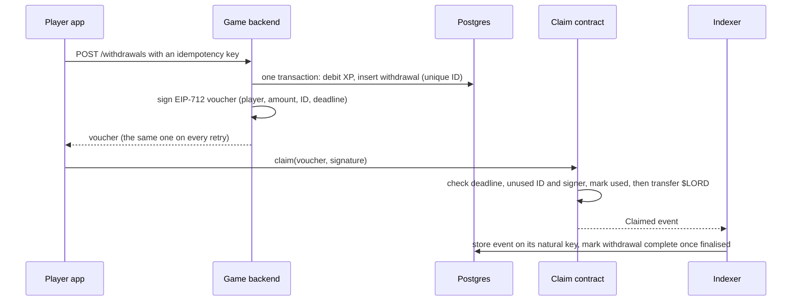

# Tonight: the one-night cut for the Metaspace interview

The interview is **Wednesday 30 September 2026 at 16:00 Port-au-Prince time**. You confirmed it
on the Calendly invite. That is midnight in Dubai, so the Tech Lead is joining late in their day,
and a crisp, short answer will be worth more than a thorough one. It is thirty minutes, which
leaves room for five to seven real questions and five minutes of yours.

This file is the Pareto cut of the whole track: the part of blockchain that produces most of what
a Tech Lead at a game studio will ask in half an hour, written so that you can read it tonight and
say it out loud tomorrow. Everything else in `output/` is optional. If this file and an older one
disagree about what you should *say*, this file wins. The earlier pitch claimed work you never
did, and it has been corrected everywhere it appeared.

You are starting from zero, and that is fine, because the honest version of your story does not
need you to be a blockchain engineer. It needs you to understand the machine well enough to talk
about it precisely, and to be very good at the part of the job that is not blockchain at all.

---

## 1. How to spend the hours

Four hours tonight, in five blocks, and a rehearsal tomorrow morning with nothing new in it. Each
block ends with you speaking, not reading: set a phone timer, answer out loud, and stop at ninety
seconds even if you are mid-sentence. Being unable to stop is the thing that loses thirty-minute
interviews, far more often than ignorance.

| When | Read | Then say out loud |
|---|---|---|
| Tonight, block 1 (45 min) | §2 the opening, §3 the mental model | The opening, three times, under 60 s each |
| Tonight, block 2 (45 min) | §4 answers 1–6 | Each answer once, under 90 s |
| Tonight, block 3 (45 min) | §4 answers 7–12, including the contract | Each answer once; read the contract aloud line by line |
| Tonight, block 4 (45 min) | §5 the XP-to-$LORD architecture | The 60-second version five times. This is the one that matters most |
| Tonight, block 5 (40 min) | §6 libraries, §7 live coding, §8 not knowing | The web3.js answer and the four coding traps |
| Tomorrow 09:00–12:00 | Nothing new | §2, §4 and §5 against a timer, then simulation one of [mock_interviews.md](mock_interviews.md), recorded on your phone |
| Tomorrow 14:00 | §11 | Camera, microphone, screen share, hotspot |
| Tomorrow 15:00 | — | Stop. Eat something. Join at 15:55 |

Then sleep. A rested brain retrieves what it studied, and a tired one improvises, which is the
opposite of what you want in front of someone who wrote the contracts.

---

## 2. The opening, and the edge of what you claim

The first question will be some version of *"tell me about yourself, and how much blockchain have
you actually done?"* The studio has your CV, so they already know the answer to the second half.
What they are really testing is whether you will be straight with them. There are three ways to
answer. Overclaim, and the first follow-up question exposes you. Underclaim with "I'm new but I
learn fast", and you have given them nothing to hire. The third way is to state the gap plainly,
inside a story about the work you are genuinely strong at.

Say this, in your own rhythm, in under sixty seconds:

> "I'm a backend and data engineer. For about ten years I've built APIs and data systems —
> FastAPI services with JWT and OAuth2, SQLAlchemy on Postgres, ETL pipelines like a
> MongoDB-to-BigQuery migration on Apache Beam, all in Docker — and right now I'm leading a React
> Native modernisation at Tekkod, so I'm in JavaScript every day as well as Python.
>
> A lot of those systems had one thing in common: they had to stay correct against a data source
> I didn't control — field platforms like ODK, KoboToolbox and mWater, where data arrives late,
> twice, or out of order.
>
> I haven't shipped anything on a blockchain — you've seen my CV. But preparing for this, what
> struck me is that most of a Web3 game backend is that same problem: keeping a database in sync
> with a chain whose last few blocks can be rewritten, ingesting events idempotently because
> delivery is at-least-once, and a write path that survives retries without paying a player
> twice.
>
> The part I'd be ramping on is Solidity and contract security, and I'd want to pair with whoever
> owns your contracts while I do. The backend and data side I can carry from day one."

Every sentence in that is on your CV or is a statement about the future, so no follow-up question
can catch you out. The admission sits in the middle, followed by the bridge, so the last thing they
hear is what you can do.

The follow-up is often **"how fast could you ramp up?"**, and it deserves a plan rather than an
adjective. Something like: "In the first week I'd read your contracts and the backend code that
talks to them, and get the whole stack running against Amoy, the Polygon testnet. By the end of
the second week I'd want to ship something small on the integration side — an indexer fix, a
reconciliation job — reviewed by whoever owns the contracts. And I'd learn Solidity the way I
learned every other codebase, by writing tests against yours, because a test is the cheapest place
to be wrong."

Three things never to say. Do not say you have written contracts, built an indexer, or run a
relayer: you have read about all three tonight, which is a different thing, and the Tech Lead will
know the difference within one question. Do not present the exercise repository in this folder as
your work. It was generated for you to study, and if you are asked to change one line of it, the
truth comes out in a minute. And do not apologise for your background. You are a backend engineer
moving *across* into this field, not a junior blockchain engineer moving up, and the difference is
audible in how you sit.

---

## 3. The mental model, from zero

Picture a bank ledger, the big book where every movement of money is written down. In a normal
bank there is one book, the bank owns it, and if a clerk wants to change an old entry, the only
thing stopping them is the bank's internal controls. You trust the bank.

Now picture thousands of clerks in different countries, each keeping their own complete copy of
the same book, none of whom trusts the others. Every few seconds one of them is chosen to write
the next page. That page is a **block**: a batch of new entries, plus a fingerprint of the previous
page. The fingerprint is a **hash**, a short number computed from the page's entire contents, with
the property that changing a single character anywhere produces a completely different number.
Because each page carries the fingerprint of the one before it, altering an old entry changes that
page's fingerprint. That breaks the link from the next page, and the next, all the way to today.
History is not impossible to change, but it is impossible to change *quietly*, and every other
clerk would reject the forgery. That chain of fingerprinted pages is the **blockchain**.

Who gets to write the next page? On Ethereum and Polygon the answer is **proof of stake**. Clerks
who want the job, called **validators**, lock up a large deposit of the chain's token. They take
turns proposing pages, and the others check and vote. A validator caught signing two
contradictory pages loses part of its deposit, so honesty is enforced by money rather than by
trust.

Now, the accounts. In a bank you walk in with ID and the bank opens an account for you. Here
nobody opens anything. You generate a **private key**, a random 32-byte number, on your own
device. From it, mathematics gives you a **public key**, and the last 20 bytes of the hash of that
public key are your **address**. The address existed, in a sense, before you generated it, and
anyone can send money to it before you have ever touched the chain. To move money, you **sign**
an instruction with your private key. Anyone can check the signature against your address, but no
one can produce it without the key. The signature *is* the authorisation: there is no password, no
support desk, and no "forgot my key" button. Lose the key and the money stays where it is,
forever, with nobody able to move it.

Two more ideas complete the picture. First, the newest pages are provisional. Occasionally two
clerks write a valid next page at almost the same moment, the network briefly disagrees, and one
version wins while the other is discarded. Entries on the losing page did not happen. That is a
**reorganisation**, or **reorg**, and it is normal, not an attack. After a short time a page
becomes **final**: the validators have voted it in so firmly that undoing it would cost them an
enormous share of their deposits. A backend that writes to its own database whenever a new page
appears must therefore be able to *unwrite* when a page disappears.

Second, **Ethereum's ledger can also run programs.** Alongside balances, the book holds small
programs called **smart contracts**, each with its own storage, and every clerk runs the same
program on the same input and must reach the same result. The engine that runs them is the
**Ethereum Virtual Machine**, the EVM. **Polygon PoS** is a separate chain that runs the same EVM
with its own set of validators, so the same contracts and the same tools work there, but blocks
arrive in a second or two and fees are fractions of a cent. For a game that sends thousands of
small transactions, that trade is the whole point.

---

## 4. The twelve answers

Each of these is written to be spoken in sixty to ninety seconds. Do not memorise the wording.
Memorise the order of the ideas, and say it in your own sentences.

**1. "What is a blockchain, in your own words?"**

A blockchain is a ledger that many independent computers keep copies of and agree on, built so
that history cannot be edited quietly. Each block holds a batch of transactions plus the hash of
the previous block, so changing any old entry changes its hash and breaks every link after it.
Who adds the next block is decided by a consensus protocol. On Ethereum and Polygon that is proof
of stake: validators lock up collateral, take turns proposing blocks, and lose part of it if they
sign conflicting histories. As a backend engineer, I think of it as an append-only, public,
slow and expensive database that nobody owns, with one twist: its newest few blocks can be replaced
in a reorg until they are finalised. So anything I derive from it has to be reversible for a short
window.

**2. "What is a smart contract, and what is the EVM?"**

A smart contract is a program deployed at an address on the chain, with its own persistent
storage. It runs only when a transaction calls it, and every node executes the same code on the
same input, so the result must be fully deterministic. That rules out calling an external API,
reading the clock precisely, or generating randomness. The EVM is the virtual machine that
executes the bytecode, which is usually compiled from Solidity. Three properties matter
operationally. Every step costs gas, so computation and especially storage are expensive. A
contract cannot wake itself up, so something off-chain must always send the transaction that
triggers it. And the code is immutable once deployed, unless it was deliberately built behind an
upgradeable proxy, which moves the question to who holds the upgrade key. "EVM-compatible" means
the same bytecode runs unchanged on Ethereum, Polygon, Base or Arbitrum.

**3. "What's the difference between an externally owned account and a contract account?"**

An externally owned account, or EOA, is controlled by a private key. It is what a wallet holds,
and it is the only kind of account that can start a transaction. A contract account is controlled
by its code and has no private key. It never acts on its own; it only reacts when something calls
it. The address of an EOA is the last twenty bytes of the Keccak-256 hash of its public key,
which is why accounts are discovered rather than created. In Solidity, `msg.sender` is whoever
called the current function, which may be a contract, while `tx.origin` is the EOA that started
the whole transaction. Using `tx.origin` for authorisation is a classic bug. One 2025 change is
worth knowing: EIP-7702, shipped in Ethereum's Pectra upgrade in May 2025, lets an EOA point at
contract code and behave like a smart account, so the clean line between the two types is
starting to blur.

**4. "Walk me through a transaction. What is gas?"**

A transaction is a signed instruction. It names a recipient, an amount of the native token, and
optional data. For a contract call, that data is a four-byte function selector followed by the
encoded arguments. It also carries a **nonce**, a gas limit, two fee fields and a chain ID, which
EIP-155 added so that a signature for Polygon cannot be replayed on Ethereum. The nonce is a
per-account sequence number, and the chain executes an account's transactions strictly in nonce
order: a missing nonce stalls everything behind it, and two transactions with the same nonce mean
only one can ever land. Gas is metered computation. A plain transfer costs 21,000 gas, and writing
a new storage slot costs about 20,000 more. Since EIP-1559 the price has two parts. The **base
fee** is set by the protocol from how full recent blocks were (on Ethereum it moves at most 12.5%
per block), and it is burned. The **priority fee** is a tip to the validator.

I think about it the way I think about the futures order book I trade on. The base fee is the
clearing price and the tip buys you queue position. An underpriced transaction does not fail; it
rests, like a limit order that never fills. You cannot cancel it either. You can only replace it
with a new transaction at the same nonce and a clearly higher price, which is exactly a price
improvement on a resting order. Last, a receipt with status 0 means the transaction reverted, but
it still paid for the gas it used.

**5. "What is a wallet, really? How would players hold their assets?"**

A wallet holds keys, not coins. The balances live on the chain, and the wallet signs instructions
to move them. Most wallets derive all their keys from one seed phrase of twelve or twenty-four
words, so the seed phrase is the account, and whoever sees it owns everything. The architectural
choice is custody. In a **non-custodial** design the player holds the keys, typically in MetaMask
or a mobile wallet connected through WalletConnect (the company behind it now calls itself Reown).
In a **custodial** design the studio holds keys on the player's behalf, which is the bank model:
easy for the player, but the studio now carries custody risk. For a mobile game, most players will
never install MetaMask, so the 2026 answer is usually a middle path. An **embedded wallet** is
created silently when the player signs in with email or a social account, combined with **smart
accounts**. ERC-4337 is the standard for these: it adds a separate transaction flow in which a
*paymaster* can pay the gas for the player. EIP-7702 lets an ordinary account get the same
abilities. The effect is that a player can claim an item without first buying POL to pay for gas.
I'd ask which model you use, because it decides half the backend.

**6. "How does a player log in with a wallet?"**

With Sign-In With Ethereum, EIP-4361, and it maps onto the JWT flows I've built before. The server
issues a one-time nonce. The wallet signs a human-readable message containing the site's domain,
the address, the chain ID, that nonce and an expiry. The server then *recovers* the signer's
address from the signature. Recovery is the key idea: the server computes who signed it, instead
of comparing against a stored credential. The server checks every field, burns the nonce in a
single atomic database statement so two concurrent requests cannot both succeed, and issues an
ordinary session or JWT. The nonce, domain and expiry are what stop replay: without them, a
signature is a bearer token that never expires, and a malicious site could harvest one and reuse
it. For anything with value, such as a reward voucher or a token approval, you use **EIP-712**
typed data instead of a plain message. The wallet then displays the actual fields, and a *domain
separator* binds the signature to one contract on one chain. One 2026 detail: a smart-contract
wallet cannot produce an ordinary recoverable signature, so verification has to fall back to the
contract's own check, ERC-1271. viem's public-client `verifyMessage` handles that case for you.

**7. "ERC-20, ERC-721, ERC-1155 — which would you use for a game?"**

ERC-20 is the fungible token standard: a balance per address, `transfer`, and the
`approve`-then-`transferFrom` pattern that lets a contract spend on your behalf. An in-game
currency like $LORD is naturally an ERC-20. ERC-721 is for unique items: each token ID has exactly
one owner, which suits a one-of-a-kind legendary ship. ERC-1155 is the multi-token standard, and
it is what most games reach for. One contract holds many item types. Each ID has a supply, so
potions with a supply of a million are fungible while a ship with a supply of one is unique.
Transfers can be batched, so a loot drop of five items is one transaction instead of five. Two
details show real understanding. First, ERC-1155's safe transfer *calls* the recipient if it is a
contract, via `onERC1155Received`, so every mint hands control to untrusted code; that is the
doorway to reentrancy. Second, the token usually points to metadata on a server or IPFS, so the
player owns a token ID on-chain while its artwork lives off-chain. From your site, characters,
weapons and ships are NFTs. I'd ask whether you use 721 or 1155 for them.

**8. "Can you read this contract?"**

They may share a contract and ask you to talk through it. What they are testing is fluency with
the building blocks, not authorship. Here is one written against OpenZeppelin Contracts v5 that
contains nearly every construct you will meet. Read it aloud tonight, top to bottom.

```solidity
// SPDX-License-Identifier: MIT
pragma solidity ^0.8.24;

import {ERC1155} from "@openzeppelin/contracts/token/ERC1155/ERC1155.sol";
import {Ownable} from "@openzeppelin/contracts/access/Ownable.sol";

contract GameItems is ERC1155, Ownable {
    uint256 public constant POTION = 1;       // minted in thousands: fungible
    uint256 public constant LEGEND_SHIP = 2;  // minted once: unique

    mapping(bytes32 => bool) public claimed;  // storage: persists between calls

    error AlreadyClaimed(bytes32 rewardId);
    event RewardGranted(address indexed player, bytes32 indexed rewardId, uint256 id, uint256 amount);

    constructor() ERC1155("https://game.example/items/{id}.json") Ownable(msg.sender) {}

    function grant(address player, bytes32 rewardId, uint256 id, uint256 amount)
        external
        onlyOwner
    {
        if (claimed[rewardId]) revert AlreadyClaimed(rewardId); // check
        claimed[rewardId] = true;                               // effect
        _mint(player, id, amount, "");                          // interaction: may call the player
        emit RewardGranted(player, rewardId, id, amount);
    }
}
```

Here is the reading. The `pragma` pins the compiler range. The contract *inherits* OpenZeppelin's
audited ERC-1155 and `Ownable`, rather than reimplementing them, and in v5 `Ownable` requires the
initial owner in its constructor. The two `constant`s are baked into the bytecode and cost no
storage. `claimed` is a **storage** mapping, which lives on-chain permanently and is the
expensive kind of variable. Function arguments of reference types live in **memory**, a scratch
area that disappears after the call, or in **calldata**, the read-only input bytes of the
transaction, which is the cheapest. The custom error is cheaper than a `require` with a string
message and gives the backend a typed reason for the failure. The event is how the contract talks
to the outside world: its two `indexed` fields become searchable topics, and emitting it costs
far less than storing the same data, which is why a well-designed contract stores only what it
must enforce and emits everything the backend needs to know. `external` means the function is
called from outside; `onlyOwner` is a **modifier**, a check that runs before the body. The body
follows **checks-effects-interactions**: check the condition, record the effect, and only then
make the call that might hand control to someone else. `_mint` may call the player's contract.
Here `onlyOwner` would already stop that contract from re-entering `grant`, but the ordering is
the habit that protects you when the function is public, as a voucher-claim function must be:
because `claimed` is set before the call, a re-entry finds the reward already claimed. Since
Solidity 0.8, arithmetic overflow reverts automatically. You would also see `view`, which reads
state without changing it, and `payable`, which lets a function receive the native token.

**9. "What are the most common smart contract vulnerabilities?"**

I'd name five, and I'd be clear that I know these as patterns rather than as an auditor.
**Reentrancy**: a contract makes an external call before updating its own state, and the callee
calls back in while the state is stale. The fix is checks-effects-interactions, or a reentrancy
guard, and in games the ERC-721 and ERC-1155 receiver hooks are where it hides. **Access
control**: who can mint, pause or upgrade. That includes the unprotected initialiser on an
upgradeable proxy, and authorising with `tx.origin`. **Signature replay**: a signed authorisation
without a nonce, a deadline, a chain ID and the contract's address can be used again somewhere
else, which is exactly what EIP-712's domain separator prevents. **Fake randomness**: anything
derived from block data is predictable or influenceable, so loot boxes need a verifiable random
function such as Chainlink VRF. **Front-running**: the mempool is public, so anyone can see a
transaction and outbid it.

For a game studio, though, the largest losses have come from off-chain keys. The Ronin bridge
behind Axie Infinity lost over six hundred million dollars in March 2022 when attackers
controlled five of its nine validator keys, and the way in was reported to be a fake job offer
sent to an engineer. So in my world, the signing key and the relayer key matter as much as the
Solidity.

**10. "How many confirmations do you wait before crediting a player?"**

I'd refuse to give a single number, because it is a risk decision priced by what is at stake. For
a cosmetic item, crediting optimistically at the head of the chain and occasionally unwinding is
fine. For anything convertible to real money, like $LORD that can become USDT, I'd credit only
once the block is *finalised*. I'd read that from the chain's `finalized` block tag rather than
hard-code a depth. On Polygon this used to be painful: there were deep reorgs, including one of
more than 150 blocks in February 2023, which is where the old advice to wait a hundred-plus blocks
came from. Recent upgrades have been about exactly this. Rio in October 2025 and Giugliano in April
2026 both targeted faster finality, and the finalized tag now trails the head by only a couple of
blocks, so the safe policy costs seconds, not minutes. Then I'd ask what depth you use today and
whether you've ever had to unwind a credit.

(For you, not for saying: the "couple of blocks" figure comes from this track's level 2 script
reading Amoy and mainnet on 19 September, recorded in [facts.md](facts.md) §1. You did not run
it, so say "my understanding is", not "I measured".)

**11. "Why would a game use Polygon rather than Ethereum mainnet?"**

Cost, speed and compatibility. A game sends many small transactions: claims, crafts, trades. On
Polygon PoS those cost fractions of a cent, blocks come every second or two, and finality now
arrives in seconds, whereas Ethereum finalises after roughly thirteen minutes and charges far more
per transaction. Because Polygon runs the same EVM, the Solidity, the tooling and the wallets all
carry over unchanged. The honest trade-off is the security model. Polygon PoS has its own set of
roughly a hundred validators and periodically checkpoints its state to Ethereum, so it does not
inherit Ethereum's full security the way a rollup such as Base or Arbitrum does. For in-game items
and a game currency, that is usually the right trade. The practical facts: mainnet chain ID 137,
gas token POL (MATIC was migrated to POL in September 2024), testnet Amoy with chain ID 80002
(Mumbai is shut down).

**12. "Why not have the API read the chain directly?"**

Because the chain is a terrible database for the questions a game asks. Every read is a network
round trip to an RPC provider that rate-limits you, and it cannot join, sort, paginate or answer
"what did this player acquire this week". So contracts *emit events*, and an **indexer** turns
them into Postgres rows. The indexer polls `eth_getLogs` over bounded block ranges, starting from
a checkpoint that it saves in the *same* database transaction as the rows it wrote. It stores each
log under its natural key, the block hash plus transaction hash plus log index, with a unique
constraint, so processing it twice changes nothing. It also keeps block hashes, so that when a
reorg replaces a block it can detect the change and roll back. The API then reads only Postgres.
The tempting shortcut is a websocket subscription, `contract.on` in ethers or `watchContractEvent`
in viem, but a subscription has no memory. Restart the process during a deploy and the events that
arrived meanwhile are simply gone, with nothing to tell you they existed. It works as a hint to
poll sooner, never as the system of record. Hosted indexers like The Graph or Goldsky are the
buy-instead-of-build option, and which to use is a real conversation to have.

---

## 5. The architecture answer: a player turns XP into $LORD and withdraws it

This is where you are strongest, so steer toward it, and rehearse it more than anything else in
this file.

First, what is public, so you know what you may say and what you should ask. Metaspace is a
free-to-play mobile action RPG on Polygon, licensed by RAK DAO in Ras Al Khaimah as a gaming
studio ([LARA on the Block](https://laraontheblock.com/web3-game-metaspace-secures-license-in-rak-digital-assets-oasis/)).
Their own site says characters, weapons and ships are NFTs, and that you can "turn your XPs into
$LORD" ([metaspacechain.com](https://metaspacechain.com/blogDetail/play-metaspace-one-of-the-best-web3-mobile-games)).
A third-party write-up ([Cubed, December 2025](https://blog.cubed.run/metaspace-a-journey-into-the-decentralized-metaverse-of-play-purpose-and-possibility-547dbd3a6aea))
says 1,000 XP converts to 1 $LORD through a "Claim LORD" option in the lobby, and that $LORD can be
converted to USDT and withdrawn, with $MLD as the governance and NFT-purchase token. The PlayToEarn
listing still shows the dual-token launch as a plan
([PlayToEarn](https://playtoearn.com/blockchaingame/metaspace)). So treat the flow as something to
*ask about*: "I read that XP converts to $LORD through a Claim button. Is that how it works today?"

Now the design, which is sound whatever their details turn out to be. The core idea is that XP
lives in the studio's database, because it changes every few seconds of gameplay and belongs
nowhere near a chain. Converting it is an ordinary database transaction. The only on-chain step is
the withdrawal, and that is where every defence goes.

There are two ways to do that step, and naming both is part of the answer. In the **push**
design, the backend's own hot wallet, the **relayer**, sends the $LORD to the player. The player
needs no gas, which suits mobile players who own no POL, but the studio now runs a transaction
pipeline. In the **pull** design, the backend signs an **EIP-712 voucher**, a typed message
saying "this player may claim this amount, with this ID, before this deadline". The player
submits it to a claim contract, which checks the signature and pays out. The studio pays no gas
for unclaimed rewards, and its signing key can only authorise specific, expiring, single-use
payouts. On the other hand, the player pays the gas, unless a paymaster sponsors it.



Walk the pull design with a defence at every step. The player's request carries an **idempotency
key**, and the withdrawal row has a **unique constraint**, so a player who taps twice on a flaky
mobile connection gets one withdrawal, and a retry returns *the same* voucher rather than a second
one. Debiting the XP and inserting the withdrawal happen in **one database transaction**, so there
is never a moment where the XP is gone but no withdrawal exists, or the reverse. The voucher is
EIP-712 typed data, so its **domain separator** binds it to one contract on one chain. The
contract checks the deadline, checks the ID is unused, recovers the signer, and **marks the ID
used before transferring**, which is the checks-effects-interactions order from §4. The contract
emits an event. The indexer stores it on its natural key and marks the withdrawal complete only
once the block is **finalised**, because this token converts to real money. And a **reconciler**
runs on a timer, looking for withdrawals with no matching event. The deadline is what makes that
reconciler safe: once a voucher's deadline has passed and no claim appeared in a finalised block,
the contract will never honour it, so crediting the XP back cannot create a double payment.

If they use the push design, the same thinking moves to the relayer. Before broadcasting, write an
**outbox** row recording the operation, the nonce and the transaction hash. Nonces are
**allocated by one authority**, a single atomic database statement, rather than read from the
node, because two concurrent requests that ask the node for "the next nonce" get the same answer.
A stuck transaction is **replaced at the same nonce with a higher fee**, and the outbox records
every hash signed for that nonce as one operation, since exactly one of them can land. The
relayer's balance is a first-class alert, because a relayer that runs out of POL causes an outage
that looks like a bug.

The sixty-second spoken version, which you should be able to say cold:

> "XP stays off-chain in Postgres; it's gameplay state. Conversion is one database transaction
> that debits XP and inserts a withdrawal row with a unique ID, keyed on an idempotency key so a
> double tap is one withdrawal. The backend signs an EIP-712 voucher — player, amount, ID,
> deadline — and returns the same voucher on every retry. The player submits it; the contract
> checks the deadline, the signature and that the ID is unused, marks it used *before*
> transferring, and emits an event. The indexer stores that event on block hash, transaction hash
> and log index, and marks the withdrawal complete once the block is finalised. A reconciler
> refunds XP for vouchers that expired unclaimed — the deadline is what makes that refund safe.
> So a duplicate payout is stopped three times: by the database constraint, by the contract, and
> by the indexer's key. If you'd rather the player never pays gas, it's the same design with a
> relayer and an outbox, or a paymaster."

---

## 6. The libraries, as of September 2026

You wrote that web3.js "will be deprecated pretty soon". It is further gone than that, and saying
so precisely is a small, free signal that you are current. **ChainSafe, the team that maintained
web3.js, announced its sunset on 15 January 2025 and archived the repository on 4 March 2025**,
pointing users to ethers.js or viem ([ChainSafe blog](https://blog.chainsafe.io/web3-js-sunset/)).
The package still installs, but nobody is fixing it. If they still have web3.js in their code,
migrating off it is a real piece of work you could offer to own.

The two libraries that matter now are **ethers v6**, still the most common choice in production
code, and **viem 2**, the TypeScript-first library that most new projects start on. Here is the
same job in both: read a player's POL balance and their balance of an ERC-20 token on Amoy.

```ts
// viem 2
import { createPublicClient, http, erc20Abi, formatEther, formatUnits } from "viem";
import { polygonAmoy } from "viem/chains";

const client = createPublicClient({ chain: polygonAmoy, transport: http() });

const pol = await client.getBalance({ address: PLAYER });            // bigint, in wei
const raw = await client.readContract({
  address: TOKEN, abi: erc20Abi, functionName: "balanceOf", args: [PLAYER],
});
const decimals = await client.readContract({ address: TOKEN, abi: erc20Abi, functionName: "decimals" });
console.log(formatEther(pol), formatUnits(raw, decimals));
```

```ts
// ethers v6
import { JsonRpcProvider, Contract, formatEther, formatUnits } from "ethers";

const provider = new JsonRpcProvider("https://rpc-amoy.polygon.technology");
const token = new Contract(TOKEN, [
  "function balanceOf(address) view returns (uint256)",
  "function decimals() view returns (uint8)",
], provider);

const pol = await provider.getBalance(PLAYER);                       // bigint in v6
const raw: bigint = await token.balanceOf(PLAYER);
console.log(formatEther(pol), formatUnits(raw, await token.decimals()));
```

Read the two side by side and the design difference is visible. In viem the ABI is a typed
value, so a misspelled function name or a wrong argument type is a **compile error**. In ethers,
the human-readable ABI strings are convenient but checked only at runtime. Both now return native
JavaScript `bigint`. That was the headline change from ethers v5, whose `BigNumber` class is gone,
and it is why the first bug everyone hits is `JSON.stringify` refusing to serialise one (§7).
viem also separates a *public client*, for reads, from a *wallet client*, for signing, which keeps
key-holding code visibly apart from everything else.

How to say it when asked **"have you used ethers or viem?"**: "Not in production, and I won't
pretend otherwise. I've read both APIs closely. For new TypeScript work I'd pick viem, for the ABI
typing and because it's what wagmi is built on. In a codebase already on ethers v6, I'd stay on
ethers, because switching libraries is rarely worth it on its own. And anything still on web3.js
I'd plan to move, since it was archived in March 2025."

The rest of the landscape, briefly, so that no name surprises you. **wagmi 3** is the React
hooks layer over viem for wallet connection in a web front end. **web3.py 8** is the Python
library. On Polygon it cannot even read a block until you inject its `ExtraDataToPOAMiddleware`,
because Polygon's block header has a longer extra-data field than Ethereum's. That is a good
concrete detail if they ask about Python. **OpenZeppelin Contracts 5.x** is the standard library
of audited building blocks. **Foundry** (Solidity-native tests, fast fuzzing, the tools `forge`,
`cast` and `anvil`) and **Hardhat 3** (TypeScript-native, and now stable per the
[Nomic Foundation](https://blog.nomic.foundation/hardhat-3-is-now-stable/)) are the two contract
toolchains. Many teams test in Foundry and script deployments in Hardhat.

---

## 7. If they ask you to code

They asked you to join from a laptop, which often means a shared editor. Assume a small task,
fifteen minutes at most, and know that **talking while you type matters more than finishing**. Ask
first: "TypeScript or Python?" You are genuinely faster in Python, and asking is normal. Say your
assumptions out loud. When you do not know an exact function name, say "I'd check the exact API,
but the shape is this" and keep moving, because ninety seconds of silence is what sinks live
exercises.

Four traps come up again and again in Web3 backend exercises, and each is small enough to recognise
on sight.

**Returning a balance as JSON.** Amounts are `bigint`, and `JSON.stringify({ balance: 10n })`
throws `TypeError: Do not know how to serialize a BigInt`. The tempting fix, `Number(balance)`,
silently loses precision above 2^53, and token amounts with 18 decimals exceed that almost
immediately. Say that out loud as you avoid it:

```ts
res.json({ balance: raw.toString(), decimals }); // a string is lossless; the client formats it
```

**Saving a list of events.** `forEach` does not wait for async callbacks, so the function returns
before anything is saved, and any error goes unhandled:

```ts
logs.forEach(async (log) => { await save(log); }); // returns immediately: wrong
for (const log of logs) await save(log);           // sequential: order kept, pool not flooded
await Promise.all(logs.map(save));                 // concurrent: fine for independent reads
```

Choose sequential for database writes where order matters, and concurrent for independent RPC
reads.

**Storing events so that running twice changes nothing.** Let the database enforce uniqueness
instead of deduplicating in JavaScript with a `Set`, which forgets everything on restart:

```sql
CREATE TABLE chain_events (
  block_hash text NOT NULL, tx_hash text NOT NULL, log_index int NOT NULL,
  block_number bigint NOT NULL, payload jsonb NOT NULL,
  PRIMARY KEY (block_hash, tx_hash, log_index)
);
INSERT INTO chain_events VALUES ($1, $2, $3, $4, $5) ON CONFLICT DO NOTHING;
```

**Telling who signed a message.** Recover the address rather than comparing strings, and volunteer
the weakness before they ask:

```ts
import { recoverMessageAddress } from "viem";
const signer = await recoverMessageAddress({ message, signature });
// Without a nonce, a domain and an expiry inside `message`, this is a replayable bearer token.
```

If you finish early, write the test. It is the most senior thing you can do with spare minutes.

---

## 8. When you don't know

You will hit a question you cannot answer. Guessing a number is the only real mistake, because a
Tech Lead can always check a number. Three shapes of answer cover almost every case.

For a **fact you don't know**: "I don't know that figure for Polygon, and I'd rather not guess.
What I'd do is read it from the chain rather than hard-code it. What do you use?" You have turned
a gap into a conversation about their system, which is the conversation you want.

For an **API you haven't used**: "I haven't used that directly. From the name, I'd expect it to do
this, for this reason, but I'd confirm in the docs before relying on it." This shows your method
at work, which is what they are hiring.

For something **past your depth in Solidity or security**: "That's beyond what I can answer
confidently. Here's how I'd reason about it" — then reason, briefly — "and on something holding
real value, I'd want your contract owner's review before I trusted my reasoning." This repeats
the edge you drew in the opening, which makes everything else you said more believable.

---

## 9. What's new this month

One paragraph of current events, used once and only if it fits, shows that you read the field this
week, not a two-year-old tutorial. **Polygon's Lugano hardfork** is live on the Amoy testnet, and
the Polygon Foundation's governance call on 25 September targeted **mainnet for 1 October**, the
day after your interview ([summary of PPGC 46](https://www.coingabbar.com/en/polygon-news-today-ppgc-46-pip-92-lugano-fork-updates)).
Its technical contents have not been published in detail, so mention that it is coming, not what
it changes. The previous finality upgrade, **Giugliano**, activated on 8 April 2026 and let block
producers announce blocks earlier to shorten time to finality
([The Block](https://www.theblock.co/post/396488/polygon-giugliano-hardfork)). On Ethereum,
**Glamsterdam** activates on the Sepolia testnet on 6 October 2026, with no mainnet date yet set
([ethereum.org](https://ethereum.org/roadmap/glamsterdam/)). And **EIP-7702**, from the May 2025
Pectra upgrade, is what now makes gas-sponsored game onboarding practical for ordinary accounts.

---

## 10. Questions to ask them

Keep five minutes for these. They are not filler: the answers tell you what the job really is,
and asking them sounds like someone who has already started thinking about the work.

Ask **"Which part of the on-chain integration hurts most right now?"** first, because it invites a
real answer. Whatever they say (indexer lag, stuck transactions, gas costs, support tickets about
missing items) is something you studied tonight, and you can respond to it.

Then ask **how a player gets from XP to $LORD today.** Does the backend relay the transfer, or
does the player claim it? Who pays the gas? Do players hold their own keys, or does the studio
hold them? This single question tells you whether the job is mostly a relayer, mostly vouchers,
or mostly custody.

Then **"Are you ready for Lugano on the first? Do you run your own nodes or use an RPC
provider?"** It shows you know what is happening on their chain this week, and the answer tells
you how much infrastructure work the role carries.

If there is time for one more, ask **what the first ninety days would look like.** It is the
question that most reliably tells you whether the role is the one advertised.

---

## 11. Before 16:00

At 14:00, join a test call from the actual laptop and check the camera, the microphone and screen
sharing in whatever tool the invite names. Have the charger plugged in and a phone hotspot ready.
If the power or the connection drops mid-interview, message them at once. Handled quickly, it is a
non-event; handled by disappearing, it is not. Have a glass of water, and close everything on the
screen you would not want shared.

At the start of the call, ask the interviewer's name and role. That is normal courtesy, and it
confirms you are talking to who you think you are, since the booking came through a personal
Calendly handle.

And keep the one safety rule without exception. Developers in this industry are targeted with
fake "technical interview" repositories that carry malware aimed at crypto on the machine, which
is the same doorway reported in the Ronin story in §4. If they send you code, read it before
running it, and run it in a container or a throwaway virtual machine, never on your main machine.
Never connect a wallet that holds anything real, and never type a seed phrase or a private key into
anything. A legitimate studio will not ask, and if someone does, you have your answer.
