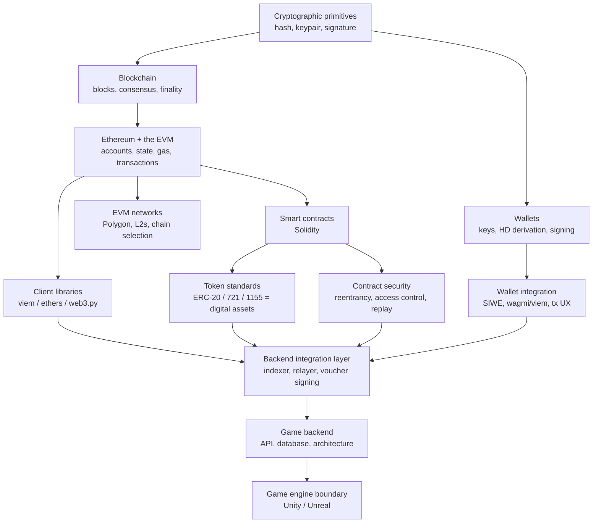

# The knowledge graph — sixteen nodes, and what actually depends on what

This is the index for the whole track. It exists because the sixteen topics listed in
[metaspace.md](../metaspace.md) are not sixteen separate things to memorise; they are a
dependency graph with about five roots, and once you can see the edges you stop trying to
learn them in alphabetical order.

Read this file first, then follow the order in [README.md](README.md). Every node below names
the article that covers it, the exercise level where you build it, and — this is the part that
matters with eleven days on the clock — whether it is in the twenty percent that earns eighty
percent of the answer.

---

## 1. The shape of the thing

The job advert names smart contracts, wallet integration, blockchain transactions, digital
assets, and connecting on-chain systems to a game backend. Those five phrases sit at different
depths in the graph, and one of them is not like the others: *connecting on-chain systems to a
game backend* is not a blockchain topic at all. It is distributed systems — idempotency,
checkpointing, reconciliation against a source of truth you do not own — dressed in new
vocabulary. That is also the part of the job you have already done for ten years under other
names, which is why the positioning note in
[../input/metaspace-prep/notes/positioning.md](../input/metaspace-prep/notes/positioning.md)
tells you to steer the conversation there.

Read the arrows as "you cannot honestly discuss the second without the first." The graph has
one long spine — primitives, chain, EVM, contracts, integration, game backend — and everything
else hangs off it.

---

## 2. The nodes

The "80/20" column is a judgement about a **thirty-minute interview with a Tech Lead at a game
studio**, not about the field. A node marked *core* is one where a vague answer costs you the
round. A node marked *context* is one where "I know what it is and what I would read" is a
perfectly respectable answer, and pretending to more is the actual risk.

| # | Node (as named in metaspace.md) | Depends on | Where it is taught | Build it at | 80/20 |
|---|---|---|---|---|---|
| — | What a blockchain engineer *is* in 2026 | — | [01](articles/01_what_is_a_blockchain_engineer_2026.md) | — | core |
| 1 | Blockchain | hashing, signatures | [02](articles/02_blockchain_from_zero.md) | L1 | core |
| 6 | On-chain systems | 1 | [02](articles/02_blockchain_from_zero.md), [03](articles/03_ethereum_evm_accounts_gas.md) | L2 | core |
| 5 | Digital transactions | 1, 6 | [03](articles/03_ethereum_evm_accounts_gas.md) | L2, L9 | core |
| 10 | EVM networks | 5 | [03](articles/03_ethereum_evm_accounts_gas.md), [04](articles/04_polygon_and_evm_networks.md) | L2 | core |
| 9 | Polygon / Ethereum | 10 | [04](articles/04_polygon_and_evm_networks.md) | L2 | core |
| 3 | Digital wallets | signatures | [05](articles/05_wallets_keys_signatures.md) | L1, L4 | core |
| 3.1 | Wallet integration | 3, 12 | [05](articles/05_wallets_keys_signatures.md), [11](articles/11_frontend_wallet_integration.md) | L4, L5, L12 | core |
| 2 | Smart contracts | 10 | [06](articles/06_solidity_from_zero.md) | L11 | core |
| 8 | Solidity | 2 | [06](articles/06_solidity_from_zero.md) | L11 | core |
| 4 | Digital assets | 8 | [07](articles/07_token_standards_digital_assets.md) | L3, L11 | core |
| — | Contract security | 8 | [08](articles/08_smart_contract_security.md) | L11 | core |
| 11 | ethers.js / Web3.js | 12 | [09](articles/09_nodejs_typescript_for_web3.md) | L2–L10 | core |
| 12 | Node.js / TypeScript | — | [09](articles/09_nodejs_typescript_for_web3.md) | every level | core |
| 13 | APIs, in this context | 12 | [10](articles/10_backend_architecture_web3_game.md) | L5, L12 | core |
| 14 | Databases, in this context | 13 | [10](articles/10_backend_architecture_web3_game.md) | L7, L8 | core |
| 15 | Backend architecture | 13, 14 | [10](articles/10_backend_architecture_web3_game.md) | L7–L12 | core |
| 7 | Game backend | 15 | [10](articles/10_backend_architecture_web3_game.md) | L12 | core |
| 16 | Unity / Unreal | 7 | [11](articles/11_frontend_wallet_integration.md) | — | context |
| — | Python path and its limits | 12 | [12](articles/12_python_path_fastapi_web3py.md) | L2, L4, L7, L10 (.py) | context |

Two nodes are marked *context* deliberately. Unity and Unreal matter to the answer "what does a
game engine have to do with this?" — the honest answer is *almost nothing directly*, and
[article 11](articles/11_frontend_wallet_integration.md) explains why that is the correct
answer rather than a dodge. The Python path matters because it is your home turf and they may
well ask what you would reach for; it does not matter because the job is Node.

---

## 3. Sub-nodes worth naming separately

The table above is coarse. Inside four of those nodes there are specific sub-topics that get
asked by name, and a graph that hides them is lying to you.

**Inside "blockchain" (node 1).** The hash link and why it makes history tamper-evident; Merkle
trees and what a proof proves; proof-of-stake and what a validator is actually risking;
finality as a *spectrum* rather than a switch, which is where reorganisations live; the mempool
as a public waiting room, which is where MEV and front-running live.

**Inside "digital transactions" (node 5).** The nonce as a per-account sequence number; gas as
metered computation; EIP-1559's split of base fee (burned, set by the protocol) from priority
fee (paid to the proposer, set by you); transaction types 0/1/2/3/4 and why type 4 is new;
what a receipt contains and why `status: success` is not the same as *your* business operation
having succeeded; the stuck transaction and the replacement rule.

**Inside "digital assets" (node 4).** ERC-20 and the approve/transferFrom dance; ERC-721 for
unique items; ERC-1155 for a game's mixed inventory of fungible and non-fungible things in one
contract, which is why it is what a studio like Metaspace uses; metadata and the `{id}`
substitution rule; EIP-2612 permit as a signature that replaces an approval transaction.

**Inside "backend architecture" (node 15).** The indexer with its checkpoint and its reorg
rollback; the relayer with its nonce discipline and fee bumping; the signed-voucher pattern for
server-authorised minting; the outbox table that makes "did I already send that transaction?"
answerable; custodial versus non-custodial wallet design for players who will never install
MetaMask; idempotency keys everywhere, because every one of these paths is at-least-once.

---

## 4. How this maps to the eleven days

The reading order in [README.md](README.md) walks the spine of the graph from the roots, which
is also the order the exercise ladder builds in. There is one deliberate exception: you read
[article 01](articles/01_what_is_a_blockchain_engineer_2026.md) first even though it depends on
everything, because it is the map, and because the first question in the room is almost
certainly some version of the question that article answers.

If you lose days and have to triage, the minimum viable path through this graph is nodes 1, 5,
3.1, 8, 4, 12 and 15 — which is to say: how a chain works, how a transaction works, how a
player proves who they are, enough Solidity to read a contract out loud, what an ERC-1155 is,
TypeScript you can write under pressure, and the integration architecture. That last one is
where you are strongest and it is worth more airtime than the rest combined.
