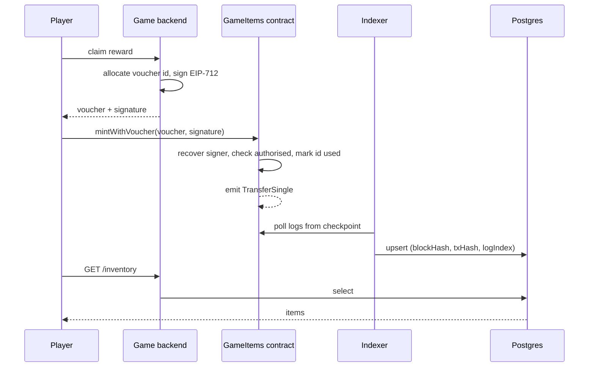

# What exactly is a blockchain engineer, on 19 September 2026?

You were asked to prepare for a job title. The trouble with that title is that it names at
least five different jobs, and the five have less in common than the words suggest. A person
who writes consensus code in Rust for a Layer 1 protocol and a person who keeps a game's
Postgres inventory in sync with Polygon are both called blockchain engineers, and they could
not do each other's work without months of retraining.

So before any Solidity, the useful question is narrower than the one in the title: **which of
those five jobs is Metaspace advertising, and what does the person doing it actually do all
day?** Get that wrong and you will spend eleven days studying elliptic curves for an interview
about idempotent event ingestion.

---

## The problem: the title tells you almost nothing

Here is the advert, compressed to its load-bearing sentence:

> "We're looking for Blockchain Engineers who can help us with smart contracts, wallet
> integration, blockchain transactions, digital assets, and connecting on-chain systems with
> our game backend. Our ideal candidate will have experience with Solidity, EVM networks,
> Polygon/Ethereum, Node.js/TypeScript, ethers.js/Web3.js, APIs, databases, and backend
> architecture."

Read it as a job specification rather than as a list of technologies and something becomes
obvious. Of the thirteen things named, **eight are ordinary backend engineering** — Node,
TypeScript, APIs, databases, backend architecture, transactions, wallet integration, and the
integration with the game backend. Three are chain-specific but shallow in day-to-day use:
Polygon, EVM networks, and a client library. Exactly **two** are the thing people imagine when
they hear "blockchain engineer": Solidity and smart contracts.

That ratio is not an accident of phrasing. It is what the job is. A game studio deploys a
handful of contracts, changes them rarely because changing them is expensive and risky, and
then spends every subsequent working day on the systems around them.

## The five jobs, so you can place yourself precisely

**The protocol engineer** works on the chain itself — consensus, peer-to-peer networking, the
execution client. This is systems programming in Rust, Go or C++, and the skill that matters is
distributed systems at the level of "what does a validator do when it receives two conflicting
blocks." Almost nobody has this job. It is not this job.

**The contract engineer** writes and audits Solidity or Vyper. The work is small in volume and
enormous in consequence, because deployed code is public, immutable by default, and holds
value. The culture is closer to aerospace than to web development: extensive testing, formal
review, invariant checks, and a strong prejudice against cleverness. Part of this job is in the
Metaspace advert, but only part.

**The integration engineer** — sometimes "Web3 backend engineer" — connects a normal product to
a chain. They index events into a database, sign and relay transactions, manage keys for
custodial wallets, build the APIs the client actually calls, and reconcile the two worlds when
they disagree. This is the job Metaspace is describing, and the phrase that gives it away is
*connecting on-chain systems with our game backend*.

**The infrastructure engineer** runs nodes, RPC endpoints, archival storage and monitoring.
Increasingly this is outsourced to Alchemy, Infura, QuickNode or drpc, which is why a studio of
Metaspace's size will have a provider account rather than a person.

**The security engineer or auditor** reviews contracts for a living. It is a specialised
discipline with its own competitions and certifications, and claiming it casually is the
fastest way to lose credibility with a Tech Lead who has actually shipped audited contracts.

## What the integration engineer does all day

Strip away the vocabulary and the day looks like this.

Something happened on chain and your database does not know about it yet. A player claimed a
reward, or transferred a sword to another player, or bought something on a marketplace your
studio does not control. Your indexer notices the event, writes it down, and updates the
inventory the game reads. When the chain reorganises — when two valid versions of recent
history briefly compete and one loses — your indexer has to notice and unwrite.

Something happened in your game and the chain does not know about it yet. A player earned an
item. You do not want to pay gas for every reward, and you certainly do not want your game
server holding a key that can mint anything at any time without limit. So the backend signs a
**voucher**: a typed, structured, single-use authorisation that says *this player may mint this
item once*. The player, or a relayer acting for them, submits it. The contract verifies the
signature against the address it trusts, marks the voucher used, and mints.

Something is stuck. A transaction you sent is sitting in the mempool because you underpriced
it, and the fee market moved. You replace it at a higher price using the same nonce, because
there is no cancel — only an outbid. If you have ever moved a limit order rather than pulling
it, you already have the instinct; the mechanics are identical.

Something is inconsistent. The chain says a player owns three swords, your database says four,
and you need to be able to answer why, from records, without guessing. This is reconciliation
against a source of truth you do not own, and it is the oldest problem in data engineering
wearing a new costume.

That is the job. Four paragraphs and only one of them mentions a contract.

## What changed recently, and why it matters in the room

A Tech Lead can tell in about ninety seconds whether a candidate learned this ecosystem from
current sources or from a 2021 tutorial. Five things have moved recently enough that mentioning
them correctly is a signal, and mentioning them incorrectly is a worse one.

**Ethereum is not proof-of-work, and has not been since 2022.** Old interview-question lists
still contain "explain mining." If you are asked about consensus, the current answer is
proof-of-stake with validators staking 32 ETH, twelve-second slots, thirty-two-slot epochs, and
finality after two epochs. The most recent upgrades are Pectra in May 2025 and Fusaka on 3
December 2025, with Glamsterdam still ahead.

**MATIC is POL, and Mumbai is dead.** Polygon's token migration is essentially complete and POL
is the gas token; the testnet is Amoy, chain ID 80002. Any material referring to MATIC gas or
the Mumbai testnet is stale by at least a year. Polygon's Rio upgrade in October 2025 brought
the throughput and fast-finality change you can measure yourself — the exercises in this track
found the gap between the head block and the finalized block sitting at two blocks, about a
second apart, on 19 September 2026.

**Web3.js is being retired.** Its documentation now carries a sunset notice. The advert names
"ethers.js/Web3.js" because that pairing is what job adverts have said for years, but the live
question is ethers versus **viem**. Ethers v6 is still what most production backends run, viem
plus wagmi is what new frontends are written against, and Alchemy archived its own SDK in July
2026 pointing users at viem. Knowing this is a small, precise demonstration of currency.

**Account abstraction arrived in two different shapes.** ERC-4337 built it beside the protocol
with a separate mempool of user operations; EIP-7702, shipped in Pectra, built a piece of it
into the protocol by letting an ordinary account temporarily execute contract code. For a game
this is not academic: it is the difference between demanding that every player install MetaMask
and fund it with POL, and letting them play while the studio sponsors gas invisibly.

**Games mostly do not put the game on chain.** The 2021 idea that gameplay itself would execute
in contracts lost to arithmetic: a chain that costs a fraction of a cent per action and settles
in a second is still thousands of times slower and more expensive than a game server doing the
same thing in memory. What survived is narrower and more sensible — **ownership and scarcity on
chain, everything else off it**. Items, currencies, marketplaces and provable scarcity live in
contracts; combat, physics, matchmaking and progression live in the backend you already know
how to build.

## Trace one claim through the whole system

Here is the request path that the rest of this track builds, end to end, in the order it
happens. If you can narrate this fluently you can hold a thirty-minute conversation about the
architecture of a Web3 game backend without ever bluffing.

A player finishes a dungeon. The game server, which is an ordinary backend, decides they earned
a sword and writes that to its own database. Nothing has touched a chain yet, and nothing
should — the player may never claim it.

The player taps "claim." The frontend asks the backend for a voucher. The backend checks its
own records, allocates a unique voucher ID, and signs an EIP-712 typed struct binding the
recipient address, the item, the amount, the voucher ID, the contract address and the chain ID.
Note what is being prevented by each of those fields: the wrong player claiming, the wrong
item, a replay, a replay on a different contract, and a replay on a different chain.

The player's wallet submits a transaction calling `mintWithVoucher` with that voucher and
signature — or, if the studio sponsors gas, a relayer submits it on their behalf. The contract
recovers the signer from the signature, checks it against the backend's known signing address,
checks the voucher ID has not been used, marks it used, and mints. Marking before minting, not
after, because the mint can call back into the recipient.

The contract emits `TransferSingle`. Some seconds later the indexer, polling the chain from its
checkpoint, sees the log, writes it into a table keyed on block hash, transaction hash and log
index — so that seeing it twice changes nothing — and updates the player's inventory.

The game client asks the backend what the player owns. The backend answers from Postgres in a
millisecond, having never consulted a node. The chain is the source of truth for ownership; the
database is the source of truth for speed; the indexer is the one-way bridge.

## So what are you, in this conversation?

You are an integration engineer with a decade of building exactly the kind of system in the
right-hand half of that diagram, who has read the contracts in the left-hand half closely
enough to discuss them and has written some, and who is not a contract security specialist. All
three clauses are true, and the third makes the first two believable.

The trap on the other side is worth naming too, because it is tempting for someone crossing
over: do not present yourself as a beginner who is eager to learn. The advert asks for APIs,
databases and backend architecture in the same breath as Solidity, and those are not the parts
you are learning.

## Interview Angles

**"So, how much blockchain have you actually done?"**

This is the first question and everything after it is downstream. The answer is not a claim
about years; it is a reframe, and then evidence. Something close to: "I'm a backend and data
engineer — Python and FastAPI mostly, a lot of systems that have to stay correct against a data
source I don't control. When I looked at what a Web3 game backend actually does, most of it is
that same problem: you're keeping a database in sync with an append-only log whose tail can be
rewritten underneath you, ingestion is at-least-once so it has to be idempotent, and the write
path has to survive retries without double-spending. I built the integration layer to check
myself — an indexer with reorg rollback, an EIP-712 voucher service for server-authorised
minting, and a relayer with nonce management and fee bumping. What I'm not is a contract
security expert; I've written ERC-1155 and staking contracts and I know the standard patterns,
but I wouldn't want to be the only pair of eyes on a contract holding real value."

That last sentence is not a weakness. Senior engineers trust people who can locate the edge of
their own competence, and the sentence makes everything before it more credible.

**"What does a blockchain engineer do here, do you think?"**

Sometimes asked as a test of whether you have understood the role or merely the title. Answer
with the trace above, compressed: most of the work is the integration layer, because contracts
change rarely and the systems around them change constantly — indexing events into the game
database, keeping ownership and inventory reconciled, signing vouchers so players can claim
rewards without the studio paying gas for things nobody claims, relaying transactions reliably,
and designing wallets so a mobile player who has never heard of MetaMask can still own their
items. Then ask them which of those is currently the painful one. You will learn more from the
answer than from any question you could ask about their stack.

**"Why Polygon and not Ethereum mainnet?"**

Because a game does thousands of small, low-value actions and mainnet prices every one of them
as if it were a bank transfer. The honest engineering answer names the trade: you get fees in
fractions of a cent and finality in seconds rather than minutes, and in exchange you accept a
smaller validator set and a security model that ultimately leans on Ethereum for settlement. If
you want to show depth, add that the choice also shapes your backend — with finality two blocks
behind the head you can credit a player almost immediately, where on a slower chain you would
need a confirmation policy and a pending state in the UI.
