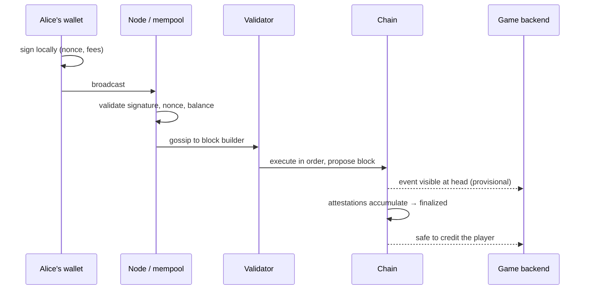

# Blockchain from zero: the problem it solves, and the price it charges

Suppose you and I both run game studios, and our games share an item economy. A sword minted in
my game can be sold in yours. Neither of us is willing to let the other hold the authoritative
list of who owns what, because whoever holds that list can quietly edit it — and even if
neither of us would, neither of us can prove it to the other's players.

This is the entire problem. It has nothing to do with cryptocurrency and everything to do with
a question that has no good answer in ordinary software: **how do two parties who do not trust
each other agree on the order of events?**

Before reaching for a chain, it is worth seeing precisely why the normal answers fail, because
the normal answers are usually right, and knowing when they are right is the difference between
an engineer and an enthusiast.

---

## Life without it

The normal answer is a database with one owner. My studio runs Postgres, the row says
`sword_1 → alice`, and when Alice sells it to Bob the row changes. This works beautifully. It
is fast, it is cheap, it supports transactions and constraints and joins, and every engineer
you will ever hire already knows how to operate it.

It fails on exactly one axis: **Alice has to trust me.** Not my good intentions — my database
backups, my access controls, my disgruntled employees, my solvency, and my willingness to still
be running the server in five years. If my studio shuts down, Alice's sword evaporates. If I
decide to mint a thousand more of the "unique" sword, nobody outside my company can tell.

The second answer is to replicate the database between us. Now we both have a copy, which
solves durability and solves nothing about trust, because now we have two copies that can
disagree and no principled way to decide which is right. Every distributed database answers
this with a coordinator, a quorum, or a consensus protocol like Raft — and all of those assume
the participants are faulty but *honest*. They crash; they do not lie. The moment a participant
might lie in its own favour, Raft has nothing to say.

That is the gap. A blockchain is a replicated log for participants who may lie, and everything
strange about it — the hashing, the fees, the energy or the staked deposits, the slowness — is
the price of closing that gap.

## Building the thing, one property at a time

### Property one: you cannot quietly edit the past

Start with an ordinary list of events. Alice mints a sword, Alice transfers it to Bob, Bob
stakes it. Anyone holding this list can edit entry two and nobody can tell.

Now give each entry a fingerprint — a hash — and put the *previous entry's* fingerprint inside
the current one. This is one line of code and it changes the structure's nature:

```ts
type Block = { height: number; parentHash: Hex; payload: string };

function hashBlock(block: Block): Hex {
  const header = `${block.height}|${block.parentHash}|${block.payload}`;
  return keccak256(stringToHex(header));
}
```

The full, runnable version is
[exercise level 1](../exercises/solutions/01_hash_and_address.ts), and it is worth running
before reading further, because the result is slightly surprising the first time.

Tamper with the middle entry — rewrite "Alice transfers to Bob" as "Alice transfers to
Mallory" — and then run the check that walks the chain comparing each block's `parentHash`
against the hash of the block before it. It reports a break at block **2**, which is not the
block you edited.

Sit with that for a moment, because it is the whole idea. Your edit left block 1 perfectly
well-formed. What it broke was block 1's *child*, which still carries a fingerprint of the
block 1 that used to exist. To make the lie hold you must re-hash block 2, which breaks block
3, and so on to the end of the chain. History is not protected because it is locked; it is
protected because rewriting any part of it requires rewriting all of it since.

An analogy that holds up: it is a ledger written in ink where every page begins by quoting the
last line of the previous page. You can forge a page, but then you must forge every page after
it, in front of witnesses who are still writing new ones.

### Property two: the rewrite must be expensive

Nothing so far stops a determined forger with a fast computer. Re-hashing a thousand blocks
takes milliseconds. The structure is tamper-*evident* but not tamper-*resistant*, and turning
one into the other is what consensus mechanisms do.

**Proof of work** makes each block artificially expensive to produce: a valid block's hash must
fall below a target, and since you cannot control a hash, you try astronomically many variants
until one does. Rewriting history then means redoing all that work, faster than the honest
network is producing new work. The security is denominated in electricity.

**Proof of stake**, which is what Ethereum has used since 2022 and what Polygon uses, denominates
it in money instead. Validators lock a deposit — 32 ETH on Ethereum — and take turns proposing
blocks and attesting to each other's. Sign two conflicting histories and the protocol destroys
part of your deposit. The security argument becomes: rewriting finalised history requires a
third of all staked value to sign contradictory statements, at which point that third is
provably guilty and gets slashed. Attacking the chain means burning your own money.

Two consequences follow immediately and both matter to a game backend. First, there is a
smallest unit of time — Ethereum's twelve-second slot, Polygon's roughly one-second block —
below which nothing can happen, because agreement takes a round trip. Second, **security is
economic, not absolute**. "The chain cannot be rewritten" is false. The true statement is that
rewriting it costs more than it is worth, and how much more depends on how deep the history is.

### Property three: agreement on the order, not just the contents

Give everyone the same list and they can verify it. But the list grows, and two validators
might each produce a block at nearly the same moment, each valid, each building on the same
parent. Now there are two histories, and both are honest.

This is not a bug and not an attack. It is the normal, expected state of a distributed system
with latency, and it resolves by rule: nodes follow the heaviest or most-attested chain, one of
the two branches accumulates more attestations, and the other is abandoned. The transactions in
the abandoned branch return to the waiting area and usually get included again shortly.

The abandoned branch is a **reorganisation**, and it is the single most important concept in
this article for the job you are interviewing for, because it is the concept that makes
indexing hard. A block that existed five seconds ago can stop existing. Anything your backend
wrote down because of that block is now wrong.

This produces the idea of **finality as a spectrum rather than a switch**. A freshly produced
block is a proposal. A block a few blocks deep is unlikely to be reverted. A block that has
been finalised by the consensus protocol cannot be reverted without provable misbehaviour and
mass slashing. Ethereum reaches that state in roughly thirteen minutes — two epochs of
thirty-two twelve-second slots. Polygon, after the Rio upgrade, reaches it in a couple of
blocks: reading Amoy on 19 September 2026, the gap between `latest` and `finalized` was two
blocks at about a second each, which you can verify yourself with
[exercise level 2](../exercises/solutions/02_read_the_chain.ts).

You are, incidentally, already fluent in this idea from a completely different domain. A trade
that has printed on the tape is not a trade that has settled. The print is real, the settlement
is later, and a system that treats the print as final is a system with a hole in it.

### Property four: the double spend, which is the reason for all of the above

Alice owns one sword. She signs a transfer of it to Bob and, simultaneously, a transfer of the
same sword to Carol, and sends each to a different part of the network. Both messages are
authentic — she really did sign both.

No amount of signature checking resolves this. Bob's node sees his first and believes it;
Carol's node sees hers first and believes it. The only thing that resolves it is agreement on
**order**: whichever transfer the network agrees came first is the one that happened, and the
second is then invalid because the sword has moved. This is why a blockchain is described as a
consensus on ordering rather than on contents, and it is why the mechanism cannot be replaced
by something cheaper like signing every message. Signatures establish *who*; only consensus
establishes *when*.

Ethereum-family chains add a second, blunter defence at the account level: every transaction
carries a **nonce**, a per-account counter, and the chain will not accept nonce N until it has
accepted N-1. One account cannot have two transactions numbered 7, so an accidental duplicate
is impossible and a deliberate one is a replacement rather than a double spend. That single
integer is going to dominate your life in [level 9](../exercises/EXERCISES.md) when the relayer
starts sending transactions concurrently.

### Property five: everyone can check without storing everything

A block contains many transactions, and a phone cannot hold the whole chain. Merkle trees solve
this: hash every transaction, hash the hashes in pairs, keep going until one root hash remains,
and put that root in the block header. Now a light client that holds only headers can be shown
that a specific transaction is in a block by being given the handful of sibling hashes along
the path from the leaf to the root — about ten hashes for a thousand transactions, rather than
a thousand.

Ethereum takes the idea further than Bitcoin did: the block header commits not only to a
transaction root but also to a **state root** and a **receipts root**, so the entire world state
— every account balance, every contract's storage — is summarised in one 32-byte value. That is
why two nodes can check they agree about everything by comparing a single number, and it is why
"the state" is a thing you can point at rather than a metaphor.

## Trace one transaction through the machinery

Alice sends Bob a sword. Watch it move.

Alice's wallet builds a transaction — recipient, calldata, gas limit, fee parameters, and her
next nonce — and signs it with her private key. Nothing has left her machine yet; this is pure
local arithmetic.

The signed transaction is broadcast to a node, which checks the cheap things first: is the
signature valid, is the nonce the one expected next, can the account afford the maximum fee.
If it passes, the node gossips it to its peers and the transaction sits in the **mempool**, a
public waiting room. Public is the operative word. Anyone can see it, which is why front-running
is possible, and why a transaction revealing a valuable intention — a large trade, a mint of a
rare item — is an invitation.

A validator building the next block selects transactions from the mempool, mostly in order of
what they are paying, and executes them in order against the current state. Each one either
succeeds or reverts; a revert still consumes gas and still occupies a slot in the block,
because the work of discovering the failure was real work.

The block is proposed and attested to by other validators. Your transaction now exists in a
block at the head of the chain — and this is the moment a naive backend credits the player and
a careful one does not, because the head is provisional.

Attestations accumulate. After enough of them, the block is finalised: reverting it now would
require a supermajority of stake to contradict itself, which is detectable and punished. The
backend's confirmation policy fires, the database is updated, and the player sees their sword.



## What it costs you, stated plainly

Every property above is bought with something, and an engineer who can name the costs is more
convincing than one who only names the benefits.

You pay in **latency**. The fastest possible acknowledgement is one block, and real confidence
takes longer. Nothing in this design gets you a microsecond write.

You pay in **throughput**. Every full node executes every transaction, so the network's capacity
is bounded by what one ordinary machine can do. This is why rollups and sidechains exist, and
why "just put the game on chain" was an idea that died of arithmetic.

You pay in **money, per write**. Reads are free; writes are priced by a live market. A design
that writes on every player action has an operating cost that scales with engagement, which is
a novel and unpleasant property for a game.

You pay in **irreversibility**. There is no support desk and no chargeback. A bug that mints a
million swords has minted a million swords, and a key that leaks has leaked. This is the reason
contract engineering culture is so conservative, and it is the reason your backend needs the
voucher pattern rather than a hot key with unlimited authority.

You pay in **privacy**. Everything is public, forever, including the fact that a particular
address bought a particular item at a particular moment.

Which is why the sensible design for a game — the one the industry converged on after the
2021 experiments — is to put **ownership and scarcity** on chain and leave everything else off
it. The chain settles who owns the sword. Your backend, which is fast, private, free to write
and possible to fix, does everything else.

## Interview Angles

**"Explain a blockchain to me as if I'm a backend engineer."**

Answer structurally rather than historically, and resist the temptation to start with Bitcoin.
Something like: it is an append-only log, replicated across mutually distrusting parties, where
each entry commits to the hash of the previous one so that editing any entry invalidates
everything after it. The hard problem it solves is not storage and not signatures, it is
agreement on *order* — signatures tell you who authorised something, but only consensus tells
you which of two conflicting authorisations came first, and that is what stops a double spend.
Proof-of-stake makes disagreeing with the agreed order expensive by putting validators'
deposits at risk. Everything else — gas, finality, reorgs — falls out of those two facts. Then
add the engineer's caveat: it is a very slow, very expensive database that you would never
choose unless you specifically needed the property that no single party can edit it.

**"What is a reorg and why should a backend engineer care?"**

Because it breaks the assumption every ETL pipeline is built on, which is that the source is
append-only. A reorg means the last few blocks you read may be replaced by a different history;
the transactions usually come back, but not necessarily in the same block, not necessarily in
the same order, and occasionally not at all. So anything your database wrote because of a
recent block is provisional, and your indexer needs three things it would not otherwise need: a
record of the block hash each row came from, the ability to detect that the chain's parent hash
no longer matches what you stored, and the ability to delete back to the last agreeing block
and reprocess. The alternative — crediting items at the head and hoping — creates assets out of
nothing, which in a game economy is the one bug you genuinely cannot walk back.

**"How many confirmations do you wait for?"**

Never answer this with a number alone; it is a risk decision and they are watching to see
whether you know that. The shape of the good answer is that it depends on the value at stake
and the cost of being wrong: a cosmetic item can be credited optimistically at the head and
reverted if the chain changes its mind, while anything that converts into real value should wait
for finality. Then get specific about this chain: on Polygon after Rio, the finalized tag runs
only a couple of blocks behind the head, so waiting for actual finality costs seconds rather
than minutes and the question mostly disappears — which is itself one of the reasons a game
studio picks Polygon. Finish by turning it back to them: what depth do they use today, and is
it the same for marketplace trades as for rewards?
