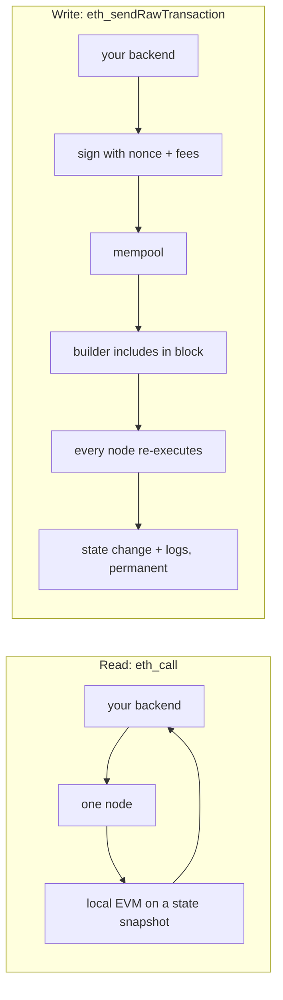

# Ethereum and the EVM: accounts, state, transactions, and what gas really is

The previous article built a chain that can order events nobody trusts anyone else to order.
That is Bitcoin's achievement, and Bitcoin's log contains one kind of entry: coins moved from
here to there.

Ethereum asks a different question. If we already have a machine that agrees on the order of
events, why restrict the events to payments? Why not agree on the order of *computations* — and
let anyone deploy the code being computed?

Answering that turns a ledger into a computer, and the moment it becomes a computer you inherit
a problem that a payment network never had: **an untrusted party can now ask every node on
Earth to run their program.** Everything distinctive about Ethereum — gas, the account model,
the peculiar economics of storage, even the shape of a game studio's contracts — descends from
how that problem was solved.

---

## Life without the account model

Bitcoin tracks unspent outputs. There is no balance anywhere; your wallet computes one by
finding all the unspent chunks of coin that your keys can unlock, and spending means consuming
whole chunks and creating new ones, including change back to yourself.

For payments this is elegant. For a game it is miserable. Ask the obvious question — *how many
swords does Alice own?* — and there is nowhere to look it up, because there is no Alice, only a
scattering of outputs. Worse, there is nowhere for a program to *store* anything, because the
model has no mutable state by design.

So Ethereum keeps balances. The world state is a mapping from a 20-byte address to an account
record holding a nonce, a balance, a storage root, and a code hash. Two kinds of account share
that one shape:

An **externally owned account** — an EOA — has no code. It is controlled by a private key, and
as you derived by hand in [level 1](../exercises/solutions/01_hash_and_address.ts), its address
is the last twenty bytes of the hash of its public key. It exists the moment someone picks a
random number, with no registration anywhere.

A **contract account** has code and storage and no key at all. It cannot start anything. It
only ever runs because something called it, and the chain of calls always begins with an EOA
signing a transaction. That asymmetry is why a contract cannot run on a schedule, why "the
contract will do it tomorrow" is never an answer, and why every automated system on chain has
an off-chain component poking it — which, when you are the studio, is your relayer.

## The problem that produces gas

Now the untrusted-program problem. If anyone can deploy code and anyone can call it, and every
node must execute it to verify the result, then `while (true) {}` is a denial-of-service attack
on the entire network. You cannot solve it by analysing the program first — that is the halting
problem, and it is not merely hard, it is impossible.

The solution is to make the caller pay per step, in advance, with a hard ceiling. Every EVM
operation has a fixed price in **gas**: arithmetic is a few units, a cold storage read is 2,100,
writing a storage slot from zero to non-zero is 20,000 plus the cold-access charge. A
transaction declares a `gas limit`, the maximum number of units it authorises. Execution stops
when the meter runs out.

And here is the part that people get wrong in interviews, so it is worth stating precisely:
**running out of gas reverts the state changes but does not refund the gas**. The computation
happened; the nodes did the work; the work is paid for. What is undone is the effect, not the
cost. A game backend that submits a mint with too low a gas limit pays for a mint that did not
happen — which is exactly why your relayer estimates, adds a margin, and records the outcome
rather than assuming success.

Gas prices are not arbitrary. They are a rough model of the real cost each operation imposes on
the network, which is why the numbers feel lopsided: arithmetic is nearly free because a CPU is
fast, while a storage write is brutal because it permanently enlarges a state that every node
must keep forever. Once you see that, contract design stops being mysterious.

**Storage is the expensive thing. Logs are the cheap thing.** A log costs 375 gas plus 375 per
indexed topic plus 8 per byte, an order of magnitude or two below a storage write, because logs
are not part of the state — nodes can prune them, and contracts cannot read them. That trade is
the architectural foundation of your whole backend: the contract stores only what it must
enforce on chain, and emits everything else for your indexer to pick up. When someone asks why
you would run an indexer instead of just reading contract state, the first half of the answer
is this price list.

## The fee market, which is an order book

Gas measures *work*. What you pay per unit of work is a separate question, and since
[EIP-1559](https://eips.ethereum.org/EIPS/eip-1559) it has two parts.

The **base fee** is set by the protocol, not by you. It rises when blocks are fuller than target
and falls when they are emptier, adjusting by at most 12.5% per block, and — this is the part
that surprises people — it is **burned**, not paid to anyone. The **priority fee** is the tip
you add for the block builder. You declare a `maxFeePerGas`, the most you will pay in total per
unit, and a `maxPriorityFeePerGas`, and you are charged the base fee plus your tip, refunded the
difference if the base fee came in lower.

You already have the right mental model for this from a completely different screen. The base
fee is the clearing price; the priority fee is your position in the queue; `maxFeePerGas` is a
limit price. An underpriced transaction does not fail — it *rests*, exactly like a limit order
away from the market, and it can sit there for hours while the base fee wanders. And there is
no cancel: to get out of it you submit a new transaction with **the same nonce** and a higher
price, which is a price improvement on your own resting order rather than a withdrawal. Level 9
of the ladder makes you do this on purpose.

[Level 2](../exercises/solutions/02_read_the_chain.ts) prints the live numbers for Amoy. Run it
twice a few minutes apart and watch the base fee move; it makes the market real in a way that
reading about it does not.

## What a transaction actually is

A transaction is a signed instruction from an EOA. Its fields are worth knowing individually,
because most interview questions about "transactions" are really questions about one field.

The **nonce** is the sender's transaction counter, and the chain accepts nonce N only after
N-1. It gives you exactly-once semantics per account for free, and it is also the thing that
makes concurrency in a relayer non-trivial: two requests handled in parallel that both read
"next nonce is 7" produce two transactions numbered 7, of which the chain will keep precisely
one — and possibly not the one you wanted.

The **to** field is the recipient, or absent for a contract deployment. The **value** is native
currency — POL on Polygon — and the **data** is calldata, which for a contract call is the
four-byte function selector followed by ABI-encoded arguments, exactly as you built by hand in
[level 3](../exercises/solutions/03_read_a_contract.ts).

Then the fee fields, the **gas limit**, and the signature as `(r, s, v)`. Since EIP-155 the
chain ID is folded into the signature, which is what stops a transaction signed for Amoy from
being replayed on Polygon mainnet — and it is why a *plain message* signature, which has no
chain ID in it, is replayable everywhere, the failure demonstrated at the end of
[level 4](../exercises/solutions/04_sign_and_recover.ts).

Transactions come in numbered types and the list is a compact history of the protocol: type 0
is the original, type 1 added access lists, type 2 is the EIP-1559 fee market and is what you
send today, type 3 carries blobs for rollups, and type 4 — new with Pectra in May 2025 — is
[EIP-7702](https://eips.ethereum.org/EIPS/eip-7702), which lets an EOA temporarily execute
contract code. That last one matters commercially for a game: it is part of how a studio can let
a player with no POL, and no idea what a wallet is, still own their items.

## Break it on purpose: `status: success` does not mean it worked

Here is a bug that reaches production in Web3 backends written by good engineers, because the
API invites it.

You send the mint. You wait for the receipt. The receipt says `status: "success"`. You mark the
reward as claimed in your database and tell the player their sword is ready.

Three separate things can be wrong with that.

The receipt says the *transaction* succeeded — that the EVM executed it without reverting. It
says nothing about whether your business operation happened. If your contract's mint function
silently does nothing when the voucher was already used, the transaction succeeds and no sword
exists. The only trustworthy record of what happened is the **event the contract emitted**,
which is why well-written contracts emit on every state change and why your indexer reads logs
rather than inferring outcomes from receipts.

The receipt is attached to a block, and the block is at the head of the chain, and the head is
provisional. A reorg can remove that block. Your transaction will usually be re-included, but
in a different block, possibly with a different outcome if the state it depended on changed —
and if your database already said "claimed," nothing will ever correct it.

And a transaction that reverted still produced a receipt, still consumed gas, and still occupies
a slot in a block. `status: "reverted"` is a normal outcome, not an exception, and code that
only handles the success path treats a revert as a hang.

The fix is not more checking around the receipt. It is a different shape: the transaction hash
goes into an **outbox** table the moment you send it, with the business operation it belongs to;
the indexer, reading events with the reorg handling from level 8, is the thing that marks the
operation complete; and the two are reconciled by a job that asks "which outbox rows have no
matching event, and how old are they?" That design is the subject of
[article 10](10_backend_architecture_web3_game.md), and it is the part of the interview where
you are the most experienced person in the conversation.

## Trace one call, two ways

Take the two operations you have already performed against Polygon Amoy and watch how little
they have in common.

**A read.** In [level 3](../exercises/solutions/03_read_a_contract.ts) you called
`totalSupply()`. Your client sent `eth_call` to a single node with four bytes of calldata. That
node loaded the contract's code and storage from its own copy of the state, ran the EVM locally,
and returned 32 bytes. No signature, no broadcast, no block, no fee, no record — and no other
node on Earth was involved or aware. A contract read is a function call on somebody else's
computer against a snapshot of the world, which is why your backend can do thousands of them and
why "reading is free" is literally true.

**A write.** Sending a mint means signing locally, broadcasting to the mempool, waiting for a
builder to include you, having every node re-execute the call to verify the result, and paying
for the privilege — after which the effect is permanent and public. Between those two paths lies
every architectural decision in this track. Push everything you can into the read path, and
into your own database; reserve the write path for the small set of facts that must be settled
in a way nobody has to trust you about.

## The EVM itself, briefly and honestly

You will not be asked to write bytecode. You may be asked what the EVM *is*, and the answer
should be crisp: a stack machine with 256-bit words, a program counter, a small set of opcodes,
three places to put data, and no access to anything outside the chain.

The three places matter because their prices differ by four orders of magnitude. The **stack**
is free and holds 1,024 words. **Memory** is a scratchpad that exists for one call and costs a
little, growing quadratically if you are careless. **Storage** is the permanent key-value map
belonging to the contract, and it is the 20,000-gas one. A fourth, transient storage, behaves
like storage but is discarded at the end of the transaction, and exists mainly to make
reentrancy guards cheap.

Two constraints are worth carrying in your head. A deployed contract may not exceed
**24,576 bytes** ([EIP-170](https://eips.ethereum.org/EIPS/eip-170)) — the reason large systems
are split across contracts or use proxies and libraries. And the EVM has no clock, no network,
no randomness and no filesystem: a contract cannot call an API, cannot know the price of
anything, and cannot generate a secret number. Every one of those needs an oracle or an
off-chain component, and `block.timestamp` as a source of randomness in a game that awards loot
is a known, exploited vulnerability rather than a clever shortcut.

The "256-bit word" detail is not trivia either. It is why Solidity's native integer is
`uint256`, why using `uint8` to save space usually *costs* gas through masking, and why every
token amount in your TypeScript is a `bigint` and never a `number` — a point the type system
will remind you of loudly the first time you multiply a timestamp.

## Interview Angles

**"What is gas, and why does it exist?"**

Give the reason before the definition, because the reason is what shows understanding. Anyone
can deploy code to Ethereum and every node has to execute it to verify the result, so without a
meter an infinite loop would be a denial-of-service attack on the whole network — and you cannot
detect that statically, because it is the halting problem. Gas is that meter: every operation
has a fixed price, the sender sets a limit and pays for what is consumed, and if the limit is
exhausted the state changes revert but the gas is still spent, because the work was really done.
Then add the design consequence, because it is the part that matters at work: the prices
approximate real costs, so a storage write is around 20,000 gas while emitting a log is a few
hundred, which is why contracts store the minimum the chain must enforce and emit everything
else for an indexer to pick up.

**"Explain EIP-1559 to me."**

Before 1559 every transaction was a blind first-price auction and everyone systematically
overpaid. Now the protocol sets a base fee algorithmically from how full recent blocks were,
moving by at most 12.5% a block, and burns it; on top of that you add a priority fee as a tip
to the builder, and you declare a maximum total you will tolerate. The practical effect is that
fees became predictable enough to estimate, and that an underpriced transaction sits in the
mempool instead of failing — it is a resting limit order, and the only way out is to replace it
at the same nonce with a higher price, because the protocol has no cancel. If you want to show
you have operated this rather than read about it, mention that replacement usually has to beat
the original by a margin, not merely match it, or the node will reject it as a duplicate.

**"A user says their transaction is stuck. Walk me through it."**

Start by separating the three things "stuck" can mean, because the diagnosis is the answer. If
the transaction is not in the mempool at all, it was never accepted — usually a nonce gap,
meaning an earlier transaction from that account is missing, so nothing after it can proceed. If
it is in the mempool but not included, it is underpriced relative to the current base fee, and
the fix is a replacement at the same nonce with a higher max fee. If it is included but the
receipt shows a revert, then it failed on chain and the gas is gone, and you need the revert
reason rather than a retry. Then name the operational lesson: this is why a relayer allocates
nonces from a single authority rather than asking the node each time, records every hash in an
outbox before broadcasting, and treats "no receipt yet" as a state to monitor rather than an
error to swallow.
